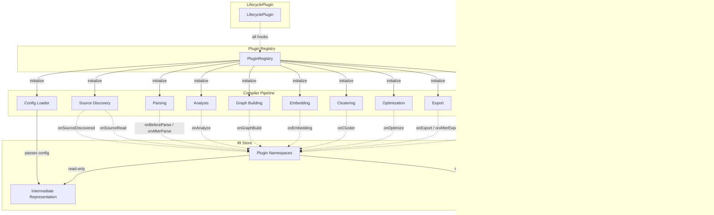
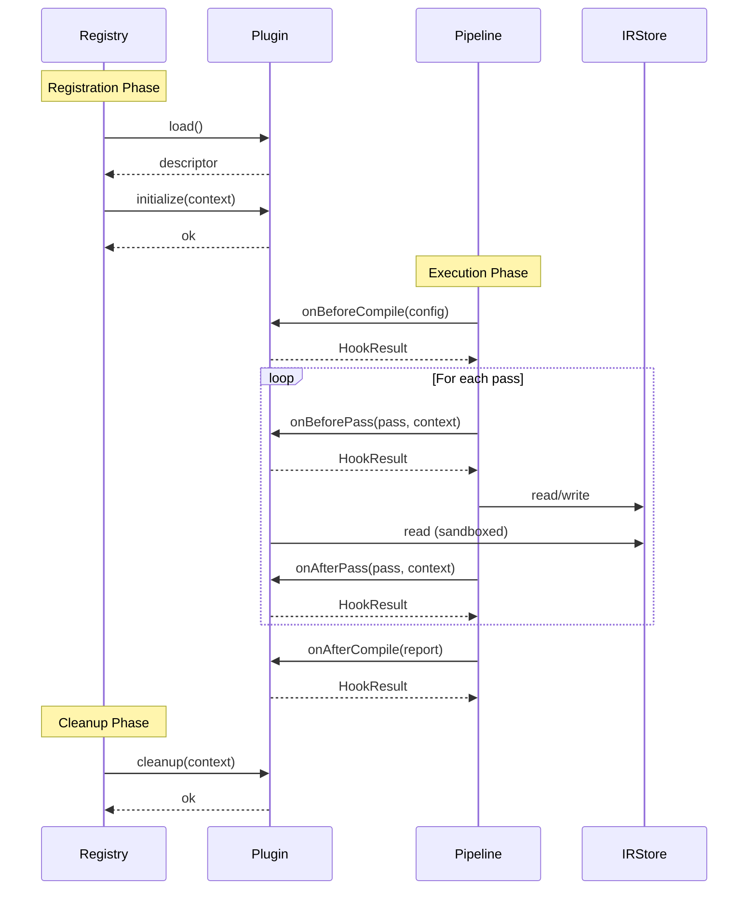

# Plugin System

> Version 1.0.0 — Part of the Knowledge Compiler API

---

## Plugin Architecture Overview

The Knowledge Compiler plugin system is built around a registry-based architecture. Plugins hook into specific stages of the compilation pipeline and interact with the Intermediate Representation (IR) through a sandboxed API surface.



### Compiler Pipeline with Plugin Hooks



---

## Plugin Types

### 1. SourcePlugin

Custom source readers for ingesting documents from non-filesystem origins.

```typescript
import { AsyncIterable } from 'stream';

interface SourcePlugin extends KnowledgeCompilerPlugin {
  type: 'source';

  /** Primary interface: yield documents from a custom source */
  readSource(config: SourceConfig): AsyncIterable<SourceDocument>;

  hooks?: {
    /** Called when a new source is discovered during source scanning */
    onSourceDiscovered?: (source: SourceDescriptor) => HookResult;
    /** Called after a source document has been read and normalized */
    onSourceRead?: (document: SourceDocument) => HookResult;
  };
}

interface SourceConfig {
  uri: string;
  auth?: { type: 'bearer' | 'basic' | 'api-key'; credentials: string };
  filters?: { include?: string[]; exclude?: string[] };
  pagination?: { pageSize: number; maxPages?: number };
  metadata?: Record<string, unknown>;
}

interface SourceDocument {
  id: string;
  path: string;
  content: string | Buffer;
  mimeType: string;
  metadata: Record<string, unknown>;
  source: string;
  checksum: string;
  createdAt: Date;
  updatedAt: Date;
}

interface SourceDescriptor {
  uri: string;
  type: 'file' | 'git' | 'database' | 'api' | 'custom';
  documentCount?: number;
  size?: number;
}
```

### 2. ParserPlugin

Custom parsers for non-Markdown input formats.

```typescript
interface ParserPlugin extends KnowledgeCompilerPlugin {
  type: 'parser';

  /** Parse raw content into a document AST */
  parse(
    content: string | Buffer,
    metadata: Record<string, unknown>
  ): DocAST;

  hooks?: {
    /** Called before parsing begins */
    onBeforeParse?: (context: { content: string | Buffer; mimeType: string }) => HookResult;
    /** Called after parsing completes */
    onAfterParse?: (ast: DocAST) => HookResult;
  };

  /** Supported MIME types this parser can handle */
  supportedMimeTypes: string[];
}

interface DocAST {
  type: 'root';
  children: ASTNode[];
  metadata: {
    title?: string;
    description?: string;
    language?: string;
    wordCount: number;
    headings: HeadingInfo[];
    links: LinkInfo[];
    images: ImageInfo[];
    codeBlocks: CodeBlockInfo[];
  };
}

interface ASTNode {
  type: string;
  value?: string;
  depth?: number;
  children?: ASTNode[];
  attributes?: Record<string, unknown>;
  position?: {
    start: { line: number; column: number; offset: number };
    end: { line: number; column: number; offset: number };
  };
}

interface HeadingInfo {
  level: number;
  text: string;
  id: string;
}

interface LinkInfo {
  href: string;
  text: string;
  internal: boolean;
}

interface ImageInfo {
  src: string;
  alt: string;
}

interface CodeBlockInfo {
  language?: string;
  content: string;
  lines: number;
}
```

### 3. AnalyzerPlugin

Custom content analyzers for domain-specific extraction.

```typescript
interface AnalyzerPlugin extends KnowledgeCompilerPlugin {
  type: 'analyzer';

  /** Run custom analysis over a set of documents */
  analyze(documents: AnalyzerDocument[]): Promise<AnalysisResult>;

  hooks?: {
    onAnalyze?: (result: AnalysisResult) => HookResult;
  };
}

interface AnalyzerDocument {
  id: string;
  content: string;
  ast?: DocAST;
  metadata: Record<string, unknown>;
}

interface AnalysisResult {
  entities?: EntityResult[];
  keywords?: KeywordResult[];
  topics?: TopicResult[];
  sentiment?: SentimentResult;
  custom?: Record<string, unknown>;
}

interface EntityResult {
  name: string;
  type: string;
  mentions: Mention[];
  salience: number; // 0–1
  metadata?: Record<string, unknown>;
}

interface Mention {
  text: string;
  position: { start: number; end: number };
  confidence: number;
}

interface KeywordResult {
  term: string;
  score: number;
  frequency: number;
  positions: { start: number; end: number }[];
}

interface TopicResult {
  label: string;
  confidence: number;
  keywords: string[];
}

interface SentimentResult {
  overall: number; // -1 to 1
  segments: { text: string; score: number }[];
}
```

### 4. GraphPlugin

Custom graph builders for domain-specific relationship extraction.

```typescript
interface GraphPlugin extends KnowledgeCompilerPlugin {
  type: 'graph';

  /** Build graph nodes and edges from analyzed documents */
  buildGraph(context: GraphContext): Promise<IRGraph>;

  hooks?: {
    onGraphBuild?: (graph: IRGraph) => HookResult;
  };
}

interface GraphContext {
  documents: AnalyzerDocument[];
  entities: EntityResult[];
  keywords: KeywordResult[];
  topics: TopicResult[];
  existingGraph?: IRGraph;
}

interface IRGraph {
  nodes: GraphNode[];
  edges: GraphEdge[];
  metadata?: {
    density: number;
    nodeCount: number;
    edgeCount: number;
    connectedComponents: number;
  };
}

interface GraphNode {
  id: string;
  type: string;
  label: string;
  properties: Record<string, unknown>;
  weight?: number;
}

interface GraphEdge {
  id: string;
  source: string;
  target: string;
  type: string;
  weight: number;
  properties?: Record<string, unknown>;
}
```

### 5. EmbeddingPlugin

Custom embedding providers.

```typescript
interface EmbeddingPlugin extends KnowledgeCompilerPlugin {
  type: 'embedding';

  /** Generate embeddings for a batch of texts */
  embed(texts: string[]): Promise<number[][]>;

  hooks?: {
    onEmbedding?: (result: { texts: string[]; embeddings: number[][]; duration: number }) => HookResult;
  };

  /** Declared configuration */
  config: EmbeddingPluginConfig;
}

interface EmbeddingPluginConfig {
  model: string;
  dimensions: number;
  batchSize: number;
  maxRetries?: number;
  timeout?: number; // ms
  apiKey?: string; // never stored in compiled output
  options?: Record<string, unknown>;
}

interface EmbeddingResult {
  id: string;
  vector: Float32Array;
  dimensions: number;
  model: string;
}
```

### 6. ClusterPlugin

Custom clustering algorithms.

```typescript
interface ClusterPlugin extends KnowledgeCompilerPlugin {
  type: 'cluster';

  /** Run clustering on a similarity matrix */
  cluster(
    similarities: SimilarityMatrix,
    config: ClusterConfig
  ): Promise<ClusterResult>;

  hooks?: {
    onCluster?: (result: ClusterResult) => HookResult;
  };
}

interface SimilarityMatrix {
  ids: string[];
  matrix: number[][]; // NxN symmetric
}

interface ClusterConfig {
  method: 'kmeans' | 'hierarchical' | 'dbscan' | 'spectral' | 'custom';
  numClusters?: number;
  minClusterSize?: number;
  epsilon?: number; // for dbscan
  linkage?: 'single' | 'complete' | 'average' | 'ward';
  distance?: 'cosine' | 'euclidean' | 'dot';
  maxIterations?: number;
  randomSeed?: number;
  options?: Record<string, unknown>;
}

interface ClusterResult {
  clusters: Cluster[];
  metrics: ClusteringMetrics;
  hierarchy?: ClusterNode; // for hierarchical
}

interface Cluster {
  id: string;
  label: string;
  nodeIds: string[];
  centroid?: number[];
  silhouetteScore?: number;
  keywords?: string[];
  summary?: string;
}

interface ClusteringMetrics {
  silhouetteScore: number;
  daviesBouldinIndex: number;
  calinskiHarabaszScore: number;
  intraClusterDistance: number;
  interClusterDistance: number;
}

interface ClusterNode {
  id: string;
  label: string;
  children?: ClusterNode[];
  leafIds?: string[];
  depth: number;
}
```

### 7. OptimizationPlugin

Custom optimization passes over the IR.

```typescript
interface OptimizationPlugin extends KnowledgeCompilerPlugin {
  type: 'optimization';

  /** Run an optimization pass on the IR */
  optimize(ir: IRNode, config: OptimizationConfig): Promise<IRNode>;

  hooks?: {
    onOptimize?: (result: { before: IRNode; after: IRNode }) => HookResult;
  };
}

interface IRNode {
  type: string;
  id: string;
  data: unknown;
  children?: IRNode[];
  metadata?: Record<string, unknown>;
}

interface OptimizationConfig {
  passName: string;
  iterations?: number;
  threshold?: number;
  options?: Record<string, unknown>;
}
```

### 8. ExportPlugin

Custom artifact exporters.

```typescript
interface ExportPlugin extends KnowledgeCompilerPlugin {
  type: 'export';

  /** Export compiled artifacts to a custom destination */
  export(artifacts: ArtifactBundle): Promise<void>;

  hooks?: {
    onExport?: (context: { artifacts: ArtifactBundle; destination: string }) => HookResult;
    onAfterExport?: (result: ExportResult) => HookResult;
  };
}

interface ArtifactBundle {
  manifest: Manifest;
  knowledge: KnowledgeGraph;
  graph: VisualGraph;
  entities: EntityCollection;
  clusters: ClusterCollection;
  concepts: ConceptCollection;
  navigation: Navigation;
  search: SearchIndex;
  embeddings: Map<string, Float32Array>;
  statistics: Statistics;
}

interface ExportResult {
  destination: string;
  artifactCount: number;
  totalSize: number;
  duration: number;
  errors?: { artifact: string; error: string }[];
}
```

### 9. VisualizationPlugin

Custom visualization React components.

```typescript
interface VisualizationPlugin extends KnowledgeCompilerPlugin {
  type: 'visualization';

  /** React component for rendering custom visualizations */
  VisualizationComponent: React.FC<VisualizationPluginProps>;

  hooks?: {
    onVisualize?: (context: { component: string; props: Record<string, unknown> }) => HookResult;
  };
}

interface VisualizationPluginProps {
  artifacts: ArtifactReader;
  theme?: 'light' | 'dark' | 'system';
  width?: number;
  height?: number;
  interactive?: boolean;
  onNodeClick?: (nodeId: string) => void;
  onEdgeClick?: (edgeId: string) => void;
  className?: string;
  style?: React.CSSProperties;
}
```

### 10. LifecyclePlugin

Observe all pipeline events for monitoring, logging, and instrumentation.

```typescript
interface LifecyclePlugin extends KnowledgeCompilerPlugin {
  type: 'lifecycle';

  hooks?: {
    onInit?: (config: CompilerConfig) => HookResult;
    onBeforePass?: (passName: string, context: PassContext) => HookResult;
    onAfterPass?: (passName: string, context: PassContext) => HookResult;
    onError?: (error: CompilerError) => HookResult;
    onComplete?: (report: CompilerReport) => HookResult;
    onBeforeCompile?: (config: CompilerConfig) => HookResult;
    onAfterCompile?: (report: CompilerReport) => HookResult;
    onPhaseStart?: (phase: CompilerPhase) => HookResult;
    onPhaseEnd?: (phase: CompilerPhase, report: PhaseReport) => HookResult;
    onCacheHit?: (key: string) => HookResult;
    onCacheMiss?: (key: string) => HookResult;
    onWarning?: (warning: CompilerWarning) => HookResult;
    onProgress?: (progress: CompilerProgress) => HookResult;
  };
}
```

---

## Plugin Lifecycle

### Registration Phase

```typescript
interface PluginRegistrationContext {
  registry: PluginRegistry;
  /** Called once during compiler init */
  load(): Promise<PluginDescriptor>;
  /** Called after all plugins are loaded */
  initialize(context: PluginContext): Promise<void>;
}

interface PluginDescriptor {
  name: string;
  version: string;
  type: PluginType;
  description?: string;
  author?: string;
  homepage?: string;
  license?: string;
  dependencies?: string[];
  /** Priority: lower runs first. Default 100. */
  priority?: number;
  /** Compatibility declaration */
  engine?: {
    'knowledge-compiler'?: string; // semver range
  };
}

type PluginType =
  | 'source'
  | 'parser'
  | 'analyzer'
  | 'graph'
  | 'embedding'
  | 'cluster'
  | 'optimization'
  | 'export'
  | 'visualization'
  | 'lifecycle';
```

### Execution Phase

```typescript
interface PluginExecutionContext {
  /** The plugin's own descriptor */
  descriptor: PluginDescriptor;
  /** Current compiler pass being executed */
  currentPass: string | null;
  /** Current compiler phase */
  currentPhase: CompilerPhase;
  /** Shared context across hooks for this plugin */
  shared: Map<string, unknown>;
}
```

### Cleanup Phase

```typescript
interface PluginCleanupContext {
  descriptor: PluginDescriptor;
  /** Reason for cleanup */
  reason: 'normal' | 'error' | 'timeout' | 'user-abort';
  error?: Error;
}
```

---

## Plugin Interfaces (TypeScript)

### Core Plugin Interface

```typescript
interface KnowledgeCompilerPlugin {
  name: string;
  version: string;
  type: PluginType;
  description?: string;

  hooks?: Partial<PluginHooks>;

  /** Called after registration, before any passes */
  initialize?(context: PluginContext): Promise<void>;

  /** Called during compiler shutdown */
  cleanup?(context: PluginContext): Promise<void>;
}

interface PluginHooks {
  // Compiler lifecycle
  onBeforeCompile: (config: CompilerConfig) => HookResult;
  onAfterCompile: (report: CompilerReport) => HookResult;

  // Phase lifecycle
  onPhaseStart: (phase: CompilerPhase) => HookResult;
  onPhaseEnd: (phase: CompilerPhase, report: PhaseReport) => HookResult;

  // Pass lifecycle
  onBeforePass: (passName: string, context: PassContext) => HookResult;
  onAfterPass: (passName: string, context: PassContext) => HookResult;

  // Source hooks
  onSourceDiscovered: (source: SourceDescriptor) => HookResult;
  onSourceRead: (document: SourceDocument) => HookResult;

  // Parse hooks
  onBeforeParse: (context: { content: string | Buffer; mimeType: string }) => HookResult;
  onAfterParse: (ast: DocAST) => HookResult;

  // Analysis hooks
  onAnalyze: (result: AnalysisResult) => HookResult;

  // Graph hooks
  onGraphBuild: (graph: IRGraph) => HookResult;

  // Embedding hooks
  onEmbedding: (result: { texts: string[]; embeddings: number[][]; duration: number }) => HookResult;

  // Cluster hooks
  onCluster: (result: ClusterResult) => HookResult;

  // Optimization hooks
  onOptimize: (result: { before: IRNode; after: IRNode }) => HookResult;

  // Export hooks
  onExport: (context: { artifacts: ArtifactBundle; destination: string }) => HookResult;
  onAfterExport: (result: ExportResult) => HookResult;

  // Visualization hooks
  onVisualize: (context: { component: string; props: Record<string, unknown> }) => HookResult;

  // Cache hooks
  onCacheHit: (key: string) => HookResult;
  onCacheMiss: (key: string) => HookResult;

  // Error hooks
  onError: (error: CompilerError) => HookResult;
  onWarning: (warning: CompilerWarning) => HookResult;

  // Progress
  onProgress: (progress: CompilerProgress) => HookResult;
  onComplete: (report: CompilerReport) => HookResult;
}

type HookResult = void | {
  /** Skip remaining hooks in this phase */
  skip?: boolean;
  /** Abort the compilation */
  abort?: boolean;
  /** Abort reason (logged to user) */
  abortReason?: string;
  /** Store data for subsequent hooks */
  data?: Record<string, unknown>;
};
```

### Plugin Registry

```typescript
interface PluginRegistry {
  /** Register a plugin manually */
  register(plugin: KnowledgeCompilerPlugin): void;

  /** Register multiple plugins */
  registerAll(plugins: KnowledgeCompilerPlugin[]): void;

  /** Find a plugin by name */
  get(name: string): KnowledgeCompilerPlugin | undefined;

  /** Find all plugins of a given type */
  getByType(type: PluginType): KnowledgeCompilerPlugin[];

  /** Check if a plugin is registered */
  has(name: string): boolean;

  /** List all registered plugins */
  list(): PluginDescriptor[];

  /** Remove a plugin */
  unregister(name: string): void;
}
```

---

## Plugin Context

The `PluginContext` is the sandboxed API surface available to all plugin hooks.

```typescript
interface PluginContext {
  /** Plugin identification */
  plugin: {
    name: string;
    version: string;
    type: PluginType;
  };

  /** Read-only IR access */
  ir: {
    /** Read the full knowledge graph */
    getKnowledgeGraph(): Promise<KnowledgeGraph>;
    /** Read IR nodes by type */
    getNodesByType(type: string): Promise<IRNode[]>;
    /** Read a single node by ID */
    getNode(id: string): Promise<IRNode | null>;
    /** Read edges */
    getEdges(filters?: EdgeFilter): Promise<GraphEdge[]>;
    /** Read the full IR tree */
    getIRTree(): Promise<IRNode>;
  };

  /** Plugin-scoped namespace for storing intermediate data */
  namespace: {
    /** Set a value in the plugin's namespace */
    set<T>(key: string, value: T): void;
    /** Get a value from the plugin's namespace */
    get<T>(key: string): T | undefined;
    /** Read from another plugin's namespace (if allowed) */
    readFrom<T>(pluginName: string, key: string): T | undefined;
    /** List all keys in this plugin's namespace */
    keys(): string[];
    /** Clear this plugin's namespace */
    clear(): void;
  };

  /** Read-only compiler configuration */
  config: {
    get<T>(path: string): T | undefined;
    getFull(): Readonly<CompilerConfig>;
  };

  /** Read-only compiler state */
  state: {
    getCurrentPhase(): CompilerPhase | null;
    getCurrentPass(): string | null;
    getElapsedMs(): number;
    getMemoryUsage(): { heapUsed: number; heapTotal: number; external: number };
    isCancelled(): boolean;
  };

  /** Scoped logger */
  logger: {
    info(message: string, ...meta: unknown[]): void;
    warn(message: string, ...meta: unknown[]): void;
    error(message: string, ...meta: unknown[]): void;
    debug(message: string, ...meta: unknown[]): void;
    trace(message: string, ...meta: unknown[]): void;
    /** Create a child logger with additional context */
    child(context: Record<string, unknown>): ScopedLogger;
  };

  /** Read-only cache interface */
  cache: {
    /** Check if a key exists in cache */
    has(key: string): Promise<boolean>;
    /** Read from cache */
    get<T>(key: string): Promise<T | undefined>;
    /** Get cache entry metadata (size, age, hit count) */
    getMeta(key: string): Promise<CacheEntryMeta | undefined>;
  };

  /** Signal helpers */
  signal: {
    /** Check if compilation has been aborted */
    aborted: boolean;
    /** Register a callback for abort */
    onAbort(callback: () => void): void;
  };
}

interface ScopedLogger {
  info(message: string, ...meta: unknown[]): void;
  warn(message: string, ...meta: unknown[]): void;
  error(message: string, ...meta: unknown[]): void;
  debug(message: string, ...meta: unknown[]): void;
  trace(message: string, ...meta: unknown[]): void;
}

interface CacheEntryMeta {
  size: number;
  createdAt: number;
  lastAccessed: number;
  hitCount: number;
  ttl?: number;
}
```

---

## Plugin Development Guide

### 1. Package Naming Convention

```
@knowledge-compiler/plugin-<name>
```

Examples: `@knowledge-compiler/plugin-git-source`, `@knowledge-compiler/plugin-csv-parser`, `@knowledge-compiler/plugin-sentiment-analyzer`

For scoped plugins:

```
@<scope>/knowledge-compiler-plugin-<name>
```

### 2. Package Structure

```
plugin-<name>/
├── src/
│   ├── index.ts          # Default export
│   ├── plugin.ts         # Plugin class
│   ├── types.ts          # Plugin-specific types
│   └── __tests__/
│       ├── plugin.test.ts
│       └── fixtures/
├── package.json
├── tsconfig.json
├── README.md
└── LICENSE
```

### 3. Default Export

```typescript
// src/index.ts
import { KnowledgeCompilerPlugin } from '@knowledge-compiler/plugins';
import { MyPlugin } from './plugin';

const plugin: KnowledgeCompilerPlugin = new MyPlugin();
export default plugin;
export { MyPlugin };
export type { MyPluginOptions } from './types';
```

### 4. Plugin Implementation Template

```typescript
// src/plugin.ts
import {
  KnowledgeCompilerPlugin,
  PluginContext,
  PluginHooks,
  HookResult,
  CompilerConfig,
  CompilerReport,
} from '@knowledge-compiler/plugins';
import { MyPluginOptions } from './types';

export class MyPlugin implements KnowledgeCompilerPlugin {
  name = '@knowledge-compiler/plugin-my-plugin';
  version = '1.0.0';
  type = 'analyzer' as const;
  description = 'Does something custom during compilation';

  private options: MyPluginOptions;

  constructor(options?: Partial<MyPluginOptions>) {
    this.options = {
      threshold: 0.5,
      maxResults: 100,
      ...options,
    };
  }

  hooks: Partial<PluginHooks> = {
    onBeforeCompile: (config: CompilerConfig): HookResult => {
      this.logger?.info('Compilation starting');
    },
    onAfterCompile: (report: CompilerReport): HookResult => {
      this.logger?.info(`Compilation finished: ${report.duration}ms`);
    },
  };

  private logger?: ScopedLogger;

  async initialize(context: PluginContext): Promise<void> {
    this.logger = context.logger.child({ plugin: this.name });
    this.logger.info('Initialized with options', this.options);
  }

  async cleanup(context: PluginContext): Promise<void> {
    this.logger?.info('Cleaning up');
  }
}
```

### 5. package.json Requirements

```json
{
  "name": "@knowledge-compiler/plugin-my-plugin",
  "version": "1.0.0",
  "type": "module",
  "main": "./dist/index.js",
  "types": "./dist/index.d.ts",
  "exports": {
    ".": {
      "types": "./dist/index.d.ts",
      "import": "./dist/index.js",
      "require": "./dist/index.cjs"
    }
  },
  "files": ["dist", "src"],
  "scripts": {
    "build": "tsc",
    "test": "vitest run",
    "test:harness": "knowledge-compiler-test-plugin"
  },
  "peerDependencies": {
    "@knowledge-compiler/plugins": ">=1.0.0"
  },
  "keywords": ["knowledge-compiler", "plugin"],
  "publishConfig": {
    "access": "public"
  }
}
```

### 6. Plugin Test Harness

```typescript
// Usage: npx knowledge-compiler-test-plugin
import { createPluginHarness } from '@knowledge-compiler/testing';

const harness = createPluginHarness({
  // Provide mock IR, config, and context
  mockIR: { nodes: [], edges: [] },
  mockConfig: { sources: ['test.md'] },
  plugins: ['./my-plugin'],
});

await harness.run();

// Assert plugin behavior
expect(harness.getHookCalls('onBeforeCompile')).toHaveLength(1);
expect(harness.getNamespace('my-key')).toBeDefined();
```

### 7. TypeScript Configuration

```json
{
  "compilerOptions": {
    "target": "ES2022",
    "module": "ESNext",
    "moduleResolution": "bundler",
    "lib": ["ES2022"],
    "declaration": true,
    "declarationMap": true,
    "sourceMap": true,
    "strict": true,
    "esModuleInterop": true,
    "skipLibCheck": true,
    "outDir": "./dist",
    "rootDir": "./src"
  },
  "include": ["src"],
  "exclude": ["node_modules", "dist", "**/__tests__/**"]
}
```

---

## Plugin Resolution

### Discovery Order

1. **Config paths** — plugins listed explicitly in `knowledge-compiler.json` under `plugins`
2. **node_modules** — packages matching `@knowledge-compiler/plugin-*`
3. **Local paths** — relative/absolute paths to plugin directories or files

```typescript
interface PluginResolutionConfig {
  /** Explicit plugin references */
  plugins?: (
    | string                    // package name or path
    | { path: string; options?: Record<string, unknown> }
  )[];

  /** Directories to scan for plugins */
  pluginDirs?: string[];

  /** Auto-discover plugins in node_modules */
  autoDiscover?: boolean;

  /** Package name patterns for auto-discovery */
  discoverPatterns?: string[]; // default: ['@knowledge-compiler/plugin-*']
}
```

### Loading

```typescript
interface PluginLoader {
  /** Load a plugin from a package name or path */
  load(specifier: string): Promise<KnowledgeCompilerPlugin>;

  /** Load multiple plugins at once */
  loadAll(specifiers: string[]): Promise<KnowledgeCompilerPlugin[]>;

  /** Auto-discover plugins from node_modules */
  discover(options?: DiscoverOptions): Promise<DiscoveredPlugin[]>;
}

interface DiscoverOptions {
  patterns?: string[];
  cwd?: string;
  depth?: number; // max directory depth to search
}

interface DiscoveredPlugin {
  name: string;
  path: string;
  version: string;
  packageJson: Record<string, unknown>;
}
```

### Validation

```typescript
interface PluginValidation {
  /** Validate a plugin's structure and compatibility */
  validate(plugin: KnowledgeCompilerPlugin): PluginValidationResult;

  /** Check version compatibility with the compiler engine */
  checkCompatibility(plugin: KnowledgeCompilerPlugin): CompatibilityResult;

  /** Validate all registered plugins */
  validateAll(): PluginValidationResult[];
}

interface PluginValidationResult {
  name: string;
  valid: boolean;
  errors: PluginValidationError[];
  warnings: string[];
}

interface PluginValidationError {
  code: PluginErrorCode;
  message: string;
  field?: string;
}

type PluginErrorCode =
  | 'MISSING_NAME'
  | 'MISSING_VERSION'
  | 'INVALID_VERSION'
  | 'MISSING_TYPE'
  | 'UNKNOWN_TYPE'
  | 'MISSING_HOOK_IMPLEMENTATION'
  | 'ENGINE_MISMATCH'
  | 'CIRCULAR_DEPENDENCY'
  | 'UNMET_PEER_DEPENDENCY';

interface CompatibilityResult {
  compatible: boolean;
  compilerVersion: string;
  requiredRange: string;
  message?: string;
}
```

### Ordering

```typescript
interface PluginOrdering {
  /** Sort plugins by priority and dependencies */
  sort(plugins: KnowledgeCompilerPlugin[]): KnowledgeCompilerPlugin[];

  /** Resolve inter-plugin dependency order (topological sort) */
  resolveDependencyOrder(plugins: KnowledgeCompilerPlugin[]): KnowledgeCompilerPlugin[];

  /** Detect circular dependencies */
  detectCircularDependencies(plugins: KnowledgeCompilerPlugin[]): string[][];
}

interface PluginSortConfig {
  /** When true, dependency order takes precedence over priority */
  respectDependencies: boolean;
  /** Default priority for plugins that don't specify one */
  defaultPriority: number;
}
```

---

## Plugin Communication

### Plugin-Specific IR Namespaces

Each plugin gets an isolated namespace within the IR store. Plugins can write to their own namespace and (with opt-in) read from others.

```typescript
interface PluginNamespaceRegistry {
  /** Get namespace for a specific plugin */
  getNamespace(pluginName: string): Namespace;

  /** Grant read access to another plugin's namespace */
  grantAccess(pluginName: string, targetPlugin: string): void;

  /** Revoke read access */
  revokeAccess(pluginName: string, targetPlugin: string): void;

  /** List all namespaces */
  listNamespaces(): string[];

  /** Get cross-plugin dependencies based on namespace access */
  getDependencyGraph(): Map<string, string[]>;
}

interface Namespace {
  set<T>(key: string, value: T): void;
  get<T>(key: string): T | undefined;
  has(key: string): boolean;
  keys(): string[];
  clear(): void;
  size(): number;
}
```

### Inter-Plugin Dependencies

```typescript
interface PluginDependency {
  /** Name of the depended-upon plugin */
  plugin: string;
  /** Whether the dependency is required */
  required: boolean;
  /** Semver range for the dependency */
  version?: string;
  /** Namespace keys this plugin needs access to */
  namespaceKeys?: string[];
}

// Declared in plugin class:
class AnalyzerPlugin implements KnowledgeCompilerPlugin {
  name = 'my-analyzer';
  version = '1.0.0';
  type = 'analyzer';

  dependencies: PluginDependency[] = [
    {
      plugin: '@knowledge-compiler/plugin-graph-base',
      required: true,
      version: '>=1.0.0',
      namespaceKeys: ['entity-graph'],
    },
  ];
}
```

### Event System for Plugin-to-Plugin Communication

```typescript
interface PluginEventBus {
  /** Emit an event that other plugins can observe */
  emit(event: string, data: unknown): void;

  /** Subscribe to events from any plugin */
  on(event: string, handler: (data: unknown, source: string) => void): void;

  /** Subscribe to a single event once */
  once(event: string, handler: (data: unknown, source: string) => void): void;

  /** Remove a subscription */
  off(event: string, handler: (data: unknown, source: string) => void): void;

  /** List active event listeners */
  listeners(event?: string): { handler: Function; source: string; once: boolean }[];

  /** Event fired when a plugin completes its work */
  'plugin:complete': { pluginName: string; duration: number };
  /** Event fired when a plugin encounters an error */
  'plugin:error': { pluginName: string; error: Error };
  /** Event fired when a plugin publishes custom data */
  'plugin:data': { pluginName: string; key: string; data: unknown };
  /** Event fired when a plugin wants to request data */
  'plugin:request': { pluginName: string; key: string; responseKey: string };
  /** Event fired in response to a data request */
  'plugin:response': { pluginName: string; key: string; data: unknown };
}
```

---

## Plugin Security

### Sandboxing

```typescript
interface PluginSandbox {
  /** Resource limits for the plugin */
  limits: PluginResourceLimits;

  /** Restricted API surface */
  context: PluginContext;

  /** Validate a plugin before execution */
  validateAccess(plugin: KnowledgeCompilerPlugin, operation: string): boolean;
}

interface PluginResourceLimits {
  /** Maximum memory in MB (default: 256) */
  maxMemoryMB: number;
  /** Maximum execution time per hook in ms (default: 30000) */
  maxHookTimeMs: number;
  /** Maximum execution time across all hooks in ms (default: 300000) */
  maxTotalTimeMs: number;
  /** Maximum namespace size in MB (default: 50) */
  maxNamespaceSizeMB: number;
  /** Maximum concurrent async operations (default: 10) */
  maxConcurrency: number;
  /** Maximum log lines per plugin (default: 10000) */
  maxLogLines: number;
}
```

### Security Policies

```typescript
interface PluginSecurityPolicy {
  /** Allow filesystem read access */
  allowFileRead?: boolean;
  /** Allow filesystem write access */
  allowFileWrite?: boolean;
  /** Allow network access */
  allowNetwork?: boolean;
  /** Allow environment variable access */
  allowEnvAccess?: boolean;
  /** Allow spawning child processes */
  allowSubprocess?: boolean;
  /** Specific API keys this plugin may use */
  allowedApiKeys?: string[];
  /** Blocked filesystem paths */
  blockedPaths?: string[];
  /** Allowed network hosts (glob patterns) */
  allowedHosts?: string[];
  /** Blocked network hosts */
  blockedHosts?: string[];
}

type PluginPermissionLevel = 'restricted' | 'default' | 'trusted';

// Pre-defined policies:
const PLUGIN_PERMISSIONS: Record<PluginPermissionLevel, PluginSecurityPolicy> = {
  restricted: {
    allowFileRead: false,
    allowFileWrite: false,
    allowNetwork: false,
    allowEnvAccess: false,
    allowSubprocess: false,
  },
  default: {
    allowFileRead: true,
    allowFileWrite: false,
    allowNetwork: false,
    allowEnvAccess: false,
    allowSubprocess: false,
  },
  trusted: {
    allowFileRead: true,
    allowFileWrite: true,
    allowNetwork: true,
    allowEnvAccess: true,
    allowSubprocess: false,
  },
};
```

### API Key Restrictions

```typescript
interface PluginApiKeyManager {
  /** Register an API key for a plugin */
  setKey(pluginName: string, keyName: string, value: string): void;

  /** Retrieve an API key (masked in logs) */
  getKey(pluginName: string, keyName: string): string | undefined;

  /** List key names registered for a plugin (values never exposed) */
  listKeys(pluginName: string): string[];

  /** Revoke a key */
  removeKey(pluginName: string, keyName: string): void;

  /** Check if a plugin has access to a specific key */
  hasKey(pluginName: string, keyName: string): boolean;

  /** Validate that keys are never serialized into artifacts */
  stripKeysFromConfig(config: CompilerConfig): CompilerConfig;
}
```

### Security Violations

```typescript
interface SecurityViolation {
  pluginName: string;
  violation: SecurityViolationType;
  detail: string;
  timestamp: number;
  blocked: boolean;
}

type SecurityViolationType =
  | 'FILESYSTEM_READ'
  | 'FILESYSTEM_WRITE'
  | 'NETWORK_ACCESS'
  | 'ENV_ACCESS'
  | 'SUBPROCESS_SPAWN'
  | 'UNAUTHORIZED_NAMESPACE_READ'
  | 'API_KEY_LEAK'
  | 'MEMORY_LIMIT_EXCEEDED'
  | 'TIME_LIMIT_EXCEEDED'
  | 'NAMESPACE_SIZE_EXCEEDED';
```

---

## Plugin Distribution

### npm Package Conventions

| Field | Convention |
|-------|-----------|
| Name | `@knowledge-compiler/plugin-<name>` |
| Version | Semver 2.0 |
| Main | `./dist/index.js` (ESM) |
| Types | `./dist/index.d.ts` |
| Exports | Dual CJS/ESM |
| Files | `dist/`, `src/` (for source maps) |
| Peer deps | `@knowledge-compiler/plugins` |
| Keywords | `knowledge-compiler`, `plugin`, `<type>` |

### Versioning Policy

- **Patch (1.0.x)**: Bug fixes, internal refactoring, no contract changes
- **Minor (1.x.0)**: New optional hooks, new plugin type, new context properties (backward-compatible)
- **Major (x.0.0)**: Breaking hook signature changes, context API removal, plugin type removal

### Compatibility Matrix

```typescript
interface CompatibilityMatrix {
  /** Map of compiler version ranges to plugin version ranges */
  entries: CompatibilityEntry[];
}

interface CompatibilityEntry {
  /** Compiler version range (semver) */
  compilerRange: string;
  /** Plugin version range that works with this compiler range */
  pluginRange: string;
  /** Any notes about breaking changes or migration */
  notes?: string;
  /** Date this combination was validated */
  validatedAt?: string;
}

// Example matrix
const COMPATIBILITY_MATRIX: CompatibilityMatrix = {
  entries: [
    { compilerRange: '>=1.0.0 <2.0.0', pluginRange: '>=1.0.0 <2.0.0', notes: 'Initial release' },
    { compilerRange: '>=1.1.0 <2.0.0', pluginRange: '>=1.0.0 <2.0.0', notes: 'Added onProgress hook' },
    { compilerRange: '>=2.0.0', pluginRange: '>=2.0.0', notes: 'Breaking: PluginContext.ir API changed' },
  ],
};
```

### Publishing Checklist

1. [ ] `npm run build` succeeds
2. [ ] `npm test` passes
3. [ ] `npx knowledge-compiler-test-plugin` passes
4. [ ] Source maps included (`declarationMap: true`, `sourceMap: true`)
5. [ ] Dual CJS/ESM exports configured
6. [ ] Peer dependency on `@knowledge-compiler/plugins`
7. [ ] `keywords` includes `knowledge-compiler` and plugin type
8. [ ] README documents hooks, options, and example usage
9. [ ] License file included
10. [ ] Changelog maintained
