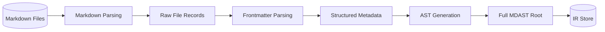
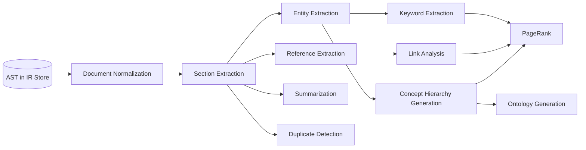
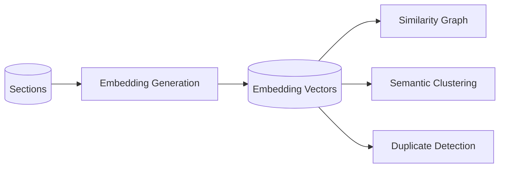
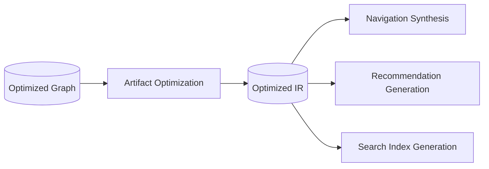
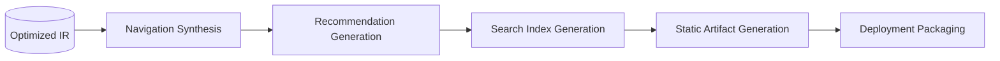
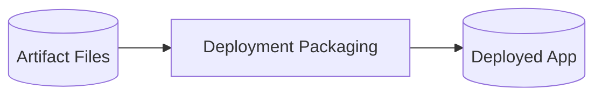

# Knowledge Compiler — Detailed Compiler Pipeline Specification

**Document Version:** 1.0.0  
**Audience:** Senior Compiler Engineers  
**Last Updated:** 2026-07-10

---

## Full Pipeline Overview

```mermaid
flowchart TB
    subgraph PARSING["PARSING PHASE"]
        MP[Markdown Parsing]
        FP[Frontmatter Parsing]
        AST[AST Generation]
    end

    subgraph ANALYSIS["ANALYSIS PHASE"]
        DN[Document Normalization]
        SE[Section Extraction]
        EE[Entity Extraction]
        RE[Reference Extraction]
        LA[Link Analysis]
        KE[Keyword Extraction]
        CH[Concept Hierarchy Generation]
        OG[Ontology Generation]
        DD[Duplicate Detection]
        SUM[Summarization]
        PR[PageRank / Importance Scoring]
    end

    subgraph EMBEDDING["EMBEDDING PHASE"]
        EG[Embedding Generation]
    end

    subgraph GRAPH["GRAPH CONSTRUCTION PHASE"]
        RI[Relationship Inference]
        KGC[Knowledge Graph Construction]
        CR[Cross-Reference Generation]
        SG[Similarity Graph]
    end

    subgraph CLUSTERING["CLUSTERING PHASE"]
        CD[Community Detection]
        TM[Topic Modeling]
        SC[Semantic Clustering]
    end

    subgraph OPTIMIZATION["OPTIMIZATION PHASE"]
        AO[Artifact Optimization]
    end

    subgraph GENERATION["GENERATION PHASE"]
        NS[Navigation Synthesis]
        RG[Recommendation Generation]
        SIG[Search Index Generation]
        AG[Static Artifact Generation]
    end

    subgraph DEPLOYMENT["DEPLOYMENT PHASE"]
        DP[Deployment Packaging]
    end

    MP --> FP --> AST
    AST --> DN --> SE
    SE --> EE --> KE
    SE --> RE --> LA
    EE --> CH --> OG
    CH --> PR
    LA --> PR
    KE --> PR
    SE --> EG
    EG --> SG
    SE --> RI --> KGC
    SG --> KGC
    KGC --> CR
    KGC --> CD
    KGC --> TM
    CD --> SC
    TM --> SC
    SC --> DD
    DD --> AO
    AO --> NS --> RG --> SIG
    SIG --> AG --> DP
    KGC --> SUM
    SUM --> AO
    EE --> RI
    RE --> RI
    EG --> SC
    EG --> DD

    classDef parse fill:#2d5a87,color:#fff
    classDef analysis fill:#4a7c59,color:#fff
    classDef embed fill:#e8792e,color:#fff
    classDef graph fill:#8b5cf6,color:#fff
    classDef cluster fill:#0ea5e9,color:#fff
    classDef opt fill:#f59e0b,color:#fff
    classDef gen fill:#10b981,color:#fff
    classDef deploy fill:#ef4444,color:#fff

    class MP,FP,AST parse
    class DN,SE,EE,RE,LA,KE,CH,OG,DD,SUM,PR analysis
    class EG embed
    class RI,KGC,CR,SG graph
    class CD,TM,SC cluster
    class AO opt
    class NS,RG,SIG,AG gen
    class DP deploy
```

---

## 1. Parsing Phase



---

### Markdown Parsing

**Category:** Parsing

**Purpose:**
Resolves file system glob patterns to discover all input Markdown documents, reads their raw bytes into memory, and computes content checksums for caching and incremental rebuild. This is the entry point of the entire compilation pipeline — without a correct file set, no downstream pass can operate.

**Inputs:**
| Input | Type | Source |
|---|---|---|
| Glob patterns | `string[]` | Compiler config (`input.glob`) |
| Ignore patterns | `string[]` | Compiler config (`input.ignore`) |
| Previous manifest (optional) | `Manifest` | L2 cache from prior build |

**Outputs:**
| Output | Type | Destination |
|---|---|---|
| File path list | `FilePath[]` | IR Store (`documents` index) |
| Raw file bytes | `Buffer[]` | IR Store (temporary, per-document) |
| Content checksums | `Map<FilePath, SHA256>` | IR Store (`DocumentNode.checksum`) |
| Change set (incremental) | `Set<FilePath>` | Scheduler |

**Algorithm:**
- Primary approach: Multi-threaded glob resolution with parallel file I/O via a thread pool worker farm
- Pseudocode:
  ```
  function markdownParsingPass(ctx):
      patterns = ctx.config.input.glob
      ignorePatterns = ctx.config.input.ignore

      // Phase 1: Glob resolution
      allFiles = []
      for pattern in patterns:
          matches = fastGlob.sync(pattern, { ignore: ignorePatterns })
          allFiles.extend(matches)

      // Phase 2: Deduplicate and sort
      allFiles = unique(allFiles)
      allFiles = sortByPath(allFiles)

      // Phase 3: Check incremental state
      previousManifest = ctx.cache.get('manifest')
      changedFiles = []
      unchangedFiles = []

      for file in allFiles:
          checksum = SHA256(readFile(file))
          if previousManifest?.fileChecksums[file] == checksum:
              unchangedFiles.push(file)
          else:
              changedFiles.push(file)

      // Phase 4: Read changed files in parallel
      workerPool = ctx.getWorkerPool('io')
      rawFiles = workerPool.map(changedFiles, file => ({
          path: file,
          content: fs.readFileSync(file),
          checksum: SHA256(content),
          size: content.length,
          mtime: fs.statSync(file).mtimeMs
      }))

      // Phase 5: Populate IR Store
      for rawFile in rawFiles:
          ctx.ir.documents.set(rawFile.path, {
              id: SHA256(normalizePath(rawFile.path)),
              filePath: rawFile.path,
              checksum: rawFile.checksum,
              size: rawFile.size,
              mtime: rawFile.mtime,
              rawContent: rawFile.content,
              status: 'unparsed'
          })

      return { changedFiles, unchangedFiles, totalFiles: allFiles.length }
  ```
- Time complexity: O(N x F) where N = number of files, F = file size in bytes; glob resolution is O(P x D) where P = pattern count, D = directory depth
- Space complexity: O(total bytes of all files); released after subsequent passes consume the content

**Implementation:**
- Recommended libraries/packages: `fast-glob` (glob resolution, 2-3x faster than node-glob), `node:fs` (file I/O), `node:crypto` (SHA-256 checksums)
- Worker pool: `node:worker_threads` with 4 dedicated I/O workers
- Configuration options: `input.glob`, `input.ignore`, `input.followSymlinks`, `pipeline.maxConcurrency`
- Plugin replacement point: Yes — implement `FileResolver` interface:
  ```typescript
  interface FileResolver {
      resolve(patterns: string[], ignore: string[]): Promise<FilePath[]>
      readFile(path: FilePath): Promise<{ content: Buffer; checksum: string }>
  }
  ```

**Edge Cases:**
- **Empty glob matches:** If no files match, emit a WARNING and produce an empty IR store; downstream passes gracefully handle zero documents
- **Binary files:** Detect non-UTF8 content via BOM/encoding detection; skip with DEGRADED status
- **Symlink loops:** Detect cycles via a visited-set during walk; break cycles by skipping the offending symlink
- **Permission errors:** Mark file as DEGRADED, log the error, continue with remaining files
- **Very large files (>100 MB):** Stream-read in 4 MB chunks, compute checksum incrementally; flag for oversized handling downstream

**Future Improvements:**
- Implement an inotify/FSEvents-based file watcher for persistent watch mode, avoiding re-glob on every incremental compilation
- Add a `.knowledgeignore` file (gitignore-compatible) for per-repository ignore rules without config changes
- Support remote file sources (S3, GCS, HTTP) via a pluggable `FileResolver` backend
- Use io_uring (Linux) or kqueue (macOS) for asynchronous file I/O with zero-copy buffers, reducing per-file overhead to sub-100us

---

### Frontmatter Parsing

**Category:** Parsing

**Purpose:**
Extracts, validates, and normalizes YAML frontmatter from each Markdown document. Frontmatter provides structured metadata (title, tags, categories, dates, custom fields) that drives downstream analysis passes, ontology construction, and artifact metadata. Validation against a user-defined or inferred Zod schema catches mismatched types before they propagate.

**Inputs:**
| Input | Type | Source |
|---|---|---|
| Raw file bytes | `Map<FilePath, Buffer>` | Markdown Parsing pass |
| Schema definition | `ZodTypeAny` | Compiler config (`frontmatter.schema`) |

**Outputs:**
| Output | Type | Destination |
|---|---|---|
| Parsed frontmatter | `Map<FilePath, Frontmatter>` | IR Store (`DocumentNode.frontmatter`) |
| Frontmatter validation errors | `ValidationError[]` | Error collector |
| Stripped body content | `Map<FilePath, string>` | IR Store (passed to AST Generation) |

**Algorithm:**
- Primary approach: Two-pass parsing: first separate frontmatter from body via delimiter detection, then parse YAML and validate against schema
- Pseudocode:
  ```
  function frontmatterParsingPass(ctx):
      rawFiles = ctx.ir.getRawFiles()
      schema = ctx.config.frontmatter.schema

      for file in rawFiles:
          content = file.content.toString('utf-8')

          // Phase 1: Delimiter detection
          delimiter = detectDelimiter(content)
          if !delimiter:
              ctx.ir.documents.get(file.path).frontmatter = {
                  title: inferTitleFromContent(content),
                  date: file.mtime,
                  tags: []
              }
              ctx.ir.documents.get(file.path).bodyContent = content
              continue

          // Phase 2: Extract raw YAML
          endIndex = content.indexOf(delimiter, delimiter.length)
          if endIndex == -1:
              ctx.errors.add(WARNING, 'Unclosed frontmatter delimiter')
              continue

          rawYaml = content.slice(delimiter.length, endIndex).trim()
          bodyContent = content.slice(endIndex + delimiter.length).trimStart()

          // Phase 3: Parse YAML
          parsed = yaml.parse(rawYaml, {
              schema: yaml.JSON_SCHEMA,
              uniqueKeys: true,
              maxAliasesCount: 0
          })

          // Phase 4: Validate against schema
          if schema:
              result = schema.safeParse(parsed)
              if !result.success:
                  ctx.errors.add(WARNING, 'Frontmatter validation error')

          // Phase 5: Normalize
          normalized = {
              title: parsed.title || inferTitle(content, file.path),
              description: parsed.description || '',
              date: normalizeDate(parsed.date),
              tags: deduplicate((parsed.tags || []).map(t => t.toLowerCase())),
              categories: parsed.categories || [],
              authors: parsed.authors || [],
              status: parsed.status || 'published',
              custom: stripKnownFields(parsed),
              _degraded: parsed._degraded || false
          }

          ctx.ir.documents.get(file.path).frontmatter = normalized
          ctx.ir.documents.get(file.path).bodyContent = bodyContent

      return results
  ```
- Time complexity: O(N x L) where N = number of files, L = frontmatter length in bytes; YAML parsing is O(L) per file
- Space complexity: O(total frontmatter bytes) ~ typically <1 KB per file

**Implementation:**
- Recommended libraries/packages: `js-yaml` (YAML parsing, v4.1+), `zod` (schema validation, v3.23+), `toml` (optional TOML support)
- Configuration options: `frontmatter.schema`, `frontmatter.delimiters` (`['---', '+++']`), `frontmatter.required` (`['title']`), `frontmatter.strict` (boolean, default false)
- Plugin replacement point: Yes — implement `FrontmatterParser` interface:
  ```typescript
  interface FrontmatterParser {
      parse(raw: string): Promise<ParsedFrontmatter>
      validate(frontmatter: unknown, schema: ZodTypeAny): ValidationResult
  }
  ```

**Edge Cases:**
- **No frontmatter:** Infer title from first `# ` heading; use default metadata; this is not an error
- **Malformed YAML:** Attempt recovery via `js-yaml`'s lenient mode; if still fails, warn and use defaults
- **Empty frontmatter (`---\n---`):** Treat as present but empty; apply all defaults
- **Duplicate keys:** YAML spec says last wins; warn but accept
- **Schema violation:** Log validation errors but do not halt — the artifact is marked degraded

**Future Improvements:**
- Support alternative frontmatter formats (TOML, JSON5, EDN) via a pluggable format adapter
- Infer a schema from a sample set of documents rather than requiring explicit Zod definitions
- Add frontmatter macros and template variables evaluated at compile time
- Implement frontmatter inheritance from directory-level `_meta.yaml` files

---

### AST Generation

**Category:** Parsing

**Purpose:**
Transforms each document's Markdown body content into a full Abstract Syntax Tree (MDAST/remark AST) and stores it as an immutable IR node. The AST is the canonical structured representation of document content — all subsequent analysis, extraction, and transformation passes operate on this tree rather than raw text.

**Inputs:**
| Input | Type | Source |
|---|---|---|
| Stripped body content | `Map<FilePath, string>` | Frontmatter Parsing pass |
| Parser configuration | `RemarkConfig` | Compiler config (`parsing.remark`) |

**Outputs:**
| Output | Type | Destination |
|---|---|---|
| Full MDAST root nodes | `Map<DocumentID, MDAST.Root>` | IR Store (`DocumentNode.ast`) |
| AST statistics | `Map<DocumentID, DocumentStats>` | IR Store (`DocumentNode.stats`) |
| Parse errors | `ParseError[]` | Error collector |

**Algorithm:**
- Primary approach: Unified remark pipeline with a standardized plugin stack, producing a typed MDAST root per document
- Pseudocode:
  ```
  function astGenerationPass(ctx):
      documents = ctx.ir.getDocumentsWithBody()
      remark = unified()
          .use(remarkParse)
          .use(remarkGfm, { singleTilde: false })
          .use(remarkMath)
          .use(remarkDirective)
          .use(remarkFrontmatter, ['yaml'])

      for doc in documents:
          try:
              ast = remark.parse(doc.bodyContent)
              stats = computeASTStats(ast)
              ctx.ir.documents.get(doc.id).ast = ast
              ctx.ir.documents.get(doc.id).stats = stats
              ctx.ir.documents.get(doc.id).status = 'parsed'
          catch error:
              ctx.errors.add(DEGRADED, 'AST parse failure')
              ctx.ir.documents.get(doc.id).ast = createMinimalAST(doc.bodyContent)
              ctx.ir.documents.get(doc.id).status = 'degraded'

      return results
  ```
- Time complexity: O(N x T) where T = tokens in document body; remark's parser is a PEG-based parser with O(T) performance for typical Markdown
- Space complexity: O(N x AST nodes per document); a typical 10-page document produces ~500-2000 AST nodes consuming ~50-200 KB

**Implementation:**
- Recommended libraries/packages: `unified` (v11+), `remark-parse` (v11+), `remark-gfm` (v4+), `remark-math` (v6+), `unist-util-visit` (tree traversal)
- Configuration options: `parsing.remark` (plugin array with options), `parsing.gfm` (boolean), `parsing.math` (boolean), `parsing.maxSize` (max input bytes, default 10 MB)
- Plugin replacement point: Yes — implement `ASTParser` interface:
  ```typescript
  interface ASTParser {
      parse(content: string, config: RemarkConfig): Promise<MDAST.Root>
      getStats(ast: MDAST.Root): DocumentStats
  }
  ```

**Edge Cases:**
- **Empty documents:** Generate a root node with a single empty paragraph; mark as valid but zero-content
- **Malformed Markdown:** remark-parse is tolerant — it produces literal text for unparseable constructs; no errors propagate
- **HTML blocks:** Preserved as raw HTML nodes; optionally sanitize via `rehype-sanitize` if configured
- **Very deep nesting (>100 levels):** Flatten at depth 20 with a warning; remark can stack-overflow on pathological input
- **Extremely long lines (>10,000 chars):** remark may exhibit O(n?) behavior; truncate at 100KB per paragraph with a warning

**Future Improvements:**
- Implement incremental AST reuse: for unchanged sections within a changed file, reuse cached sub-ASTs to avoid full re-parse
- Add a streaming parser for extremely large files (>50 MB) that yields AST subtrees per section
- Support alternative Markdown dialects (GitLab Flavored Markdown, AsciiDoc, reStructuredText) via dialect detection and parser selection
- Integrate a CST (Concrete Syntax Tree) layer that preserves whitespace and formatting for round-trip editing support

---

## 2. Analysis Phase



---

### Document Normalization

**Category:** Analysis

**Purpose:**
Transforms the raw parsed AST into a canonical, normalized form suitable for downstream analysis. This includes whitespace normalization, Unicode canonicalization, stop-word removal for analysis paths, and consistent text encoding. Normalization ensures that the same semantic content produces identical IR regardless of formatting differences, enabling deterministic caching and accurate duplicate detection.

**Inputs:**
| Input | Type | Source |
|---|---|---|
| Full MDAST root nodes | `Map<DocumentID, MDAST.Root>` | AST Generation pass |
| Normalization configuration | `NormalizationConfig` | Compiler config (analysis.normalization) |

**Outputs:**
| Output | Type | Destination |
|---|---|---|
| Normalized MDAST root nodes | `Map<DocumentID, MDAST.Root>` | IR Store (DocumentNode.ast) |
| Normalization statistics | `Map<DocumentID, NormalizationStats>` | IR Store (DocumentNode.stats) |
| Normalization offset map | `Map<DocumentID, OffsetMap>` | IR Store (source mapping) |

**Algorithm:**
- Primary approach: Recursive AST visitor applying a pipeline of normalization transforms in fixed order
- Pseudocode:
  ```
  function documentNormalizationPass(ctx):
      for doc in ctx.ir.getDocuments():
          ast = doc.ast

          // 1. Unicode normalization (NFC)
          ast = transformNodes(ast, node => {
              if node.type == 'text' || node.type == 'inlineCode':
                  node.value = node.value.normalize('NFC')
              return node
          })

          // 2. Whitespace canonicalization
          ast = transformNodes(ast, node => {
              if node.type == 'text':
                  node.value = node.value.replace(/\t/g, ' ')
                      .replace(/ +/g, ' ').trimEnd()
              return node
          })

          // 3. Remove empty text nodes
          ast = removeNodes(ast, node =>
              node.type == 'text' && node.value.length == 0)

          // 4. Normalize heading text
          ast = transformNodes(ast, node => {
              if node.type == 'heading':
                  for child in node.children:
                      if child.type == 'text':
                          child.value = child.value.replace(/\s*#+\s*$/, '').trim()
              return node
          })

          // 5. Normalize code blocks
          ast = transformNodes(ast, node => {
              if node.type == 'code':
                  node.value = node.value.replace(/\r\n/g, '\n')
                      .replace(/\r/g, '\n').replace(/\n{3,}/g, '\n\n').trimEnd() + '\n'
                  node.lang = node.lang?.toLowerCase().trim() || null
              return node
          })

          // 6. Normalize link URLs
          ast = transformNodes(ast, node => {
              if node.type == 'link' || node.type == 'image':
                  node.url = node.url.replace(/\/+/g, '/').replace(/\/$/, '')
              return node
          })

          ctx.ir.documents.get(doc.id).ast = ast
  ```
- Time complexity: O(N x A) where A = AST nodes per document; each transform visits every node once
- Space complexity: O(A x N); can be done in-place

**Implementation:**
- Recommended libraries/packages: `unist-util-visit`, `unist-util-remove`, built-in `String.prototype.normalize`
- Configuration options: `analysis.normalization.unicodeNormalization` (boolean, default true), `.collapseWhitespace` (default true), `.removeEmptyNodes` (default true), `.normalizeHeadings` (default true), `.normalizeCodeBlocks` (default true), `.normalizeLinks` (default true)
- Plugin replacement point: Yes — implement `NormalizationTransform` interface:
  ```typescript
  interface NormalizationTransform {
      name: string
      priority: number
      transform(ast: MDAST.Root, config: Record<string, unknown>): MDAST.Root
  }
  ```

**Edge Cases:**
- **Mixed Unicode forms:** NFC normalization ensures consistent representation
- **Zero-width characters:** Strip U+200B, U+200C, U+200E, U+200F from analysis paths
- **Whitespace-only documents:** Collapse to empty root with empty paragraph
- **Oversized normalization map:** Sample offset map at 10% intervals for documents >100K nodes

**Future Improvements:**
- Add configurable transliteration for non-Latin scripts (NFKC normalization + ASCII fallback)
- Implement source-map compression using interval trees, reducing memory consumption by ~10x
- Support language-specific normalization rules (German ss, Turkish dotted/dotless I)
- Add normalization diff viewer mode for debugging normalization pipeline

---

### Section Extraction

**Category:** Analysis

**Purpose:**
Decomposes the normalized document AST into discrete, addressable section nodes based on heading structure. Each section represents a coherent unit of content — analogous to a paragraph group, subchapter, or topical segment. Section boundaries are defined by heading hierarchy, thematic breaks, or configurable split heuristics. Sections are the fundamental unit of analysis, embedding, and retrieval.

**Inputs:**
| Input | Type | Source |
|---|---|---|
| Normalized MDAST root nodes | `Map<DocumentID, MDAST.Root>` | Document Normalization pass |
| Section extraction config | `SectionConfig` | Compiler config (analysis.sections) |

**Outputs:**
| Output | Type | Destination |
|---|---|---|
| Section nodes | `Map<SectionID, SectionNode>` | IR Store (sections) |
| Section-document mapping | `Map<SectionID, DocumentID>` | IR Store (section parent index) |
| Document-section mapping | `Map<DocumentID, SectionID[]>` | IR Store (section children index) |
| Heading path registry | `Map<HeadingPath, SectionID>` | IR Store (heading uniqueness index) |

**Algorithm:**
- Primary approach: Recursive descent through the AST, accumulating content between headings into section nodes with a heading-stack tracking the current path
- Pseudocode:
  ```
  function sectionExtractionPass(ctx):
      for doc in ctx.ir.getDocuments():
          headingStack = []
          currentSection = new SectionBuilder()
          sectionIndex = 0

          visit(doc.ast, (node, parent) => {
              switch node.type:
                  case 'heading':
                      if currentSection.hasContent():
                          sectionId = genSectionId(doc.id, headingStack, sectionIndex)
                          sections.push(currentSection.build(sectionId))
                          sectionIndex++

                      popDeeperHeadings(headingStack, node.depth)
                      headingStack.push({ depth: node.depth, text: extractText(node) })
                      currentSection = new SectionBuilder({
                          headingPath: headingStack.map(h => h.text).join(' > '),
                          depth: node.depth,
                          headingText: extractText(node)
                      })
                      return

                  case 'paragraph': case 'code': case 'list':
                  case 'blockquote': case 'table':
                      currentSection.addBlock({
                          type: node.type,
                          content: serializeNode(node),
                          ast: node,
                          position: node.position
                      })
          })

          if currentSection.hasContent():
              sections.push(currentSection.build(
                  genSectionId(doc.id, headingStack, sectionIndex)))

          for section in sections:
              ctx.ir.sections.set(section.id, section)
              ctx.ir.registerSectionMapping(section.id, doc.id)
  ```
- Time complexity: O(N x A) single visit of AST; heading stack operations are O(1) amortized
- Space complexity: O(S) where S = number of sections produced (typically 3-10 per document)

**Implementation:**
- Recommended libraries/packages: `unist-util-visit`, `mdast-util-to-string`, `mdast-util-phrasing`
- Configuration options: `analysis.sections.minSectionLength` (default 50), `.maxSectionDepth` (default 6), `.splitOnThematicBreak` (default false), `.splitOnHeadings` (default true), `.preserveCodeBlocks` (default true), `.tokenizer` ('cl100k_base' | 'gpt2' | 'word')
- Plugin replacement point: Yes — implement `SectionExtractor` interface:
  ```typescript
  interface SectionExtractor {
      extract(ast: MDAST.Root, docId: DocumentID, config: SectionConfig): Promise<SectionNode[]>
  }
  ```

**Edge Cases:**
- **No headings in document:** Create single section with document title as path
- **Orphaned content before first heading:** Collected into a preamble section
- **Non-contiguous heading levels (h1 to h3 without h2):** Heading stack handles arbitrary depth jumps
- **Empty sections (heading with no content):** Skip; heading alone provides structural information
- **Very long sections (>10,000 tokens):** Sub-split on paragraph boundaries every 5000 tokens
- **Sections with only code blocks:** Preserved as-is; tokenized separately for embedding

**Future Improvements:**
- Add semantic section merging: use embedding similarity to merge adjacent sections on same topic
- Implement multi-resolution section extraction: produce both coarse (h1-level) and fine-grained hierarchies simultaneously
- Support document-embedded section markers for explicit manual section boundaries
- Add cross-document section linking: detect continuation patterns and create edges automatically

---

### Entity Extraction

**Category:** Analysis

**Purpose:**
Identifies and classifies named entities (people, organizations, locations, technologies, concepts) within each section's text content. Entity extraction populates the concept graph with typed nodes that form the backbone of semantic understanding, cross-referencing, and ontology construction.

**Inputs:**
| Input | Type | Source |
|---|---|---|
| Normalized section content | `Map<SectionID, string>` | Section Extraction pass |
| Known entity lexicon | `Map<string, EntityEntry>` | Compiler config or prior build |
| Document frontmatter | `Map<DocumentID, Frontmatter>` | Frontmatter Parsing pass |

**Outputs:**
| Output | Type | Destination |
|---|---|---|
| Extracted entity nodes | `Map<EntityID, EntityNode>` | IR Store (concepts, type=entity) |
| Section-entity mapping | `Map<SectionID, EntityID[]>` | IR Store (section entity index) |
| Entity co-occurrence counts | `Map<[EntityID, EntityID], number>` | IR Store |
| Entity frequency statistics | `Map<EntityID, EntityStats>` | IR Store (ConceptNode.frequency) |

**Algorithm:**
- Primary approach: Hybrid pipeline combining rule-based pattern matching with statistical NLP, followed by entity resolution and disambiguation
- Pseudocode:
  ```
  function entityExtractionPass(ctx):
      // Phase 1: Regex pattern extraction
      patterns = [
          /(?:https?:\/\/)?([A-Z][a-z]+\.(?:com|org|io|net))/g,
          /@([A-Za-z0-9_]+)/g,
          /\b([A-Z][a-z]+ [A-Z][a-z]+)\b/g,
          /#([A-Za-z0-9_]+)/g,
      ]

      for section of sections:
          text = section.content
          sectionEntityIds = []

          // Extract via patterns
          for pattern in patterns:
              for match of text.matchAll(pattern):
                  entity = normalizeEntityName(match[1], match[0])
                  entities.set(entity.id, createEntity(entity))
                  sectionEntityIds.push(entity.id)

          // Extract via statistical NER
          if config.enableNER:
              nerResults = ner.extract(text)
              for result of nerResults:
                  entity = resolveAlias(normalizeEntityName(result.text, result.label), lexicon)
                  if entity:
                      entities.set(entity.id, createEntity(entity, result.label))
                      sectionEntityIds.push(entity.id)

          // Compute co-occurrence for entity pairs in same section
          for i in 0..<sectionEntityIds.length:
              for j in i+1..<sectionEntityIds.length:
                  cooccurrence.increment([sectionEntityIds[i], sectionEntityIds[j]])

      // Phase 2: Entity resolution
      if config.enableResolution:
          clusters = resolveEntities(entities, { threshold: 0.85 })
          for cluster in clusters:
              canonical = pickCanonical(cluster)
              for entity in cluster:
                  if entity.id != canonical.id:
                      mergeEntity(canonical, entity)
                      entities.delete(entity.id)

      // Populate IR Store
      for entity of entities.values():
          ctx.ir.concepts.set(entity.id, entity)
  ```
- Time complexity: O(S x L x P + S x NER(L)) where S = sections, L = section length, P = pattern count; CRF NER is O(L) per section
- Space complexity: O(E + S x E_avg) where E = distinct entities

**Implementation:**
- Recommended libraries/packages: `compromise` (lightweight NER), `natural` (TF-IDF, tokenizer), `node-nlp` (full NLP suite), `spacy-rs` (WASM-compiled spaCy) for high-accuracy NER
- Configuration options: `analysis.entities.enableNER` (default true), `.enableResolution` (default true), `.minFrequency` (default 2), `.minCooccurrence` (default 1), `.lexicon` (path to custom entity dictionary)
- Plugin replacement point: Yes — implement `EntityExtractor` interface:
  ```typescript
  interface EntityExtractor {
      extract(section: SectionNode, config: EntityConfig): Promise<EntityExtraction[]>
      resolve(entities: EntityNode[], config: ResolutionConfig): Promise<EntityCluster[]>
  }
  ```

**Edge Cases:**
- **Acronyms and initialisms:** Detect via /\b[A-Z]{2,}\b/g; expand using built-in acronym dictionary
- **Compound entities:** Support multi-word extraction via n-gram sliding window with CRF sequence labeling
- **False positives:** Filter using a stop-entity list; require minimum confidence >0.3
- **Entities in code blocks:** Skip by default; optionally extract from comments and docstrings
- **Entities with punctuation (C++, .NET, React.js):** Custom tokenizer rules preserve punctuation-internal entities

**Future Improvements:**
- Integrate transformer-based NER (distilled BERT-NER via ONNX Runtime) for sub-10ms inference
- Implement entity grounding to external knowledge bases (Wikipedia, Wikidata, DBpedia)
- Add temporal entity tracking for entities with temporal scope
- Use embedding-based entity linking for disambiguation across contexts

---

### Reference Extraction

**Category:** Analysis

**Purpose:**
Discovers and resolves cross-document and intra-document references expressed as wiki-links, Markdown links, footnote references, and citation keys. Reference extraction builds the raw edge set for the knowledge graph by identifying explicit connections between content units.

**Inputs:**
| Input | Type | Source |
|---|---|---|
| Normalized MDAST root nodes | `Map<DocumentID, MDAST.Root>` | Document Normalization pass |
| Section-document mapping | `Map<SectionID, DocumentID>` | Section Extraction pass |
| Document path-ID registry | `Map<FilePath, DocumentID>` | Markdown Parsing pass |
| Citation style config | `CitationConfig` | Compiler config |

**Outputs:**
| Output | Type | Destination |
|---|---|---|
| Raw reference edges | `Edge[]` | IR Store (edges, type=references) |
| Broken reference report | `BrokenReference[]` | Error collector |
| Reference resolution map | `Map<ReferenceID, ResolvedTarget>` | IR Store |

**Algorithm:**
- Primary approach: AST visitor collecting reference nodes, resolving each against a target index built from document paths, headings, and explicit anchors
- Pseudocode:
  ```
  function referenceExtractionPass(ctx):
      // Build target index from documents, sections, and anchors
      targetIndex = new Map()
      for doc of documents:
          targetIndex.set(normalizeKey(doc.filePath), { type: 'document', docId: doc.id })
          targetIndex.set(stem(doc.filePath), { type: 'document', docId: doc.id })
          for section of ctx.ir.getDocumentSections(doc.id):
              anchor = generateHeadingAnchor(section.headingPath)
              targetIndex.set(anchor, { type: 'section', sectionId: section.id })

      // Visit each doc's AST for reference nodes
      for doc of documents:
          visit(doc.ast, (node) => {
              if node.type == 'wikiLink':
                  resolved = targetIndex.get(normalizeKey(node.value))
                  if resolved:
                      edges.push({ sourceId: sectionId, targetId: resolved.id,
                          type: 'references', weight: 1.0,
                          metadata: { linkType: 'wiki', text: node.text } })
                  else:
                      brokenRefs.push({ source: doc.filePath, target: node.value })

              if node.type == 'link' && isInternalURL(node.url):
                  resolved = targetIndex.get(normalizeURLToKey(node.url))
                  if resolved:
                      edges.push({ sourceId: sectionId, targetId: resolved.id,
                          type: 'references', weight: 0.9,
                          metadata: { linkType: 'markdown', url: node.url } })
          })

      for edge of edges:
          ctx.ir.edges.add(edge)
  ```
- Time complexity: O(N x A + R x log(T)) where R = references, T = target index entries; hash map lookup is O(1)
- Space complexity: O(T + R) where T = target index size, R = reference edge count

**Implementation:**
- Recommended libraries/packages: `remark-wiki-link`, `remark-cite`, `mdast-util-to-string`
- Configuration options: `analysis.references.strict` (default false), `.warnOnBrokenInternalLinks` (default true), `.indexCustomAnchors` (default true), `.resolveCitations` (default false)
- Plugin replacement point: Yes — implement `ReferenceResolver` interface:
  ```typescript
  interface ReferenceResolver {
      buildTargetIndex(ctx: CompilerContext): Promise<Map<string, ResolvedTarget>>
      resolveReference(ref: ReferenceNode, index: TargetIndex): Promise<ResolvedReference | null>
  }
  ```

**Edge Cases:**
- **Circular references (A to B to A):** Not an error; edges stored as-is; cycle detection deferred to Knowledge Graph Construction
- **Self-references:** Allowed; creates intra-document edges between sections
- **Multiple targets for same key:** Warning emitted; section-level preferred over document-level
- **Case-insensitive resolution:** All target keys lowercased; wiki-links are case-insensitive
- **Escaped brackets:** remark-wiki-link handles escaped wiki-link brackets

**Future Improvements:**
- Add fuzzy reference resolution: Levenshtein-distance matching (threshold: 0.8) as fallback
- Implement reference autocomplete validation against target index
- Support transclusion (![[Other Doc#section]]) with inline content embedding
- Add cross-repository references via remote manifest lookup

---

### Link Analysis

**Category:** Analysis

**Purpose:**
Analyzes the link structure of the document corpus to compute link-based metrics (link density, out-degree/in-degree per section, link patterns) and resolve link context. This pass distinguishes between navigational links, semantic references, and structural links, classifying each edge for downstream graph construction and PageRank scoring.

**Inputs:**
| Input | Type | Source |
|---|---|---|
| Raw reference edges | `Edge[]` | Reference Extraction pass |
| AST nodes with position data | `Map<DocumentID, MDAST.Root>` | Document Normalization pass |
| Link classification config | `LinkAnalysisConfig` | Compiler config |

**Outputs:**
| Output | Type | Destination |
|---|---|---|
| Classified link edges | `Edge[] (updated weights/types)` | IR Store (edges) |
| Link statistics | `LinkStats` | IR Store (document statistics) |
| Link context embeddings | `Map<EdgeID, string>` | IR Store (surrounding text) |

**Algorithm:**
- Primary approach: Two-pass classifier — heuristic-based classification using pattern matching on link position and surrounding context, then statistical refinement using graph properties
- Pseudocode:
  ```
  function linkAnalysisPass(ctx):
      for edge of ctx.ir.edges.getByType('references'):
          sourceSection = ctx.ir.sections.get(edge.sourceId)

          // Classify link based on position and context
          categories = classifyLink(edge, sourceSection)

          if categories.has('navigational'):
              edge.type = 'navigational'; edge.weight = 0.4
          elif categories.has('structural'):
              edge.type = 'structural'; edge.weight = 0.6
          elif categories.has('definitional'):
              edge.type = 'defines'; edge.weight = 1.0
          elif categories.has('related'):
              edge.type = 'related'; edge.weight = 0.7
          else:
              edge.type = 'references'; edge.weight = 0.8

          // Capture surrounding text for context
          if config.captureLinkContext:
              context = extractSurroundingText(sourceSection, edge, { windowChars: 200 })
              edge.metadata.surroundingContext = context

          ctx.ir.edges.update(edge)

  function classifyLink(edge, section):
      categories = new Set()
      linkText = edge.metadata.text || ''

      if linkText.match(/^(next|previous|home|back|top|index)$/i):
          categories.add('navigational')
      if edge.metadata.surroundingContext.match(/(see also|related|more info)/i):
          categories.add('related')
      if edge.metadata.surroundingContext.match(/(is a|is an|refers to|defined as)/i):
          categories.add('definitional')

      return categories
  ```
- Time complexity: O(E x W) where E = edges, W = context window length (constant)
- Space complexity: O(E) for classified edges with context metadata

**Implementation:**
- Recommended libraries/packages: Custom rule engine based on regex and position heuristics; optional `@ml-link-classifier/light` for ML-based classification
- Configuration options: `analysis.links.captureLinkContext` (default true), `.contextWindowChars` (default 200), `.classifier` ('heuristic' | 'ml' | 'hybrid')
- Plugin replacement point: Yes — implement `LinkClassifier` interface:
  ```typescript
  interface LinkClassifier {
      classify(edge: Edge, section: SectionNode): Promise<LinkClassification>
      analyze(edges: Edge[]): Promise<LinkAnalysisResult>
  }
  ```

**Edge Cases:**
- **Links with no surrounding text:** Classify as 'navigational'; context extends to nearest paragraph boundary
- **Multiple links in same span:** Process each independently; overlapping contexts allowed
- **Image links:** Treated as 'related'; weight adjusted if alt text indicates diagram
- **Autogenerated links (from templates):** Detect via metadata marker; assign lower default weight (0.3)
- **External URLs:** Indexed with type 'external' and reduced weight (0.2); excluded from PageRank

**Future Improvements:**
- Train a lightweight transformer model on labeled link types for more accurate classification
- Implement temporal link analysis: compare patterns across versions to detect link rot
- Add sentiment-aware link classification via surrounding context sentiment analysis
- Use link context embeddings for semantic similarity between source and target

---

### Keyword Extraction

**Category:** Analysis

**Purpose:**
Extracts significant keywords and keyphrases from each section and document using statistical and graph-based methods. Keywords populate the concept graph with topic nodes, enable search index construction, provide features for clustering, and power the TF-IDF fallback for embedding generation.

**Inputs:**
| Input | Type | Source |
|---|---|---|
| Normalized section content | `Map<SectionID, string>` | Section Extraction pass |
| Document-section mapping | `Map<DocumentID, SectionID[]>` | Section Extraction pass |
| Entity nodes | `Map<EntityID, EntityNode>` | Entity Extraction pass |
| Keyword extraction config | `KeywordConfig` | Compiler config |

**Outputs:**
| Output | Type | Destination |
|---|---|---|
| Keyword nodes | `Map<KeywordID, KeywordNode>` | IR Store (concepts, type=keyword) |
| Section-keyword mapping | `Map<SectionID, KeywordID[]>` | IR Store (section keyword index) |
| TF-IDF matrix (fallback) | `SparseMatrix` | IR Store (used by Embedding Generation) |

**Algorithm:**
- Primary approach: Hybrid of TF-IDF with positional boosting for section-level extraction, and TextRank (graph-based) for document-level keyphrase extraction
- Pseudocode:
  ```
  function keywordExtractionPass(ctx):
      // Phase 1: Corpus-level IDF computation
      df = new Counter()
      for section of sections:
          tokens = tokenizer.tokenize(section.content.toLowerCase())
          tokens = tokens.filter(t => !stopWords.has(t) && t.length >= 3)
          for token of unique(tokens):
              df.increment(token)

      N = sections.length
      idf = new Map()
      for [token, docFreq] of df:
          idf.set(token, Math.log(N / (1 + docFreq)))

      // Phase 2: Per-section TF-IDF scoring with positional boosting
      for section of sections:
          tokens = tokenizer.tokenize(section.content.toLowerCase())
          tokens = tokens.filter(t => !stopWords.has(t) && t.length >= 3)

          tf = new Counter()
          positions = new Map()
          for i, token of tokens:
              tf.increment(token)
              positions.set(token, (positions.get(token) || []).concat(i))

          // Boost heading terms
          if section.depth > 0:
              headingTerms = tokenizer.tokenize(section.headingPath.toLowerCase())
                  .filter(t => !stopWords.has(t))
              for term of headingTerms:
                  tf.increment(term, 1.0)

          // Score: TF-IDF * positional weight
          sectionKeywordScores = []
          for [token, freq] of tf:
              score = freq * idf.get(token)
              firstPosition = Math.min(...positions.get(token))
              positionalWeight = 1.0 + (1.0 / (1.0 + firstPosition))
              score *= positionalWeight

              if score >= config.minScore:
                  sectionKeywordScores.push({ term: token, score })

          topK = sectionKeywordScores.sort((a,b)=>b.score-a.score).slice(0, config.maxKeywordsPerSection)
          for kw of topK:
              ctx.ir.concepts.set(kw.id, { name: kw.term, type: 'keyword', score: kw.score })

      // Phase 3: Multi-word keyphrase extraction via TextRank
      if config.enableKeyphrases:
          for doc of documents:
              phrases = textRankKeyphrases(fullText, { ngramRange: [2,4], topN: 10 })
              for phrase of phrases:
                  ctx.ir.concepts.set(phrase.id, {
                      name: phrase.text, type: 'keyphrase', score: phrase.score, isMultiWord: true })
  ```
- Time complexity: O(S x T + V log V) where T = tokens per section, V = vocabulary size; TextRank is O(K? x I) where K = candidate keyphrases, I = iterations
- Space complexity: O(V + S x K) where K = keywords per section

**Implementation:**
- Recommended libraries/packages: `natural` (TF-IDF, tokenizer), `compromise` (tokenizer), custom TextRank implementation
- Configuration options: `analysis.keywords.maxKeywordsPerSection` (default 20), `.maxKeyphrasesPerDoc` (default 10), `.minScore` (default 0.1), `.minWordLength` (default 3), `.language` (default 'en'), `.enableKeyphrases` (default true), `.headingBoost` (default 2.0)
- Plugin replacement point: Yes — implement `KeywordExtractor` interface:
  ```typescript
  interface KeywordExtractor {
      extract(section: SectionNode, corpus: CorpusStats): Promise<ScoredTerm[]>
      extractKeyphrases(doc: DocumentNode): Promise<ScoredPhrase[]>
      computeIDF(sections: SectionNode[]): Promise<Map<string, number>>
  }
  ```

**Edge Cases:**
- **Very short sections (<20 words):** Lower minScore threshold by 50%
- **Code-heavy sections:** Extract keywords from comments and identifiers; skip pure code
- **Duplicate keywords across sections:** Merged by ID; frequency counter tracks total appearances
- **Numbers as keywords:** Filter numeric-only; allow numbers with units via pattern /\d+[A-Za-z]+/
- **Non-ASCII keywords:** CJK uses character n-grams rather than whitespace splitting

**Future Improvements:**
- Implement keyphrase quality scoring using a supervised model trained on KP20k dataset
- Add temporal keyword trending: track frequency changes across document versions
- Implement multi-language keyword extraction with language-specific tokenizers
- Use embedding similarity to merge semantically equivalent keywords (ML vs Machine Learning)

---

### Concept Hierarchy Generation

**Category:** Analysis

**Purpose:**
Organizes extracted entities and keywords into a taxonomic hierarchy using hypernym/hyponym relationships, subsumption analysis, and lexical pattern matching. The resulting hierarchy provides the structural backbone for navigation, faceted search, and ontology generation.

**Inputs:**
| Input | Type | Source |
|---|---|---|
| Entity nodes | `Map<EntityID, EntityNode>` | Entity Extraction pass |
| Keyword nodes | `Map<KeywordID, KeywordNode>` | Keyword Extraction pass |
| Section content | `Map<SectionID, string>` | Section Extraction pass |
| Hierarchy configuration | `HierarchyConfig` | Compiler config |

**Outputs:**
| Output | Type | Destination |
|---|---|---|
| Concept hierarchy (DAG) | `Map<ConceptID, ParentConceptID[]>` | IR Store (hierarchy index) |
| Hierarchy depth map | `Map<ConceptID, number>` | IR Store (concept depth metadata) |
| Subsumption edges | `Edge[] (type=subsumes)` | IR Store (edges) |

**Algorithm:**
- Primary approach: Hybrid of lexical pattern matching, distributional similarity (embedding-based subsumption), and lexical database lookup (WordNet)
- Pseudocode:
  ```
  function conceptHierarchyPass(ctx):
      // Phase 1: Extract explicit hyponymy relations from text
      explicitEdges = []
      for section of ctx.ir.getSections():
          for match of section.content.matchAll(
              /(\w+(?:\s+\w+){0,3})\s+is\s+(?:a|an)\s+(?:type|kind|form)\s+of\s+(\w+(?:\s+\w+){0,3})/gi):
              hyponym = normalizeConcept(match[1])
              hypernym = normalizeConcept(match[2])
              if hasConcept(allConcepts, hyponym) && hasConcept(allConcepts, hypernym):
                  explicitEdges.push({ child: hyponym, parent: hypernym, confidence: 0.95 })

          for match of section.content.matchAll(
              /(\w+(?:\s+\w+){0,3})\s+such\s+as\s+(.+)/gi):
              hypernym = normalizeConcept(match[1])
              for hyponym of match[2].split(',').map(s => normalizeConcept(s.trim())):
                  if hasConcept(allConcepts, hyponym) && hasConcept(allConcepts, hypernym):
                      explicitEdges.push({ child: hyponym, parent: hypernym, confidence: 0.9 })

      // Phase 2: WordNet lookup
      if config.enableWordNet:
          wordnet = await loadWordnet(config.language)
          for [conceptId, node] of allConcepts:
              hypernyms = wordnet.getHypernyms(node.name)
              for hypernym of hypernyms:
                  parentId = findConceptByName(allConcepts, hypernym)
                  if parentId:
                      explicitEdges.push({ child: conceptId, parent: parentId, confidence: 0.85 })

      // Phase 3: Merge and resolve conflicts (ensure DAG)
      parentMap = new Map()
      for edge of explicitEdges.sort((a,b) => b.confidence - a.confidence):
          if !parentMap.has(edge.child) && !wouldCreateCycle(edge.child, edge.parent, parentMap):
              parentMap.set(edge.child, edge.parent)
              ctx.ir.edges.add({
                  sourceId: edge.child, targetId: edge.parent,
                  type: 'subsumes', weight: edge.confidence })

      // Compute hierarchy depths
      for conceptId of allConcepts.keys():
          depths.set(conceptId, computeDepth(conceptId, parentMap, 0))
      ctx.ir.setHierarchyDepths(depths)
  ```
- Time complexity: O(C? x D) for distributional subsumption (expensive, disabled by default); O(S x P) for pattern extraction; WordNet lookup is O(1) per concept
- Space complexity: O(C + H) where H = hierarchy edges (typically C/2 to C*2)

**Implementation:**
- Recommended libraries/packages: `wordnet-db` + `wordpos` (WordNet interface), custom pattern matcher
- Configuration options: `analysis.hierarchy.enableDistributional` (default false, expensive), `.enableWordNet` (default true), `.subsumptionThreshold` (default 0.3), `.language` (default 'en')
- Plugin replacement point: Yes — implement `HierarchyBuilder` interface:
  ```typescript
  interface HierarchyBuilder {
      build(concepts: ConceptNode[], sections: SectionNode[], config: HierarchyConfig): Promise<SubsumptionEdge[]>
  }
  ```

**Edge Cases:**
- **Cyclic parent relationships (A to B to A):** Break by removing lower-confidence edge; log conflict
- **Multiple inheritance:** Supported (DAG, not tree); merge-policy: 'keep-all' or 'prefer-highest-confidence'
- **Unknown concepts (not in WordNet):** Distributional subsumption or lexical overlap as fallback
- **Root concepts with no parents:** Assigned to artificial root node; depth = 1
- **Overly broad subsumption:** Penalize concepts appearing in >20% of documents

**Future Improvements:**
- Integrate with Wikidata/DBpedia taxonomy for high-coverage concept hierarchy extraction
- Implement ontology alignment with existing domain ontologies (Dublin Core, Schema.org)
- Add interactive hierarchy refinement format for human curation
- Use LLM prompting for zero-shot hyponymy detection with confidence calibration

---

### Ontology Generation

**Category:** Analysis

**Purpose:**
Produces a formal, structured ontology from the concept hierarchy, entity types, and relationship patterns discovered in the corpus. The ontology defines classes, object properties, data properties, and axioms that describe the domain of knowledge captured by the documents. This enables semantically rich querying and validation of the knowledge graph.

**Inputs:**
| Input | Type | Source |
|---|---|---|
| Concept hierarchy (DAG) | `Map<ConceptID, ParentConceptID[]>` | Concept Hierarchy Generation pass |
| Entity nodes with types | `Map<EntityID, EntityNode>` | Entity Extraction pass |
| Relationship patterns | `RelationshipPattern[]` | Relationship Inference pass |
| Ontology configuration | `OntologyConfig` | Compiler config |

**Outputs:**
| Output | Type | Destination |
|---|---|---|
| OWL/RDFS ontology | `OWLOntology` | IR Store (ontology model) |
| Class hierarchy | `Map<ClassID, ClassDefinition>` | IR Store (ontology classes) |
| Object property definitions | `Map<PropertyID, PropertyDefinition>` | IR Store (ontology properties) |
| Type axioms | `Axiom[]` | IR Store (ontology axioms) |

**Algorithm:**
- Primary approach: Bottom-up abstraction over concept hierarchy with type inference from entity extraction labels and relationship co-occurrence patterns
- Pseudocode:
  ```
  function ontologyGenerationPass(ctx):
      // Phase 1: Derive classes from concept hierarchy
      for [conceptId, parents] of hierarchy:
          classes.set(conceptId, {
              name: ctx.ir.concepts.get(conceptId).name,
              type: 'owl:Class',
              subClassOf: parents.map(p => ({ classId: p })),
              annotations: { label: ctx.ir.concepts.get(conceptId).name }
          })

      // Phase 2: Derive object properties from relationship patterns
      relationshipPatterns = [
          { pattern: 'works_for', domain: 'Person', range: 'Organization' },
          { pattern: 'located_in', domain: 'Location', range: 'Location' },
          { pattern: 'created_by', domain: 'Technology', range: 'Person|Organization' },
          { pattern: 'part_of', domain: 'Concept', range: 'Concept' },
      ]
      for relPattern of relationshipPatterns:
          instances = findRelationshipInstances(relPattern, ctx.ir)
          if instances.length > config.minPropertyInstances:
              properties.set(propId, {
                  label: relPattern.label, type: 'owl:ObjectProperty',
                  domain: resolveClass(relPattern.domain), range: resolveClass(relPattern.range) })

      // Phase 3: Infer type axioms from entity labels
      labelClassMap = { 'PERSON': 'Person', 'ORG': 'Organization', 'TECH': 'Technology' }
      for entity of entities:
          owlClass = labelClassMap[entity.entityType]
          if owlClass && classes.has(owlClass):
              axioms.push({ type: 'ClassAssertion', individualId: entity.id, classId: owlClass })

      ctx.ir.setOntology({ classes: [...classes.values()], properties: [...properties.values()], axioms })
  ```
- Time complexity: O(C? + R x I) where C = classes, R = relationship patterns, I = instance checks
- Space complexity: O(C + P + A) where P = properties, A = axioms

**Implementation:**
- Recommended libraries/packages: `jsonld` (JSON-LD serialization), `n3` (RDF/Turtle serialization)
- Configuration options: `analysis.ontology.inferDisjointness` (default false), `.minPropertyInstances` (default 3), `.format` ('rdfs' | 'owl' | 'jsonld'), `.namespace` (default 'http://knowledge-compiler.dev/ontology#')
- Plugin replacement point: Yes — implement `OntologyGenerator` interface:
  ```typescript
  interface OntologyGenerator {
      generate(ir: IRStore, config: OntologyConfig): Promise<OWLOntology>
      export(ontology: OWLOntology, format: string): Promise<string>
  }
  ```

**Edge Cases:**
- **Empty ontology:** Generate ontology with only owl:Thing
- **Conflicting axioms:** Emit warning; prefer higher-confidence axiom
- **Very large ontologies (>10,000 classes):** Emit summary: top-3 levels only
- **Domain/range mismatch:** Store as warning but do not exclude

**Future Improvements:**
- Integrate OWL reasoner (HermiT, Pellet via WASM) for ontology classification and inference
- Support ontology alignment with Schema.org, Dublin Core, FOAF, SKOS
- Generate SHACL shapes for knowledge graph validation
- Add ontology versioning with diff capabilities

---

### Summarization

**Category:** Analysis

**Purpose:**
Generates concise, extractive summaries for each section and document. Summaries serve as snippet previews in search results, navigation tooltips, and lightweight content for recommendation interfaces. The extractive approach ensures determinism and avoids the latency and cost of abstractive generation at build time.

**Inputs:**
| Input | Type | Source |
|---|---|---|
| Section content | `Map<SectionID, string>` | Section Extraction pass |
| Section headings and position | `Map<SectionID, SectionMetadata>` | Section Extraction pass |
| Entity/keyword annotations | `Map<SectionID, ConceptID[]>` | Entity/Keyword Extraction passes |
| Summarization config | `SummarizationConfig` | Compiler config |

**Outputs:**
| Output | Type | Destination |
|---|---|---|
| Section summaries | `Map<SectionID, string>` | IR Store (SectionNode.summary) |
| Document abstracts | `Map<DocumentID, string>` | IR Store (DocumentNode.abstract) |
| Key sentence extractions | `Map<SectionID, Sentence[]>` | IR Store (optional) |

**Algorithm:**
- Primary approach: Extractive summarization using TextRank with section-specific lexical centrality and lead-3 bias for short sections
- Pseudocode:
  ```
  function summarizationPass(ctx):
      for section of sections:
          if section.type == 'code':
              summary = extractFirstMeaningfulLine(section)
              sectionSummaries.set(section.id, summary)
              continue

          sentences = splitSentences(section.content)
          if sentences.length <= config.minSentencesForRanking:
              sectionSummaries.set(section.id, sentences.slice(0, config.summarySentenceCount).join(' '))
              continue

          // Build sentence similarity graph
          sentVectors = sentences.map(s => vectorize(s, { stopWords }))
          similarityMatrix = computeCosineSimilarityMatrix(sentVectors)

          // TextRank: PageRank on sentence graph
          scores = textRankPageRank(similarityMatrix, { dampingFactor: 0.85, maxIterations: 100 })

          // Boost sentences containing entities
          sectionConcepts = ctx.ir.getSectionConcepts(section.id)
          if sectionConcepts && config.boostEntitySentences:
              for i, sentence of sentences:
                  for concept of sectionConcepts:
                      if sentence.toLowerCase().includes(concept.name.toLowerCase()):
                          scores[i] *= config.entityBoostFactor

          // Lead-3 bias
          if config.leadBias:
              for i in range(min(3, sentences.length)):
                  scores[i] *= 1.0 + (config.leadBiasStrength * (1.0 - i / 3.0))

          // Select top-K sentences in original order
          ranked = sentences.map((s, i) => ({ sentence: s, score: scores[i], index: i }))
              .sort((a, b) => b.score - a.score)
              .slice(0, config.summarySentenceCount)
              .sort((a, b) => a.index - b.index)

          summary = ranked.map(s => s.sentence).join(' ')
          sectionSummaries.set(section.id, summary.slice(0, config.maxSummaryChars))

      // Document-level abstracts: concatenate first section summaries
      for doc of documents:
          docSections = ctx.ir.getDocumentSections(doc.id)
          abstract = sectionSummaries.get(docSections[0].id) || ''
          docAbstracts.set(doc.id, abstract.slice(0, config.maxDocAbstractChars))
  ```
- Time complexity: O(S x (T? + T log T)) where T = sentences per section; TextRank is O(T?) per section
- Space complexity: O(S x T_avg?) for similarity matrices (computed and discarded per section)

**Implementation:**
- Recommended libraries/packages: Custom TextRank, `compromise` (sentence splitting), `natural` (tokenizer, vectorizer), `@xenova/transformers` for transformer-based extractive summarization
- Configuration options: `analysis.summarization.summarySentenceCount` (default 3), `.maxSummaryChars` (default 500), `.minSentencesForRanking` (default 5), `.method` ('textrank' | 'lead-k' | 'transformer' | 'hybrid'), `.leadBias` (default true), `.boostEntitySentences` (default true), `.entityBoostFactor` (default 1.5)
- Plugin replacement point: Yes — implement `Summarizer` interface:
  ```typescript
  interface Summarizer {
      summarize(text: string, context: SummarizationContext): Promise<string>
      abstract(docSections: SectionNode[], config: SummarizationConfig): Promise<string>
  }
  ```

**Edge Cases:**
- **Single-sentence sections:** Return sentence truncated to maxSummaryChars
- **Code-only sections:** Use first comment line or docstring
- **Lists as sections:** Use first list item or introductory sentence
- **Duplicate content across sections:** Independently summarized; deduplication pass merges near-duplicates
- **Non-English text:** Language-appropriate sentence segmentation via ICU

**Future Improvements:**
- Implement abstractive summarization via local ONNX-optimized DistilBART model for more fluent summaries
- Add query-focused summarization: generate summaries conditioned on document's most important entities
- Use contrastive summarization for version diffs
- Implement hierarchical summarization per heading level for multi-resolution browsing

---

## 3. Embedding Phase


---

### Embedding Generation

**Category:** Embedding

**Purpose:**
Transforms section content into fixed-dimensional vector representations (embeddings) using a neural embedding model. Embeddings capture semantic content in a dense vector space where semantically similar content maps to nearby points. These vectors are the foundation for clustering, similarity search, duplicate detection, and semantic matching throughout the pipeline.

**Inputs:**
| Input | Type | Source |
|---|---|---|
| Normalized section content | `Map<SectionID, string>` | Section Extraction pass |
| Section heading context | `Map<SectionID, string>` | Section Extraction pass |
| Text chunking config | `ChunkingConfig` | Compiler config (embedding.chunking) |
| Embedding model config | `EmbeddingConfig` | Compiler config (embedding) |

**Outputs:**
| Output | Type | Destination |
|---|---|---|
| Dense embedding vectors | `Map<SectionID, Float32Array>` | IR Store (EmbeddingStore) |
| Embedding metadata | `Map<SectionID, EmbeddingMeta>` | IR Store (model, dimensions, chunk info) |
| Reduced-dimension vectors | `Map<SectionID, Float32Array>` | IR Store (256d after PCA/UMAP) |
| TF-IDF sparse vectors (fallback) | `Map<SectionID, SparseVector>` | IR Store (fallback path) |

**Algorithm:**
- Primary approach: Chunk sections into token windows within model limits, batch-send to embedding API/provider, apply dimensionality reduction, and store in memory-efficient flat buffer with memory-mapping support
- Pseudocode:
  ```
  function embeddingGenerationPass(ctx):
      // Phase 1: Chunking
      for section of sections:
          if section.tokenCount <= chunkConfig.maxTokens:
              chunks.push({ sectionId: section.id, text: prependHeading(section), tokenCount: section.tokenCount })
          else:
              sectionChunks = splitIntoChunks(section.content, section.headingPath, {
                  maxTokens: chunkConfig.maxTokens,
                  overlapTokens: chunkConfig.overlapTokens,
                  tokenizer,
                  respectParagraphBoundaries: chunkConfig.respectParagraphBoundaries })
              for chunk of sectionChunks:
                  chunks.push({ sectionId: section.id, text: chunk.text, tokenCount: chunk.tokenCount })

      // Phase 2: Generate embeddings with fallback
      provider = getEmbeddingProvider(config)
      if provider.status == 'available':
          batcher = new EmbeddingBatcher({ maxBatchSize: config.batchSize, provider })
          for batch of batcher.batch(chunks):
              result = await batcher.embed(batch)
              for chunkMeta of batch:
                  // Mean pool for multi-chunk sections
                  embedding = meanPool(embeddings.get(chunkMeta.sectionId) || initVector(), result.vector)
                  embeddings.set(chunkMeta.sectionId, embedding)
      else:
          // TF-IDF fallback
          tfidf = computeTFIDF(ctx)
          for section of sections:
              embeddings.set(section.id, tfidf.vectorize(section.id))
              ctx.ir.sections.get(section.id).embeddingType = 'tfidf'

      // Phase 3: Dimensionality reduction
      if config.dimensions < 1536 && config.reductionMethod && provider.status == 'available':
          if config.reductionMethod == 'pca':
              reducer = new PCA({ nComponents: config.dimensions })
              sample = vectorArray.slice(0, Math.min(10000, vectorArray.length))
              reducer.fit(sample)
              reduced = reducer.transform(vectorArray)
          elif config.reductionMethod == 'umap':
              reducer = new UMAP({ nComponents: config.dimensions })
              reduced = reducer.fitTransform(vectorArray)
          for sectionId of embeddings.keys():
              embeddings.set(sectionId, reduced[i])

      // Phase 4: Store in EmbeddingStore
      for [sectionId, vector] of embeddings:
          ctx.ir.embeddings.set(sectionId, Float32Array.from(vector))
  ```
- Time complexity: O(C x M) where C = chunks, M = embedding inference time (~50-200ms/chunk batched for API, ~10-50ms/chunk for local GPU)
- Space complexity: O(C x D) where D = dimensions (256 or 1536). 50K sections x 256d x 4 bytes = ~51 MB. Full 1536d = ~307 MB, memory-mapped

**Implementation:**
- Recommended libraries/packages: `openai` (OpenAI API client), `@xenova/transformers` (local ONNX models), `ml-pca` (PCA), `umap-js` (UMAP), custom TF-IDF via `natural`
- Configuration options: `embedding.provider` ('openai' | 'azure' | 'local'), `.model` (default 'text-embedding-3-small'), `.dimensions` (default 256), `.batchSize` (default 2048), `.maxRetries` (default 5), `.chunking.maxTokens` (default 8191), `.chunking.overlapTokens` (default 200), `.reductionMethod` ('none' | 'pca' | 'umap'), `.fallback` ('tfidf' | 'none')
- Plugin replacement point: Yes — implement `EmbeddingProvider` interface:
  ```typescript
  interface EmbeddingProvider {
      readonly name: string
      available(): Promise<boolean>
      embed(chunks: TextChunk[]): Promise<EmbeddingResult[]>
  }
  ```

**Edge Cases:**
- **Zero-token sections (empty after normalization):** Assign zero vector; downstream clustering excludes
- **Sections exceeding model context window:** Chunked into overlapping segments; mean pooling merges
- **Provider rate limiting (429):** Exponential backoff (100ms initial, max 30s); degrade to TF-IDF after 5 failures
- **Provider timeout (>30s per batch):** Reduce batch size by 25% and retry; minimum 32 per batch
- **Text encoding issues:** Normalize to NFC before tokenization; strip non-BMP characters
- **Mixed-language content:** Detect language per chunk; multilingual models handle natively

**Future Improvements:**
- Implement distillation: train student embedding model (384d) to mimic teacher (1536d) with <2% accuracy loss
- Add sparse-dense hybrid embeddings (SPLADE-style) for improved retrieval quality
- Support multi-vector embeddings (ColBERT-style) with per-token storage
- Implement embedding refresh scheduling: auto-re-embed sections whose content changed beyond Jaccard threshold

---

### Relationship Inference

**Category:** Graph

**Purpose:**
Infers typed, weighted semantic relationships between concept nodes (entities and keywords) based on co-occurrence patterns, distributional similarity, and explicit relational patterns in text. This pass transforms sparse entity/keyword annotations into a rich, weighted relationship graph that captures how concepts relate within the corpus.

**Inputs:**
| Input | Type | Source |
|---|---|---|
| Entity nodes | `Map<EntityID, EntityNode>` | Entity Extraction pass |
| Keyword nodes | `Map<KeywordID, KeywordNode>` | Keyword Extraction pass |
| Section-concept mapping | `Map<SectionID, ConceptID[]>` | Entity + Keyword Extraction passes |
| Section content | `Map<SectionID, string>` | Section Extraction pass |
| Co-occurrence counts | `Map<[ConceptID, ConceptID], number>` | Entity Extraction pass |

**Outputs:**
| Output | Type | Destination |
|---|---|---|
| Weighted concept edges | `Edge[] (type=related/co-occurs)` | IR Store (edges) |
| Relationship type labels | `Map<EdgeID, string>` | IR Store (edge metadata) |
| Relationship confidence scores | `Map<EdgeID, number>` | IR Store (edge weight) |

**Algorithm:**
- Primary approach: Pointwise Mutual Information (PMI) for co-occurrence significance, distributional centroid similarity, and explicit pattern matching for typed relations
- Pseudocode:
  ```
  function relationshipInferencePass(ctx):
      N = sections.length

      // Phase 1: Compute PMI for co-occurring concept pairs
      conceptFreq = new Counter()
      for [sectionId, conceptIds] of sectionConcepts:
          for cid of conceptIds:
              conceptFreq.increment(cid)

      for [[cidA, cidB], coCount] of cooccurrenceCounts:
          if coCount < config.minCooccurrence: continue
          pA = conceptFreq.get(cidA) / N
          pB = conceptFreq.get(cidB) / N
          pAB = coCount / N
          pmi = Math.log2(pAB / (pA * pB))
          npmi = pmi / -Math.log2(pAB)  // Normalized PMI [-1, 1]

          if npmi > config.npmiThreshold:
              edges.push({ source: cidA, target: cidB, weight: npmi,
                  type: 'co-occurs', confidence: Math.min(1.0, coCount / 10) })

      // Phase 2: Distributional similarity (embedding-based)
      if config.enableEmbeddingSimilarity:
          for i in range(conceptIds.length):
              for j in range(i+1, conceptIds.length):
                  embA = ctx.ir.concepts.get(conceptIds[i])?.embedding
                  embB = ctx.ir.concepts.get(conceptIds[j])?.embedding
                  if !embA || !embB: continue
                  similarity = cosineSimilarity(embA, embB)
                  if similarity > config.similarityThreshold:
                      edges.push({ source: conceptIds[i], target: conceptIds[j],
                          weight: similarity, type: 'related', confidence: 0.6 })

      // Phase 3: Explicit relational pattern extraction
      if config.enablePatternExtraction:
          patterns = [
              { pattern: /\b(\w+)\s+depends\s+on\s+(\w+)/gi, type: 'depends-on' },
              { pattern: /\b(\w+)\s+requires\s+(\w+)/gi, type: 'requires' },
              { pattern: /\b(\w+)\s+implements?\s+(\w+)/gi, type: 'implements' },
          ]
          for [sectionId, cIds] of sectionConcepts:
              for pattern of patterns:
                  for match of sections.get(sectionId).content.matchAll(pattern.pattern):
                      conceptA = findConceptByNameInSet(match[1], cIds)
                      conceptB = findConceptByNameInSet(match[2], cIds)
                      if conceptA && conceptB:
                          edges.push({ source: conceptA, target: conceptB,
                              weight: 1.0, type: pattern.type, confidence: 0.9 })

      // Phase 4: Deduplicate and store
      for edge of edges.sort((a,b) => b.confidence - a.confidence):
          key = edgeKey(edge)
          if !seen.has(key):
              seen.add(key)
              ctx.ir.edges.add(edge)
  ```
- Time complexity: O(K?) for PMI where K = concepts; O(S x P x K_avg?) for pattern extraction
- Space complexity: O(R) where R = inferred relationships (5-20% of concept pairs)

**Implementation:**
- Recommended libraries/packages: Custom PMI/NPMI implementation, `ml-distance` (cosine similarity)
- Configuration options: `graph.relationships.minCooccurrence` (default 2), `.npmiThreshold` (default 0.1), `.enableEmbeddingSimilarity` (default false), `.similarityThreshold` (default 0.7), `.enablePatternExtraction` (default true), `.maxRelationshipsPerConcept` (default 50)
- Plugin replacement point: Yes — implement `RelationshipInferrer` interface:
  ```typescript
  interface RelationshipInferrer {
      infer(concepts: ConceptNode[], sections: SectionNode[], ir: IRStore, config: RelationshipConfig): Promise<InferredEdge[]>
  }
  ```

**Edge Cases:**
- **Concepts that never co-occur:** No relationship inferred; disconnected
- **Negative PMI:** Filtered out (spurious co-occurrence)
- **Frequent but low-PMI pairs (a and b appear in every document):** Likely generic stop-concepts
- **Self-co-occurrence:** Explicitly excluded
- **Triangular relationships (A to B to C, A to C):** All stored independently; non-transitive

**Future Improvements:**
- Implement Granger causality analysis on temporal co-occurrence for directional causal relationships
- Add knowledge base completion via graph neural network (ComplEx, DistMult) for missing relationships
- Integrate with Wikidata relationship ontology for standardized property types
- Implement relationship strength decay: time-decayed PMI for temporal corpora

---

### Knowledge Graph Construction

**Category:** Graph

**Purpose:**
Assembles all extracted nodes (documents, sections, concepts) and edges (references, relationships, hierarchies) into a unified, queryable knowledge graph. This is the central integration pass — it validates graph integrity, computes global graph metrics, and produces the canonical graph representation that all subsequent passes consume.

**Inputs:**
| Input | Type | Source |
|---|---|---|
| Document nodes | `Map<DocumentID, DocumentNode>` | Parsing phase |
| Section nodes | `Map<SectionID, SectionNode>` | Section Extraction pass |
| Concept nodes | `Map<ConceptID, ConceptNode>` | Entity/Keyword Extraction passes |
| All edges | `Edge[]` | All prior passes |
| Graph config | `GraphConfig` | Compiler config |

**Outputs:**
| Output | Type | Destination |
|---|---|---|
| Validated unified graph | `IRStore (frozen)` | IR Store (graph finalized) |
| Graph metadata | `GraphMetadata` | IR Store (density, diameter, components) |
| Validation report | `GraphValidationReport` | Error collector |

**Algorithm:**
- Primary approach: Graph assembly through typed edge-set merging, cycle detection (for hierarchy), connectivity analysis, and metric computation
- Pseudocode:
  ```
  function knowledgeGraphConstructionPass(ctx):
      // Phase 1: Validate node references
      allNodeIds = new Set(ctx.ir.getAllNodeIds())
      for edge of ctx.ir.edges.getAll():
          if allNodeIds.has(edge.sourceId) && allNodeIds.has(edge.targetId):
              validEdges.push(edge)
          else:
              brokenEdges.push(edge)

      // Phase 2: Deduplicate edges (keep highest weight)
      edgeIndex = new Map()
      for edge of validEdges:
          key = edgeKey(edge)
          if !edgeIndex.has(key) || edge.weight > edgeIndex.get(key).weight:
              edgeIndex.set(key, edge)

      // Phase 3: Validate hierarchy DAG property
      hierarchyEdges = [...edgeIndex.values()].filter(e => e.type == 'subsumes')
      if hasCycle(hierarchyEdges):
          edgesToRemove = breakCycle(hierarchyEdges, cycle)
          consolidatedEdges.filter(e => !edgesToRemove.includes(e))

      // Phase 4: Compute graph metrics
      adjacency = buildAdjacencyMap(consolidatedEdges)
      graphMetrics = {
          nodeCount: allNodeIds.size,
          edgeCount: consolidatedEdges.length,
          density: 2 * consolidatedEdges.length / (allNodeIds.size * (allNodeIds.size - 1)),
          components: findConnectedComponents(adjacency),
          componentCount: components.length,
          avgDegree: avg(degrees.values()),
          maxDegree: Math.max(...degrees.values()),
          diameter: approximateDiameter(adjacency, 100),
          avgClusteringCoefficient: computeAvgClusteringCoefficient(adjacency),
      }

      ctx.ir.edges.setAll(consolidatedEdges)
      ctx.ir.freeze()
      ctx.ir.setGraphMetadata(graphMetrics)
  ```
- Time complexity: O(N + E) for validation; O(S x (N + E)) for diameter with S samples; clustering coefficient is O(N x avgDeg?)
- Space complexity: O(N + E) for adjacency structure

**Implementation:**
- Recommended libraries/packages: `graphology` (for graphs <500K nodes), or custom adjacency list for larger graphs
- Configuration options: `graph.enableDiameter` (default false for large graphs), `.diameterSamplingSize` (default 100), `.validateOnConstruct` (default true), `.mergeDuplicateEdges` ('keep-highest' | 'average' | 'sum')
- Plugin replacement point: Yes — implement `GraphAssembler` interface:
  ```typescript
  interface GraphAssembler {
      assemble(ir: IRStore, config: GraphConfig): Promise<GraphAssemblyResult>
      validate(graph: AssembledGraph): Promise<GraphValidationReport>
      computeMetrics(graph: AssembledGraph): Promise<GraphMetrics>
  }
  ```

**Edge Cases:**
- **Empty graph (no documents):** Zero nodes and edges; all metrics zero/nan
- **Self-loops:** Allowed; handled by edge deduplication
- **Multi-edges (parallel edges):** Merged via configurable strategy
- **Isolated nodes with no edges:** Counted as components of size 1
- **Very dense graph (>50% possible edges):** Adjacency list remains efficient

**Future Improvements:**
- Implement graph summarization: compressed version preserving structural properties at 10x compression
- Add temporal graph layering: maintain separate snapshots per time period with inter-snapshot diffs
- Support property graph model with arbitrary key-value properties on nodes and edges
- Integrate a graph query engine (Cypher-like) for ad-hoc exploration during development

---

### Cross-Reference Generation

**Category:** Graph

**Purpose:**
Generates bidirectional cross-reference edges between related sections, documents, and concepts that do not have explicit linking. This pass discovers implicit connections based on shared vocabulary, co-occurring entities, and semantic similarity, creating a denser graph that improves navigation and recommendation quality.

**Inputs:**
| Input | Type | Source |
|---|---|---|
| Unified knowledge graph | `IRStore` | Knowledge Graph Construction pass |
| Section-keyword mapping | `Map<SectionID, KeywordID[]>` | Keyword Extraction pass |
| Section-entity mapping | `Map<SectionID, EntityID[]>` | Entity Extraction pass |
| Embedding vectors | `Map<SectionID, Float32Array>` | Embedding Generation pass |
| Cross-reference config | `CrossRefConfig` | Compiler config |

**Outputs:**
| Output | Type | Destination |
|---|---|---|
| Cross-reference edges | `Edge[] (type=cross-reference)` | IR Store (edges) |
| Cross-reference metadata | `Map<EdgeID, CrossRefMeta>` | IR Store (edge metadata) |

**Algorithm:**
- Primary approach: Multi-signal candidate generation with weighted scoring. Signals: lexical overlap (TF-IDF), entity overlap (Jaccard), citation coupling, and embedding similarity
- Pseudocode:
  ```
  function crossReferenceGenerationPass(ctx):
      candidates = new Map()

      // Signal 1: Lexical overlap (TF-IDF cosine similarity)
      if config.enableLexicalOverlap:
          for section of sections:
              similar = tfidf.query(section.id, { topK: config.candidateTopK })
              for [targetId, score] of similar:
                  if score > config.lexicalThreshold:
                      addSignal(candidates, section.id, targetId, 'lexical', score)

      // Signal 2: Entity/keyword overlap (Jaccard)
      if config.enableConceptOverlap:
          for section of sections:
              sectionConcepts = getSectionConcepts(section.id)
              conceptSet = new Set(sectionConcepts)
              for targetId of ctx.ir.getSectionsWithConcepts(sectionConcepts):
                  if targetId == section.id: continue
                  targetConcepts = ctx.ir.getSectionConcepts(targetId)
                  jaccard = conceptSet.intersect(new Set(targetConcepts)).size /
                            conceptSet.union(new Set(targetConcepts)).size
                  if jaccard > config.jaccardThreshold:
                      addSignal(candidates, section.id, targetId, 'concept', jaccard)

      // Signal 3: Citation coupling
      if config.enableCitationCoupling:
          for section of sections:
              outRefs = ctx.ir.edges.getOutgoing(section.id, 'references')
              for ref of outRefs:
                  for cocite of ctx.ir.edges.getIncoming(ref.targetId, 'references'):
                      if cocite.sourceId != section.id:
                          addSignal(candidates, section.id, cocite.sourceId, 'citation-coupling', 0.7)

      // Signal 4: Embedding similarity
      if config.enableEmbeddingSimilarity:
          annIndex = ctx.ir.embeddings.getANNIndex()
          for section of sections:
              neighbors = annIndex.query(section.id, { topK: config.candidateTopK })
              for [neighborId, similarity] of neighbors:
                  if similarity > config.embeddingThreshold:
                      addSignal(candidates, section.id, neighborId, 'embedding', similarity)

      // Phase 2: Score and filter
      for [key, candidate] of candidates:
          candidate.score = candidate.signals.reduce((sum, s) => sum + config.signalWeights[s.type] * s.score, 0)
          candidate.score /= sum(Object.values(config.signalWeights))

      // Select top-K per section, score >= minScore
      for [srcId, results] of perTarget:
          for result of results:
              ctx.ir.edges.add({
                  sourceId: srcId, targetId: result.targetId,
                  type: 'cross-reference', weight: result.score, metadata: { inferred: true } })
  ```
- Time complexity: O(S x K log V + S x C_avg? + S x R) where K = candidate neighbors, V = vocabulary, C_avg = concepts, R = references
- Space complexity: O(S x K) for candidates; O(C) for stored cross-references

**Implementation:**
- Recommended libraries/packages: `ml-nearest-communities` (ANN), `natural` (TF-IDF), `node-faiss` (large-scale ANN)
- Configuration options: `graph.crossReferences.enableLexicalOverlap` (default true), `.enableConceptOverlap` (default true), `.enableEmbeddingSimilarity` (default true), `.candidateTopK` (default 20), `.maxCrossReferencesPerSection` (default 5), `.minScore` (default 0.3), `.signalWeights` (object with signal type keys)
- Plugin replacement point: Yes — implement `CrossReferenceGenerator` interface:
  ```typescript
  interface CrossReferenceGenerator {
      generateCandidates(ir: IRStore, config: CrossRefConfig): Promise<CandidatePair[]>
      scoreCandidates(candidates: CandidatePair[]): Promise<ScoredCandidate[]>
      selectTopK(scored: ScoredCandidate[], k: number): Promise<ScoredCandidate[]>
  }
  ```

**Edge Cases:**
- **Sections with no concepts:** Only lexical and embedding signals available
- **Identical content (near-duplicates):** Very high score; deduplication may merge first
- **Very short sections (<50 chars):** Excluded; too little signal
- **Intra-document vs inter-document:** Intra-document penalized but not excluded
- **Symmetric edges:** Both directions stored independently; weights may differ

**Future Improvements:**
- Implement query-specific cross-referencing: generate refs conditioned on specific topic/intent
- Use trained learning-to-rank model (LambdaRank) over signal features for more accurate scoring
- Add temporal cross-referencing: prefer connections to recent documents for time-sensitive corpora
- Support cross-repository references via remote manifest lookup

---

### Similarity Graph

**Category:** Graph

**Purpose:**
Constructs a weighted similarity graph over sections (and optionally documents) based on embedding cosine similarity. The similarity graph is the primary input for clustering algorithms and enables nearest-neighbor queries, similarity-based deduplication, and visual graph layouts. It uses an approximate nearest neighbor index for scalability.

**Inputs:**
| Input | Type | Source |
|---|---|---|
| Embedding vectors | `Map<SectionID, Float32Array>` | Embedding Generation pass |
| Section metadata | `Map<SectionID, SectionNode>` | Section Extraction pass |
| Similarity config | `SimilarityConfig` | Compiler config |

**Outputs:**
| Output | Type | Destination |
|---|---|---|
| Similarity edges | `Edge[] (type=similar)` | IR Store (edges) |
| ANN index | `ApproximateNearestNeighborIndex` | IR Store (embeddings index) |
| Similarity matrix (sparse) | `SparseMatrix` | IR Store (CSR format, optional) |

**Algorithm:**
- Primary approach: Build a hierarchical navigable small-world (HNSW) index for approximate nearest neighbor search, then extract top-K similar neighbors per section to populate the similarity graph
- Pseudocode:
  ```
  function similarityGraphPass(ctx):
      // Phase 1: Build ANN index
      index = new HNSWIndex({
          dimensions: ctx.ir.embeddings.dimensions,
          metric: 'cosine',
          m: 16,  // Number of bi-directional links per element
          efConstruction: 200  // Index build quality/speed tradeoff
      })

      for [sectionId, vector] of ctx.ir.embeddings.getAll():
          index.insert(sectionId, vector)

      // Phase 2: Query top-K neighbors per section
      similarityEdges = new Map()
      for [sectionId, vector] of ctx.ir.embeddings.getAll():
          neighbors = index.query(vector, config.topKNeighbors + 1)  // +1 to exclude self
          for [neighborId, similarity] of neighbors:
              if neighborId == sectionId: continue
              if similarity < config.minSimilarity: continue

              key = edgeKey(sectionId, neighborId)
              if !similarityEdges.has(key) || similarity > similarityEdges.get(key).weight:
                  similarityEdges.set(key, {
                      sourceId: sectionId, targetId: neighborId,
                      type: 'similar', weight: similarity
                  })

      // Phase 3: Symmetrize edges
      for [key, edge] of similarityEdges:
          reverseKey = edgeKey(edge.targetId, edge.sourceId)
          if similarityEdges.has(reverseKey):
              // Take average of forward and reverse similarity
              reverse = similarityEdges.get(reverseKey)
              edge.weight = (edge.weight + reverse.weight) / 2
          ctx.ir.edges.add(edge)

      // Phase 4: Store ANN index for downstream use
      ctx.ir.embeddings.setANNIndex(index)
      ctx.ir.setSimilarityMetadata({
          totalEdges: similarityEdges.size,
          avgDegree: similarityEdges.size / ctx.ir.embeddings.size,
          indexBuildTime: index.buildTime,
          indexRecall: index.recall
      })
  ```
- Time complexity: O(S x D x M x log(S)) for HNSW index construction; O(S x K x D) for queries where K = topKNeighbors; HNSW insertion is O(log(S) x M x D)
- Space complexity: O(S x D) for the HNSW index (vectors + graph structure); O(S x K) for similarity edges

**Implementation:**
- Recommended libraries/packages: `hnswlib-node` (HNSW index bindings), `node-faiss` (Faiss index), or `ml-nearest-communities` (pure JS ANN)
- Configuration options: `graph.similarity.topKNeighbors` (default 20), `.minSimilarity` (default 0.5), `.indexType` ('hnsw' | 'faiss' | 'bruteforce'), `.hnsw.m` (default 16), `.hnsw.efConstruction` (default 200), `.hnsw.efSearch` (default 100), `.symmetrize` (default true)
- Plugin replacement point: Yes — implement `SimilarityGraphBuilder` interface:
  ```typescript
  interface SimilarityGraphBuilder {
      buildIndex(embeddings: EmbeddingStore, config: SimilarityConfig): Promise<ANNIndex>
      queryNeighbors(index: ANNIndex, sectionId: SectionID, k: number): Promise<NeighborResult[]>
      buildGraph(index: ANNIndex, sectionIds: SectionID[], k: number): Promise<SimilarityEdge[]>
  }
  ```

**Edge Cases:**
- **Single section in corpus:** Return empty similarity graph; no neighbors possible
- **Duplicate embeddings (identical content):** Very high similarity (0.999); edge weight capped at 1.0
- **Zero embeddings (all fallback TF-IDF):** Index works with sparse TF-IDF vectors instead; similarity computed via cosine on sparse vectors
- **Memory constraints for large indices:** Shard index by document cluster; build per-cluster indices; merge results
- **Very large corpus (>1M sections):** Use IVF-PQ (Inverted File with Product Quantization) for 100x compression of vectors

**Future Improvements:**
- Implement multi-resolution similarity: coarse similarity for navigation, fine-grained for deduplication
- Add learned similarity metric: train a siamese network to produce task-specific similarity scores
- Support asymmetric similarity computation: weight queries differently than index entries for personalized similarity
- Integrate with collaborative filtering signals if user interaction data becomes available at build time

---

### Community Detection

**Category:** Clustering

**Purpose:**
Identifies densely connected communities (clusters) within the knowledge graph using graph-based community detection algorithms. Communities represent groups of nodes (sections, documents, or concepts) that are more connected to each other than to the rest of the graph, revealing topical groupings and knowledge domains within the corpus.

**Inputs:**
| Input | Type | Source |
|---|---|---|
| Knowledge graph edges | `Edge[]` | Knowledge Graph Construction pass |
| All graph nodes | `Set<NodeID>` | IR Store |
| Community detection config | `CommunityConfig` | Compiler config |

**Outputs:**
| Output | Type | Destination |
|---|---|---|
| Community assignments | `Map<NodeID, CommunityID>` | IR Store (all node types) |
| Community metadata | `Map<CommunityID, CommunityMeta>` | IR Store (size, density, top terms) |
| Community hierarchy | `Map<CommunityID, ParentCommunityID>` | IR Store (nested communities) |

**Algorithm:**
- Primary approach: Louvain method for modularity optimization (fast, scalable to graphs with millions of nodes), with optional refinement via Leiden algorithm for better partitioning
- Pseudocode:
  ```
  function communityDetectionPass(ctx):
      // Phase 1: Build weighted adjacency list
      adjMap = new Map()
      for edge of ctx.ir.edges.getAll():
          if edge.type == 'similar' || edge.type == 'cross-reference' || edge.type == 'references':
              addUndirectedEdge(adjMap, edge.sourceId, edge.targetId, edge.weight)

      // Phase 2: Louvain community detection
      communities = louvain(adjMap, {
          gamma: config.resolution,  // Resolution parameter (default 1.0)
          maxIterations: config.maxIterations,
          convergenceThreshold: 1e-6,
          seed: config.seed  // For deterministic output
      })

      // Phase 3: Compute community metadata
      communityMeta = new Map()
      for [nodeId, commId] of communities:
          if !communityMeta.has(commId):
              communityMeta.set(commId, {
                  id: commId,
                  memberIds: [],
                  size: 0,
                  internalEdges: 0,
                  totalWeight: 0,
                  topTerms: []
              })
          communityMeta.get(commId).memberIds.push(nodeId)
          communityMeta.get(commId).size++

      // Compute internal edge density per community
      for edge of ctx.ir.edges.getAll():
          commA = communities.get(edge.sourceId)
          commB = communities.get(edge.targetId)
          if commA == commB:
              communityMeta.get(commA).internalEdges++
              communityMeta.get(commA).totalWeight += edge.weight

      // Find top TF-IDF terms per community
      for [commId, meta] of communityMeta:
          meta.topTerms = findTopTerms(meta.memberIds, ctx.ir, config.topTermsPerCommunity)

      // Phase 4: Store results
      for [nodeId, commId] of communities:
          ctx.ir.setCommunity(nodeId, commId)
      for [commId, meta] of communityMeta:
          ctx.ir.setCommunityMetadata(commId, meta)
      ctx.ir.setCommunityStatistics({
          totalCommunities: communityMeta.size,
          modularity: communities.modularity,
          avgCommunitySize: avg([...communityMeta.values()].map(m => m.size)),
          largestCommunity: Math.max(...[...communityMeta.values()].map(m => m.size)),
          communityCountBySize: countBySize(communityMeta)
      })
  ```
- Time complexity: O(E x gamma) for Louvain (near-linear in edge count); O(E) for metadata computation; modularity optimization typically converges in 20-50 passes
- Space complexity: O(N + E) for adjacency structure; O(N) for community assignments

**Implementation:**
- Recommended libraries/packages: `graphology-communities-louvain` (Louvain), `networkx` (Python bridge via subprocess), or custom implementation for large graphs
- Configuration options: `clustering.community.algorithm` ('louvain' | 'leiden' | 'infomap'), `.resolution` (float, default 1.0), `.maxIterations` (int, default 100), `.seed` (int, default 42), `.topTermsPerCommunity` (int, default 10), `.minCommunitySize` (int, default 2)
- Plugin replacement point: Yes — implement `CommunityDetector` interface:
  ```typescript
  interface CommunityDetector {
      detect(adjacency: Map<string, Map<string, number>>, config: CommunityConfig): Promise<CommunityResult>
      computeMetadata(communities: CommunityResult, ir: IRStore): Promise<Map<CommunityID, CommunityMeta>>
  }
  ```

**Edge Cases:**
- **Disconnected graph (multiple components):** Louvain handles naturally; each component may have multiple communities
- **Single large community (>50% of nodes):** Increase resolution parameter; or use hierarchical community detection
- **Very small graphs (<100 nodes):** Switch to spectral clustering or label propagation for more meaningful partitions
- **Isolated nodes:** Assigned to their own community of size 1; may be merged into nearest community in post-processing
- **Weighted edges vs unweighted:** Louvain supports weighted edges naturally; edge weights guide the optimization

**Future Improvements:**
- Implement hierarchical community detection (Louvain naturally produces a hierarchy; store all levels)
- Add overlapping community detection (via BIGCLAM or CESNA) for nodes belonging to multiple communities
- Integrate dynamic community tracking: detect community evolution across document versions
- Use community-aware PageRank for topic-biased importance scoring within each community

---

### Topic Modeling

**Category:** Clustering

**Purpose:**
Discovers latent thematic topics across the document corpus using probabilistic topic modeling and neural embedding clustering. Topics provide a high-level thematic organization that complements the graph-based communities, enabling users to explore content by abstract theme rather than structural connectivity.

**Inputs:**
| Input | Type | Source |
|---|---|---|
| Section content | `Map<SectionID, string>` | Section Extraction pass |
| Embedding vectors | `Map<SectionID, Float32Array>` | Embedding Generation pass |
| Keyword nodes | `Map<KeywordID, KeywordNode>` | Keyword Extraction pass |
| Topic modeling config | `TopicModelConfig` | Compiler config |

**Outputs:**
| Output | Type | Destination |
|---|---|---|
| Topic assignments | `Map<SectionID, TopicID>` | IR Store (section topics) |
| Topic-word distributions | `Map<TopicID, ScoredTerm[]>` | IR Store (top terms per topic) |
| Topic embeddings (centroids) | `Map<TopicID, Float32Array>` | IR Store (topic centroid vectors) |
| Topic hierarchy | `Tree<TopicID>` | IR Store (coarse-to-fine topics) |

**Algorithm:**
- Primary approach: BERTopic-style pipeline: embed sections, reduce dimensionality (UMAP), cluster (HDBSCAN), and extract topic representations using class-based TF-IDF. Falls back to LDA for non-embedding paths.
- Pseudocode:
  ```
  function topicModelingPass(ctx):
      // Phase 1: Dimensionality reduction for clustering
      sectionIds = [...ctx.ir.embeddings.keys()]
      vectors = sectionIds.map(id => ctx.ir.embeddings.get(id))
      vectorArray = Float64Array.from(vectors)

      reducer = new UMAP({ nComponents: config.umapDimensions, nNeighbors: 15, minDist: 0.0 })
      reduced = reducer.fitTransform(vectorArray)

      // Phase 2: HDBSCAN clustering
      clusterer = new HDBSCAN({
          minClusterSize: config.minTopicSize,
          minSamples: config.minSamples,
          metric: 'euclidean',
          clusterSelectionEpsilon: config.clusterSelectionEpsilon
      })
      labels = clusterer.fitPredict(reduced)  // -1 = noise

      // Phase 3: Topic representation via c-TF-IDF
      topicDocs = new Map()  // topicId -> concatenated text
      for i, label of labels:
          if label == -1: continue  // Exclude noise
          if !topicDocs.has(label): topicDocs.set(label, '')
          topicDocs.set(label, topicDocs.get(label) + ' ' + ctx.ir.sections.get(sectionIds[i]).content)

      // Compute class-based TF-IDF per topic
      topicTerms = new Map()
      for [topicId, docText] of topicDocs:
          tokens = tokenize(docText)
          tf = countTokens(tokens)
          // c-TF-IDF: treat each topic's aggregated text as a document
          topicTfidf = computeCTFIDF(tf, topicDocs.size)
          topicTerms.set(topicId, topicTfidf.sort((a,b) => b.score-a.score).slice(0, config.topTermsPerTopic))

      // Phase 4: Reduce topics (merge similar)
      if config.mergeSimilarTopics:
          topicEmbeddings = computeTopicCentroids(labels, reduced, sectionIds)
          merged = mergeSimilarTopics(topicEmbeddings, topicTerms, { threshold: config.mergeThreshold })
          for [fromTopic, toTopic] of merged:
              for [sectionId, label] of zip(sectionIds, labels):
                  if label == fromTopic: labels[i] = toTopic

      // Phase 5: Store results
      for i, label of labels:
          if label != -1:
              ctx.ir.sections.get(sectionIds[i]).topicId = label
          else:
              ctx.ir.sections.get(sectionIds[i]).topicId = null  // Noise

      for [topicId, terms] of topicTerms:
          ctx.ir.setTopicMetadata(topicId, {
              id: topicId,
              size: labels.filter(l => l == topicId).length,
              topTerms: terms.map(t => t.term),
              topTermScores: terms.map(t => t.score),
              centroid: computeCentroid(topicId, labels, reduced, sectionIds)
          })
  ```
- Time complexity: O(S x D x log(S)) for UMAP; O(S? x log(S)) for HDBSCAN; O(T x V) for c-TF-IDF
- Space complexity: O(S x U + S) where U = UMAP dimensions (default 5); O(T x V) for topic-term distributions

**Implementation:**
- Recommended libraries/packages: `hdbscan` (JS port or Python subprocess), `umap-js` (UMAP), `lda` (LDA fallback), `@xenova/transformers` (BERTopic-style via sentence-transformers)
- Configuration options: `clustering.topic.algorithm` ('bertopic' | 'lda' | 'nmf'), `.numTopics` (int, 0=auto via HDBSCAN), `.minTopicSize` (int, default 5), `.topTermsPerTopic` (int, default 15), `.umapDimensions` (int, default 5), `.mergeSimilarTopics` (boolean, default true), `.mergeThreshold` (float, default 0.85)
- Plugin replacement point: Yes — implement `TopicModeler` interface:
  ```typescript
  interface TopicModeler {
      fit(embeddings: Float32Array[], config: TopicModelConfig): Promise<TopicModel>
      transform(section: SectionNode, model: TopicModel): Promise<TopicAssignment>
      getTopTerms(topicId: TopicID, k: number): Promise<ScoredTerm[]>
  }
  ```

**Edge Cases:**
- **Noise points (label = -1 in HDBSCAN):** Sections not assigned to any topic; either collect into 'Miscellaneous' topic or mark as uncategorized
- **Single topic dominating corpus:** Adjust minClusterSize and UMAP parameters; try LDA as fallback
- **Very small corpus (<50 sections):** HDBSCAN may fail to find clusters; fall back to LDA with fixed topic count
- **Overlapping topics:** Topic modeling produces hard assignments; use topic proportions from LDA for soft assignments
- **Non-English text:** Tokenizer must support language; multilingual sentence embeddings handle automatically

**Future Improvements:**
- Implement guided topic modeling: seed topics with known keywords for semi-supervised topic discovery
- Add dynamic topic modeling: track topic evolution and emergence across document versions
- Support hierarchical topic modeling (hLDA) for nested topic discovery
- Integrate with LLM for topic labeling and description generation

---

### Semantic Clustering

**Category:** Clustering

**Purpose:**
Performs dense clustering of sections using embedding vectors to discover semantically cohesive groups. Unlike graph-based community detection or topic modeling, semantic clustering operates exclusively on embedding distances without considering graph connectivity. This produces purely content-based clusters that complement structural communities.

**Inputs:**
| Input | Type | Source |
|---|---|---|
| Embedding vectors | `Map<SectionID, Float32Array>` | Embedding Generation pass |
| Reduced-dimension embeddings | `Map<SectionID, Float32Array>` | Embedding Generation pass (optional) |
| Clustering config | `ClusteringConfig` | Compiler config |

**Outputs:**
| Output | Type | Destination |
|---|---|---|
| Cluster assignments | `Map<SectionID, ClusterID>` | IR Store (sections) |
| Cluster centroids | `Map<ClusterID, Float32Array>` | IR Store (centroid vectors) |
| Cluster metadata | `Map<ClusterID, ClusterMeta>` | IR Store (size, variance, top terms) |
| Cluster hierarchy | `Dendrogram<ClusterID>` | IR Store (agglomerative hierarchy) |

**Algorithm:**
- Primary approach: Two-phase clustering — HDBSCAN for robust density-based clustering (noise-aware, no fixed K), followed by agglomerative clustering for hierarchy construction
- Pseudocode:
  ```
  function semanticClusteringPass(ctx):
      // Phase 1: Optional dimensionality reduction
      vectors = collectEmbeddingVectors(ctx.ir.embeddings)
      sectionIds = [...ctx.ir.embeddings.keys()]

      if config.enableReduction:
          reducer = new UMAP({ nComponents: config.reductionDimensions, nNeighbors: 30, minDist: 0.0 })
          reducedVectors = reducer.fitTransform(vectors)
      else:
          reducedVectors = vectors

      // Phase 2: HDBSCAN density-based clustering
      clusterer = new HDBSCAN({
          minClusterSize: config.minClusterSize,
          minSamples: config.minClusterSamples,
          algorithm: config.algorithm,
          metric: config.distanceMetric
      })
      labels = clusterer.fitPredict(reducedVectors)

      // Phase 3: Build cluster centroids and metadata
      clusterData = new Map()
      for i, label of labels:
          if label == -1: continue  // Noise/unassigned
          if !clusterData.has(label):
              clusterData.set(label, { vectors: [], sectionIds: [] })
          clusterData.get(label).vectors.push(reducedVectors[i])
          clusterData.get(label).sectionIds.push(sectionIds[i])

      for [label, data] of clusterData:
          centroid = meanPool(data.vectors)
          variance = computeClusterVariance(data.vectors, centroid)
          topTerms = findDiscriminativeTerms(data.sectionIds, ctx.ir, config.topTermsPerCluster)

          cluster = {
              id: label,
              centroid: centroid,
              size: data.sectionIds.length,
              variance: variance,
              radius: Math.sqrt(variance),
              topTerms: topTerms,
              representativeSection: data.sectionIds[0]  // Nearest to centroid
          }
          ctx.ir.setCluster(label, cluster)

      // Phase 4: Build cluster hierarchy via agglomerative clustering
      if config.buildHierarchy:
          clusterCentroids = [...clusterData.keys()].map(k => clusterData.get(k).centroid)
          hierarchy = agglomerativeClustering(clusterCentroids, {
              linkage: config.linkage,
              distanceThreshold: config.hierarchyDistanceThreshold
          })
          ctx.ir.setClusterHierarchy(hierarchy)

      // Phase 5: Store assignments
      for i, label of labels:
          ctx.ir.sections.get(sectionIds[i]).clusterId = label  // -1 means unclustered

      // Phase 6: Evaluation metrics
      silhouetteAvg = computeSilhouetteScore(reducedVectors, labels)
      daviesBouldin = computeDaviesBouldinIndex(clusterData)

      ctx.ir.setClusterStatistics({
          totalClusters: clusterData.size,
          noisePoints: labels.filter(l => l == -1).length,
          noiseRatio: labels.filter(l => l == -1).length / labels.length,
          avgClusterSize: avg([...clusterData.values()].map(d => d.sectionIds.length)),
          silhouetteScore: silhouetteAvg,
          daviesBouldinIndex: daviesBouldin
      })
  ```
- Time complexity: O(S? x log(S)) for HDBSCAN (with dual-tree implementation); O(S x D x K) for silhouette score; agglomerative clustering is O(C? log C) where C = clusters
- Space complexity: O(S x D) for embedding vectors (already in memory); O(C x D) for centroids

**Implementation:**
- Recommended libraries/packages: `hdbscan` (JS or Python bridge), `ml-hdbscan` (pure JS), `ml-distance` (distance metrics), `ml-agglomerative-clustering` (hierarchy)
- Configuration options: `clustering.semantic.algorithm` ('hdbscan' | 'kmeans' | 'dbscan' | 'agglomerative'), `.minClusterSize` (int, default 3), `.minClusterSamples` (int, default 2), `.distanceMetric` ('cosine' | 'euclidean' | 'manhattan'), `.topTermsPerCluster` (int, default 10), `.buildHierarchy` (boolean, default true), `.enableReduction` (boolean, default true), `.reductionDimensions` (int, default 5)
- Plugin replacement point: Yes — implement `SemanticClusterer` interface:
  ```typescript
  interface SemanticClusterer {
      cluster(embeddings: Float32Array[], config: ClusteringConfig): Promise<ClusteringResult>
      computeCentroids(assignments: number[], vectors: Float32Array[]): Promise<Map<ClusterID, Float32Array>>
      evaluate(vectors: Float32Array[], labels: number[]): Promise<ClusteringMetrics>
  }
  ```

**Edge Cases:**
- **All noise (no clusters found):** Increase minClusterSize or minSamples; fall back to K-Means with config.numClusters
- **Very small corpus (<30 sections):** HDBSCAN unlikely to find clusters; use K-Means with fixed K
- **Memory pressure with large corpara:** Use mini-batch K-Means (O(S x D x K x B)) instead of HDBSCAN (O(S?))
- **Unbalanced clusters:** One massive cluster + many tiny ones is typical; evaluate silhouette and Davies-Bouldin
- **Outliers/noise (label = -1):** Sections that don't fit any cluster; either leave unassigned or forced-assign to nearest cluster

**Future Improvements:**
- Implement online clustering: update cluster assignments incrementally as new sections are added
- Add cluster refinement via constrained clustering: incorporate must-link/cannot-link constraints from explicit cross-references
- Use model-based clustering (Gaussian Mixture Models) for probabilistic cluster membership scores
- Implement cluster summarization: generate cluster-specific embeddings and summary text for navigation

---

### Duplicate Detection

**Category:** Analysis

**Purpose:**
Identifies near-duplicate and identical sections across the corpus using a combination of exact hash matching, locality-sensitive hashing (simhash), and embedding similarity. Duplicate detection enables merging redundant content, eliminating noise from clustering, and reducing artifact size through deduplication.

**Inputs:**
| Input | Type | Source |
|---|---|---|
| Section content | `Map<SectionID, string>` | Section Extraction pass |
| Content hashes (SHA-256) | `Map<SectionID, string>` | Section Extraction pass |
| Embedding vectors | `Map<SectionID, Float32Array>` | Embedding Generation pass |
| Deduplication config | `DedupConfig` | Compiler config |

**Outputs:**
| Output | Type | Destination |
|---|---|---|
| Duplicate clusters | `Map<SectionID, SectionID[]>` | IR Store (duplicate groups) |
| Canonical section mapping | `Map<SectionID, SectionID>` | IR Store (redirect index) |
| Deduplication report | `DedupReport` | Error collector |

**Algorithm:**
- Primary approach: Three-phase deduplication pipeline — exact hash comparison (O(N)), simhash fingerprinting with Hamming distance search (O(N)), and embedding-based verification for borderline cases
- Pseudocode:
  ```
  function duplicateDetectionPass(ctx):
      // Phase 1: Exact duplicate detection via content hash
      hashIndex = new Map()
      exactDuplicates = new Map()
      for section of sections:
          if hashIndex.has(section.contentHash):
              canonicalId = hashIndex.get(section.contentHash)
              if !exactDuplicates.has(canonicalId):
                  exactDuplicates.set(canonicalId, [])
              exactDuplicates.get(canonicalId).push(section.id)
          else:
              hashIndex.set(section.contentHash, section.id)

      // Phase 2: Near-duplicate detection via simhash
      if config.enableSimhash:
          simhashIndex = new SimhashIndex({
              fingerprintBits: 64,
              shingleSize: 4,  // Word n-gram
              hammingDistanceThreshold: config.simhashThreshold  // Default: 3
          })

          for section of sections:
              if exactDuplicates.hasMatching(section.contentHash): continue  // Already exact-duplicate
              fingerprint = simhash.compute(section.content, { shingleSize: 4 })
              matches = simhashIndex.query(fingerprint)

              for matchId of matches:
                  // Verify with edit distance to avoid false positives
                  editDist = normalizedEditDistance(
                      ctx.ir.sections.get(matchId).content,
                      section.content
                  )
                  if editDist < config.maxEditDistance:
                      if !nearDuplicates.has(matchId):
                          nearDuplicates.set(matchId, [])
                      nearDuplicates.get(matchId).push(section.id)

              simhashIndex.insert(section.id, fingerprint)

      // Phase 3: Embedding-based near-duplicate verification
      if config.enableEmbeddingVerification && ctx.ir.embeddings.size > 0:
          annIndex = ctx.ir.embeddings.getANNIndex()
          for [canonicalId, dupIds] of exactDuplicates:
              for [nearCanonicalId, nearDupIds] of nearDuplicates:
                  vec1 = ctx.ir.embeddings.get(canonicalId)
                  vec2 = ctx.ir.embeddings.get(nearCanonicalId)
                  if vec1 && vec2:
                      similarity = cosineSimilarity(vec1, vec2)
                      if similarity > config.embeddingThreshold:
                          // Merge near-duplicate group into exact duplicate group
                          exactDuplicates.get(canonicalId).push(...nearDupIds)
                          nearDuplicates.delete(nearCanonicalId)

      // Phase 4: Build redirect index
      redirectIndex = new Map()
      for [canonicalId, dupIds] of exactDuplicates:
          for dupId of dupIds:
              redirectIndex.set(dupId, canonicalId)
      for [canonicalId, dupIds] of nearDuplicates:
          for dupId of dupIds:
              redirectIndex.set(dupId, canonicalId)

      // Phase 5: Store results
      ctx.ir.setRedirectIndex(redirectIndex)

      for [redirectFrom, redirectTo] of redirectIndex:
          ctx.ir.edges.add({
              sourceId: redirectFrom, targetId: redirectTo,
              type: 'redirects-to', weight: 1.0,
              metadata: { duplicateType: exactDuplicates.has(redirectTo) ? 'exact' : 'near' }
          })

      return {
          exactDuplicatesFound: sum(exactDuplicates, ([k, v]) => v.length),
          nearDuplicatesFound: sum(nearDuplicates, ([k, v]) => v.length),
          totalDuplicatesRemoved: sum(exactDuplicates, ([k, v]) => v.length) +
                                  sum(nearDuplicates, ([k, v]) => v.length),
          canonicalSectionCount: ctx.ir.sections.size - sum(exactDuplicates, ([k, v]) => v.length)
      }
  ```
- Time complexity: O(N x S x log(N)) for simhash where N = sections, S = shingles; O(N) for exact hash; embedding verification is O(K x D) where K = candidate pairs from ANN
- Space complexity: O(N) for hash/simhash indices; O(D) for duplicate clusters (typically <5% of sections)

**Implementation:**
- Recommended libraries/packages: `simhash-js` (simhash implementation), `node:crypto` (SHA-256), custom ANN-based verification wrapper
- Configuration options: `analysis.deduplication.enableExact` (default true), `.enableSimhash` (default true), `.enableEmbeddingVerification` (default true), `.simhashThreshold` (int, default 3 bits), `.maxEditDistance` (float, default 0.15), `.embeddingThreshold` (float, default 0.95), `.minSectionLength` (int, default 100 chars, skip shorter)
- Plugin replacement point: Yes — implement `DuplicateDetector` interface:
  ```typescript
  interface DuplicateDetector {
      detectExact(sections: SectionNode[]): Promise<Map<SectionID, SectionID[]>>
      detectNear(sections: SectionNode[], config: SimhashConfig): Promise<Map<SectionID, SectionID[]>>
      verifyWithEmbeddings(candidates: Map<SectionID, SectionID[]>, embeddings: EmbeddingStore, threshold: number): Promise<Map<SectionID, SectionID[]>>
  }
  ```

**Edge Cases:**
- **Sections with identical content but different heading paths:** Content hash matches; marked as exact duplicates; heading preserved in canonical
- **Sections that differ only in whitespace or punctuation:** Simhash catches these; verify with normalized edit distance
- **Sections that are conceptually duplicate but worded differently:** Embedding similarity >0.95 catches these
- **Very short sections (<100 chars):** Excluded from near-duplicate detection to avoid false positives (code snippets, table rows)
- **Code-only sections:** Code deduplication requires token-level similarity, not semantic; use AST-based matching

**Future Improvements:**
- Implement structural deduplication (AST-based): detect sections with identical structure but different parameterization (templates, examples)
- Add fuzzy deduplication for code blocks: token-normalized comparison ignoring variable names
- Support cross-repository deduplication: compare against a shared fingerprint registry
- Implement incremental deduplication: only check new/changed sections against existing index

---

### PageRank / Importance Scoring

**Category:** Analysis

**Purpose:**
Computes global and local importance scores for all nodes in the knowledge graph using the PageRank algorithm adapted for weighted, directed edges. Importance scores drive recommendation ranking, search result ordering, navigation prominence, and pruning decisions.

**Inputs:**
| Input | Type | Source |
|---|---|---|
| Weighted directed edges | `Edge[]` | Link Analysis + Relationship Inference passes |
| Section-document mapping | `Map<SectionID, DocumentID>` | Section Extraction pass |
| Node type registry | `Map<NodeID, NodeType>` | IR Store |
| PageRank configuration | `PageRankConfig` | Compiler config |

**Outputs:**
| Output | Type | Destination |
|---|---|---|
| Global PageRank scores | `Map<NodeID, number>` | IR Store (all node types) |
| Document-level PageRank | `Map<DocumentID, number>` | IR Store (DocumentNode.importance) |
| Section-level PageRank | `Map<SectionID, number>` | IR Store (SectionNode.importance) |
| Concept-level PageRank | `Map<ConceptID, number>` | IR Store (ConceptNode.importance) |

**Algorithm:**
- Primary approach: Power iteration on the weighted adjacency matrix with topic-sensitive personalization vectors, using sparse matrix representation
- Pseudocode:
  ```
  function pageRankPass(ctx):
      // Build sparse adjacency matrix (CSR format)
      n = ctx.ir.getNodeCount()
      nodeIds = [...ctx.ir.getAllNodeIds()]
      nodeIndex = new Map(nodeIds.map((id, i) => [id, i]))

      validTypes = new Set(['references', 'related', 'defines', 'structural', 'cites'])
      outEdges = new Map()
      outDegrees = new Float64Array(n)

      for edge of edges:
          if !validTypes.has(edge.type) || edge.weight < config.minEdgeWeight: continue
          srcIdx = nodeIndex.get(edge.sourceId)
          tgtIdx = nodeIndex.get(edge.targetId)
          if srcIdx == undefined || tgtIdx == undefined: continue

          if !outEdges.has(srcIdx): outEdges.set(srcIdx, [])
          outEdges.get(srcIdx).push({ target: tgtIdx, weight: edge.weight })
          outDegrees[srcIdx] += edge.weight

      // Initialize rank vector (uniform), personalization vector
      rank = new Float64Array(n).fill(1.0 / n)
      personalization = new Float64Array(n).fill(1.0 / n)

      // Power iteration
      for iteration in range(config.maxIterations):
          newRank = new Float64Array(n)
          danglingSum = sum(rank[i] for i where outDegrees[i] == 0)

          for i in range(n):
              // Incoming contributions
              for [srcIdx, edges] of outEdges:
                  for edge of edges:
                      if edge.target == i:
                          newRank[i] += rank[srcIdx] * (edge.weight / outDegrees[srcIdx])

              // Dangling node redistribution + teleportation
              newRank[i] = (1 - config.dampingFactor) * personalization[i] +
                           config.dampingFactor * (newRank[i] + danglingSum / n)

          diff = sum(abs(rank - newRank))
          rank = newRank
          if diff < config.convergenceThreshold: break

      // Normalize to [0, 1]
      maxRank = max(rank)
      for i in range(n): rank[i] /= maxRank

      // Store by node type
      for i, nodeId of nodeIds:
          ctx.ir.setImportance(nodeId, rank[i])
  ```
- Time complexity: O(I x (E + N)) where I = iterations (20-100), E = edges, N = nodes
- Space complexity: O(N + E) for rank vectors and adjacency structure

**Implementation:**
- Recommended libraries/packages: Custom implementation with `typedarray-pool`; `graphology` for graphs <1M nodes
- Configuration options: `analysis.pagerank.dampingFactor` (default 0.85), `.maxIterations` (default 100), `.convergenceThreshold` (default 1e-8), `.personalization` ('uniform' | 'inverse_age' | 'user_defined'), `.minEdgeWeight` (default 0.1)
- Plugin replacement point: Yes — implement `ImportanceScorer` interface:
  ```typescript
  interface ImportanceScorer {
      compute(graph: SparseGraph, config: PageRankConfig): Promise<Map<string, number>>
      computeTopicBiased(graph: SparseGraph, topic: ConceptID, config: PageRankConfig): Promise<Map<string, number>>
  }
  ```

**Edge Cases:**
- **Disconnected graph:** Dangling node handling distributes rank via teleport; all nodes get some rank
- **Zero-edge graph (no references):** All nodes get uniform rank; teleport dominates
- **Single-node graph:** Rank = 1.0
- **Very large graphs (>100K nodes):** Convergence in 30-50 iterations; consider blocked PageRank for parallelism
- **Negative edge weights:** Not supported; clamped to [0, 1] with warning

**Future Improvements:**
- Implement incremental PageRank for few-edge changes using Chien et al. (2004) approximate update
- Add topic-sensitive PageRank per topic cluster for topic-biased importance
- Support HITS algorithm for hub and authority scores separately
- Implement edge-quality weighting based on link position and context relevance

---


## 5. Optimization Phase



---

### Artifact Optimization

**Category:** Optimization

**Purpose:**
Applies structural and data-level optimizations to the compiled knowledge graph and associated data. This includes edge pruning (removing low-weight or redundant connections), node merging (folding duplicate or near-duplicate entities), embedding quantization (reducing numerical precision), and property compression. The goal is to minimize artifact size while preserving semantic fidelity.

**Inputs:**
| Input | Type | Source |
|---|---|---|
| Unified knowledge graph | `IRStore (frozen)` | Knowledge Graph Construction pass |
| Redirect index (duplicates) | `Map<SectionID, SectionID>` | Duplicate Detection pass |
| Embedding vectors | `Map<SectionID, Float32Array>` | Embedding Generation pass |
| Importance scores | `Map<NodeID, number>` | PageRank pass |
| Optimization config | `OptimizationConfig` | Compiler config |

**Outputs:**
| Output | Type | Destination |
|---|---|---|
| Pruned edges | `Edge[] (reduced set)` | IR Store (edges, optimized) |
| Merged concept nodes | `Map<ConceptID, ConceptID>` | IR Store (concept redirects) |
| Quantized embeddings | `Map<SectionID, Int8Array>` | IR Store (EmbeddingStore) |
| Compressed metadata | `Record<string, string>` | IR Store (minified keys) |
| Optimization report | `OptimizationReport` | Error collector |

**Algorithm:**
- Primary approach: Multi-phase optimization — edge pruning by weight threshold and importance, concept merging by alias/name similarity, embedding quantization, and metadata key minification
- Pseudocode:
  ```
  function artifactOptimizationPass(ctx):
      // Phase 1: Edge pruning
      prunedEdges = ctx.ir.edges.getAll().filter(edge => {
          if (edge.type == 'subsumes' || edge.type == 'structural') return true
          if (edge.weight < config.pruning.minEdgeWeight) return false
          sourceImp = ctx.ir.getImportance(edge.sourceId) || 0
          targetImp = ctx.ir.getImportance(edge.targetId) || 0
          if (sourceImp < config.pruning.importanceThreshold &&
              targetImp < config.pruning.importanceThreshold) return false
          return true
      })

      // Phase 2: Concept merging by name
      if config.merging.enableNameMerging:
          nameIndex = new Map()
          mergeMap = new Map()
          for concept of ctx.ir.concepts.values():
              canonicalName = concept.name.toLowerCase().trim().replace(/\s+/g, ' ')
              if nameIndex.has(canonicalName):
                  existing = nameIndex.get(canonicalName)
                  mergeMap.set(concept.id, existing)
                  ctx.ir.concepts.get(existing).frequency += concept.frequency
                  ctx.ir.concepts.get(existing).aliases.push(...concept.aliases)
              else:
                  nameIndex.set(canonicalName, concept.id)

      // Phase 3: Embedding quantization (float32 to int8)
      if config.quantization.enable:
          calibrationSet = sampleEmbeddings(ctx.ir.embeddings, config.quantization.calibrationSize)
          for sectionId of ctx.ir.embeddings.keys():
              vector = ctx.ir.embeddings.getVector(sectionId)
              quantized = quantizeFloat32ToInt8(vector, { calibrationSet })
              ctx.ir.embeddings.setVector(sectionId, quantized)

      // Phase 4: Minify metadata keys (applied during serialization)
      if config.minifyMetadata:
          keyMap = { 'headingPath': 'hp', 'contentHash': 'ch', 'tokenCount': 'tc',
                     'importance': 'imp', 'clusterId': 'cid', 'topicId': 'tid' }
          // Applied during artifact serialization, not in-memory

      ctx.ir.edges.setAll(prunedEdges)
      ctx.ir.setMergeMap(mergeMap)
  ```
- Time complexity: O(E) for edge pruning; O(C) for concept merging; O(S x D) for quantization
- Space complexity: O(E + C) for edge/concept indices; quantized embeddings use 4x less memory

**Implementation:**
- Recommended libraries/packages: Custom quantization using `Int8Array` views; `zstd` (compression)
- Configuration options: `optimization.pruning.importanceThreshold` (default 0.01), `.pruning.minEdgeWeight` (default 0.15), `.pruning.removeIsolatedNodes` (default false), `.merging.enableNameMerging` (default true), `.quantization.enable` (default true), `.quantization.symmetric` (default true), `.quantization.calibrationSize` (int, default 10000), `.minifyMetadata` (default true)
- Plugin replacement point: Yes — implement `OptimizationPass` interface:
  ```typescript
  interface OptimizationPass {
      prune(edges: Edge[], ir: IRStore, config: PruningConfig): Promise<Edge[]>
      mergeConcepts(concepts: ConceptNode[], edges: Edge[], config: MergeConfig): Promise<MergeResult>
      quantize(embeddings: EmbeddingStore, config: QuantizationConfig): Promise<QuantizedStore>
      minify(metadata: Record<string, unknown>): Record<string, unknown>
  }
  ```

**Edge Cases:**
- **Aggressive pruning losing important connections:** Thresholds are configurable; defaults (0.15 weight, 0.01 importance) retain 80-90% of edges
- **Concept merging false positives:** Requires exact match after normalization; alias lists for fuzzy merging
- **Quantization accuracy loss:** Int8 quantization typically retains >98% of retrieval accuracy (recall@10) with calibration
- **Isolated sections (no edges after pruning):** Legitimate leaf content; not removed by default
- **Cyclic merge dependencies:** Resolve by preference order (merge into highest-importance concept)

**Future Improvements:**
- Implement knowledge distillation: train smaller student graph model approximating the full graph
- Add structural pruning via effective resistance: remove edges whose removal minimally affects connectivity
- Support mixed-precision quantization: float16 for important embeddings, int8 for rest
- Implement lossy compression for serialized artifacts: delta-encoding for timestamps, dictionary coding for repeated strings

---


## 6. Generation Phase



---

### Navigation Synthesis

**Category:** Generation

**Purpose:**
Generates a navigable site structure from the computed hierarchy, communities, and topics. This pass produces the navigation graph that users interact with — breadcrumb trails, table of contents, related section links, and hierarchical browsing structures. The navigation graph is optimized for intuitive exploration rather than analytical completeness.

**Inputs:**
| Input | Type | Source |
|---|---|---|
| Concept hierarchy (DAG) | `Map<ConceptID, ParentConceptID[]>` | Concept Hierarchy Generation pass |
| Community assignments | `Map<NodeID, CommunityID>` | Community Detection pass |
| Topic assignments | `Map<SectionID, TopicID>` | Topic Modeling pass |
| Importance scores | `Map<NodeID, number>` | PageRank pass |
| Navigation config | `NavigationConfig` | Compiler config |

**Outputs:**
| Output | Type | Destination |
|---|---|---|
| Navigation graph | `NavigationGraph` | IR Store (navigation tree) |
| Breadcrumb definitions | `Map<SectionID, BreadcrumbPath>` | IR Store (nav metadata) |
| Site map (hierarchical) | `SiteMapNode[]` | IR Store (TOC structure) |
| Table of contents | `TOCEntry[]` | IR Store (per-document TOC) |

**Algorithm:**
- Primary approach: Multi-source navigation tree construction merging structural hierarchy (headings) with semantic groupings (communities, topics) into a unified navigable graph, balanced by importance scores
- Pseudocode:
  ```
  function navigationSynthesisPass(ctx):
      navigation = new NavigationBuilder()

      // Phase 1: Extract structural hierarchy from headings
      for doc of ctx.ir.getDocuments():
          docNav = navigation.addNode({
              id: doc.id, type: 'document',
              label: doc.frontmatter.title, importance: doc.importance || 0.5, children: [] })
          for section of ctx.ir.getDocumentSections(doc.id):
              if section.depth > 0:
                  parentNav = findParentNavNode(navigation, docNav, section.depth - 1)
                  parentNav.children.push(navigation.addNode({
                      id: section.id, type: 'section',
                      label: section.headingText || section.summary?.slice(0, 60),
                      importance: section.importance || 0.5, depth: section.depth,
                      parent: parentNav.id, children: [] }))

      // Phase 2: Inject concept hierarchy as navigation facets
      if config.enableConceptNavigation:
          for [conceptId, parentIds] of ctx.ir.getHierarchy():
              conceptNav = navigation.addNode({
                  id: conceptId, type: 'concept',
                  label: ctx.ir.concepts.get(conceptId).name,
                  importance: ctx.ir.concepts.get(conceptId).importance || 0.5,
                  parent: parentIds[0] || null, children: [] })
              for secId of (ctx.ir.getSectionsWithConcept(conceptId) || []).slice(0, config.maxLinksPerConcept):
                  conceptNav.children.push({ ref: secId, type: 'section',
                      label: ctx.ir.sections.get(secId).headingPath })

      // Phase 3: Add community-based navigation
      if config.enableCommunityNavigation:
          for [commId, memberIds] of groupBy(ctx.ir.getAllNodeIds(), id => ctx.ir.getCommunity(id)):
              if memberIds.length < config.minCommunityMembers: continue
              navigation.addNode({
                  id: `community-${commId}`, type: 'community',
                  label: generateCommunityLabel(commId, ctx.ir),
                  children: memberIds.map(id => ({ ref: id, type: ctx.ir.getNodeType(id) })) })

      // Phase 4: Build breadcrumbs
      for section of ctx.ir.getSections():
          parts = section.headingPath.split(' > ')
          breadcrumb = parts.map((label, i) => ({
              label, ref: findSectionAtDepth(section.docId, i + 1, ctx.ir), depth: i + 1 }))
          ctx.ir.setBreadcrumb(section.id, breadcrumb)

      ctx.ir.setNavigationGraph(navigation.build())
  ```
- Time complexity: O(N log N) for hierarchy construction; O(C + S x C_avg) for concept links
- Space complexity: O(N_nav + B + TOC) where N_nav ≈ 1.2x sections

**Implementation:**
- Recommended libraries/packages: Custom navigation tree builder; no external dependencies required
- Configuration options: `generation.navigation.enableConceptNavigation` (default true), `.enableCommunityNavigation` (default true), `.maxLinksPerConcept` (default 10), `.minCommunityMembers` (default 3), `.maxNavDepth` (default 6), `.breadcrumbMaxSegments` (default 5)
- Plugin replacement point: Yes — implement `NavigationSynthesizer` interface:
  ```typescript
  interface NavigationSynthesizer {
      buildNavigation(ir: IRStore, config: NavigationConfig): Promise<NavigationGraph>
      buildBreadcrumbs(section: SectionNode, ir: IRStore): Promise<BreadcrumbPath>
      buildTOC(docId: DocumentID, ir: IRStore): Promise<TOCEntry[]>
  }
  ```

**Edge Cases:**
- **Documents with no sections:** Add standalone document node; single breadcrumb with document title
- **Very deep hierarchies (>6 levels):** Flatten to max depth; deeper nodes linked via 'see also'
- **Communities with no clear label:** Use top 3 TF-IDF terms as label
- **Isolated documents (no community, no concepts):** Listed in 'uncategorized'; sorted by date/importance
- **Navigation cycles (A->B->A in hierarchy):** Break by removing lower-importance edge

**Future Improvements:**
- Implement personalized navigation: different trees for beginner vs. expert personas
- Add search-driven navigation: dynamic highlighting of sections matching a query
- Support multiple navigation ontologies: technical vs. business vs. chronological
- Implement progressive disclosure: show top 2 levels by default, expand on interaction

---

### Recommendation Generation

**Category:** Generation

**Purpose:**
Generates content recommendation lists for each section and document based on graph proximity, semantic similarity, and community membership. Recommendations enable serendipitous discovery and deeper exploration of the knowledge base, presented as 'Related Content', 'Next Steps', and 'Prerequisites' suggestions.

**Inputs:**
| Input | Type | Source |
|---|---|---|
| Knowledge graph edges | `Edge[]` | Optimized IR Store |
| Similarity edges | `Edge[] (type=similar)` | Similarity Graph pass |
| Navigation graph | `NavigationGraph` | Navigation Synthesis pass |
| Importance scores | `Map<NodeID, number>` | PageRank pass |
| Recommendation config | `RecommendationConfig` | Compiler config |

**Outputs:**
| Output | Type | Destination |
|---|---|---|
| Section recommendations | `Map<SectionID, RecommendedItem[]>` | IR Store (nav metadata) |
| Document recommendations | `Map<DocumentID, RecommendedItem[]>` | IR Store (nav metadata) |
| Recommended reading paths | `Path[]` | IR Store (curated sequences) |
| Recommendation metadata | `Map<SectionID, RecMeta>` | IR Store (rationale, confidence) |

**Algorithm:**
- Primary approach: Multi-signal engine combining personalized PageRank (PPR) for graph relevance, embedding similarity for content-based filtering, and diversity-aware ranking (Maximal Marginal Relevance) to avoid redundancy
- Pseudocode:
  ```
  function recommendationGenerationPass(ctx):
      for section of ctx.ir.getSections():
          // Phase 1: Compute seed set
          seedSet = new Set([section.id])
          for edge of ctx.ir.edges.getOutgoing(section.id):
              if edge.weight > config.minWeight: seedSet.add(edge.targetId)
          commId = ctx.ir.getCommunity(section.id)
          if commId != null:
              for memberId of ctx.ir.getCommunityMembers(commId):
                  if memberId != section.id: seedSet.add(memberId)

          // Phase 2: Personalized PageRank
          pprScores = personalizedPageRank(ctx.ir, seedSet,
              { dampingFactor: config.pprDamping, maxIterations: 50 })

          // Phase 3: Score candidates
          candidates = []
          for [nodeId, score] of pprScores:
              if nodeId == section.id || ctx.ir.getNodeType(nodeId) != 'section': continue
              if score < config.minScore: continue
              embSim = cosineSimilarity(ctx.ir.embeddings.get(section.id),
                                        ctx.ir.embeddings.get(nodeId))
              candidates.push({ nodeId, pprScore: score, embSim })

          // Phase 4: MMR diversity ranking
          selected = []
          remaining = candidates.sort((a, b) => b.pprScore - a.pprScore)
          while selected.length < config.maxRecommendations && remaining.length > 0:
              bestScore, bestIdx = -Infinity, -1
              for i, c of remaining:
                  maxSimToSel = selected.length > 0
                      ? Math.max(...selected.map(s => cosineSimilarity(
                          ctx.ir.embeddings.get(s.nodeId), ctx.ir.embeddings.get(c.nodeId))))
                      : 0
                  mmr = config.mmrLambda * c.pprScore - (1 - config.mmrLambda) * maxSimToSel
                  if mmr > bestScore: bestScore, bestIdx = mmr, i
              selected.push(remaining[bestIdx])
              remaining.splice(bestIdx, 1)

          ctx.ir.setRecommendations(section.id, selected.map(s => ({
              sectionId: s.nodeId, score: s.pprScore,
              rationale: generateRationale(s, ctx.ir),
              linkType: s.embSim > 0.8 ? 'similar' : 'recommended'
          })))

      // Phase 5: Document-level recommendations (aggregate section recs)
      for doc of ctx.ir.getDocuments():
          allRecs = ctx.ir.getDocumentSections(doc.id)
              .flatMap(s => ctx.ir.getRecommendations(s.id) || [])
          topRecs = deduplicateBy(allRecs, r => r.sectionId)
              .sort((a, b) => b.score - a.score).slice(0, config.maxDocRecommendations)
          ctx.ir.setDocumentRecommendations(doc.id, topRecs)
  ```
- Time complexity: O(S x I x (E + N)) for naive PPR; optimized using Monte Carlo PPR (O(S x R x L) with R walks, L length)
- Space complexity: O(S x K) where K = maxRecommendations (typically 5-10)

**Implementation:**
- Recommended libraries/packages: Custom PPR using sparse matrix operations; `graphology` (PPR support); `ml-distance`
- Configuration options: `generation.recommendation.maxRecommendations` (default 5), `.maxDocRecommendations` (default 10), `.pprDamping` (default 0.85), `.minScore` (default 0.01), `.minWeight` (default 0.3), `.mmrLambda` (default 0.7), `.enableReadingPaths` (default false), `.maxPathLength` (default 5)
- Plugin replacement point: Yes — implement `RecommendationEngine` interface:
  ```typescript
  interface RecommendationEngine {
      computePPR(ir: IRStore, seedSet: Set<string>, config: PPRConfig): Promise<Map<string, number>>
      rankCandidates(candidates: ScoredCandidate[], config: RankConfig): Promise<ScoredCandidate[]>
      generateRationale(rec: ScoredCandidate, ir: IRStore): Promise<string>
  }
  ```

**Edge Cases:**
- **Section with no edges (isolated):** Fall back to embedding similarity only; recommend top-K most similar
- **Cold start (new section, no community):** Embedding similarity exclusively until connectivity established
- **Mutual recommendations (A recs B, B recs A):** Acceptable; mutual links reinforce both
- **All candidates below minScore:** Return empty list; do not force low-quality recommendations
- **Very large candidate sets:** Cap at maxRecommendations; diversity ranking ensures variety

**Future Improvements:**
- Implement collaborative filtering: use user interaction data (clicks, time-on-page) as signal
- Add session-based recommendations: paths optimized for multi-session learning journeys
- Support contextual recommendations: content relevant to specific query or user persona
- Use reinforcement learning for recommendation policy optimization

---

### Search Index Generation

**Category:** Generation

**Purpose:**
Builds a full-text search index over all sections and documents, augmented with semantic embedding vectors for hybrid search (BM25 + vector similarity). The search index enables fast, relevant client-side search with snippet generation, typo tolerance, and faceted filtering by metadata, concepts, community, and topic.

**Inputs:**
| Input | Type | Source |
|---|---|---|
| Section content and metadata | `Map<SectionID, SectionNode>` | Optimized IR Store |
| Document metadata | `Map<DocumentID, DocumentNode>` | Optimized IR Store |
| Embedding vectors | `Map<SectionID, Float32Array>` | Embedding Generation pass |
| Keyword/entity annotations | `Map<SectionID, ConceptID[]>` | Entity/Keyword Extraction passes |
| Cluster/topic assignments | `Map<SectionID, number>` | Clustering phase |
| Search config | `SearchConfig` | Compiler config |

**Outputs:**
| Output | Type | Destination |
|---|---|---|
| Full-text search index (BM25) | `SearchIndex` | Artifact: search-index.json |
| Hybrid search encoder | `SearchEncoder` | Artifact: search-encoder.json |
| Faceted filter index | `FacetIndex` | Artifact: facet-index.json |
| Typo-tolerance dictionary | `Trie` | Artifact: typo-dict.json |
| Search metadata | `SearchMetadata` | Artifact: search-meta.json |

**Algorithm:**
- Primary approach: Three-tier index — BM25 inverted index for keyword search, IVF-PQ embedding index for semantic search, and faceted inverted index for metadata filtering. Combined via hybrid scoring at search time.
- Pseudocode:
  ```
  function searchIndexGenerationPass(ctx):
      // Phase 1: BM25 inverted index
      invertedIndex = new Map()
      docLengths = []
      for section of sections:
          tokens = tokenize(section.content, { stemmer: config.enableStemming })
          docLengths.push(tokens.length)
          for [term, freq] of countTokens(tokens):
              if !invertedIndex.has(term): invertedIndex.set(term, [])
              invertedIndex.get(term).push({
                  sectionId: section.id, frequency: freq,
                  positions: getTokenPositions(tokens, term) })

      avgDocLen = avg(docLengths)
      N = sections.length
      k1, b = config.bm25.k1, config.bm25.b

      for [term, postings] of invertedIndex:
          idf = Math.log(1 + (N - postings.length + 0.5) / (postings.length + 0.5))
          for posting of postings:
              docLen = docLengths[posting.sectionId]
              posting.bm25Score = idf * (posting.frequency * (k1 + 1)) /
                                  (posting.frequency + k1 * (1 - b + b * docLen / avgDocLen))

      // Phase 2: Embedding search index (IVF-PQ)
      if config.enableEmbeddingSearch:
          encoder = new SearchEncoder({
              dimensions: ctx.ir.embeddings.dimensions,
              quantization: 'pq', numSubvectors: 64, numCentroids: 256 })
          vectors = [...ctx.ir.embeddings.getAll().map(([id, v]) => v)]
          encoder.fit(vectors)
          ivfIndex = new IVFIndex({
              numCentroids: Math.floor(Math.sqrt(vectors.length)),
              distanceMetric: 'cosine' })
          ivfIndex.build(encoder.encode(vectors), sectionIds)

      // Phase 3: Faceted filter index
      facetIndex = { communities: new Map(), topics: new Map(),
                     tags: new Map(), authors: new Map(), concepts: new Map() }
      for section of sections:
          addToFacet(facetIndex.communities, ctx.ir.getCommunity(section.id), section.id)
          addToFacet(facetIndex.topics, section.topicId, section.id)
          for conceptId of (ctx.ir.getSectionConcepts(section.id) || []):
              addToFacet(facetIndex.concepts, conceptId, section.id)
          doc = ctx.ir.documents.get(section.docId)
          for tag of (doc?.frontmatter?.tags || []):
              addToFacet(facetIndex.tags, tag.toLowerCase(), section.id)

      // Phase 4: Typo-tolerance trie
      if config.enableTypoTolerance:
          trie = new Trie()
          for [term] of invertedIndex: trie.insert(term)

      ctx.artifacts.setSearchIndex({ version: '1.0', type: 'bm25', index: invertedIndex, ... })
      if config.enableEmbeddingSearch:
          ctx.artifacts.setSearchEncoder(encoder.serialize())
          ctx.artifacts.setIVFIndex(ivfIndex.serialize())
      ctx.artifacts.setFacetIndex(facetIndex)
  ```
- Time complexity: O(S x T log V) for BM25; O(S x D x K) for IVF-PQ training; O(S x F) for facet index
- Space complexity: O(V x postings + S x D_encoded + F x S)

**Implementation:**
- Recommended libraries/packages: Custom BM25 using typed arrays; `node-faiss` (IVF-PQ); `trie-prefix-tree` (typo trie)
- Configuration options: `generation.search.enableBM25` (default true), `.enableEmbeddingSearch` (default true), `.enableTypoTolerance` (default true), `.enableStemming` (default true), `.bm25.k1` (default 1.2), `.bm25.b` (default 0.75), `.encoder.numSubvectors` (default 64), `.precomputeSnippets` (default true), `.snippetMaxChars` (default 200)
- Plugin replacement point: Yes — implement `SearchIndexBuilder` interface:
  ```typescript
  interface SearchIndexBuilder {
      buildBM25(sections: SectionNode[], config: BM25Config): Promise<BM25Index>
      buildEmbeddingIndex(embeddings: EmbeddingStore, config: EncoderConfig): Promise<EncodedIndex>
      buildFacetIndex(ir: IRStore): Promise<FacetIndex>
      buildTypoTrie(vocabulary: string[], config: TypoConfig): Promise<Trie>
  }
  ```

**Edge Cases:**
- **Very large vocabulary (>500K terms):** Prune terms with near-zero IDF (appear in >95% of docs)
- **Empty vocabulary (no text content):** Return empty index; search returns no results gracefully
- **Encoding search without embeddings:** Build BM25-only index; embedding search disabled
- **IVF with too few vectors:** Reduce centroid count to N/2; fall back to brute-force
- **Non-ASCII vocabulary:** Store as UTF-8; Unicode case folding for collation
- **Cross-lingual search:** Maintain separate BM25 index per detected language

**Future Improvements:**
- Implement learned sparse retrieval (SPLADE) replacing BM25 for better keyword matching
- Add cross-encoder re-ranking over top-100 BM25 results for improved relevance
- Support personalizable search: re-rank based on user's browsing history or persona
- Implement query expansion using synonym dictionary from the ontology

---

### Static Artifact Generation

**Category:** Generation

**Purpose:**
Serializes the entire compiled knowledge base into a set of static JSON (or msgpack) files optimized for CDN delivery. This produces the deployable artifact set consumed by the Next.js frontend. All data is flattened, indexed, and prepared for zero-computation client-side consumption.

**Inputs:**
| Input | Type | Source |
|---|---|---|
| Optimized knowledge graph | `IRStore` | Artifact Optimization pass |
| Search indexes | `SearchIndex, FacetIndex, TypoTrie` | Search Index Generation pass |
| Navigation graph | `NavigationGraph` | Navigation Synthesis pass |
| Recommendation data | `Map<SectionID, RecommendedItem[]>` | Recommendation Generation pass |
| Ontology model | `OWLOntology` | Ontology Generation pass |
| Artifact config | `ArtifactConfig` | Compiler config |

**Outputs:**
| Output | Type | Destination |
|---|---|---|
| knowledge-graph.json | `Buffer (JSON/msgpack)` | Artifact output directory |
| embeddings.vec | `Buffer (binary flat)` | Artifact output directory |
| section-index.json | `Buffer` | Artifact output directory |
| concept-index.json | `Buffer` | Artifact output directory |
| cluster-index.json | `Buffer` | Artifact output directory |
| navigation.json | `Buffer` | Artifact output directory |
| recommendations.json | `Buffer` | Artifact output directory |
| search-index.json | `Buffer` | Artifact output directory |
| ontology.json | `Buffer` | Artifact output directory |
| manifest.json | `Buffer` | Artifact output directory |

**Algorithm:**
- Primary approach: Multi-threaded serialization with cross-file reference validation, compression (zstd), and checksum computation. Produces a manifest recording all artifact metadata, versions, and dependency relationships.
- Pseudocode:
  ```
  function staticArtifactGenerationPass(ctx):
      outputDir = ctx.config.output.dir

      // Phase 1: Flatten IR for serialization
      graph = {
          version: '1.0.0', schema: 'knowledge-graph',
          metadata: { generatedAt: now(), sourceCount, sectionCount, conceptCount, edgeCount },
          documents: [...ctx.ir.documents.values()].map(d => ({
              id: d.id, filePath: d.filePath, title: d.frontmatter?.title, importance: d.importance })),
          sections: [...ctx.ir.sections.values()].map(s => ({
              id: s.id, docId: s.docId, type: s.type, depth: s.depth,
              headingPath: s.headingPath, summary: s.summary || s.content.slice(0, 200),
              tokenCount: s.tokenCount, importance: s.importance,
              clusterId: s.clusterId, topicId: s.topicId,
              embeddingOffset: sectionEmbeddingMap.get(s.id),
              conceptIds: ctx.ir.getSectionConcepts(s.id) || [] })),
          concepts: [...ctx.ir.concepts.values()].map(c => ({
              id: c.id, name: c.name, type: c.type, frequency: c.frequency,
              importance: c.importance, aliases: c.aliases })),
          edges: [...ctx.ir.edges.getAll()].map(e => ({
              sourceId: e.sourceId, targetId: e.targetId, type: e.type, weight: e.weight })),
      }

      // Phase 2: Serialize embeddings to binary flat file
      header = writeHeader('KCMB', 1, numVectors, dimensions, byteLength)
      vectorBuffer = allocate(byteLength)
      for [sectionId, vector] of ctx.ir.embeddings.getAll():
          vectorBuffer.write(vector, offset)
          sectionEmbeddingMap.set(sectionId, offset)
          offset += dimensions * 4
      embeddingsFile = Buffer.concat([header, vectorBuffer, indexBuffer])
      writeFile(outputDir + '/embeddings.vec', embeddingsFile)

      // Phase 3: Write artifact files in parallel
      artifactFiles = [
          { name: 'knowledge-graph.json', data: graph },
          { name: 'section-index.json', data: buildSectionIndex(ctx.ir, sectionEmbeddingMap) },
          { name: 'concept-index.json', data: buildConceptIndex(ctx.ir) },
          { name: 'cluster-index.json', data: buildClusterIndex(ctx.ir) },
          { name: 'navigation.json', data: ctx.ir.getNavigationGraph() },
          { name: 'recommendations.json', data: buildRecommendationIndex(ctx.ir) },
          { name: 'search-index.json', data: ctx.artifacts.getSearchIndex() },
      ]

      for file of artifactFiles:
          serialized = JSON.stringify(file.data)
          compressed = zstd.compress(serialized)
          writeFile(outputDir + '/' + file.name, compressed)
          checksums.set(file.name, SHA256(compressed))

      // Phase 4: Build manifest
      manifest = { version: '1.0.0', artifactType: 'manifest', metadata: { generatedAt: now() },
          files: [...checksums.entries()].map(([name, hash]) => ({
              name, checksum: hash, size: stat(name).size, format: 'json', compression: 'zstd' })) }
      writeFile(outputDir + '/manifest.json', JSON.stringify(manifest, null, 2))
  ```
- Time complexity: O(N + E + C + S x D) for serialization; O(F x B) for compression
- Space complexity: O(N + E + C + S x D) in-memory before serialization (released after writing)

**Implementation:**
- Recommended libraries/packages: `msgpackr` (MessagePack, faster than JSON), `zstd` (Zstandard), `node:crypto` (SHA-256)
- Configuration options: `output.format` ('json' | 'msgpack', default 'msgpack'), `.compression` ('zstd' | 'gzip' | 'none'), `.compressionLevel` (int, default 3), `.dir` (output path), `.prettyPrint` (bool, default false), `.validateOutput` (bool, default true)
- Plugin replacement point: Yes — implement `ArtifactSerializer` interface:
  ```typescript
  interface ArtifactSerializer {
      serializeGraph(ir: IRStore, config: ArtifactConfig): Promise<SerializedFile[]>
      serializeEmbeddings(store: EmbeddingStore, config: ArtifactConfig): Promise<BinaryFile>
      serializeManifest(files: SerializedFile[], ctx: CompilerContext): Promise<Manifest>
      writeAll(files: SerializedFile[], outputDir: string): Promise<WriteResult>
  }
  ```

**Edge Cases:**
- **Section with no embedding (TF-IDF fallback):** embeddingOffset = -1; client falls back to sparse TF-IDF
- **Very large artifacts (>100 MB compressed):** Split graph into shards by document group
- **Empty graph (no documents):** Write empty arrays with valid schema; manifest reports zero counts
- **Corrupted writes (disk full, process killed):** Write to temp file first, then atomic rename; validate checksum before replacing
- **Cross-file integrity:** All IDs in concept-index and cluster-index must exist in knowledge-graph; validate before writing manifest

**Future Improvements:**
- Implement streaming serialization: write artifacts as NDJSON streams rather than loading full JSON in memory
- Add incremental artifact patching: for partial rebuilds, write only changed artifact files
- Support multiple output formats simultaneously (json + msgpack) for debugging vs. production
- Integrate with CDN uploaders (S3, Vercel Blob) for direct deployment without intermediate file storage

---


## 7. Deployment Phase



---

### Deployment Packaging

**Category:** Deployment

**Purpose:**
Packages the generated artifacts with the Next.js frontend application into a deployable bundle. This pass produces the final build output, integrates artifacts with the Next.js build pipeline, validates deployment readiness, and generates deployment metadata for Vercel or other static hosting platforms.

**Inputs:**
| Input | Type | Source |
|---|---|---|
| All artifact files | `Buffer[]` | Static Artifact Generation pass |
| Artifact manifest | `Manifest` | Static Artifact Generation pass |
| Next.js application bundle | `NextBuildOutput` | Next.js build pipeline |
| Deployment config | `DeploymentConfig` | Compiler config + next.config.js |

**Outputs:**
| Output | Type | Destination |
|---|---|---|
| Deployment-ready bundle | `DeploymentBundle` | Output directory (.next/knowledge/) |
| Vercel configuration | `vercel.json` | Output directory |
| Deployment manifest | `deploy-manifest.json` | Output directory |
| Adapter routes | `NextAPIRoutes` | Next.js pages/api directory |

**Algorithm:**
- Primary approach: Copy artifacts into Next.js public directory, generate API route stubs for client-side data loading, write Vercel configuration for CDN caching, and produce deployment manifest for CI/CD pipelines
- Pseudocode:
  ```
  function deploymentPackagingPass(ctx):
      outputDir = ctx.config.output.dir
      publicDir = 'public/knowledge'

      // Phase 1: Copy artifacts with content-addressed filenames
      for file of readdir(outputDir).filter(f => f.endsWith('.json') || f.endsWith('.vec')):
          if config.contentAddressing:
              checksum = manifest.files.find(f => f.name == file)?.checksum
              ext = path.extname(file)
              base = path.basename(file, ext)
              deployName = base + '-' + checksum.slice(0, 12) + ext
          else:
              deployName = file
          copyFile(outputDir + '/' + file, publicDir + '/' + deployName)

      // Phase 2: Write Vercel CDN configuration
      vercelConfig = {
          headers: [
              { source: '/knowledge/(.*)\\.(json|vec)',
                headers: [
                    { key: 'Cache-Control', value: 'public, max-age=31536000, immutable' } ] },
              { source: '/knowledge/manifest.json',
                headers: [
                    { key: 'Cache-Control', value: 'public, max-age=300, stale-while-revalidate=86400' } ] }
          ]
      }
      writeFile('vercel.json', JSON.stringify(vercelConfig, null, 2))

      // Phase 3: Generate deployment manifest
      deployManifest = {
          version: '1.0.0', generatedAt: new Date().toISOString(),
          platform: config.deployment.platform,
          artifactCount: artifactFiles.length,
          totalSizeBytes: ..., contentAddressed: config.contentAddressing,
          deployPath: publicDir,
          environment: { nodeVersion: process.version, platform: process.platform }
      }
      writeFile(outputDir + '/deploy-manifest.json', JSON.stringify(deployManifest, null, 2))

      // Phase 4: Validate deployment readiness
      validationErrors = []
      if artifactFiles.length == 0:
          validationErrors.push('No artifacts generated')
      for file of artifactFiles:
          if !manifest.files.find(f => f.name == path.basename(file)):
              validationErrors.push('Missing manifest entry for ' + file)

      return { status: validationErrors.length == 0 ? 'ready' : 'degraded',
               validationErrors, artifactCount: artifactFiles.length, deployPath: publicDir }
  ```
- Time complexity: O(F x B) for file copy operations (I/O bound)
- Space complexity: O(1) streaming copy; manifest in memory (<10 MB)

**Implementation:**
- Recommended libraries/packages: `node:fs` (file operations), `@vercel/static-config` (Vercel config validation)
- Configuration options: `deployment.platform` ('vercel' | 'netlify' | 'cloudflare-pages'), `.deployDir` (string), `.contentAddressing` (bool, default true), `.rewrites` (Next.js rewrite rules), `.headers` (custom HTTP headers), `.nextjs.publicDir` (string, default 'public/knowledge')
- Plugin replacement point: Yes — implement `DeploymentPackager` interface:
  ```typescript
  interface DeploymentPackager {
      copyArtifacts(source: string, target: string, config: DeployConfig): Promise<CopyResult>
      generateConfig(platform: string, config: DeployConfig): Promise<PlatformConfig>
      validate(manifest: Manifest, artifactDir: string): Promise<ValidationResult>
      generateAPIRoutes(artifacts: ArtifactFile[], config: DeployConfig): Promise<APIStub[]>
  }
  ```

**Edge Cases:**
- **Empty artifact directory:** Generate empty manifest; deployment proceeds app shows 'no content'
- **Wrong Node.js version:** Check at start; emit FATAL if below minimum (18.0.0)
- **Missing Next.js config:** Emit WARNING; deployment may work with defaults
- **Permission denied on output directory:** Attempt fallback to .knowledge/deploy/; log error
- **Vercel size limits (250 MB function, 500 MB total):** Shard artifacts if total > 200 MB
- **CDN cache invalidation:** Content-addressed filenames ensure immediate cache busting; manifest.json has short TTL (5 min)

**Future Improvements:**
- Implement zero-downtime deployment: write to version directory, atomically swap manifest symlink
- Add deployment previews: generate preview artifacts with 'preview' flag for PR-based deployments
- Support incremental deployment: only upload changed artifacts via checksum diff
- Integrate with Vercel deploy hooks and GitHub Actions for CI/CD pipeline automation

---

