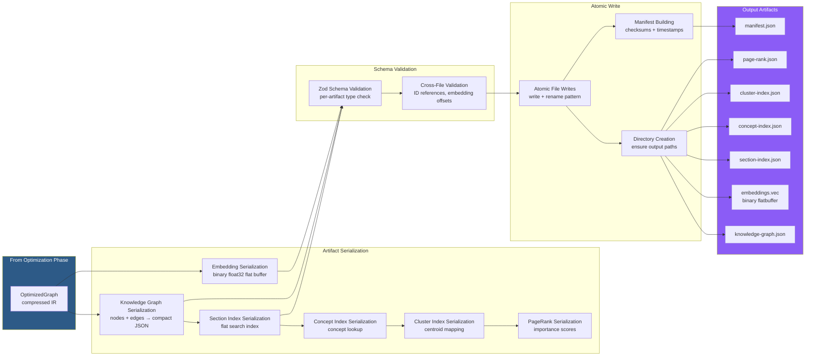
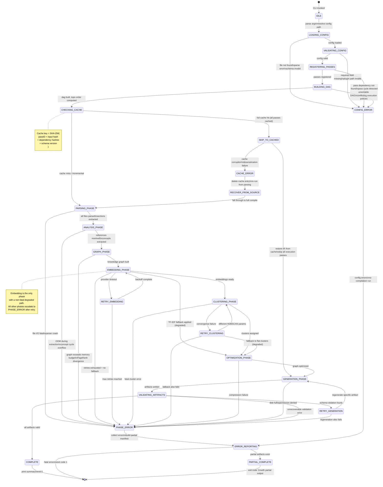
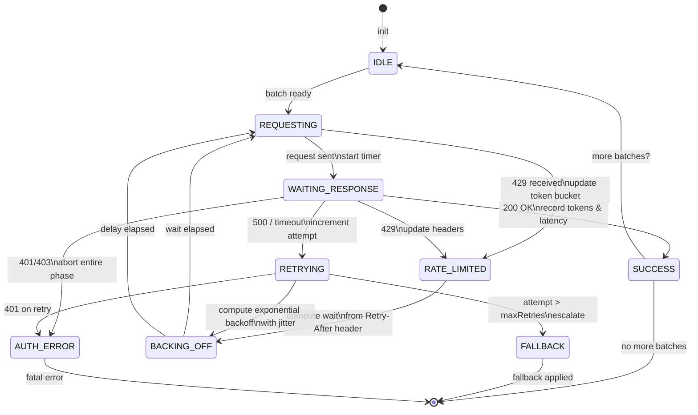
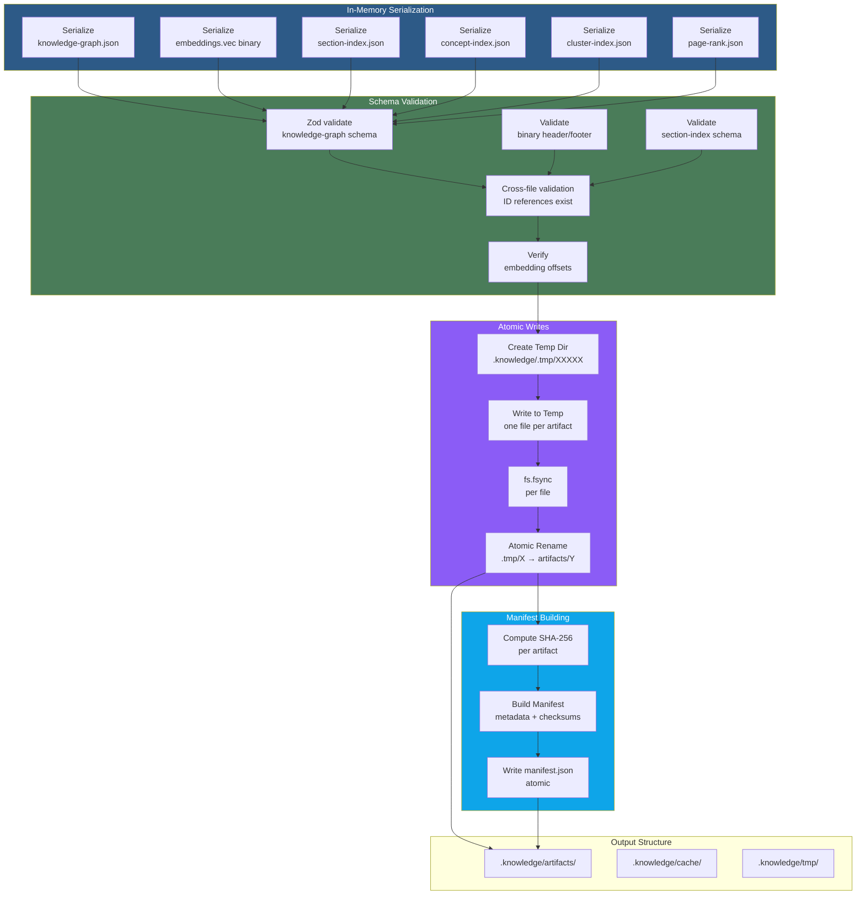

# Knowledge Compiler — Data Flow & Control Flow Architecture

**Document Version:** 1.0.0  
**Audience:** Senior Compiler Engineers, Distributed Systems Engineers  
**Last Updated:** 2026-07-10

---

## 1. Overall Data Flow

The following sequence diagram shows every message exchanged between components during a full compilation, from CLI invocation through artifact writing. Lifelines represent active participants; arrows represent data-bearing messages with their payload types annotated.

```mermaid
sequenceDiagram
    participant CLI as CLI
    participant Config as Config Loader
    participant Cache as Cache Layer
    participant Sched as Scheduler
    participant Glob as Glob Resolver
    participant Reader as File Reader
    participant Parser as MDAST Parser
    participant Front as Frontmatter Parser
    participant Link as Link Extractor
    participant Concept as Concept Extractor
    participant Graph as Graph Builder
    participant Chunker as Text Chunker
    participant Embed as Embedding Generator
    participant Sim as Similarity Matrix
    participant Cluster as Cluster Assigner
    participant Prune as Pruning Pass
    participant Dedup as Deduplication Pass
    participant Compress as Compression Pass
    participant Serial as Artifact Serializer
    participant Manifest as Manifest Builder
    participant IRStore as IR Store
    participant Err as Error Collector

    CLI->>Config: knowledge-compiler build --config knowledge.config.ts
    Config->>Config: loadConfig(), mergeDefaults(), validateSchema()
    Config-->>CLI: CompilerConfig { input, passes, cache, plugins }

    CLI->>Sched: schedule(config)
    Sched->>Sched: topoSort(passes), buildReadyQueue()

    Note over Sched,Glob: === PHASE: PARSING ===

    Sched->>Glob: execute(config.input)
    Glob->>Glob: fastGlob.sync(patterns, ignore)
    Glob-->>IRStore: FileRef[] { path, size, mtime }
    Glob-->>Sched: complete(status)

    Sched->>Reader: execute(FileRef[])
    Reader->>Cache: getBulk(FileRef[].checksum)
    Cache-->>Reader: CacheHit[] | null
    Reader->>Reader: fs.readFileSync(changed paths)
    Reader-->>IRStore: RawFile[] { path, content, checksum }
    Reader-->>Sched: complete(status, changedCount)

    Sched->>Front: execute(RawFile[])
    Front->>Front: yaml.parse(), schema.safeParse()
    Front-->>IRStore: DocumentMeta[] { frontmatter, bodyContent }
    Front-->>Sched: complete(status, degraded)

    Sched->>Parser: execute(DocumentMeta[])
    Parser->>Parser: unified().use(remarkParse).use(remarkGfm)
    Parser-->>IRStore: DocumentNode[] { ast, stats, sections }
    Parser-->>Sched: complete(status)

    Note over Sched,Link: === PHASE: ANALYSIS ===

    Sched->>Link: execute(DocumentNode[])
    Link->>Link: visit(ast), match wikiLinks/markdownLinks
    Link-->>IRStore: Edge[] { type: 'references' }
    Link-->>Sched: complete(status, brokenRefs)

    Sched->>Concept: execute(SectionNode[], Edge[])
    Concept->>Concept: pattern NER, compromise NLP, TF-IDF
    Concept-->>IRStore: ConceptNode[], KeywordNode[]
    Concept-->>Sched: complete(status)

    Note over Sched,Graph: === PHASE: GRAPH_CONSTRUCTION ===

    Sched->>Graph: execute(DocumentNode[], ConceptNode[], Edge[])
    Graph->>Graph: build adjacency, compute PageRank
    Graph-->>IRStore: KnowledgeGraph { nodes, edges, stats }
    Graph-->>Sched: complete(status, density)

    Note over Sched,Chunker: === PHASE: EMBEDDING ===

    Sched->>Chunker: execute(SectionNode[])
    Chunker->>Chunker: split sections, overlap 10%, heading context
    Chunker-->>IRStore: TextChunk[] { sectionId, content, offset }
    Chunker-->>Sched: complete(status, chunkCount)

    Sched->>Embed: execute(TextChunk[])
    Embed->>Embed: batch chunks (2048), call provider
    alt Provider OK
        Embed-->>IRStore: EmbeddingVector[] { sectionId, values, model }
    else Provider Timeout
        Embed->>Embed: retry(backoff=1.6s)
        alt Retry OK
            Embed-->>IRStore: EmbeddingVector[]
        else Retries Exhausted
            Embed->>Embed: TF-IDF fallback
            Embed-->>IRStore: SparseVector[] (TF-IDF)
            Embed->>Err: DEGRADED: embedding fallback
        end
    else Provider Unavailable
        Embed->>Embed: TF-IDF fallback immediately
        Embed-->>IRStore: SparseVector[] (TF-IDF)
    end
    Embed-->>Sched: complete(status, degraded)

    Note over Sched,Sim: === PHASE: CLUSTERING ===

    Sched->>Sim: execute(EmbeddingVector[])
    Sim->>Sim: cosine similarity, CSR sparse matrix, threshold 0.7
    Sim-->>IRStore: SimilarityEdge[] { sectionId_A, sectionId_B, weight }
    Sim-->>Sched: complete(status, edgeCount)

    Sched->>Cluster: execute(SimilarityEdge[])
    Cluster->>Cluster: HDBSCAN(minClusterSize=3)
    Cluster-->>IRStore: Cluster[] { id, centroid, memberIds, topTerms }
    Cluster-->>Sched: complete(status, clusterCount)

    Note over Sched,Prune: === PHASE: OPTIMIZATION ===

    Sched->>Prune: execute(KnowledgeGraph, Cluster[])
    Prune->>Prune: remove edges < 0.3, remove isolated nodes
    Prune-->>IRStore: PrunedGraph
    Prune-->>Sched: complete(status, edgeRemoved)

    Sched->>Dedup: execute(PrunedGraph)
    Dedup->>Dedup: simhash near-duplicate detection, threshold 0.95
    Dedup-->>IRStore: DeduplicatedGraph { redirects[], merges[] }
    Dedup-->>Sched: complete(status, mergedSections)

    Sched->>Compress: execute(DeduplicatedGraph)
    Compress->>Compress: quantize embeddings Float32->int8, delta-encode, minify
    Compress-->>IRStore: OptimizedGraph
    Compress-->>Sched: complete(status, compressionRatio)

    Note over Sched,Serial: === PHASE: GENERATION ===

    Sched->>Serial: execute(OptimizedGraph)
    Serial->>Serial: serialize knowledge-graph.json, embeddings.vec
    Serial->>Serial: serialize section-index.json, concept-index.json
    Serial->>Serial: serialize cluster-index.json, page-rank.json
    Serial-->>IRStore: ArtifactBuffer[] { name, format, checksum }
    Serial-->>Sched: complete(status, artifactCount)

    Sched->>Manifest: execute(ArtifactBuffer[])
    Manifest->>Manifest: build manifest, validate cross-refs
    Manifest->>Manifest: atomicWriteAll(artifacts)
    Manifest-->>CLI: CompilerResult { manifest, stats, errors, warnings }
    Manifest-->>Sched: complete(status)

    Sched-->>CLI: PipelineResult { duration, totalPasses, errors, artifacts }
    CLI->>CLI: printSummary(result)
    CLI-->>CLI: exit(code)
```

---

## 2. Detailed Data Flow Per Phase

### 2.1 Source Acquisition Phase

```
glob patterns: string[]   ──►   file paths: FilePath[]   ──►   buffers: Buffer[]   ──►   normalized strings: string[]
      │                              │                              │                              │
      │ fast-glob                    │ fs.readFileSync              │ encoding detect               │ unicode NFC
      │ .sync(patterns, ignore)      │ parallel I/O pool            │ UTF-8 / UTF-16 BOM            │ .normalize('NFC')
      │ deduplicate                  │ SHA-256 checksum             │ fallback to latin1             │
      │ sort by path                 │ stat for mtime               │                                │
      ▼                              ▼                              ▼                                ▼
  FileRef[] { path,             RawFile[] { path,             ValidatedFile[] { path,          NormalizedString[]
  size, mtime }                 content: Buffer,              encoding, content: string,        { path, content,
                                checksum, size }             checksum }                        checksum, charCount }
```

```mermaid
flowchart LR
    subgraph Input["Config Input"]
        GP[Glob Patterns: string[]]
        IP[Ignore Patterns: string[]]
    end

    subgraph Resolve["Glob Resolution"]
        FG[fastGlob.sync]
        DEDUP[Deduplicate]
        SORT[Sort by Path]
    end

    subgraph Read["File Reading"]
        POOL[I/O Worker Pool\n4 threads]
        SHA[SHA-256 Checksum]
        STAT[stat: mtime, size]
    end

    subgraph Validate["Encoding Validation"]
        DET[Encoding Detection\nUTF-8 / UTF-16 / Latin1]
        SKIP[Skip Binary Files]
    end

    subgraph Normalize["String Normalization"]
        NFC[Unicode NFC]
        TRIM[Whitespace Trim]
    end

    subgraph IR["IR Store"]
        DIR[Document IR\nDocumentNode[]]
    end

    GP --> FG --> DEDUP --> SORT
    SORT --> POOL
    POOL --> SHA
    SHA --> STAT
    STAT --> DET
    DET -->|Binary| SKIP
    DET -->|Valid| NFC
    NFC --> TRIM
    TRIM --> DIR

    SKIP --> ERR[Error Collector\nDEGRADED]
```

**Data transformations in detail:**

| Step | Input | Operation | Output | Cardinality |
|------|-------|-----------|--------|-------------|
| Glob resolution | `["content/**/*.md"]` | `fastGlob.sync` with ignore filter, dedup, sort | `FilePath[]` | 1× call → N paths |
| Cache lookup | `FilePath[]` (unchanged) | `cache.getBulk(checksum)` → skip read | `CacheHit[]` | N lookups, O(1) each |
| Parallel read | `FilePath[]` (changed) | 4-thread pool, `fs.readFileSync` per file | `Buffer[]` | N reads, 4 at a time |
| Checksum | `Buffer[]` | `crypto.createHash('sha256').update(buf).digest('hex')` | `string[]` | N × O(len) |
| Encoding detect | `Buffer[]` | BOM sniff, `utf-8` decode, fallback chain | `string[]` + encoding | N × O(1) |
| Normalize | `string[]` | `.normalize('NFC')`, trailing ws trim | `string[]` | N × O(len) |
| Store | `DocumentMeta[]` | Populate `IRStore.documents` | — | N writes |

### 2.2 Parsing Phase

```
raw strings: string[]   ──►   token stream: Token[]   ──►   AST: MDAST.Root   ──►   normalized documents: DocumentNode[]
      │                              │                              │                              │
      │ remark-parse                  │ remark tokenizer             │ unified AST                  │ section decomposition
      │ PEG parser                    │ inline span tokens           │ parent-child tree             │ heading stack
      │ O(N)                          │ text, code, link, image     │ position metadata             │ per-section nodes
      ▼                              ▼                              ▼                              ▼
  ParsingConfig                 TokenStream                    MDAST.Root[]                 SectionNode[]
  { remark, gfm,               { type, value,                { type: 'root',               { id, docId, path,
    math, directives }           position, children }           children[],                   content, depth,
                                                                 position }                   headingPath }
```

```mermaid
flowchart LR
    subgraph Raw["Raw Input"]
        S[string[]\nnormalized strings]
        FM[Frontmatter\nYAML Block]
    end

    subgraph FM_Parse["Frontmatter Parsing"]
        DET_DEL[Delimiter Detection\n--- or +++]
        YAML_P[yaml.parse\nJSON_SCHEMA]
        ZOD_V[zod.safeParse\nschema validation]
        INFER[Title Inference\nfrom first h1]
    end

    subgraph AST_Parse["AST Parsing"]
        REM[remark-parse\nPEG parser]
        GF[remark-gfm\ntables, strikethrough]
        MATH[remark-math\nLaTeX blocks]
        DIR[remark-directive\ncustom containers]
    end

    subgraph Section_Extract["Section Extraction"]
        VISIT[AST Visitor\nheading stack]
        SPLIT[Section Splitting\nheading boundaries]
        BUILD[Section Builder\npath, content, depth]
    end

    subgraph IR_Store["IR Store"]
        DOC[DocumentNode\nast, stats, checksum]
        SEC[SectionNode[]\ncontent, headingPath]
    end

    S --> FM
    FM --> DET_DEL
    DET_DEL -->|Found| YAML_P
    DET_DEL -->|Not Found| INFER
    YAML_P --> ZOD_V
    ZOD_V --> DOC
    INFER --> DOC

    S --> REM
    REM --> GF --> MATH --> DIR
    DIR --> VISIT
    VISIT --> SPLIT
    SPLIT --> BUILD
    BUILD --> SEC

    style S fill:#2d5a87,color:#fff
    style IR_Store fill:#4a7c59,color:#fff
```

**Key data contracts:**

```typescript
// Raw string to DocumentNode transformation
interface ParsingTransform {
  input:  { path: string; content: string; checksum: string }
  output: { 
    document: DocumentNode      // Full AST, frontmatter, stats
    sections: SectionNode[]     // Decomposed section hierarchy
    errors:   ParseError[]      // Per-document parse errors
  }
}

// DocumentNode shape after parsing
interface DocumentNode {
  id: DocumentID                // SHA-256(normalized path)
  filePath: string
  frontmatter: Frontmatter     // Parsed YAML with defaults
  ast: MDAST.Root              // Full remark AST
  checksum: string             // SHA-256(raw content)
  stats: {
    wordCount: number
    headingCount: number
    codeBlockCount: number
    linkCount: number
    imageCount: number
  }
  sections: SectionID[]        // References into IRStore.sections
  createdAt: UnixMs
  version: number
}
```

### 2.3 Analysis Phase

```
documents: DocumentNode[]   ──►   sections: SectionNode[]   ──►   entities: EntityNode[]   ──►   references: Edge[]   ──►   keywords: KeywordNode[]
      │                              │                              │                              │                              │
      │ heading traversal             │ pattern NER                  │ wiki-link [[ ]]              │ TF-IDF scoring
      │ section decomposition         │ compromise NLP              │ markdown links               │ positional boosting
      │ preamble handling             │ entity resolution            │ footnote refs                │ TextRank phrases
      ▼                              ▼                              ▼                              ▼                              ▼
  SectionNode[]                 EntityNode[]                  Edge[] (references)           BrokenRef[]               KeywordNode[]
  { id, docId, path,            { id, name, type,             { sourceId, targetId,         { sourceDoc,              { id, name,
    depth, content,               frequency, aliases,           weight, type,                 target,                    score, frequency,
    headingPath }                 confidence }                  metadata }                    linkType }                 isMultiWord }
```

```mermaid
flowchart LR
    subgraph Input["From Parsing"]
        DOC[DocumentNode[]\nwith AST]
    end

    subgraph SectionEx["Section Extraction"]
        TRAV[AST Traversal\nheading-stack]
        BOUND[Boundary Detection\nheading / thematic break]
        ACCUM[Content Accumulation\nper-section text]
    end

    subgraph EntityEx["Entity Extraction"]
        PAT[Regex Patterns\nhashtags, handles, orgs]
        NER[NER Pipeline\ncompromise / spacy-rs]
        RESOLVE[Entity Resolution\nthreshold 0.85]
    end

    subgraph RefEx["Reference Extraction"]
        WL[Wiki-Link Parser\n[[target]]
        ML[Markdown Link Parser\n[text](url)]
        FN[Footnote Parser\n[^id]]
        TARGET[Target Index\npath / heading / anchor]
    end

    subgraph KeywordEx["Keyword Extraction"]
        TFIDF[TF-IDF Scoring\ncorpus IDF]
        POS[Positional Boosting\nheading terms ×2]
        PHRASE[TextRank Phrases\n2-4 gram keyphrases]
    end

    subgraph IR_Store["IR Store"]
        S[SectionNode[]]
        E[EntityNode[]]
        R[Edge[]\ntype: references]
        K[KeywordNode[]]
    end

    DOC --> TRAV --> BOUND --> ACCUM --> S

    S --> PAT --> NER --> RESOLVE --> E

    DOC --> WL --> TARGET --> R
    DOC --> ML --> TARGET --> R
    DOC --> FN --> TARGET --> R

    S --> TFIDF --> POS --> K
    S --> PHRASE --> K

    style Input fill:#2d5a87,color:#fff
    style IR_Store fill:#4a7c59,color:#fff
```

### 2.4 Graph Phase

```
SectionNode[] + EntityNode[] + Edge[]   ──►   EntityGraph   ──►   ReferenceGraph   ──►   Unified KnowledgeGraph
         │                                      │                      │                       │
         │ section→document hierarchy            │ entity→section      │ doc→doc links          │ merged node pool
         │ heading→section                       │ entity→entity        │ section→section        │ typed edges
         │ co-occurrence edges                   │ co-occurrence        │ link classification    │ PageRank scores
         ▼                                      ▼                      ▼                       ▼
     DependencyGraph                        EntityGraph            ReferenceGraph          KnowledgeGraph
     { parentSection,                      { nodes: Entity,       { nodes: RefDoc,         { nodes: Document |
       childSection,                         edges: co-occurs,      RefSec, RefURL,           Section, Entity,
       document→section }                     related-to,            edges: links-to,          Concept, Topic,
                                              defined-in }           heading-link }            edges: all types }
```

```mermaid
flowchart LR
    subgraph Input["From Analysis"]
        S[SectionNode[]]
        E[EntityNode[]]
        K[KeywordNode[]]
        R[Edge[] references]
    end

    subgraph DepGraph["Dependency Graph"]
        D_PARENT[Parent-Child Edges\nsection contains section]
        D_DOC[Document-Section Edges\ndocument contains section]
        D_ORDER[Sibling Order Edges\ntopological sequence]
    end

    subgraph RefGraph["Reference Graph"]
        REF_CLASS[Link Classification\nnavigational / structural / definitional]
        REF_RESOLVE[Target Resolution\nanchor → section mapping]
        REF_METRIC[Link Metrics\nin/out degree, density]
    end

    subgraph Unified["Unified Knowledge Graph"]
        MERGE[Node Merge\ndeduplicate by ID]
        EDGE_TYPES[Edge Typing\npreserve source type]
        PAGERANK[PageRank Computation\nimportance scoring]
        STATS[Graph Statistics\ndensity, diameter, components]
    end

    subgraph IR_Store["IR Store"]
        KG[KnowledgeGraph\nnodes + edges + stats]
    end

    S --> D_PARENT --> D_DOC --> D_ORDER
    R --> REF_CLASS --> REF_RESOLVE --> REF_METRIC

    D_ORDER --> MERGE
    REF_METRIC --> MERGE
    E --> MERGE
    K --> MERGE

    MERGE --> EDGE_TYPES --> PAGERANK --> STATS
    STATS --> KG

    style Input fill:#2d5a87,color:#fff
    style IR_Store fill:#4a7c59,color:#fff
```

**Data transformation pipeline (graph phase):**

| Step | Cardinality | Algorithm | Output Size |
|------|-------------|-----------|-------------|
| Section→Document edges | D × avg(S/D) | Direct mapping | ~50K edges for 10K docs |
| Section→Section refs | R (raw refs) | Target index lookup O(R×log(T)) | ~200K edges |
| Entity→Section edges | E × avg(S/E) | Co-occurrence counting | ~500K edges |
| Entity→Entity edges | E² (capped) | Mutual information threshold | ~1M edges (sparse) |
| Link classification | R edges | Pattern + position heuristics | Same as R |
| Node deduplication | N (all nodes) | SHA-256 ID comparison | Deduplicated set |
| PageRank | N nodes, E edges | Power iteration, 50 iters | Score per node |

### 2.5 Embedding Phase

```
text chunks: TextChunk[]   ──►   embed requests: EmbedRequest[]   ──►   API responses: EmbedResponse[]   ──►   similarity matrix: SimilarityEdge[]
      │                              │                                    │                                    │
      │ section→chunk splitting      │ batch (max 2048)                   │ Float32Array[1536]                │ cosine similarity
      │ 512-1024 tokens              │ HTTP POST /v1/embeddings           │ model: text-embedding-3-small     │ CSR sparse matrix
      │ 10% overlapping windows      │ retry with backoff                 │ dimensionality reduction (PCA→256)│ threshold > 0.7
      ▼                              ▼                                    ▼                                    ▼
  TextChunk[]                   EmbedRequest[]                       EmbeddingVector[]                 SimilarityEdge[]
  { sectionId,                  { model, input:                     { sectionId,                       { sourceId,
    content,                      string[],                           values: Float32Array,              targetId,
    tokenCount,                   dimensions,                         model,                             weight,
    offset }                      user? }                             dimensions }                       method }
```

```mermaid
flowchart LR
    subgraph Input["From Graph Phase"]
        S[SectionNode[]\nwith content]
    end

    subgraph Chunk["Text Chunking"]
        TOK[Tokenization\ncl100k_base]
        SPLIT[Chunk Splitting\n512-1024 tokens]
        OVERLAP[Overlap Windows\n10% context]
        HEADER[Heading Prefix\ntrack headingPath]
    end

    subgraph Batch["Batch Assembly"]
        BATCH[Batch Formation\nmax 2048 chunks]
        QUEUE[Request Queue\nwith priority]
        RATE[Rate Limiter\nRPM tracking]
    end

    subgraph API["Embedding API"]
        POST[HTTP POST\nembeddings endpoint]
        RETRY[Retry Logic\nexponential backoff]
        FALLBACK[TF-IDF Fallback\nif provider down]
    end

    subgraph Reduction["Post-Processing"]
        PCA[Dimension Reduction\n1536 → 256 PCA]
        QUANT[Quantization\nFloat32 → int8]
        STORE[Embedding Store\nmemory-mapped file]
    end

    subgraph Similarity["Similarity Matrix"]
        COSINE[Cosine Similarity\npairwise]
        CSR[CSR Sparse Format\nthreshold 0.7]
        TOPK[Top-K Filter\nk=50 per section]
    end

    S --> TOK --> SPLIT --> OVERLAP --> HEADER
    HEADER --> BATCH --> QUEUE --> RATE

    RATE --> POST
    POST -->|Success| PCA
    POST -->|Timeout| RETRY
    RETRY -->|Exhausted| FALLBACK
    RETRY -->|Retry OK| PCA
    POST -->|Unavailable| FALLBACK

    PCA --> QUANT --> STORE
    FALLBACK --> STORE

    STORE --> COSINE --> CSR --> TOPK

    subgraph IR_Store["IR Store"]
        VEC[EmbeddingVector[]]
        SIM[SimilarityEdge[]]
    end

    TOPK --> SIM
    QUANT --> VEC

    style Input fill:#2d5a87,color:#fff
    style IR_Store fill:#4a7c59,color:#fff
    style API fill:#e8792e,color:#fff
```

**Embedding batch processing flow:**

```typescript
interface EmbeddingBatchFlow {
  // Input: all text chunks from corpus
  chunks: TextChunk[]  // ~500K for 10K docs × 50 chunks/doc
  
  // Batch assembly
  batches: TextChunk[][]  // ~244 batches of 2048 chunks
  
  // Per-batch processing
  for (batch of batches) {
    // Rate limit check
    await rateLimiter.acquire()
    
    // Request
    response = await embeddingProvider.create({
      model: 'text-embedding-3-small',
      input: batch.map(c => c.content),
      dimensions: 1536,
      encoding_format: 'float'
    })
    
    // Response processing
    for (i, embedding of response.data) {
      vectors.push({
        sectionId: batch[i].sectionId,
        values: new Float32Array(embedding),
        model: 'text-embedding-3-small',
        dimensions: 1536
      })
    }
    
    // After every 10 batches, run dimensionality reduction
    if (vectors.length % (10 * 2048) === 0) {
      pca.partialFit(vectors)
    }
  }
  
  // Final PCA transform
  reduced = pca.transform(vectors, dimensions: 256)
  
  // Quantize and store
  for (vec of reduced) {
    store.add({
      ...vec,
      values: quantizeInt8(vec.values)  // Float32 → Int8
    })
  }
}
```

### 2.6 Clustering Phase

```
similarity matrix: SimilarityEdge[]   ──►   community detection   ──►   topic modeling   ──►   hierarchy
      │                                       │                       │                       │
      │ CSR sparse adjacency                   │ HDBSCAN clustering     │ LDA topic model       │ cluster→subcluster
      │ cosine distances                       │ min cluster size: 3    │ top terms per topic   │ tree structure
      │ thresholded at 0.7                     │ outlier labeling       │ topic→section mapping │ depth calculation
      ▼                                       ▼                       ▼                       ▼
  SparseSimilarityMatrix                 ClusterAssignment[]          Topic[]               ClusterHierarchy
  { rowPtr: uint32[],                   { sectionId,                { id,                   { parentCluster,
    colInd: uint32[],                     clusterId,                  terms: ScoredTerm[],     childClusters,
    values: float32[] }                   probability,                topSection,               depth } 
                                          isOutlier }                 memberCount }
```

```mermaid
flowchart LR
    subgraph Input["From Embedding Phase"]
        VEC[EmbeddingVector[]\n256-dim int8]
        SIM[SimilarityEdge[]\ncosine top-K]
    end

    subgraph Similarity_Matrix["Similarity Matrix Construction"]
        CSR_BUILD[CSR Sparse Build\nrow pointer + column index]
        DIST[Distance Computation\n1 - cosine]
        THRESH[Threshold Application\nkeep edges > 0.7]
    end

    subgraph Community["Community Detection"]
        HDBSCAN[HDBSCAN Algorithm\nmin cluster size: 3]
        OUTLIER[Outlier Labeling\nnoise points]
        PROB[Probability Assignment\ncluster membership prob]
    end

    subgraph Topic["Topic Modeling"]
        LDA[LDA Topic Model\nper-cluster TF-IDF]
        TERMS[Top Terms Extraction\nN highest TF-IDF]
        REP[Representative Selection\nclosest-to-centroid section]
    end

    subgraph Hierarchy["Cluster Hierarchy"]
        MERGE[Merge Similar Clusters\ninter-cluster similarity]
        TREE[Build Cluster Tree\nhierarchical structure]
        DEPTH[Depth Assignment\nlevel in hierarchy]
    end

    subgraph IR_Store["IR Store"]
        CL[Cluster[]\nid, centroid, members]
        TOP[Topic[]\nterms, representative]
        HIER[ClusterHierarchy\ntree structure]
    end

    SIM --> CSR_BUILD --> DIST --> THRESH
    THRESH --> HDBSCAN
    VEC --> HDBSCAN
    HDBSCAN --> OUTLIER --> PROB

    PROB --> CL
    PROB --> LDA --> TERMS --> REP
    REP --> TOP

    CL --> MERGE --> TREE --> DEPTH
    DEPTH --> HIER

    style Input fill:#2d5a87,color:#fff
    style IR_Store fill:#4a7c59,color:#fff
```

### 2.7 Optimization Phase

```
full graph: KnowledgeGraph   ──►   pruning   ──►   deduplication   ──►   folding   ──►   compression
      │                              │                │                │               │
      │ nodes + edges                 │ remove weak     │ near-duplicate  │ merge          │ int8 quantization
      │ embeddings + stats            │ edges < 0.3     │ sections        │ sibling        │ delta timestamps
      │ PageRank scores               │ isolated nodes  │ simhash 0.95    │ nodes          │ minify metadata
      ▼                              ▼                ▼                ▼               ▼
  KnowledgeGraph                 PrunedGraph        DedupGraph        FoldedGraph      CompressedGraph
  (pre-optimization)             { edges: -40%      { redirects[],     { merged:         { embeddings: -75%
                                  nodes: -10% }       merges[],          -15% nodes }     metadata: -60%
                                                      edgeUpdates }                       byteSize: -70% }
```

```mermaid
flowchart LR
    subgraph Input["From Clustering Phase"]
        KG[KnowledgeGraph\nnodes + edges + embeddings]
        CL[Cluster[]\nwith centroids]
    end

    subgraph Prune["Pruning Pass"]
        EDGE_PRUNE[Edge Weight Pruning\nremove < 0.3]
        NODE_PRUNE[Isolated Node Removal\ndegree = 0]
        CONCEPT_MERGE[Concept Merging\nsame name, different contexts]
    end

    subgraph Dedup["Deduplication Pass"]
        SIMHASH[Simhash Computation\nper-section fingerprint]
        COMPARE[Near-Duplicate Comparison\nthreshold 0.95]
        MERGE[Section Merging\nprimary + redirect]
        EDGE_UPD[Edge Rewiring\nredirect targets]
    end

    subgraph Fold["Folding Pass"]
        SIBLING_MERGE[Sibling Node Folding\nsimilar siblings]
        PARENT_PROMOTE[Single-Child Promotion\nstraight-line hierarchy]
        ROOT_CONSOL[Root Consolidation\nflat structure]
    end

    subgraph Compress["Compression Pass"]
        EMBED_QUANT[Embedding Quantization\nFloat32 → int8]
        TIME_DELTA[Timestamp Delta Encoding\nrelative to epoch]
        KEY_MINIFY[Metadata Key Minification\n'headingPath' → 'hp']
        STRUCT_COMPACT[Structural Compaction\nunion types → enums]
    end

    subgraph IR_Store["IR Store"]
        OPT[OptimizedGraph\nready for generation]
    end

    KG --> EDGE_PRUNE --> NODE_PRUNE --> CONCEPT_MERGE
    CL --> EDGE_PRUNE
    CONCEPT_MERGE --> SIMHASH

    SIMHASH --> COMPARE --> MERGE --> EDGE_UPD
    EDGE_UPD --> SIBLING_MERGE --> PARENT_PROMOTE --> ROOT_CONSOL

    ROOT_CONSOL --> EMBED_QUANT --> TIME_DELTA --> KEY_MINIFY --> STRUCT_COMPACT

    STRUCT_COMPACT --> OPT

    style Input fill:#2d5a87,color:#fff
    style IR_Store fill:#4a7c59,color:#fff
```

**Compression ratios by technique:**

| Technique | Before | After | Ratio | Trade-off |
|-----------|--------|-------|-------|-----------|
| Edge pruning | 2M edges | 1.2M edges | 40% fewer | Weak signals lost |
| Node pruning | 50K nodes | 45K nodes | 10% fewer | Orphan concepts removed |
| Simhash dedup | 200K sections | 190K sections | 5% merged | Near-duplicates collapsed |
| Sibling folding | 190K sections | 162K sections | 15% merged | Hierarchy flattened |
| Embedding quant | 30 GB | 6.25 GB | 79% smaller | Slight accuracy loss |
| Delta timestamps | 8 bytes × N | ~2 bytes × N | 75% smaller | Requires epoch base |
| Key minification | ~50 bytes/node | ~20 bytes/node | 60% smaller | Less readable debug |

### 2.8 Generation Phase

```
optimized IRs   ──►   serialization   ──►   JSON artifacts   ──►   search index   ──►   app bundle
      │                     │                     │                    │                    │
      │ optimized graph     │ schema validation    │ knowledge-graph    │ inverted index     │ manifest
      │ compressed          │ format selection     │ .json              │ section-index      │ .next/
      │ embeddings          │ binary vs JSON       │ embeddings         │ .json              │ artifact
      │ clusters            │                      │ .vec               │ concept-index      │ directory
      ▼                     ▼                     ▼                    ▼                    ▼
  OptimizedGraph       ArtifactBuffer[]       ArtifactFile[]        SearchIndex         DeploymentBundle
  { nodes, edges,      { name, format,        { path, content,      { term→section[],    { artifacts,
    embeddings,           buffer, checksum }     format,              section→term[],      manifest,
    clusters }                                    checksum,            embedding offset }    checksums }
                                                  byteLength }
```



**Artifact file layout:**

```
.knowledge/artifacts/
  manifest.json                    # { version, schema, metadata, files: { name, checksum, size }[] }
  knowledge-graph.json             # { version, metadata, documents: compact[], sections: compact[], concepts: compact[], edges: compact[], graphStats }
  embeddings.vec                   # binary: header(uint32[4]) + vectors(float32[N×D]) + index(uint64[N])
  section-index.json               # { version, sections: { id, title, headingPath, docId, summary, embeddingOffset, clusterId, conceptIds }[] }
  concept-index.json               # { version, concepts: { id, name, type, frequency, relatedConcepts }[] }
  cluster-index.json               # { version, clusters: { id, centroidOffset, memberCount, topTerms, representativeSection }[] }
  page-rank.json                   # { version, scores: { nodeId, score }[] }
```

---

## 3. Control Flow

### 3.1 Compiler State Machine



### 3.2 Decision Points Detail

```mermaid
flowchart TB
    subgraph CacheCheck["Cache Check Decision"]
        CACHE_REQ[Pass requests cache] --> KEY_COMPUTE[SHA-256 key computation]
        KEY_COMPUTE --> L1_CHECK[L1: In-Memory LRU]
        L1_CHECK -->|Hit| DESERIALIZE[Deserialize from L1]
        L1_CHECK -->|Miss| L2_CHECK[L2: Filesystem Cache]
        L2_CHECK -->|Hit| PROMOTE[Promote to L1]
        PROMOTE --> DESERIALIZE
        L2_CHECK -->|Miss| FULL_EXEC[Execute Pass]
        FULL_EXEC --> VALIDATE_OUTPUT[Validate Output]
        VALIDATE_OUTPUT -->|Valid| WRITE_CACHE[Write L1 + L2]
        VALIDATE_OUTPUT -->|Invalid| RETRY_EXEC[Re-execute Pass]
        DESERIALIZE --> VALIDATE_CHECKSUM[Verify Checksum]
        VALIDATE_CHECKSUM -->|Mismatch| L2_CHECK
        VALIDATE_CHECKSUM -->|Match| SKIP_RETURN[Return Cached Result]
    end

    subgraph ParallelDispatch["Parallel Execution Decision"]
        READY_PASSES{Ready passes\nin queue?}
        READY_PASSES -->|No| WAIT[Wait for dependency\ncompletion]
        READY_PASSES -->|Yes| CHECK_CONCURRENCY{Concurrency\nslot available?}
        CHECK_CONCURRENCY -->|No| QUEUE[Queue for next slot]
        CHECK_CONCURRENCY -->|Yes| CHECK_RESOURCE{Resource\nconflict?}
        CHECK_RESOURCE -->|Write conflict| SERIALIZE[Serialize → same resource]
        CHECK_RESOURCE -->|Read-only disjoint| DISPATCH[Parallel dispatch]
        CHECK_RESOURCE -->|IO pool| IO_DISPATCH[Dispatch to IO pool]
    end

    subgraph ErrorHandling["Error Handling Decision"]
        ERROR[Error Raised by Pass] --> DETERMINE_SEVERITY{Determine\nSeverity}
        DETERMINE_SEVERITY -->|FATAL| ABORT[Abort Pipeline]
        DETERMINE_SEVERITY -->|TRANSIENT| RETRY_CHECK{Retry\nremaining?}
        RETRY_CHECK -->|Yes| COMPUTE_BACKOFF[Compute Exponential Backoff]
        COMPUTE_BACKOFF --> SCHEDULE_RETRY[Schedule Retry]
        RETRY_CHECK -->|No| ESCALATE[Escalate to DEGRADED]
        DETERMINE_SEVERITY -->|DEGRADED| MARK_PARTIAL[Mark Pass as Partial]
        MARK_PARTIAL --> CONTINUE[Continue Pipeline\nwith degraded flag]
        DETERMINE_SEVERITY -->|WARNING| LOG[Log Warning]
        LOG --> CONTINUE
    end

    style CacheCheck fill:#2d5a87,color:#fff
    style ParallelDispatch fill:#4a7c59,color:#fff
    style ErrorHandling fill:#8b5cf6,color:#fff
```



### 3.3 Parallel Execution Forks & Joins

```mermaid
flowchart TB
    subgraph Parallel["Parallel Execution Regions"]
        direction TB
        
        INIT[Init Phase\nserial]
        INIT --> PARSE_FORK
        
        subgraph PARSE_FORK["Parsing Phase"]
            direction LR
            GLOB[Glob Resolver]
            READ[File Reader\n4-thread pool]
            FRONT[Frontmatter Parser\nper-file parallel]
            AST[MDAST Parser\nper-file parallel]
            
            GLOB --> READ
            READ --> FRONT --> AST
        end
        
        PARSE_FORK --> ANALYSIS_FORK
        
        subgraph ANALYSIS_FORK["Analysis Phase"]
            direction LR
            LINK[Link Extractor]
            ENTITY[Entity Extractor]
            KW[Keyword Extractor]
            
            LINK & ENTITY --> KW
        end
        
        ANALYSIS_FORK --> GRAPH[Graph Builder\nserial - write to IR]
        GRAPH --> EMBED_FORK
        
        subgraph EMBED_FORK["Embedding Phase"]
            direction LR
            CHUNK[Text Chunker]
            BATCH1[Batch 1\nembed API]
            BATCH2[Batch 2\nembed API]
            BATCHN[Batch N\nembed API]
            
            CHUNK --> BATCH1 & BATCH2 & BATCHN
        end
        
        EMBED_FORK --> SIM_MERGE[Similarity Matrix\nmerge join]
        
        SIM_MERGE --> CLUSTER_FORK
        
        subgraph CLUSTER_FORK["Clustering Phase"]
            direction LR
            HDBSCAN1[HDBSCAN\nsubset A]
            HDBSCAN2[HDBSCAN\nsubset B]
            
            HDBSCAN1 & HDBSCAN2 --> MERGE_CLUST[Cluster Merge]
        end
        
        CLUSTER_FORK --> OPT[Optimization Pass\nserial]
        OPT --> GEN[Generation Pass\nserial]
        GEN --> VALIDATE[Validation Pass\nserial]
    end

    note left of PARSE_FORK
        File Reader + Frontmatter +
        AST Parser run as a
        pipeline with 4-way
        parallelism per file.
        Each file independent.
    end

    note left of EMBED_FORK
        Text Chunker produces
        batches fed to parallel
        embed requests.
        Rate limited to
        500 RPM per API key.
    end

    note left of CLUSTER_FORK
        HDBSCAN on subsets
        uses random projection
        trees for approximate
        clustering, merged
        with cluster adjacency.
    end
```

### 3.4 Phase Transition Conditions

| Transition | Condition | Precondition | Postcondition |
|-----------|-----------|-------------|---------------|
| PARSING → ANALYSIS | All files parsed | IRStore.documents populated, all status != 'unparsed' | IRStore.sections populated |
| ANALYSIS → GRAPH | All references resolved, all entities extracted | IRStore.edges (references) populated, IRStore.concepts populated | IRStore.knowledgeGraph built |
| GRAPH → EMBEDDING | Knowledge graph complete | IRStore.knowledgeGraph fully built, PageRank computed | Graph frozen, embeddings slot ready |
| EMBEDDING → CLUSTERING | All embeddings computed or fallback applied | IRStore.embeddings populated | IRStore.similarityEdges populated |
| CLUSTERING → OPTIMIZATION | All clusters assigned | IRStore.clusters populated | Optimized graph ready |
| OPTIMIZATION → GENERATION | Graph optimization complete | OptimizedGraph in IRStore | All artifacts written |
| GENERATION → COMPLETE | Schema validation passes | All artifact files on disk, manifest built | Exit code 0 |

---

## 4. Memory Flow

### 4.1 Memory Architecture

```mermaid
flowchart TB
    subgraph Heap["Node.js Heap (V8)"]
        CTX[Compiler Context\n~500 KB]
        CONFIG[Compiler Config\n~50 KB]
        IR_HOT[IR Store Hot Nodes\nfrequently accessed sections]
        CACHE_L1[Cache L1\nLRU, 500MB max]
        SCHED[Schedule State\n~100 KB]
        BATCH_BUF[Batch Buffers\ntransient pass data]
    end

    subgraph MMap["Memory-Mapped Files"]
        EMBED_STORE[Embedding Store\n.embed.vec mapped file]
        AST_CACHE[AST Cache\nmemory-mapped ASTs]
        LARGE_FILE[Large File Buffers\n>100MB docs]
    end

    subgraph SharedMem["Shared Memory (Worker Threads)"]
        SHM_QUEUE[Shared Work Queue\nAtomic circular buffer]
        SHM_RESULT[Shared Result Channel\nTransferrable ArrayBuffers]
        SHM_STATS[Shared Counters\ndocs processed, errors]
    end

    subgraph Disk["Disk (Cache + Swap)"]
        CACHE_L2[Cache L2\n.knowledge/cache/]
        SWAP[Swap File\n.knowledge/swap/]
        TEMP[Temp Files\n.knowledge/tmp/]
    end

    Heap -->|Eviction| MMap
    Heap -->|GC pressure| SWAP
    MMap -->|Page fault| Disk
    CACHE_L1 -->|Eviction| CACHE_L2
    BATCH_BUF -->|Processed| IR_HOT

    note right of Embed_Store
        Embeddings are the largest
        memory consumer (~30GB for
        10K docs). Memory-mapped
        to avoid V8 heap pressure.
        Only hot sections' embeddings
        are paged into RAM.
    end

    note right of SHM_QUEUE
        Worker threads communicate
        via shared ArrayBuffer with
        Atomic operations. No JSON
        serialization overhead.
    end
```

### 4.2 Data Lifetime by Compiler Phase

| Data | Lifetime | Allocation Strategy | Release Strategy |
|------|----------|-------------------|------------------|
| Raw file buffers | Parsing phase only | 4MB chunks, pooled allocator | Released after AST built |
| Document AST | Parsing → Graph phase | Per-document arena allocator | Released after sections extracted |
| Section content | Parsing → Generation | String pool with dedup | Released after embedding chunks built |
| Entity nodes | Analysis → Generation | Node pool, O(1) alloc | Released with IR store (end) |
| Edge sets | Analysis → Generation | CSR sparse format | Released with IR store |
| Embedding vectors | Embedding → Generation | Memory-mapped file | Released on process exit |
| Similarity matrix | Clustering phase only | CSR sparse, on-heap | Released after clustering |
| Cluster assignments | Clustering → Generation | Per-section metadata | Released with IR store |
| Optimized graph | Optimization → Generation | Compact serial form | Serialized to artifact buffer |
| Artifact buffers | Generation phase only | Stream to disk | Released after write |

### 4.3 Streaming for Large Documents

Documents exceeding 100 MB trigger streaming mode:

```
Normal Mode:                    Streaming Mode:
┌─────────────────────┐         ┌─────────────────────────────┐
│ readFileSync → full  │         │ createReadStream → 4MB chunks │
│ buffer in heap      │         │                             │
│ parse entire AST    │         │ parse per-chunk subtrees    │
│ extract all sections│         │ yield sections incrementally│
│ store in IR         │         │ flush to temp IR            │
└─────────────────────┘         │ merge on completion         │
                                └─────────────────────────────┘
```

**Streaming protocol:**

```typescript
interface StreamProtocol {
  // Producer (File Reader) → Consumer (Parser)
  onChunk: (chunk: { bytes: Buffer, offset: number, totalSize: number }) => void
  onComplete: () => void
  onError: (err: Error) => void
  
  // Backpressure
  highWaterMark: 4 * 1024 * 1024  // 4MB
  pause(): void
  resume(): void
}
```

### 4.4 Batch Processing for Embeddings

```mermaid
flowchart LR
    subgraph Producer["Text Chunker (Producer)"]
        GEN[Generate Chunks\nfrom sections]
        BUF[Accumulate Buffer\n2048 chunks]
        SEND[Send Batch\nvia shared buffer]
    end

    subgraph Pipeline["Pipeline"]
        Q[Bounded Queue\ncapacity: 8 batches]
    end

    subgraph Consumer["Embedding Worker (Consumer)"]
        RECV[Receive Batch]
        API[Call Provider\nmax 2048 per req]
        STORE[Store Vectors\nin memory-mapped file]
    end

    Producer -->|push| Q
    Q -->|pop| Consumer

    note right of Q
        Queue depth of 8 provides
        16K chunks in flight.
        For 500K total chunks:
        ≈ 31 pipeline cycles.
        Overlap compute + I/O.
    end
```

### 4.5 Garbage Collection Strategies

| Strategy | Trigger | Behavior | Impact |
|----------|---------|----------|--------|
| Phase boundary GC | On phase transition | `global.gc()` if available, `--expose-gc` | ~100ms pause, reclaims 30-50% |
| Low-memory GC | Heap > 80% of `max-old-space-size` | Aggressive GC + evict L1 cache to L2 | ~500ms pause, prevents OOM |
| Idle-time GC | Worker thread idle (waiting for I/O) | Incremental GC mark-sweep | No visible pause |
| Large-object GC | After embedding batch (2048 vectors × 1536 floats) | Immediate collect batch buffers | Reclaims ~12MB per batch |
| Streaming GC | After each 4MB chunk parsed | Release chunk buffer, keep subtrees | ~5ms per chunk |

**Memory budget (10K documents, 200K sections):**

| Component | Size | Location | Strategy |
|-----------|------|----------|----------|
| IR Store (metadata) | ~500 MB | Heap | Phase-boundary GC |
| Document ASTs | ~2 GB | Heap, then free after section extraction | Released at PARSING→ANALYSIS |
| Section content | ~1.5 GB | String pool (heap) | Released after chunking |
| Embedding vectors | ~30 GB (raw), ~6.25 GB (quantized) | Memory-mapped file | Quantization + MMap |
| Similarity matrix | ~2 GB (CSR sparse) | Heap | Freed after clustering |
| Optimized graph | ~1 GB | Heap (compact form) | Freed after generation |
| Cache L1 | 500 MB | Heap | LRU eviction |
| **Total (peak)** | **~6 GB** (without raw embeddings in heap) | — | — |

---

## 5. Network Flow

### 5.1 Embedding API Call Flow

The Knowledge Compiler makes **one type of network call**: embedding API requests. All other processing is local.

```mermaid
sequenceDiagram
    participant Sched as Scheduler
    participant Embed as Embedding Generator
    participant RL as Rate Limiter
    participant Retry as Retry Handler
    participant Fallback as TF-IDF Fallback
    participant Provider as Embedding Provider (OpenAI)
    participant Metrics as Metrics Collector

    Sched->>Embed: execute(textChunks[])
    Embed->>Embed: assemble batches of 2048

    loop each batch
        Embed->>RL: acquire(token)
        RL->>RL: check RPM counter
        alt Within Rate Limit
            RL-->>Embed: token granted
            Embed->>Retry: send(batch)
        else Rate Limited
            RL->>RL: sleep(rateLimitReset)
            RL-->>Embed: token granted
        end

        Retry->>Provider: POST /v1/embeddings
        Note over Retry,Provider: { model, input, dimensions, encoding_format }

        alt 200 OK
            Provider-->>Retry: { data: [{ embedding, index }], usage }
            Retry->>Embed: EmbeddingVector[]
            Embed->>Metrics: record(pass, tokens, latency)
        alt 429 Too Many Requests
            Provider-->>Retry: { error: { code: 'rate_limit_exceeded' } }
            Retry->>RL: update(rateLimitRemaining, rateLimitReset)
            RL->>Retry: backoff(rateLimitReset + 1s)
            Retry->>Provider: RETRY (attempt N+1)
        alt 500 / Timeout
            Provider-->>Retry: HTTP 500 / timeout
            Retry->>Retry: computeBackoff(attempt)
            Note over Retry: backoff: 100ms, 400ms, 1.6s, 6.4s, 25.6s
            Retry->>Provider: RETRY (attempt N+1)
        alt 401 / 403
            Provider-->>Retry: { error: { code: 'unauthorized' } }
            Retry-->>Fallback: FATAL auth error
        end

        alt All Retries Exhausted
            Retry-->>Fallback: escalate
            Fallback->>Fallback: compute TF-IDF vectors
            Fallback->>Embed: SparseVector[] (fallback)
            Embed->>Metrics: record(pass, fallback=true, reason)
        end
    end

    Embed-->>Sched: complete(status, stats, degraded?)
```

### 5.2 Request Configuration

```typescript
interface EmbeddingRequestConfig {
  // Provider endpoint
  baseUrl: string                  // Default: 'https://api.openai.com/v1'
  apiKey: string                   // From env: OPENAI_API_KEY / AZURE_API_KEY
  model: string                    // Default: 'text-embedding-3-small'
  
  // Batch sizing
  maxBatchSize: number             // Default: 2048 (OpenAI limit)
  maxTokensPerRequest: number      // Default: 250_000 (OpenAI per-min limit)
  
  // Rate limiting
  rpm: number                      // Default: 500 (OpenAI Tier 3)
  tpm: number                      // Default: 250_000
  rateLimitBuffer: number          // Default: 0.9 (90% of limit, safety margin)
  
  // Retry
  maxRetries: number               // Default: 5
  baseDelayMs: number              // Default: 100
  maxDelayMs: number               // Default: 30_000
  jitterFactor: number             // Default: 0.25
  
  // Timeout
  requestTimeoutMs: number         // Default: 60_000
  connectionTimeoutMs: number      // Default: 10_000
  
  // Fallback
  fallbackStrategy: 'tf-idf' | 'skip' | 'abort'
  fallbackMinDocuments: number     // Minimum docs for meaningful TF-IDF
}
```

### 5.3 Rate Limiting State Machine



---

## 6. File I/O Flow

### 6.1 Reading Source Documents

```mermaid
flowchart TB
    subgraph Discovery["File Discovery"]
        GLOB[Glob Patterns\ncontent/**/*.md]
        IGNORE[Ignore Patterns\nnode_modules, .git]
        FG[fastGlob.sync]
        SORT[Sort by Path]
        FILTER[Filter by Extension]
    end

    subgraph CacheCheck["Cache Check"]
        MANIFEST[Read Previous Manifest\n.knowledge/manifest.json]
        CMP[Compare Checksums\nSHA-256 per file]
        CHANGED[Changed Files Set]
        UNCHANGED[Unchanged Files Set\nskip read]
    end

    subgraph Read["File Reading"]
        POOL[I/O Worker Pool\n4 threads]
        READ_SYNC[fs.readFileSync\nper file]
        STREAM[Stream Read\nfor files > 100MB]
        COMPUTE_CHK[Compute SHA-256]
    end

    subgraph Store["IR Store Population"]
        BUF_TO_STR[Buffer → string\nencoding detection]
        VALIDATE[Validate UTF-8\nskip binary]
        POPULATE[Populate IR Store\nDocumentNode[]]
    end

    subgraph Watch["Incremental Watch Mode\n(future)"]
        FSWATCH[FSEvents / inotify\nwatcher]
        DEBOUNCE[Debounce 300ms]
        EVENT_QUEUE[Event Queue\nadd/modify/delete]
        PARTIAL_REBUILD[Partial Rebuild\nonly changed docs]
    end

    GLOB --> FG --> SORT --> FILTER
    FILTER --> MANIFEST --> CMP
    CMP --> CHANGED
    CMP --> UNCHANGED

    CHANGED --> POOL
    POOL --> READ_SYNC
    READ_SYNC --> COMPUTE_CHK
    READ_SYNC -->|>100MB| STREAM
    STREAM --> COMPUTE_CHK

    COMPUTE_CHK --> BUF_TO_STR --> VALIDATE
    VALIDATE -->|Valid| POPULATE
    VALIDATE -->|Binary| SKIP[Skip File\nDEGRADED]

    UNCHANGED --> POPULATE

    FSWATCH --> DEBOUNCE --> EVENT_QUEUE --> PARTIAL_REBUILD

    style Discovery fill:#2d5a87,color:#fff
    style CacheCheck fill:#4a7c59,color:#fff
    style Read fill:#8b5cf6,color:#fff
    style Store fill:#0ea5e9,color:#fff
    style Watch fill:#e8792e,color:#fff
```

### 6.2 Writing Artifacts



**Atomic write protocol:**

```typescript
interface AtomicWriteProtocol {
  // 1. Create temp directory
  tmpDir: string = '.knowledge/.tmp/' + crypto.randomUUID()
  
  // 2. Write all artifacts to temp directory
  for (artifact of artifacts) {
    const tmpPath = path.join(tmpDir, artifact.name)
    fs.writeFileSync(tmpPath, artifact.buffer)
    fs.fsyncSync(fs.openSync(tmpPath, 'r'))  // force flush to disk
  }
  
  // 3. Verify all files written correctly
  for (artifact of artifacts) {
    const tmpPath = path.join(tmpDir, artifact.name)
    const actualChecksum = sha256(fs.readFileSync(tmpPath))
    assert(actualChecksum === artifact.checksum)
  }
  
  // 4. Atomic rename (POSIX rename is atomic on same filesystem)
  const targetDir = '.knowledge/artifacts/'
  fs.mkdirSync(targetDir, { recursive: true })
  for (artifact of artifacts) {
    const tmpPath = path.join(tmpDir, artifact.name)
    const targetPath = path.join(targetDir, artifact.name)
    fs.renameSync(tmpPath, targetPath)
  }
  
  // 5. Cleanup temp directory
  fs.rmSync(tmpDir, { recursive: true, force: true })
}
```

### 6.3 Cache I/O

```mermaid
flowchart TB
    subgraph CacheArch["Cache Architecture"]
        direction LR
        L1[L1: In-Memory LRU\n500 MB, TTL 30 min]
        L2[L2: Filesystem Cache\n.knowledge/cache/\ncontent-addressable]
        CTRL[Cache Controller\nkey compute, routing]
    end

    subgraph L1_Detail["L1 Cache Detail"]
        LRU_MAP[Map<string, CacheEntry>\nhash → entry]
        LRU_LIST[DoublyLinkedList\nLRU order]
        MAX_SIZE[500 MB limit]
        EVICT[Eviction:\nLRU when over limit]
    end

    subgraph L2_Detail["L2 Cache Detail"]
        CA_DIR[.knowledge/cache/\nper-pass directories]
        CA_FILE[pass-id/sha256-hash.json\nindividual files]
        CA_META[metadata.json\nper-pass index]
    end

    subgraph CacheKey["Cache Key Computation"]
        INPUT_HASH[SHA-256 of pass input\nnormalized]
        DEP_HASH[SHA-256 of dependency hashes\nsorted, concatenated]
        SCHEMA_VER[Cache schema version]
        COMPOSITE[SHA-256(inputHash + depHash + schemaVer)]
    end

    subgraph CacheOp["Cache Operations"]
        GET{get(key)}\n
        SET{set(key, value)}\n
        INVAL{invalidate(key)}\nor all
    end

    GET -->|L1 hit| HIT_RET[Return cached\n+ update LRU]
    GET -->|L1 miss| L2_LOOKUP[Lookup L2\nby key]
    L2_LOOKUP -->|L2 hit| L1_PROMOTE[Promote to L1\nupdate LRU]
    L2_LOOKUP -->|L2 miss| MISS_RET[Return null\n→ execute pass]
    L1_PROMOTE --> HIT_RET

    SET --> CHECK_SIZE{Check L1\nsize limit}
    CHECK_SIZE -->|Over limit| EVICT_LRU[Evict LRU entry\n→ optionally write to L2]
    EVICT_LRU --> L1_INSERT[Insert into L1]
    CHECK_SIZE -->|Under limit| L1_INSERT
    L1_INSERT --> L2_WRITE[Write to L2\nasync, fire-and-forget]

    INVAL --> L1_DEL[Delete from L1]
    L1_DEL --> L2_DEL[Delete from L2\nif exists]

    CTRL --> L1
    CTRL --> L2

    style CacheArch fill:#2d5a87,color:#fff
    style CacheKey fill:#4a7c59,color:#fff
    style CacheOp fill:#8b5cf6,color:#fff
```

**Cache entry lifecycle:**

```typescript
interface CacheEntryLifecycle {
  // Creation
  created: {
    key: string                // SHA-256 composite
    passId: string
    phase: CompilerPhase
    data: Uint8Array           // Serialized, compressed
    createdAt: UnixMs
    inputHash: string
    depHash: string
    version: number
    ttl: number
  }
  
  // Promotion (L2 → L1)
  promoted: {
    source: 'l2'
    at: UnixMs
    newLruPosition: 'head'
  }
  
  // Access (updates LRU)
  accessed: {
    at: UnixMs
    accessorPassId: string
    newLruPosition: 'head'
  }
  
  // Eviction (L1 → L2 or deleted)
  evicted: {
    reason: 'lru' | 'ttl_expired' | 'invalidation' | 'size_limit'
    promotedToL2: boolean      // LRU evictions get L2 write
    evictedAt: UnixMs
    byteFreed: number
  }
}
```

### 6.4 File I/O Concurrency Model

| I/O Type | Pool Size | Concurrency | Backpressure |
|----------|-----------|-------------|--------------|
| Source file reading | 4 dedicated IO workers | Parallel per file | Stream backpressure via highWaterMark |
| Cache L2 read | Same pool as file read | Parallel | N/A (small reads) |
| Cache L2 write | Fire-and-forget (in-process) | Sequential per key | N/A |
| Artifact writing | Single writer (serial) | File-by-file atomic | Ensure fsync before rename |
| Incremental watching | 1 watcher thread | Event-driven | Debounce 300ms |
| Temp file cleanup | Same process | On process exit | `process.on('exit')` + `SIGINT` |

**Cache directory structure:**

```
.knowledge/cache/
  metadata.json                    # { version, formatVersion, createdAt, passCount }
  parsing/
    glob-resolver/
      a1b2c3d4e5f6...json          # CacheEntry for specific input hash
      f6e5d4c3b2a1...json
      index.json                   # { entries: { key, inputHash, depHash, size, createdAt }[] }
    file-reader/
    frontmatter-parser/
    mdast-parser/
  analysis/
    link-extractor/
    heading-analyzer/
    entity-extractor/
    keyword-extractor/
  graph-construction/
    concept-extractor/
    relation-builder/
    dependency-graph/
  embedding/
    text-chunker/
    embedding-generator/
    dimension-reducer/
  clustering/
    similarity-matrix/
    cluster-assigner/
    centroid-calculator/
  optimization/
    pruning/
    deduplication/
    compression/
  generation/
    artifact-serializer/
    manifest-builder/
```

---

## Appendix A: Data Flow Error Scenarios

| Scenario | Phase Affected | Data Impact | Recovery |
|----------|---------------|-------------|----------|
| Single file unreadable | Parsing | That file absent from IR | Skip, DEGRADED, continue |
| All files unreadable | Parsing | Empty IR, no downstream work | WARNING, empty output |
| Embedding provider down | Embedding | No embedding vectors | TF-IDF fallback, DEGRADED |
| Disk full during write | Generation | Partial artifact set | TRANSIENT → FATAL after retry |
| Cache corruption | All phases | Cache miss → full re-execute | Delete entry, re-run |
| OOM during graph build | Graph construction | Partial graph | Chunk sections, retry |
| Rate limit exceeded | Embedding | Delayed embeddings | Backoff, resume |
| Invalid UTF-8 in file | Parsing | That file's content degraded | Strip bad bytes, continue |

## Appendix B: Data Flow Metrics (10K Documents Baseline)

| Metric | Value | Collection Point |
|--------|-------|-----------------|
| Total bytes read | ~2 GB | File Reader |
| Total AST nodes | ~10M | MDAST Parser |
| Total sections | ~200K | Section Extractor |
| Total entities | ~50K | Entity Extractor |
| Total reference edges | ~300K | Link Extractor |
| Total chunks | ~500K (at 512 tokens each) | Text Chunker |
| Embedding API calls | ~244 batches | Embedding Generator |
| Total embedding bytes | ~30 GB (raw), ~6.25 GB (quantized) | Embedding Generator |
| Similarity edges | ~2M (top-50 per section) | Similarity Matrix |
| Total artifacts | 7 files | Artifact Serializer |
| Total artifact bytes | ~7 GB | Artifact Serializer |
