# Intermediate Representations

> **Status:** Living Document  
> **IR Schema Version:** 1  
> **Last Updated:** 2026-07-10

This document defines every Intermediate Representation (IR) used in the Knowledge Compiler — a semantic compiler that transforms Markdown documents into optimized semantic artifacts. Each IR serves a distinct purpose in the compilation pipeline, enabling modular passes, incremental caching, and multi-phase optimization.

---

## Table of Contents

1. [Base Types](#1-base-types)
2. [Document AST (DocAST)](#2-document-ast-docast)
3. [Section Graph (SectionGraph)](#3-section-graph-sectiongraph)
4. [Citation Graph (CitationGraph)](#4-citation-graph-citationgraph)
5. [Entity Graph (EntityGraph)](#5-entity-graph-entitygraph)
6. [Reference Graph (ReferenceGraph)](#6-reference-graph-referencegraph)
7. [Knowledge Graph (KnowledgeGraph)](#7-knowledge-graph-knowledgegraph)
8. [Concept Graph (ConceptGraph)](#8-concept-graph-conceptgraph)
9. [Topic Graph (TopicGraph)](#9-topic-graph-topicgraph)
10. [Semantic Graph (SemanticGraph)](#10-semantic-graph-semanticgraph)
11. [Cluster Graph (ClusterGraph)](#11-cluster-graph-clustergraph)
12. [Navigation Graph (NavigationGraph)](#12-navigation-graph-navigationgraph)
13. [Importance Graph (ImportanceGraph)](#13-importance-graph-importancegraph)
14. [Dependency Graph (DependencyGraph)](#14-dependency-graph-dependencygraph)
15. [Search Graph (SearchGraph)](#15-search-graph-searchgraph)
16. [Recommendation Graph (RecommendationGraph)](#16-recommendation-graph-recommendationgraph)
17. [Transformation Pipeline](#17-transformation-pipeline)
18. [Cache Invalidation & Versioning](#18-cache-invalidation--versioning)

## 1. Base Types

All IRs share a common base type system. Graphs are generic over their node types.

```typescript
// --- Identity ---

type UUID = string;           // UUID v4
type UnixMs = number;         // Unix timestamp in milliseconds
type NodeType = string;       // Discriminator -- always a PascalCase constant
type EdgeType = string;       // Discriminator -- always kebab-case

// --- Serialization ---

interface Serializable {
  toJSON(): Record<string, unknown>;
  static fromJSON(data: Record<string, unknown>): this;
}

// --- Base IR Node ---

interface IRNode {
  id: UUID;
  type: NodeType;
  metadata: Record<string, unknown>;
  createdAt: UnixMs;
  version: number;            // IR schema version (currently 1)
}

// --- Base IR Edge ---

interface IREdge {
  id: UUID;
  sourceId: UUID;
  targetId: UUID;
  type: EdgeType;
  weight: number;             // Interpretation varies by edge type:
                              //   [0, 1]    for probabilities, similarities, scores
                              //   [0, inf)  for frequencies, counts
  metadata: Record<string, unknown>;
}

// --- Generic Graph Container ---

interface IRGraph<T extends IRNode> {
  nodes: Map<UUID, T>;
  edges: Map<UUID, IREdge>;
  adjacency: Map<UUID, UUID[]>;   // nodeId -> ordered edgeId list
}

// --- Position (source mapping) ---

interface SourcePosition {
  startLine: number;          // 1-indexed
  endLine: number;
  startCol: number;           // 0-indexed
  endCol: number;
}

// --- Embedding ---

interface EmbeddingVector {
  model: string;              // e.g. "text-embedding-3-small"
  dimensions: number;
  values: Float32Array | number[];
}

// --- Content Hash ---

interface ContentHash {
  algorithm: string;          // e.g. "sha256"
  hash: string;               // hex-encoded
}
```

### Invariants (Base Types)

| Invariant | Description |
|-----------|-------------|
| `IRNode.id` uniqueness | No two nodes in the same graph share an ID |
| `IRNode.version` stability | Must equal current schema version (1) for this document |
| `IRNode.createdAt` monotonicity | Within a single compilation, `createdAt` is non-decreasing |
| `IREdge.weight` domain | Weight must be in `[0, 1]` for similarity/score edges, `[0, inf)` for frequency edges |
| `adjacency` completeness | Every edge must appear in the adjacency list for both source and target |
| `adjacency` ordering | Edge IDs in adjacency lists are ordered by application (chronological) |
| Type discriminator parity | `IRNode.type` must be the class name constant (e.g. `"Document"`) |

---

## 2. Document AST (DocAST)

### Purpose

DocAST is the first IR produced by the compiler. It is the parsed tree representation of a Markdown document. The **Lexer & Parser** stage reads raw Markdown text and produces a DocAST. This IR is the foundation for all downstream graph extraction.

**Producer:** `LexerPass` -> `ParserPass`
**Consumer(s):** `SectionExtractorPass`, `ReferenceExtractorPass`, `CitationExtractorPass`

### Schema

```typescript
// --- Node Types ---

type DocNodeType =
  | "Document"
  | "Heading"
  | "Paragraph"
  | "CodeBlock"
  | "List"
  | "ListItem"
  | "Table"
  | "TableRow"
  | "TableCell"
  | "Blockquote"
  | "ThematicBreak"
  | "InlineMath"
  | "BlockMath"
  | "InlineCode"
  | "Link"
  | "Image"
  | "Emphasis"
  | "Strong"
  | "Strikethrough"
  | "Text"
  | "SoftBreak"
  | "HardBreak"
  | "HtmlInline"
  | "FootnoteReference"
  | "DefinitionList"
  | "TaskItem";

// --- Metadata Variants ---

interface HeadingMetadata {
  level: 1 | 2 | 3 | 4 | 5 | 6;
  id?: string;                // Auto-generated or explicit {#id}
  anchor: string;             // Slugified anchor for linking
}

interface CodeBlockMetadata {
  language: string | null;    // e.g. "typescript", null if unspecified
  meta: string | null;        // Additional info after language (e.g. "{.line-numbers}")
  content: string;            // Raw code text
}

interface LinkMetadata {
  url: string;
  title: string | null;
  isInternal: boolean;        // true if URL is relative or same-origin
  isFootnote: boolean;
  footnoteId?: string;
}

interface ImageMetadata {
  src: string;
  alt: string;
  title: string | null;
}

interface TableMetadata {
  align: Array<"left" | "center" | "right" | null>;
  headerRow: boolean;
  rowCount: number;
  colCount: number;
}

interface ListMetadata {
  ordered: boolean;
  start: number | null;       // Starting number (for ordered lists)
  spread: boolean;            // True if any item has blank line separation
  tight: boolean;             // True if list items have no blank lines between
}

interface TaskItemMetadata {
  checked: boolean;
}

interface DefinitionListMetadata {
  definitions: Array<{
    term: string;
    description: string;
  }>;
}

// --- Doc Node ---

interface DocNode extends IRNode {
  type: DocNodeType;
  position: SourcePosition;
  children: UUID[];               // Child node IDs (empty for leaf nodes)
  parentId: UUID | null;          // Null for Document root
  metadata: HeadingMetadata
    | CodeBlockMetadata
    | LinkMetadata
    | ImageMetadata
    | TableMetadata
    | ListMetadata
    | TaskItemMetadata
    | DefinitionListMetadata
    | Record<string, unknown>;    // Default for simple nodes
}

// --- Concrete Graph ---

interface DocAST extends IRGraph<DocNode> {
  type: "DocAST";
  sourcePath: string;             // Original file path
  sourceHash: ContentHash;        // Hash of raw markdown content
  rootNodeId: UUID;               // ID of the Document root node
  totalTokens: number;            // Approximate token count
  statistics: {
    nodeCount: number;
    maxDepth: number;
    totalWords: number;
    totalCodeLines: number;
    totalLinks: number;
    totalImages: number;
    headingCounts: Record<number, number>;  // level -> count
  };
}
```

### Example

```json
{
  "type": "DocAST",
  "sourcePath": "/docs/guides/deployment.md",
  "sourceHash": {
    "algorithm": "sha256",
    "hash": "a1b2c3d4e5f6..."
  },
  "rootNodeId": "doc-001",
  "totalTokens": 2847,
  "statistics": {
    "nodeCount": 42,
    "maxDepth": 5,
    "totalWords": 1842,
    "totalCodeLines": 89,
    "totalLinks": 12,
    "totalImages": 3,
    "headingCounts": { "1": 1, "2": 4, "3": 8 }
  },
  "nodes": {
    "doc-001": {
      "id": "doc-001",
      "type": "Document",
      "position": { "startLine": 1, "endLine": 245, "startCol": 0, "endCol": 0 },
      "children": ["heading-001", "para-001", "heading-002", "code-001", "heading-003"],
      "parentId": null,
      "metadata": {},
      "createdAt": 1720550400000,
      "version": 1
    },
    "heading-001": {
      "id": "heading-001",
      "type": "Heading",
      "position": { "startLine": 1, "endLine": 1, "startCol": 0, "endCol": 28 },
      "children": ["text-h1"],
      "parentId": "doc-001",
      "metadata": {
        "level": 1,
        "id": "deployment-guide",
        "anchor": "deployment-guide"
      },
      "createdAt": 1720550400001,
      "version": 1
    },
    "text-h1": {
      "id": "text-h1",
      "type": "Text",
      "position": { "startLine": 1, "endLine": 1, "startCol": 2, "endCol": 18 },
      "children": [],
      "parentId": "heading-001",
      "metadata": { "value": "Deployment Guide" },
      "createdAt": 1720550400002,
      "version": 1
    },
    "para-001": {
      "id": "para-001",
      "type": "Paragraph",
      "position": { "startLine": 3, "endLine": 5, "startCol": 0, "endCol": 0 },
      "children": ["text-p1", "link-001", "text-p2"],
      "parentId": "doc-001",
      "metadata": {},
      "createdAt": 1720550400003,
      "version": 1
    },
    "link-001": {
      "id": "link-001",
      "type": "Link",
      "position": { "startLine": 4, "endLine": 4, "startCol": 15, "endCol": 58 },
      "children": ["text-link-label"],
      "parentId": "para-001",
      "metadata": {
        "url": "/docs/guides/configuration",
        "title": "Configuration Reference",
        "isInternal": true,
        "isFootnote": false
      },
      "createdAt": 1720550400004,
      "version": 1
    },
    "code-001": {
      "id": "code-001",
      "type": "CodeBlock",
      "position": { "startLine": 28, "endLine": 42, "startCol": 0, "endCol": 0 },
      "children": [],
      "parentId": "doc-001",
      "metadata": {
        "language": "bash",
        "meta": null,
        "content": "npm run build\nnpm run deploy -- --env production"
      },
      "createdAt": 1720550400005,
      "version": 1
    }
  },
  "edges": {},
  "adjacency": {}
}
```

> **Note:** DocAST uses `edges` to store parent-child relationships as hierarchical edges only when required by generic graph algorithms. Typically, parent-child is navigated via `children` and `parentId` fields directly.

### Invariants

| Invariant | Description |
|-----------|-------------|
| Tree structure | Every node (except root) has exactly one parent; no cycles exist |
| Child ordering | `children` array preserves document order |
| Position monotonicity | For any parent node, `position.startLine <= child.position.startLine` and `child.position.endLine <= position.endLine` |
| Leaf node consistency | Text, InlineCode, ThematicBreak, HardBreak, SoftBreak, HtmlInline have empty `children` |
| Heading level validity | `level` is in `{1,2,3,4,5,6}` |
| List nesting depth | Maximum nesting depth is 32 (protection against pathological input) |
| ID uniqueness | No duplicate IDs across the entire document tree |
| Anchor uniqueness | Heading anchors are unique within a document (disambiguated by suffixing `-1`, `-2`, etc.) |
| ContentHash match | `sourceHash.hash` must match `sha256(sourcePath content)` |

### Transformations

DocAST is produced from raw Markdown text via a two-pass pipeline:

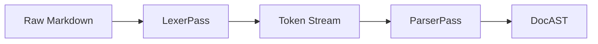

### Optimization Opportunities

| Technique | Description | Estimated Savings |
|-----------|-------------|-------------------|
| **String interning** | Deduplicate repeated text values (headings, code language strings) | 15-30% memory |
| **Position compression** | Store positions as relative offsets (delta encoding) instead of absolute | 40-60% memory |
| **Sparse children** | For leaf-heavy trees, store children as an offset into a flat array | 10-20% memory |
| **Node pooling** | Reuse Text nodes with identical content across documents | Varies by corpus |
| **Lazy inline parsing** | Defer inline tree construction until Section extraction requires it | 20-40% parse time |
| **Column omission** | Omit `startCol`/`endCol` when only line-level precision is needed | 25% memory |

---

## 3. Section Graph (SectionGraph)

### Purpose

SectionGraph extracts logical sections from the DocAST by traversing the heading hierarchy. Each section represents a contiguous block of content under a heading. This IR is the structural backbone of the document and feeds into nearly every downstream IR.

**Producer:** `SectionExtractorPass`
**Consumer(s):** `CitationExtractorPass`, `EntityExtractorPass`, `KnowledgeGraphBuilderPass`, `ConceptBuilderPass`, `TopicModelingPass`, `SearchIndexerPass`

### Schema

```typescript
interface SectionMetadata {
  wordCount: number;
  tokenCount: number;
  codeBlockCount: number;
  linkCount: number;
  imageCount: number;
  containsMath: boolean;
  readingTimeMinutes: number;        // Based on 200 words/min
  hasIntroduction: boolean;          // True if first child is an introductory paragraph
  summary?: string;                  // LLM-generated summary (populated in optimization pass)
}

interface SectionNode extends IRNode {
  type: "Section";
  documentId: UUID;                  // References a Document node
  path: string[];                    // Heading hierarchy e.g. ["Docs", "Guides", "Deployment"]
  title: string;                     // Section heading text
  depth: number;                     // heading level (1-6), 0 for implicit root section
  content: string;                   // Concatenated text content of this section and descendants
  position: SourcePosition;
  headingAnchor: string;             // Slug for anchor linking
  parentSectionId: UUID | null;      // Parent section (null for document root section)
  childSectionIds: UUID[];
  headingNodeIds: UUID[];            // DocNode IDs for headings in this section
  siblingOrder: number;              // Ordinal position among siblings
  metadata: SectionMetadata;
}

interface SectionGraph extends IRGraph<SectionNode> {
  type: "SectionGraph";
  documentCount: number;
  totalSections: number;
  maxDepth: number;
}
```

### Example

```json
{
  "type": "SectionGraph",
  "documentCount": 2,
  "totalSections": 9,
  "maxDepth": 4,
  "nodes": {
    "sec-root-deploy": {
      "id": "sec-root-deploy",
      "type": "Section",
      "documentId": "doc-deploy",
      "path": [],
      "title": "(root)",
      "depth": 0,
      "content": "Deployment Guide This guide covers...",
      "position": { "startLine": 1, "endLine": 245, "startCol": 0, "endCol": 0 },
      "headingAnchor": "",
      "parentSectionId": null,
      "childSectionIds": ["sec-1-setup", "sec-2-config", "sec-3-troubleshoot"],
      "headingNodeIds": [],
      "siblingOrder": 0,
      "metadata": {
        "wordCount": 1842,
        "tokenCount": 2847,
        "codeBlockCount": 5,
        "linkCount": 12,
        "imageCount": 3,
        "containsMath": false,
        "readingTimeMinutes": 9.2,
        "hasIntroduction": true
      },
      "createdAt": 1720550400100,
      "version": 1
    },
    "sec-1-setup": {
      "id": "sec-1-setup",
      "type": "Section",
      "documentId": "doc-deploy",
      "path": ["Deployment Guide", "Prerequisites"],
      "title": "Prerequisites",
      "depth": 2,
      "content": "Before deploying, ensure you have Node.js 18+ and Docker installed...",
      "position": { "startLine": 7, "endLine": 34, "startCol": 0, "endCol": 0 },
      "headingAnchor": "prerequisites",
      "parentSectionId": "sec-root-deploy",
      "childSectionIds": ["sec-1-1-system-reqs", "sec-1-2-env-vars"],
      "headingNodeIds": ["heading-prereqs"],
      "siblingOrder": 1,
      "metadata": {
        "wordCount": 312,
        "tokenCount": 487,
        "codeBlockCount": 1,
        "linkCount": 3,
        "imageCount": 0,
        "containsMath": false,
        "readingTimeMinutes": 1.6,
        "hasIntroduction": false
      },
      "createdAt": 1720550400101,
      "version": 1
    },
    "sec-1-1-system-reqs": {
      "id": "sec-1-1-system-reqs",
      "type": "Section",
      "documentId": "doc-deploy",
      "path": ["Deployment Guide", "Prerequisites", "System Requirements"],
      "title": "System Requirements",
      "depth": 3,
      "content": "Node.js 18+ (LTS recommended), Docker 24+, 4GB RAM minimum...",
      "position": { "startLine": 9, "endLine": 18, "startCol": 0, "endCol": 0 },
      "headingAnchor": "system-requirements",
      "parentSectionId": "sec-1-setup",
      "childSectionIds": [],
      "headingNodeIds": ["heading-sys-reqs"],
      "siblingOrder": 1,
      "metadata": {
        "wordCount": 142,
        "tokenCount": 218,
        "codeBlockCount": 0,
        "linkCount": 2,
        "imageCount": 0,
        "containsMath": false,
        "readingTimeMinutes": 0.7,
        "hasIntroduction": false
      },
      "createdAt": 1720550400102,
      "version": 1
    }
  },
  "edges": {},
  "adjacency": {}
}
```

### Invariants

| Invariant | Description |
|-----------|-------------|
| Tree structure | Every section (except root per-document) has exactly one parent section |
| Position containment | Child section positions are strictly within parent section positions |
| Depth consistency | `depth === path.length` and `depth === heading level` (0 for root) |
| Section continuity | Sections within a document are non-overlapping and cover every line of the document |
| Path prefix property | For child section with path `[A, B, C]`, parent has path `[A, B]` |
| Sibling ordering | `siblingOrder` is a dense sequence (0, 1, 2...) within each parent |
| `headingNodeIds` validity | All referenced heading node IDs exist in the source DocAST |
| Document-scoped default | A document with no headings produces one root Section node |

### Transformations

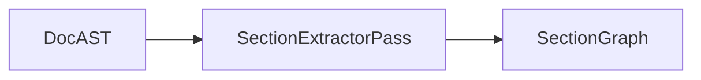

### Optimization Opportunities

| Technique | Description | Estimated Savings |
|-----------|-------------|-------------------|
| **Content deduplication** | Store content as pointer to DocAST node range instead of concatenated string | 30-50% memory |
| **Delta path encoding** | Store path as diff from parent (just the new segment) | 20-30% memory |
| **Empty section elision** | Skip sections with zero content (pure structural sections) | Varies |
| **Lazy summarization** | Defer summary generation to on-demand or background pass | 100% of build time (deferred) |

---

## 4. Citation Graph (CitationGraph)

### Purpose

CitationGraph captures citation and reference relationships between documents and sections. It models which documents cite others, how frequently, and with what relevance weight. This enables authority scoring, provenance tracking, and influence analysis.

**Producer:** `CitationExtractorPass`
**Consumer(s):** `KnowledgeGraphBuilderPass`, `ImportanceScorerPass`, `SearchIndexerPass`

### Schema

```typescript
type CitationNodeType = "CitationDocument" | "CitationSection";

interface CitationDocumentNode extends IRNode {
  type: "CitationDocument";
  documentId: UUID;             // Links to source document
  title: string;
  url: string | null;
  canonicalId: string | null;   // DOI, arXiv ID, ISBN, etc.
  citationCount: number;        // Number of outgoing citations
  citedByCount: number;         // Number of incoming citations
}

interface CitationSectionNode extends IRNode {
  type: "CitationSection";
  sectionId: UUID;              // Links to SectionGraph node
  citationDocumentId: UUID;     // Links to parent CitationDocument
  title: string;
  citationCount: number;
  citedByCount: number;
}

type CitationEdgeType =
  | "cites"                     // A cites B (direct)
  | "cited-by"                  // A is cited by B (inverse)
  | "references"                // A references B (broader than cites)
  | "referenced-by"             // A is referenced by B
  | "co-cited"                  // A and B are cited by the same documents
  | "bibliographic-couple";     // A and B cite the same documents

interface CitationGraph extends IRGraph<CitationDocumentNode | CitationSectionNode> {
  type: "CitationGraph";
  totalCitations: number;
  totalReferences: number;
  documentCount: number;
}
```

### Example

```json
{
  "type": "CitationGraph",
  "totalCitations": 47,
  "totalReferences": 89,
  "documentCount": 12,
  "nodes": {
    "citdoc-001": {
      "id": "citdoc-001",
      "type": "CitationDocument",
      "documentId": "doc-deploy",
      "title": "Deployment Guide",
      "url": "https://docs.example.com/guides/deployment",
      "canonicalId": null,
      "citationCount": 3,
      "citedByCount": 2,
      "metadata": {},
      "createdAt": 1720550400200,
      "version": 1
    },
    "citdoc-002": {
      "id": "citdoc-002",
      "type": "CitationDocument",
      "documentId": "doc-arch-overview",
      "title": "System Architecture Overview",
      "url": "https://docs.example.com/architecture/overview",
      "canonicalId": "10.1234/arch-2024-001",
      "citationCount": 8,
      "citedByCount": 15,
      "metadata": {},
      "createdAt": 1720550400201,
      "version": 1
    },
    "citsection-001": {
      "id": "citsection-001",
      "type": "CitationSection",
      "sectionId": "sec-1-setup",
      "citationDocumentId": "citdoc-001",
      "title": "Prerequisites",
      "citationCount": 1,
      "citedByCount": 0,
      "metadata": {},
      "createdAt": 1720550400202,
      "version": 1
    }
  },
  "edges": {
    "edge-cite-001": {
      "id": "edge-cite-001",
      "sourceId": "citdoc-001",
      "targetId": "citdoc-002",
      "type": "cites",
      "weight": 0.85,
      "metadata": {
        "context": "See Architecture Overview for system requirements",
        "citationText": "[1]",
        "position": { "startLine": 12, "endLine": 12, "startCol": 45, "endCol": 48 }
      }
    },
    "edge-cocited-001": {
      "id": "edge-cocited-001",
      "sourceId": "citdoc-001",
      "targetId": "citdoc-003",
      "type": "co-cited",
      "weight": 3,
      "metadata": {
        "sharedCiters": ["citdoc-005", "citdoc-007", "citdoc-009"]
      }
    }
  },
  "adjacency": {
    "citdoc-001": ["edge-cite-001", "edge-cocited-001"],
    "citdoc-002": ["edge-cite-001"],
    "citdoc-003": ["edge-cocited-001"]
  }
}
```

### Invariants

| Invariant | Description |
|-----------|-------------|
| Edge symmetry | For every `cites` edge from A->B, there exists a `cited-by` edge from B->A |
| Weight semantics | `cites`/`cited-by` weight is relevance score `[0, 1]`; `co-cited` weight is count `[0, inf)` |
| Citation context | Every `cites` edge must have a non-empty `metadata.context` field |
| Document-section binding | Every `CitationSection` node references a valid `citationDocumentId` |
| Canonical ID uniqueness | If `canonicalId` is set, it must be unique across all CitationDocument nodes |
| Citation count consistency | `citationCount` must equal number of outgoing `cites` edges from the node |

### Transformations

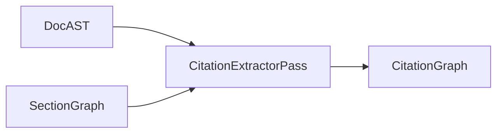

### Optimization Opportunities

| Technique | Description | Estimated Savings |
|-----------|-------------|-------------------|
| **Sparse edge storage** | For documents with large citation networks, store only top-k co-citation edges | 60-80% edges |
| **Citation context compression** | Store context as DocAST node ID + offset instead of string | 40-50% memory |
| **Weight quantization** | Store relevance weights as uint8 scaled to `[0, 255]` | 75% edge memory |
| **Canonical ID dedup** | Deduplicate documents by canonicalId across repository | Variable |

---

## 5. Entity Graph (EntityGraph)

### Purpose

EntityGraph captures named entities extracted from document text. Entities include people, organizations, locations, concepts, technologies, and products -- with metadata about confidence, frequency, aliases, and temporal presence.

**Producer:** `EntityExtractorPass` (NLP-based, supports pluggable backends)
**Consumer(s):** `KnowledgeGraphBuilderPass`, `ConceptBuilderPass`, `TopicModelingPass`, `SearchIndexerPass`, `RecommendationBuilderPass`

### Schema

```typescript
type EntityType =
  | "PERSON"
  | "ORG"           // Organization
  | "LOC"           // Location
  | "GPE"           // Geopolitical entity
  | "DATE"
  | "TIME"
  | "MONEY"
  | "PERCENT"
  | "FAC"           // Facility
  | "PRODUCT"
  | "EVENT"
  | "WORK_OF_ART"
  | "LAW"
  | "LANGUAGE"
  | "TECHNOLOGY"
  | "CONCEPT"
  | "PROTOCOL"
  | "FRAMEWORK"
  | "API"
  | "DATABASE"
  | "ALGORITHM"
  | "FILE_FORMAT"
  | "CONFIGURATION";

type EntityEdgeType =
  | "co-occurs"               // Entities appear within the same window
  | "related-to"              // Generic relationship
  | "defined-in"              // Entity is defined in a specific section
  | "referenced-by"           // Entity is referenced by a section
  | "is-a"                    // Hypernymy: X is a Y
  | "part-of"                 // Meronymy: X is part of Y
  | "produces"                // X produces Y
  | "depends-on"              // X depends on Y
  | "version-of"              // X is a version of Y
  | "alias-of"                // X is an alias for Y
  | "contrasts-with"          // X contrasts with Y
  | "prerequisite-for";       // X is a prerequisite for Y

interface EntityNode extends IRNode {
  type: "Entity";
  entityType: EntityType;
  name: string;                       // Canonical name
  aliases: string[];                  // Alternative names
  description: string;
  confidence: number;                 // [0, 1] extraction confidence
  frequency: number;                  // Total occurrences
  documentFrequency: number;          // Number of distinct documents
  firstSeen: UnixMs;
  lastSeen: UnixMs;
  salience: number;                   // [0, 1] how central to corpus
  embedding?: EmbeddingVector;
  wikipediaId?: string;
  externalUris: string[];
}

interface EntityGraph extends IRGraph<EntityNode> {
  type: "EntityGraph";
  extractor: string;                  // e.g. "spacy", "bert-ner", "hybrid-v3"
  language: string;
  totalEntities: number;
  totalOccurrences: number;
  entityTypeDistribution: Record<EntityType, number>;
  coOccurrenceWindow: number;         // Token window used for co-occurrence
}
```

### Example

```json
{
  "type": "EntityGraph",
  "extractor": "hybrid-v3",
  "language": "en",
  "totalEntities": 234,
  "totalOccurrences": 1892,
  "entityTypeDistribution": {
    "TECHNOLOGY": 67,
    "CONCEPT": 52,
    "ORG": 41,
    "PRODUCT": 29,
    "LOC": 18,
    "PERSON": 13,
    "PROTOCOL": 8,
    "FRAMEWORK": 6
  },
  "coOccurrenceWindow": 50,
  "nodes": {
    "ent-001": {
      "id": "ent-001",
      "type": "Entity",
      "entityType": "TECHNOLOGY",
      "name": "Kubernetes",
      "aliases": ["k8s", "Kube", "Kubernetes Cluster"],
      "description": "Container orchestration platform",
      "confidence": 0.97,
      "frequency": 142,
      "documentFrequency": 18,
      "firstSeen": 1698883200000,
      "lastSeen": 1720550400000,
      "salience": 0.82,
      "externalUris": ["https://kubernetes.io", "https://github.com/kubernetes/kubernetes"],
      "metadata": {},
      "createdAt": 1720550400300,
      "version": 1
    },
    "ent-002": {
      "id": "ent-002",
      "type": "Entity",
      "entityType": "CONCEPT",
      "name": "Horizontal Pod Autoscaling",
      "aliases": ["HPA", "pod autoscaling", "horizontal autoscaling"],
      "description": "Kubernetes feature that automatically scales pod replicas",
      "confidence": 0.91,
      "frequency": 37,
      "documentFrequency": 6,
      "firstSeen": 1704067200000,
      "lastSeen": 1720550400000,
      "salience": 0.45,
      "externalUris": [],
      "metadata": {},
      "createdAt": 1720550400301,
      "version": 1
    },
    "ent-003": {
      "id": "ent-003",
      "type": "Entity",
      "entityType": "ORG",
      "name": "CloudNative Computing Foundation",
      "aliases": ["CNCF", "Cloud Native Computing Foundation"],
      "description": "Organization that oversees Kubernetes and related projects",
      "confidence": 0.94,
      "frequency": 23,
      "documentFrequency": 8,
      "firstSeen": 1698883200000,
      "lastSeen": 1720550400000,
      "salience": 0.38,
      "externalUris": ["https://cncf.io"],
      "metadata": {},
      "createdAt": 1720550400302,
      "version": 1
    }
  },
  "edges": {
    "edge-entity-co-001": {
      "id": "edge-entity-co-001",
      "sourceId": "ent-001",
      "targetId": "ent-002",
      "type": "co-occurs",
      "weight": 28,
      "metadata": {
        "contexts": [
          { "sectionId": "sec-3-scaling", "sentence": "Kubernetes HPA automatically scales pods..." },
          { "sectionId": "sec-5-advanced", "sentence": "Horizontal Pod Autoscaling is a key Kubernetes feature..." }
        ]
      }
    },
    "edge-entity-dep-001": {
      "id": "edge-entity-dep-001",
      "sourceId": "ent-001",
      "targetId": "ent-003",
      "type": "depends-on",
      "weight": 0.9,
      "metadata": {
        "description": "Kubernetes is governed by CNCF"
      }
    }
  },
  "adjacency": {
    "ent-001": ["edge-entity-co-001", "edge-entity-dep-001"],
    "ent-002": ["edge-entity-co-001"],
    "ent-003": ["edge-entity-dep-001"]
  }
}
```

### Invariants

| Invariant | Description |
|-----------|-------------|
| Canonical name uniqueness | No two entities may share the same `name` within a single EntityGraph |
| Alias consistency | An alias must not equal the canonical name of a different entity |
| Confidence bounds | `confidence` in [0, 1] |
| Frequency consistency | `frequency` >= `documentFrequency` |
| Temporal monotonicity | `firstSeen` <= `lastSeen` |
| Entity type validity | `entityType` must be an element of `EntityType` union |
| Co-occurrence symmetry | For every `co-occurs` edge from A->B, there should be one from B->A |

### Transformations

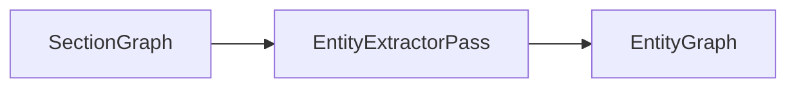

### Optimization Opportunities

| Technique | Description | Estimated Savings |
|-----------|-------------|-------------------|
| **Embedding quantization** | Quantize entity embeddings to int8 (via binary quantization or PQ) | 75-90% memory |
| **Co-occurrence pruning** | Only store top-k co-occurring pairs per entity | 50-80% edges |
| **Alias compression** | Store aliases as a bloom filter (trade recall for memory) | 80% alias memory |
| **Entity resolution batching** | Batch disambiguation across corpus instead of per-document | 40% time |
| **Frequency decay** | Discard entities with `frequency` below threshold after merging | 10-30% nodes |

---

## 6. Reference Graph (ReferenceGraph)

### Purpose

ReferenceGraph captures all internal and external reference links within and between documents. This includes hyperlinks, heading references, footnote references, definition references, and cross-document links. It is separate from CitationGraph to distinguish navigational links from academic-style citations.

**Producer:** `ReferenceExtractorPass`
**Consumer(s):** `KnowledgeGraphBuilderPass`, `NavigationGraphBuilderPass`, `SearchIndexerPass`, `LinkValidationPass`

### Schema

```typescript
type ReferenceNodeType = "ReferenceDocument" | "ReferenceSection" | "ReferenceURL";

interface ReferenceDocumentNode extends IRNode {
  type: "ReferenceDocument";
  documentId: UUID;
  path: string;
  outgoingLinkCount: number;
  incomingLinkCount: number;
  brokenLinkCount: number;
}

interface ReferenceSectionNode extends IRNode {
  type: "ReferenceSection";
  sectionId: UUID;
  headingAnchor: string;
  outgoingLinkCount: number;
  incomingLinkCount: number;
}

interface ReferenceURLNode extends IRNode {
  type: "ReferenceURL";
  url: string;
  normalizedUrl: string;           // Lowercased, trailing slash normalized
  domain: string;
  isInternal: boolean;
  isReachable: boolean;            // Validated by link checker
  statusCode: number | null;       // HTTP status if external
  lastChecked: UnixMs | null;
  anchorTargets: string[];         // If URL points to a page with anchors
}

type ReferenceEdgeType =
  | "links-to"                   // A links to B
  | "referenced-by"              // A is referenced by B (inverse)
  | "heading-link"               // Link to a specific heading
  | "definition-link"            // Link to a definition
  | "footnote-ref"               // Footnote reference
  | "footnote-backlink"          // Backlink from footnote
  | "image-ref"                  // Image reference (non-navigational)
  | "embed-ref";                 // Embedded content reference

interface ReferenceGraph extends IRGraph<ReferenceDocumentNode | ReferenceSectionNode | ReferenceURLNode> {
  type: "ReferenceGraph";
  totalLinks: number;
  internalLinks: number;
  externalLinks: number;
  brokenLinks: number;
  totalFootnotes: number;
}
```

### Example

```json
{
  "type": "ReferenceGraph",
  "totalLinks": 156,
  "internalLinks": 98,
  "externalLinks": 58,
  "brokenLinks": 3,
  "totalFootnotes": 12,
  "nodes": {
    "refdoc-001": {
      "id": "refdoc-001",
      "type": "ReferenceDocument",
      "documentId": "doc-deploy",
      "path": "/docs/guides/deployment.md",
      "outgoingLinkCount": 12,
      "incomingLinkCount": 7,
      "brokenLinkCount": 1,
      "metadata": {},
      "createdAt": 1720550400400,
      "version": 1
    },
    "refsec-001": {
      "id": "refsec-001",
      "type": "ReferenceSection",
      "sectionId": "sec-1-setup",
      "headingAnchor": "prerequisites",
      "outgoingLinkCount": 3,
      "incomingLinkCount": 2,
      "metadata": {},
      "createdAt": 1720550400401,
      "version": 1
    },
    "refurl-001": {
      "id": "refurl-001",
      "type": "ReferenceURL",
      "url": "https://kubernetes.io/docs/setup/",
      "normalizedUrl": "https://kubernetes.io/docs/setup",
      "domain": "kubernetes.io",
      "isInternal": false,
      "isReachable": true,
      "statusCode": 200,
      "lastChecked": 1720550400000,
      "anchorTargets": [],
      "metadata": {},
      "createdAt": 1720550400402,
      "version": 1
    },
    "refurl-002": {
      "id": "refurl-002",
      "type": "ReferenceURL",
      "url": "/docs/guides/configuration#environment-variables",
      "normalizedUrl": "/docs/guides/configuration#environment-variables",
      "domain": "(internal)",
      "isInternal": true,
      "isReachable": true,
      "statusCode": null,
      "lastChecked": 1720550400000,
      "anchorTargets": ["environment-variables"],
      "metadata": {},
      "createdAt": 1720550400403,
      "version": 1
    }
  },
  "edges": {
    "edge-ref-001": {
      "id": "edge-ref-001",
      "sourceId": "refsec-001",
      "targetId": "refurl-002",
      "type": "links-to",
      "weight": 1,
      "metadata": {
        "linkText": "environment variables",
        "position": { "startLine": 15, "endLine": 15, "startCol": 22, "endCol": 44 },
        "context": "Configure your environment variables as described in the configuration guide"
      }
    },
    "edge-ref-002": {
      "id": "edge-ref-002",
      "sourceId": "refdoc-001",
      "targetId": "refurl-001",
      "type": "links-to",
      "weight": 1,
      "metadata": {
        "linkText": "Kubernetes setup guide",
        "position": { "startLine": 30, "endLine": 30, "startCol": 10, "endCol": 35 }
      }
    }
  },
  "adjacency": {
    "refsec-001": ["edge-ref-001"],
    "refurl-002": ["edge-ref-001"],
    "refdoc-001": ["edge-ref-002"],
    "refurl-001": ["edge-ref-002"]
  }
}
```

### Invariants

| Invariant | Description |
|-----------|-------------|
| URL normalization | All URLs must be normalized (lowercase scheme/host, removed default ports, collapsed `..` segments) |
| Broken link detection | `brokenLinks` count must match sum of edges where `target.isReachable === false` |
| Footnote reciprocity | Every `footnote-ref` edge must have a corresponding `footnote-backlink` edge |
| Internal link resolution | For internal links, target must exist in the graph or a separate validation report must document the failure |
| Link text presence | Every `links-to` edge must have non-empty `metadata.linkText` |
| IsInternal consistency | `ReferenceURL.isInternal` must agree with the URL scheme and host |

### Transformations

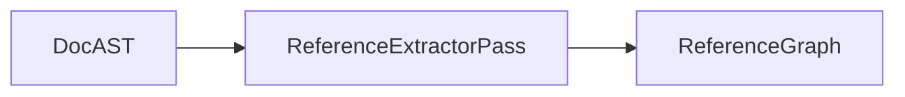

### Optimization Opportunities

| Technique | Description | Estimated Savings |
|-----------|-------------|-------------------|
| **URL deduplication** | Intern all URL strings -- many documents reference the same URLs | 30-50% strings |
| **Link validation caching** | Cache reachability results with TTL (daily revalidation) | 90% fewer HTTP requests |
| **Anchor resolution lazy loading** | Resolve heading anchors on-demand rather than eagerly for all internal links | Variable |
| **Edge metadata compression** | Store link text as offset into source document string | 40-60% memory |

---

## 7. Knowledge Graph (KnowledgeGraph)

### Purpose

KnowledgeGraph is the **primary integration IR** -- a unified semantic graph that merges entities, documents, sections, concepts, and all relationship types from source graphs into a single navigable structure. It serves as the "single source of truth" for downstream semantic passes.

**Producer:** `KnowledgeGraphBuilderPass` (fusion pass)
**Consumer(s):** `ImportanceScorerPass`, `ClusterPass`, `NavigationGraphBuilderPass`, `RecommendationBuilderPass`, `ConceptBuilderPass`

### Schema

```typescript
// KnowledgeGraph is the union of all node types from upstream IRs

type KnowledgeNodeType =
  | "Document"
  | "Section"
  | "Entity"
  | "Concept"
  | "Topic"
  | "Cluster"
  | "KGCitation"
  | "KGReference";

interface KnowledgeNode extends IRNode {
  type: KnowledgeNodeType;
  originalGraph: string;            // Which IR this node originated from
  originalId: UUID;                 // Original ID in source IR
  label: string;                    // Human-readable label
  description: string;
  aliases: string[];
  importance: number;               // [0, 1] -- may be refined later by ImportanceGraph
  embedding?: EmbeddingVector;
  nodeMetadata: Record<string, unknown>;  // Preserved from source IR
}

// Unified edge types cover all source graph edges
type KnowledgeEdgeType =
  // Structural
  | "contains"           // Document contains Section
  | "child-section"      // Section contains Section
  // Entity
  | "co-occurs"
  | "related-to"
  | "defined-in"
  | "is-a"
  | "part-of"
  | "produces"
  | "depends-on"
  | "alias-of"
  // Citation
  | "cites"
  | "cited-by"
  | "references"
  | "referenced-by"
  | "co-cited"
  // Reference
  | "links-to"
  | "heading-link"
  | "footnote-ref"
  // Concept
  | "broader-than"
  | "narrower-than"
  | "has-a"
  // Topic
  | "topic-document"
  | "topic-similar"
  // Semantic
  | "semantically-similar"
  | "nearest-neighbor"
  // Cluster
  | "cluster-member"
  | "similar-cluster"
  // Importance
  | "influence-flow";

interface KnowledgeEdge extends IREdge {
  type: KnowledgeEdgeType;
  sourceGraph: string;             // Source IR of this edge
  originalEdgeId: UUID;            // Original edge ID in source IR
}

interface KnowledgeGraph extends IRGraph<KnowledgeNode> {
  type: "KnowledgeGraph";
  version: number;
  upstreamGraphs: string[];        // List of source IR names
  nodeTypeDistribution: Record<KnowledgeNodeType, number>;
  edgeTypeDistribution: Record<KnowledgeEdgeType, number>;
  totalNodeCount: number;
  totalEdgeCount: number;
  density: number;                 // Edge count / (node count)^2
}
```

### Example

```json
{
  "type": "KnowledgeGraph",
  "version": 1,
  "upstreamGraphs": ["DocAST", "SectionGraph", "EntityGraph", "CitationGraph", "ReferenceGraph"],
  "nodeTypeDistribution": {
    "Document": 14,
    "Section": 89,
    "Entity": 234,
    "Concept": 0,
    "Topic": 0,
    "Cluster": 0
  },
  "edgeTypeDistribution": {
    "contains": 14,
    "child-section": 88,
    "co-occurs": 1247,
    "related-to": 312,
    "cites": 47,
    "links-to": 156,
    "defined-in": 89,
    "is-a": 45,
    "depends-on": 23
  },
  "totalNodeCount": 337,
  "totalEdgeCount": 2021,
  "density": 0.0179,
  "nodes": {
    "kg-doc-001": {
      "id": "kg-doc-001",
      "type": "Document",
      "originalGraph": "SectionGraph",
      "originalId": "doc-deploy",
      "label": "Deployment Guide",
      "description": "Guide for deploying applications to production",
      "aliases": ["deploy guide", "deployment howto"],
      "importance": 0.75,
      "nodeMetadata": { "sourcePath": "/docs/guides/deployment.md" },
      "metadata": {},
      "createdAt": 1720550400500,
      "version": 1
    },
    "kg-sec-001": {
      "id": "kg-sec-001",
      "type": "Section",
      "originalGraph": "SectionGraph",
      "originalId": "sec-1-setup",
      "label": "Prerequisites",
      "description": "System requirements and environment setup for deployment",
      "aliases": [],
      "importance": 0.62,
      "nodeMetadata": {
        "documentId": "doc-deploy",
        "headingAnchor": "prerequisites",
        "depth": 2
      },
      "metadata": {},
      "createdAt": 1720550400501,
      "version": 1
    },
    "kg-ent-001": {
      "id": "kg-ent-001",
      "type": "Entity",
      "originalGraph": "EntityGraph",
      "originalId": "ent-001",
      "label": "Kubernetes",
      "description": "Container orchestration platform",
      "aliases": ["k8s", "Kube"],
      "importance": 0.88,
      "embedding": {
        "model": "text-embedding-3-small",
        "dimensions": 1536,
        "values": [0.023, -0.045, 0.112]
      },
      "nodeMetadata": {
        "entityType": "TECHNOLOGY",
        "frequency": 142,
        "salience": 0.82
      },
      "metadata": {},
      "createdAt": 1720550400502,
      "version": 1
    }
  },
  "edges": {
    "kg-edge-001": {
      "id": "kg-edge-001",
      "sourceId": "kg-doc-001",
      "targetId": "kg-sec-001",
      "type": "contains",
      "weight": 1,
      "sourceGraph": "SectionGraph",
      "originalEdgeId": "(implicit)",
      "metadata": {}
    },
    "kg-edge-002": {
      "id": "kg-edge-002",
      "sourceId": "kg-ent-001",
      "targetId": "kg-sec-001",
      "type": "defined-in",
      "weight": 0.85,
      "sourceGraph": "EntityGraph",
      "originalEdgeId": "edge-entity-defined-001",
      "metadata": {
        "sentence": "Kubernetes is deployed on production clusters"
      }
    }
  },
  "adjacency": {
    "kg-doc-001": ["kg-edge-001"],
    "kg-sec-001": ["kg-edge-001", "kg-edge-002"],
    "kg-ent-001": ["kg-edge-002"]
  }
}
```

### Invariants

| Invariant | Description |
|-----------|-------------|
| ID stability | KnowledgeGraph does not re-generate IDs; it prefixes source IDs with a graph namespace |
| Edge deduplication | If two source IRs produce the same logical edge (same type, source, target), only one is kept |
| Importance freshness | `importance` is initially set to source graph salience/centrality; refined by subsequent passes |
| Embedding consistency | All embedding vectors in the same graph must have the same `model` and `dimensions` |
| No dangling references | Every `originalId` must exist in the corresponding source IR |
| Type preservation | `KnowledgeNodeType` must faithfully reflect the source node's type |
| Metadata preservation | Source metadata must be accessible under `nodeMetadata` |

### Transformations

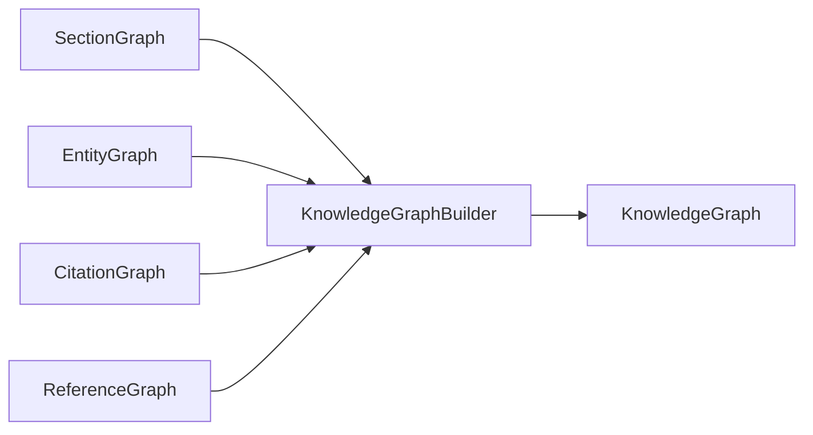

### Optimization Opportunities

| Technique | Description | Estimated Savings |
|-----------|-------------|-------------------|
| **Edge type compression** | Store edge types as uint8 enum instead of strings | 50-70% per edge |
| **Adjacency list compression** | Use delta-encoded sorted adjacency lists | 40-50% adjacency memory |
| **Node pruning** | Remove nodes with importance below threshold (tunable) | 10-30% nodes |
| **View materialization** | Materialize sub-graphs (Entity-KG, Section-KG) as views | Faster queries |
| **Node metadata externalization** | Store `nodeMetadata` in a separate sparse store | 20-40% node size |

---

## 8. Concept Graph (ConceptGraph)

### Purpose

ConceptGraph organizes extracted entities and topics into a hierarchical concept taxonomy. It models "is-a", "has-a", "broader-than", and "narrower-than" relationships to create a tree or DAG of concepts from the domain level down to atomic leaf concepts. This powers faceted navigation, generalization, and specialization queries.

**Producer:** `ConceptBuilderPass`
**Consumer(s):** `KnowledgeGraphBuilderPass`, `NavigationGraphBuilderPass`, `SearchIndexerPass`, `RecommendationBuilderPass`

### Schema

```typescript
interface ConceptNode extends IRNode {
  type: "Concept";
  label: string;
  description: string;
  level: number;                     // 0 (domain root) -> N (atomic concept)
  parentId: UUID | null;
  childIds: UUID[];
  aliases: string[];
  entityIds: UUID[];                 // References to EntityGraph nodes that map to this concept
  sectionIds: UUID[];                // References to SectionGraph sections that define/mention this
  frequency: number;                 // Total occurrences across corpus
  documentCount: number;             // Distinct documents containing this concept
  embedding?: EmbeddingVector;
}

type ConceptEdgeType =
  | "is-a"                          // Kubernetes is-a OrchestrationPlatform
  | "has-a"                         // DeploymentPipeline has-a BuildStage
  | "related-to"                    // Generic relatedness
  | "broader-than"                  // Container broader-than Docker (generic)
  | "narrower-than"                 // Inverse of broader-than
  | "prerequisite-for"              // Networking is prerequisite-for Deployment
  | "equivalent-to";                // Two concepts are equivalent (from different sources)

interface ConceptEdge extends IREdge {
  type: ConceptEdgeType;
}

interface ConceptGraph extends IRGraph<ConceptNode> {
  type: "ConceptGraph";
  maxLevel: number;
  totalConcepts: number;
  rootConceptIds: UUID[];            // Top-level domain concepts (level 0)
  leafCount: number;                 // Concepts with no children
  averageDepth: number;
  averageBranchingFactor: number;
}
```

### Example

```json
{
  "type": "ConceptGraph",
  "maxLevel": 5,
  "totalConcepts": 186,
  "rootConceptIds": ["concept-infrastructure", "concept-application", "concept-devops"],
  "leafCount": 112,
  "averageDepth": 3.2,
  "averageBranchingFactor": 2.8,
  "nodes": {
    "concept-infrastructure": {
      "id": "concept-infrastructure",
      "type": "Concept",
      "label": "Infrastructure",
      "description": "Computing infrastructure and platform concepts",
      "level": 0,
      "parentId": null,
      "childIds": ["concept-containers", "concept-networking", "concept-storage"],
      "aliases": ["infra", "platform infrastructure"],
      "entityIds": [],
      "sectionIds": [],
      "frequency": 0,
      "documentCount": 0,
      "metadata": {},
      "createdAt": 1720550400600,
      "version": 1
    },
    "concept-containers": {
      "id": "concept-containers",
      "type": "Concept",
      "label": "Containers",
      "description": "Containerization technologies and orchestration",
      "level": 1,
      "parentId": "concept-infrastructure",
      "childIds": ["concept-docker", "concept-kubernetes", "concept-container-runtime"],
      "aliases": ["containerization", "container tech"],
      "entityIds": ["ent-001"],
      "sectionIds": ["sec-2-containers"],
      "frequency": 312,
      "documentCount": 24,
      "metadata": {},
      "createdAt": 1720550400601,
      "version": 1
    },
    "concept-kubernetes": {
      "id": "concept-kubernetes",
      "type": "Concept",
      "label": "Kubernetes",
      "description": "Container orchestration platform",
      "level": 2,
      "parentId": "concept-containers",
      "childIds": ["concept-k8s-pods", "concept-k8s-services", "concept-k8s-deployments", "concept-hpa"],
      "aliases": ["k8s", "Kubernetes cluster"],
      "entityIds": ["ent-001"],
      "sectionIds": ["sec-3-kubernetes-setup", "sec-4-k8s-config"],
      "frequency": 284,
      "documentCount": 22,
      "embedding": {
        "model": "text-embedding-3-small",
        "dimensions": 1536,
        "values": [0.015, -0.032]
      },
      "metadata": {},
      "createdAt": 1720550400602,
      "version": 1
    },
    "concept-hpa": {
      "id": "concept-hpa",
      "type": "Concept",
      "label": "Horizontal Pod Autoscaling",
      "description": "Automatically scales pod replicas based on resource utilization",
      "level": 3,
      "parentId": "concept-kubernetes",
      "childIds": [],
      "aliases": ["HPA", "pod autoscaling"],
      "entityIds": ["ent-002"],
      "sectionIds": ["sec-5-hpa-config"],
      "frequency": 37,
      "documentCount": 6,
      "metadata": {},
      "createdAt": 1720550400603,
      "version": 1
    }
  },
  "edges": {
    "edge-concept-001": {
      "id": "edge-concept-001",
      "sourceId": "concept-containers",
      "targetId": "concept-kubernetes",
      "type": "is-a",
      "weight": 1,
      "metadata": {
        "source": "manual-curation",
        "confidence": 0.98
      }
    },
    "edge-concept-002": {
      "id": "edge-concept-002",
      "sourceId": "concept-kubernetes",
      "targetId": "concept-hpa",
      "type": "has-a",
      "weight": 1,
      "metadata": {
        "source": "entity-cooccurrence",
        "confidence": 0.85
      }
    }
  },
  "adjacency": {
    "concept-containers": ["edge-concept-001"],
    "concept-kubernetes": ["edge-concept-001", "edge-concept-002"],
    "concept-hpa": ["edge-concept-002"]
  }
}
```

### Invariants

| Invariant | Description |
|-----------|-------------|
| Level consistency | `level` of root concepts is 0; child `level === parent.level + 1` |
| DAG / Tree property | ConceptGraph should be a directed acyclic graph (no cycles) |
| Parent-child reciprocity | If A has child B, then B's `parentId === A.id` |
| Leaf definition | `leafCount` = count of nodes where `childIds.length === 0` |
| Entity mapping | All `entityIds` must reference valid nodes in EntityGraph |
| Level bound | `level <= maxLevel` |
| Rootedness | Every non-root concept is reachable from at least one root via parent links |
| Edge direction | `is-a`, `has-a`, `broader-than` go from more general to more specific |

### Transformations

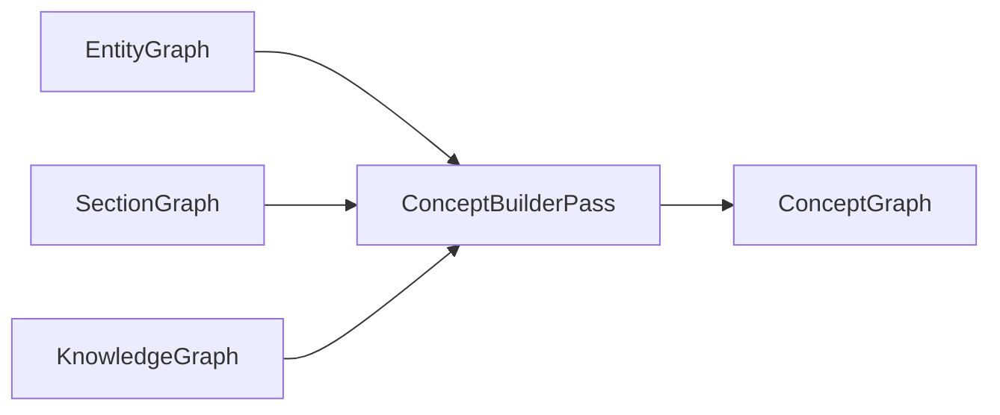

### Optimization Opportunities

| Technique | Description | Estimated Savings |
|-----------|-------------|-------------------|
| **Embedding deduplication** | Share embedding vectors with EntityGraph (same underlying object) | 0% extra (shared) |
| **Child list compression** | Store child IDs as delta-encoded offsets | 30-40% memory |
| **Concept pruning** | Merge concepts with frequency below threshold into parent | 10-20% nodes |
| **Level compression** | Level can be uint8 (max depth 255) | Negligible per node |
| **Lazy embedding** | Compute concept embeddings on demand via aggregation of entity vectors | Variable |

---

## 9. Topic Graph (TopicGraph)

### Purpose

TopicGraph captures topics discovered via unsupervised topic modeling (e.g., LDA, BERTopic, NMF). Each topic is defined by its top terms and the documents/sections that express it. Inter-topic similarity edges enable topic browsing and navigation.

**Producer:** `TopicModelingPass`
**Consumer(s):** `KnowledgeGraphBuilderPass`, `ClusterGraphBuilderPass`, `SearchIndexerPass`, `RecommendationBuilderPass`

### Schema

```typescript
interface TopicNode extends IRNode {
  type: "Topic";
  label: string;                     // Auto-generated or LLM-assigned label
  topTerms: Array<{
    term: string;
    weight: number;                  // Contribution weight to the topic
  }>;
  topDocuments: Array<{
    documentId: UUID;
    weight: number;                  // Topic proportion in this document [0, 1]
  }>;
  topSections: Array<{
    sectionId: UUID;
    weight: number;
  }>;
  coherence: number;                 // Topic coherence score [0, 1]
  size: number;                      // Number of documents assigned to this topic
  rank: number;                      // By corpus prevalence (1 = most prevalent)
  keywords: string[];
  embedding?: EmbeddingVector;
}

type TopicEdgeType =
  | "topic-document"             // Topic is expressed in Document
  | "topic-section"              // Topic is expressed in Section
  | "topic-similar"              // Two topics are similar
  | "topic-subtopic"             // Hierarchical topic relationship
  | "topic-contains-entity";     // Topic contains an entity

interface TopicEdge extends IREdge {
  type: TopicEdgeType;
}

interface TopicGraph extends IRGraph<TopicNode> {
  type: "TopicGraph";
  algorithm: string;                 // e.g. "lda", "bertopic", "nmf"
  numTopics: number;
  numDocuments: number;
  hyperparameters: Record<string, unknown>;
  averageCoherence: number;
}
```

### Example

```json
{
  "type": "TopicGraph",
  "algorithm": "bertopic-v2",
  "numTopics": 24,
  "numDocuments": 142,
  "hyperparameters": {
    "minTopicSize": 5,
    "embeddingModel": "all-MiniLM-L6-v2",
    "umapNeighbors": 15,
    "hdbscanMinClusterSize": 3
  },
  "averageCoherence": 0.72,
  "nodes": {
    "topic-001": {
      "id": "topic-001",
      "type": "Topic",
      "label": "Container Orchestration & Deployment",
      "topTerms": [
        { "term": "kubernetes", "weight": 0.142 },
        { "term": "deployment", "weight": 0.098 },
        { "term": "container", "weight": 0.087 },
        { "term": "cluster", "weight": 0.076 },
        { "term": "pod", "weight": 0.065 },
        { "term": "replica", "weight": 0.054 },
        { "term": "rollout", "weight": 0.048 },
        { "term": "namespace", "weight": 0.041 },
        { "term": "service", "weight": 0.038 },
        { "term": "ingress", "weight": 0.032 }
      ],
      "topDocuments": [
        { "documentId": "doc-deploy", "weight": 0.91 },
        { "documentId": "doc-k8s-advanced", "weight": 0.87 },
        { "documentId": "doc-cluster-admin", "weight": 0.76 }
      ],
      "topSections": [
        { "sectionId": "sec-3-kubernetes-setup", "weight": 0.94 },
        { "sectionId": "sec-4-k8s-config", "weight": 0.88 }
      ],
      "coherence": 0.81,
      "size": 18,
      "rank": 1,
      "keywords": ["kubernetes", "deployment", "containers", "orchestration"],
      "metadata": {},
      "createdAt": 1720550400700,
      "version": 1
    },
    "topic-002": {
      "id": "topic-002",
      "type": "Topic",
      "label": "Monitoring & Observability",
      "topTerms": [
        { "term": "monitoring", "weight": 0.121 },
        { "term": "metrics", "weight": 0.098 },
        { "term": "alert", "weight": 0.087 },
        { "term": "dashboard", "weight": 0.072 },
        { "term": "prometheus", "weight": 0.068 },
        { "term": "grafana", "weight": 0.061 },
        { "term": "tracing", "weight": 0.054 },
        { "term": "logging", "weight": 0.047 },
        { "term": "sla", "weight": 0.036 },
        { "term": "health-check", "weight": 0.031 }
      ],
      "topDocuments": [
        { "documentId": "doc-monitoring", "weight": 0.93 },
        { "documentId": "doc-observability", "weight": 0.89 }
      ],
      "topSections": [],
      "coherence": 0.76,
      "size": 12,
      "rank": 3,
      "keywords": ["monitoring", "observability", "prometheus", "grafana"],
      "metadata": {},
      "createdAt": 1720550400701,
      "version": 1
    }
  },
  "edges": {
    "edge-topic-sim-001": {
      "id": "edge-topic-sim-001",
      "sourceId": "topic-001",
      "targetId": "topic-002",
      "type": "topic-similar",
      "weight": 0.34,
      "metadata": {
        "method": "cosine-similarity",
        "similarityThreshold": 0.3
      }
    }
  },
  "adjacency": {
    "topic-001": ["edge-topic-sim-001"],
    "topic-002": ["edge-topic-sim-001"]
  }
}
```

### Invariants

| Invariant | Description |
|-----------|-------------|
| Topic uniqueness | Topic labels must be unique within a single TopicGraph |
| Term weight normalization | Sum of `topTerms[*].weight` for a topic must equal 1.0 (within floating tolerance) |
| Document weight bounds | `topDocuments[*].weight` in [0, 1] |
| Coherence bounds | `coherence` in [0, 1] |
| Size consistency | `size` must equal `topDocuments.length` |
| Rank uniqueness | `rank` values are dense and non-overlapping (1, 2, 3...) |
| Keyword subset | All `keywords` must appear in `topTerms[*].term` |
| Topic-similarity symmetry | Similarity edges should be symmetric (A->B implies B->A) |

### Transformations

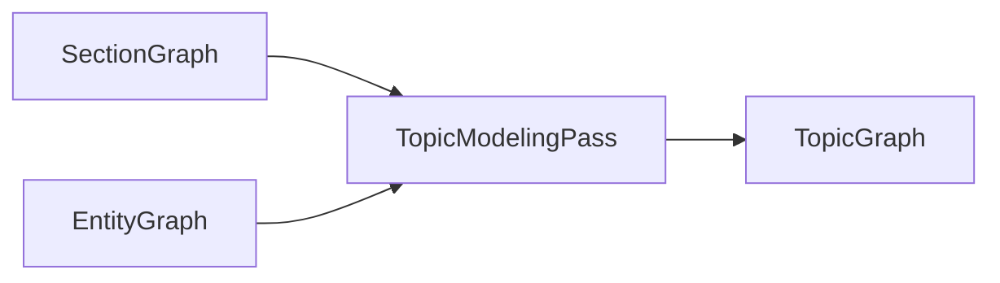

### Optimization Opportunities

| Technique | Description | Estimated Savings |
|-----------|-------------|-------------------|
| **Topic pruning** | Merge topics with coherence < threshold into "Other" topic | 10-30% topics |
| **Top-terms limiting** | Cap `topTerms` to top 20 instead of full distribution | 80% per topic |
| **Document weighting threshold** | Only store `topDocuments` with weight > 0.05 | 40-60% edges |
| **Topic similarity pruning** | Only store inter-topic edges where similarity > 0.2 | 60-80% edges |
| **Keyword deduplication** | Share keyword strings across topics via interning | 20-30% strings |

---

## 10. Semantic Graph (SemanticGraph)

### Purpose

SemanticGraph captures embedding-derived similarity relationships between documents, sections, entities, and concepts. It provides nearest-neighbor and similarity-score edges that enable semantic search, similarity browsing, and recommendation.

**Producer:** `EmbeddingPass`
**Consumer(s):** `KnowledgeGraphBuilderPass`, `ClusterGraphBuilderPass`, `SearchGraphBuilderPass`, `RecommendationBuilderPass`

### Schema

```typescript
type SemanticNodeType = "SemanticDocument" | "SemanticSection" | "SemanticEntity" | "SemanticConcept";

interface SemanticNode extends IRNode {
  type: SemanticNodeType;
  originalId: UUID;
  label: string;
  embedding: EmbeddingVector;
  tokenCount: number;               // Number of tokens in the embedded text
  chunkIndex?: number;              // For chunked documents (0-based)
  chunkCount?: number;              // Total chunks for this original node
}

type SemanticEdgeType =
  | "semantically-similar"         // Cosine similarity above threshold
  | "nearest-neighbor"             // Top-k nearest neighbors
  | "centroid-relation";           // Relation to cluster centroid

interface SemanticEdge extends IREdge {
  type: SemanticEdgeType;
  weight: number;                   // Cosine similarity in [0, 1]
  metadata: {
    similarityMethod: string;      // "cosine", "euclidean", "dot-product"
    rank?: number;                  // For nearest-neighbor edges: 1 = most similar
  };
}

interface SemanticGraph extends IRGraph<SemanticNode> {
  type: "SemanticGraph";
  embeddingModel: string;
  embeddingDimensions: number;
  totalEmbeddings: number;
  similarityThreshold: number;      // Minimum cosine similarity for edges
  nearestNeighborK: number;         // k for nearest-neighbor edges
  chunkSize: number;                // Token chunk size for long documents
  chunkOverlap: number;             // Overlap between chunks
}
```

### Example

```json
{
  "type": "SemanticGraph",
  "embeddingModel": "text-embedding-3-small",
  "embeddingDimensions": 1536,
  "totalEmbeddings": 342,
  "similarityThreshold": 0.65,
  "nearestNeighborK": 10,
  "chunkSize": 512,
  "chunkOverlap": 64,
  "nodes": {
    "semdoc-001": {
      "id": "semdoc-001",
      "type": "SemanticDocument",
      "originalId": "doc-deploy",
      "label": "Deployment Guide",
      "embedding": {
        "model": "text-embedding-3-small",
        "dimensions": 1536,
        "values": [0.023, -0.045, 0.112]
      },
      "tokenCount": 2847,
      "metadata": {},
      "createdAt": 1720550400800,
      "version": 1
    },
    "semsec-001": {
      "id": "semsec-001",
      "type": "SemanticSection",
      "originalId": "sec-3-kubernetes-setup",
      "label": "Kubernetes Setup",
      "embedding": {
        "model": "text-embedding-3-small",
        "dimensions": 1536,
        "values": [0.031, -0.052, 0.098]
      },
      "tokenCount": 423,
      "metadata": {},
      "createdAt": 1720550400801,
      "version": 1
    }
  },
  "edges": {
    "edge-sem-001": {
      "id": "edge-sem-001",
      "sourceId": "semdoc-001",
      "targetId": "semsec-001",
      "type": "semantically-similar",
      "weight": 0.87,
      "metadata": {
        "similarityMethod": "cosine",
        "rank": 1
      }
    },
    "edge-sem-002": {
      "id": "edge-sem-002",
      "sourceId": "semsec-001",
      "targetId": "semsec-002",
      "type": "nearest-neighbor",
      "weight": 0.82,
      "metadata": {
        "similarityMethod": "cosine",
        "rank": 2
      }
    }
  },
  "adjacency": {
    "semdoc-001": ["edge-sem-001"],
    "semsec-001": ["edge-sem-001", "edge-sem-002"],
    "semsec-002": ["edge-sem-002"]
  }
}
```

### Invariants

| Invariant | Description |
|-----------|-------------|
| Embedding dimension consistency | All embeddings in a single SemanticGraph must have identical `dimensions` |
| Similarity symmetry | `semantically-similar` edges should be symmetric (both A->B and B->A are stored) |
| NN completeness | If B is in A's top-k nearest neighbors, an edge `nearest-neighbor` must exist |
| Weight domain | All edge weights in this graph are cosine similarities in [0, 1] |
| Chunk consistency | `chunkIndex` must be in `[0, chunkCount)` when present |
| Threshold conformance | No edge has weight below `similarityThreshold` |

### Transformations

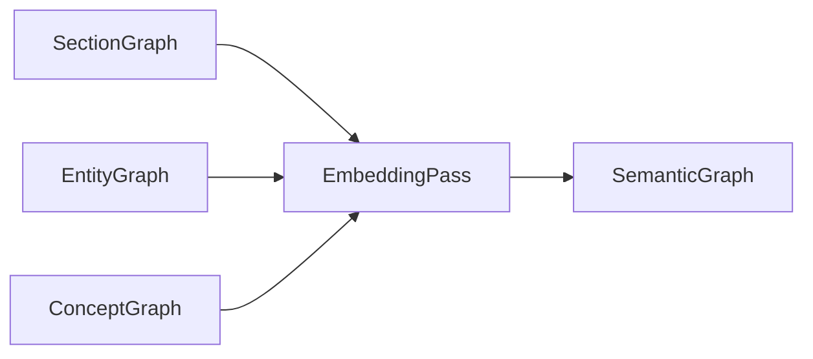

### Optimization Opportunities

| Technique | Description | Estimated Savings |
|-----------|-------------|-------------------|
| **Embedding quantization** | Quantize float32 -> int8 (scalar quantization) | 75% embedding memory |
| **Binary embeddings** | Binarize embeddings for faster ANN search (at recall cost) | 96% memory |
| **Approximate NN** | Use HNSW / IVF-PQ instead of exact kNN | 90-99% compute time |
| **Edge pruning** | Only store top-5 nearest-neighbor edges instead of top-10 | 50% edges |
| **Chunk deduplication** | Cache embeddings for chunks that appear in multiple contexts | Variable |

---

## 11. Cluster Graph (ClusterGraph)

### Purpose

ClusterGraph represents communities and clusters discovered by graph partitioning algorithms on the KnowledgeGraph. It groups related nodes into cohesive clusters with intra-cluster density and inter-cluster separation metrics. Cluster hierarchies support zooming from broad domains to fine-grained groups.

**Producer:** `ClusterPass` (community detection / graph partitioning)
**Consumer(s):** `KnowledgeGraphBuilderPass`, `NavigationGraphBuilderPass`, `RecommendationBuilderPass`

### Schema

```typescript
interface ClusterNode extends IRNode {
  type: "Cluster";
  label: string;
  description: string;
  size: number;                      // Number of member nodes
  internalDensity: number;           // [0, 1] -- fraction of possible intra-cluster edges that exist
  externalDensity: number;           // [0, 1] -- fraction of possible inter-cluster edges that exist
  conductance: number;               // [0, 1] -- cut size / intra-cluster edges (lower = better)
  modularity: number;                // Contribution to overall modularity
  memberIds: UUID[];                 // IDs of contained nodes (any type)
  memberTypes: Record<NodeType, number>;  // Count of each node type in cluster
  parentClusterId: UUID | null;
  childClusterIds: UUID[];
  centroid?: EmbeddingVector;        // Mean of member embeddings
  topTerms: string[];                // Most distinctive terms for this cluster
  topEntities: UUID[];               // Most important entity IDs in cluster
}

type ClusterEdgeType =
  | "cluster-hierarchy"             // Parent-child cluster relationship
  | "contains-member"               // Cluster contains a node
  | "cluster-similarity"            // Inter-cluster similarity
  | "cluster-overlap";              // Overlapping membership between clusters (for soft clustering)

interface ClusterEdge extends IREdge {
  type: ClusterEdgeType;
}

interface ClusterGraph extends IRGraph<ClusterNode> {
  type: "ClusterGraph";
  algorithm: string;                 // e.g. "louvain", "leiden", "spectral", "hdbscan"
  numClusters: number;
  resolution: number;                // Cluster resolution parameter
  modularity: number;                // Overall graph modularity
  maxDepth: number;                  // Hierarchy depth
  topLevelClusterIds: UUID[];        // Root clusters (no parent)
}
```

### Example

```json
{
  "type": "ClusterGraph",
  "algorithm": "leiden-v3",
  "numClusters": 18,
  "resolution": 1.0,
  "modularity": 0.72,
  "maxDepth": 2,
  "topLevelClusterIds": ["cluster-infra", "cluster-app", "cluster-devops"],
  "nodes": {
    "cluster-infra": {
      "id": "cluster-infra",
      "type": "Cluster",
      "label": "Infrastructure & Platform",
      "description": "Documents and concepts related to infrastructure, containers, and platforms",
      "size": 47,
      "internalDensity": 0.68,
      "externalDensity": 0.12,
      "conductance": 0.21,
      "modularity": 0.31,
      "memberIds": ["concept-infrastructure", "concept-containers", "doc-infra-guide"],
      "memberTypes": {
        "Document": 5,
        "Section": 18,
        "Entity": 14,
        "Concept": 10
      },
      "parentClusterId": null,
      "childClusterIds": ["cluster-infra-containers", "cluster-infra-networking"],
      "topTerms": ["kubernetes", "container", "docker", "cluster", "orchestration"],
      "topEntities": ["ent-001", "ent-004", "ent-007"],
      "metadata": {},
      "createdAt": 1720550400900,
      "version": 1
    },
    "cluster-infra-containers": {
      "id": "cluster-infra-containers",
      "type": "Cluster",
      "label": "Container Orchestration",
      "description": "Container technologies and orchestration platforms",
      "size": 23,
      "internalDensity": 0.82,
      "externalDensity": 0.08,
      "conductance": 0.09,
      "modularity": 0.18,
      "memberIds": ["concept-kubernetes", "concept-docker", "ent-001", "sec-3-kubernetes-setup"],
      "memberTypes": {
        "Document": 2,
        "Section": 8,
        "Entity": 7,
        "Concept": 6
      },
      "parentClusterId": "cluster-infra",
      "childClusterIds": [],
      "topTerms": ["kubernetes", "pod", "deployment", "replica", "service"],
      "topEntities": ["ent-001", "ent-002"],
      "metadata": {},
      "createdAt": 1720550400901,
      "version": 1
    }
  },
  "edges": {
    "edge-cluster-hier-001": {
      "id": "edge-cluster-hier-001",
      "sourceId": "cluster-infra",
      "targetId": "cluster-infra-containers",
      "type": "cluster-hierarchy",
      "weight": 1,
      "metadata": {}
    },
    "edge-cluster-sim-001": {
      "id": "edge-cluster-sim-001",
      "sourceId": "cluster-infra-containers",
      "targetId": "cluster-app-microservices",
      "type": "cluster-similarity",
      "weight": 0.45,
      "metadata": {
        "method": "embedding-cosine",
        "overlappingMembers": 3
      }
    }
  },
  "adjacency": {
    "cluster-infra": ["edge-cluster-hier-001"],
    "cluster-infra-containers": ["edge-cluster-hier-001", "edge-cluster-sim-001"],
    "cluster-app-microservices": ["edge-cluster-sim-001"]
  }
}
```

### Invariants

| Invariant | Description |
|-----------|-------------|
| No cycles | Cluster hierarchy must be a directed forest |
| Member uniqueness | A member node should appear in exactly one leaf cluster (for hard clustering) |
| Density bounds | `internalDensity`, `externalDensity`, `conductance`, `modularity` all in [0, 1] |
| Size consistency | `size === memberIds.length` |
| Type count consistency | `sum(memberTypes.values) === size` |
| Member ID validity | Every `memberId` must exist in the input KnowledgeGraph |
| Top-level root | `topLevelClusterIds` cluster nodes have `parentClusterId === null` |
| Hierarchy consistency | Leaf clusters have `childClusterIds.length === 0` |

### Transformations

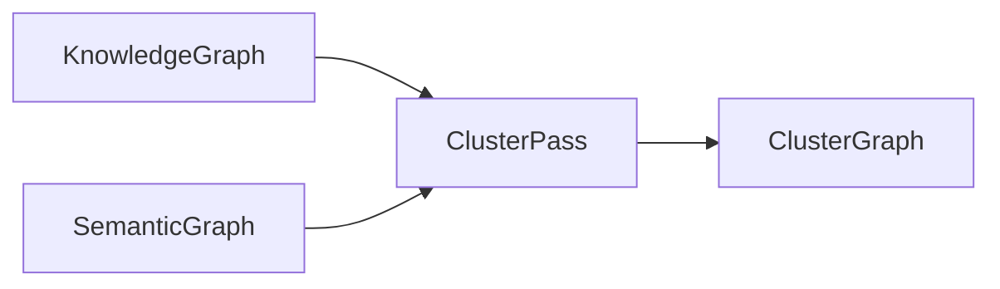

### Optimization Opportunities

| Technique | Description | Estimated Savings |
|-----------|-------------|-------------------|
| **Stochastic clustering** | Use approximate modularity optimization | 50% compute time |
| **Member list compression** | For large clusters, store member IDs as ranges | 40-60% memory |
| **Top-terms pruning** | Cap `topTerms` at 10 terms | Variable |
| **Hierarchy flattening** | Skip hierarchy levels beyond depth 3 | 30% nodes |
| **Distributed clustering** | For graphs > 1M nodes, use distributed Louvain | Scale-up |

---

## 12. Navigation Graph (NavigationGraph)

### Purpose

NavigationGraph is the **UI-facing IR** -- it encodes the navigation structure for the frontend. It defines pages, their hierarchy, related links, breadcrumbs, and recommendations. This is the only IR designed explicitly for rendering, not analysis.

**Producer:** `NavigationGraphBuilderPass`
**Consumer(s):** `Frontend (React/Vue)`, `API layer`

### Schema

```typescript
type PageType =
  | "TOPIC"
  | "CONCEPT"
  | "DOCUMENT"
  | "SECTION"
  | "SEARCH"
  | "CLUSTER"
  | "ENTITY"
  | "HUB"                      // Dashboard / landing page
  | "COLLECTION";              // Curated collection of pages

interface PageNode extends IRNode {
  type: "Page";
  title: string;
  path: string;                    // URL path e.g. "/topics/container-orchestration"
  pageType: PageType;
  originalId: UUID | null;         // Original IR node (null for synthetic pages)
  icon: string;                    // Icon identifier for UI
  description: string;
  badge: string | null;            // Optional badge text (e.g. "New", "Updated")
  isIndexed: boolean;              // Whether this page is included in search index
  isHidden: boolean;               // Whether to hide from nav (but still linkable)
  pinned: boolean;                 // Whether to show in sidebar by default
  metadata: {
    breadcrumb: Array<{
      id: UUID;
      title: string;
      path: string;
    }>;
    lastModified: UnixMs;
    wordCount: number;
    readingTimeMinutes: number;
    tags: string[];
  };
}

type NavigationEdgeType =
  | "nav-parent"                  // Parent-child in nav tree
  | "nav-child"                   // Inverse of nav-parent
  | "nav-next"                    // Next page in sequence
  | "nav-prev"                    // Previous page in sequence
  | "nav-related"                 // Related page (algorithmic)
  | "nav-recommended"             // Recommended page (personalization)
  | "nav-breadcrumb";             // Ancestor in breadcrumb trail

interface NavigationEdge extends IREdge {
  type: NavigationEdgeType;
  weight: number;                  // Relevance / priority score
}

interface NavigationGraph extends IRGraph<PageNode> {
  type: "NavigationGraph";
  totalPages: number;
  maxNavDepth: number;
  rootPageId: UUID;
  siteTitle: string;
  siteDescription: string;
  navVersion: number;
}
```

### Example

```json
{
  "type": "NavigationGraph",
  "totalPages": 156,
  "maxNavDepth": 4,
  "rootPageId": "page-hub",
  "siteTitle": "Knowledge Base",
  "siteDescription": "Technical documentation and knowledge base",
  "navVersion": 42,
  "nodes": {
    "page-hub": {
      "id": "page-hub",
      "type": "Page",
      "title": "Home",
      "path": "/",
      "pageType": "HUB",
      "originalId": null,
      "icon": "home",
      "description": "Knowledge base home page",
      "badge": null,
      "isIndexed": false,
      "isHidden": false,
      "pinned": true,
      "metadata": {
        "breadcrumb": [],
        "lastModified": 1720550400000,
        "wordCount": 0,
        "readingTimeMinutes": 0,
        "tags": []
      },
      "createdAt": 1720550401000,
      "version": 1
    },
    "page-deploy": {
      "id": "page-deploy",
      "type": "Page",
      "title": "Deployment Guide",
      "path": "/docs/deployment-guide",
      "pageType": "DOCUMENT",
      "originalId": "doc-deploy",
      "icon": "file-text",
      "description": "Guide for deploying applications to production",
      "badge": "Updated",
      "isIndexed": true,
      "isHidden": false,
      "pinned": false,
      "metadata": {
        "breadcrumb": [
          { "id": "page-hub", "title": "Home", "path": "/" },
          { "id": "page-docs", "title": "Documentation", "path": "/docs" }
        ],
        "lastModified": 1720550400000,
        "wordCount": 1842,
        "readingTimeMinutes": 9.2,
        "tags": ["deployment", "production", "guide"]
      },
      "createdAt": 1720550401001,
      "version": 1
    },
    "page-topic-containers": {
      "id": "page-topic-containers",
      "type": "Page",
      "title": "Container Orchestration",
      "path": "/topics/container-orchestration",
      "pageType": "TOPIC",
      "originalId": "topic-001",
      "icon": "layers",
      "description": "Container orchestration topics and related documentation",
      "badge": null,
      "isIndexed": true,
      "isHidden": false,
      "pinned": false,
      "metadata": {
        "breadcrumb": [
          { "id": "page-hub", "title": "Home", "path": "/" },
          { "id": "page-topics", "title": "Topics", "path": "/topics" }
        ],
        "lastModified": 1720550400000,
        "wordCount": 0,
        "readingTimeMinutes": 0,
        "tags": ["kubernetes", "containers", "docker"]
      },
      "createdAt": 1720550401002,
      "version": 1
    }
  },
  "edges": {
    "edge-nav-001": {
      "id": "edge-nav-001",
      "sourceId": "page-hub",
      "targetId": "page-docs",
      "type": "nav-child",
      "weight": 1,
      "metadata": { "order": 1 }
    },
    "edge-nav-002": {
      "id": "edge-nav-002",
      "sourceId": "page-docs",
      "targetId": "page-deploy",
      "type": "nav-child",
      "weight": 1,
      "metadata": { "order": 3 }
    },
    "edge-nav-003": {
      "id": "edge-nav-003",
      "sourceId": "page-deploy",
      "targetId": "page-topic-containers",
      "type": "nav-related",
      "weight": 0.85,
      "metadata": {
        "source": "topic-overlap",
        "confidence": 0.82
      }
    },
    "edge-nav-004": {
      "id": "edge-nav-004",
      "sourceId": "page-deploy",
      "targetId": "page-config-guide",
      "type": "nav-next",
      "weight": 1,
      "metadata": { "order": 1 }
    }
  },
  "adjacency": {
    "page-hub": ["edge-nav-001"],
    "page-docs": ["edge-nav-001", "edge-nav-002"],
    "page-deploy": ["edge-nav-002", "edge-nav-003", "edge-nav-004"],
    "page-topic-containers": ["edge-nav-003"],
    "page-config-guide": ["edge-nav-004"]
  }
}
```

### Invariants

| Invariant | Description |
|-----------|-------------|
| Tree for parent-child | `nav-parent`/`nav-child` edges must form a rooted tree (no cycles) |
| Breadcrumb correctness | Breadcrumb ancestors must form a valid path to root via `nav-parent` edges |
| Path uniqueness | `path` must be unique across all pages |
| Sequence consistency | `nav-next`/`nav-prev` edges are paired and no cycles exist in sequences |
| Page type validity | `pageType` must be an element of `PageType` |
| Original ID consistency | If `originalId` is non-null, it must reference a node in the source IR graph |

### Transformations

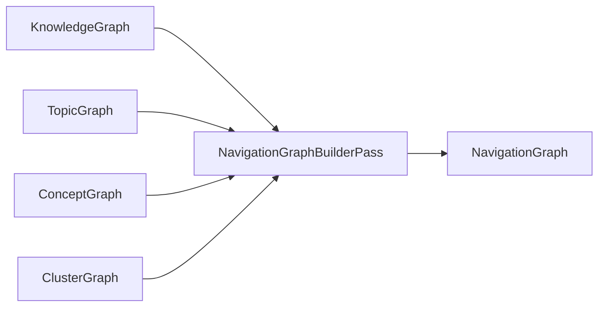

### Optimization Opportunities

| Technique | Description | Estimated Savings |
|-----------|-------------|-------------------|
| **Page compression** | Serialize NavigationGraph as a flat tree structure instead of full graph | 40-60% size |
| **Lazy breadcrumbs** | Generate breadcrumbs on-demand from parent chain instead of storing | 30% per page |
| **Related link pruning** | Limit `nav-related` edges to top-5 per page | 80% edges |
| **Edge deduplication** | Remove redundant edges (nav-child + nav-breadcrumb to same ancestor) | Variable |

---

## 13. Importance Graph (ImportanceGraph)

### Purpose

ImportanceGraph assigns centrality and importance scores to every node in the KnowledgeGraph. It runs multiple centrality algorithms and produces a unified importance score. This is used for ranking search results, prioritizing recommendations, and determining what content to feature.

**Producer:** `ImportanceScorerPass`
**Consumer(s):** `KnowledgeGraphBuilderPass`, `SearchGraphBuilderPass`, `RecommendationBuilderPass`, `NavigationGraphBuilderPass`

### Schema

```typescript
interface ImportanceNode extends IRNode {
  type: "ImportanceNode";
  originalId: UUID;
  originalType: NodeType;            // Preserved from source
  label: string;
  importance: number;                // Unified importance score [0, 1]
  centralityScores: {
    pagerank: number;
    degree: number;
    betweenness: number;
    eigenvector: number;
    closeness: number;
    harmonic: number;
  };
  normalizedScores: {
    pagerank: number;                // Min-max normalized across all nodes
    degree: number;
    betweenness: number;
    eigenvector: number;
  };
  rank: number;                      // Global importance rank (1 = most important)
  percentile: number;                // Importance percentile [0, 100]
  isHub: boolean;                    // High degree + high betweenness
  isAuthority: boolean;              // High PageRank from other hubs
}

type ImportanceEdgeType =
  | "influence-flow"                // Direction of importance propagation
  | "importance-correlation";       // Two nodes have correlated importance

interface ImportanceEdge extends IREdge {
  type: ImportanceEdgeType;
  weight: number;                    // Influence strength [0, 1]
}

interface ImportanceGraph extends IRGraph<ImportanceNode> {
  type: "ImportanceGraph";
  sourceGraph: string;               // Which KnowledgeGraph this is derived from
  algorithms: string[];              // Which algorithms were run
  scoreWeights: {
    pagerank: number;                // Weight for PageRank in unified score
    degree: number;
    betweenness: number;
    eigenvector: number;
    closeness: number;
  };
  topNodeIds: UUID[];                // Top 10 most important nodes
  distribution: {
    mean: number;
    median: number;
    stddev: number;
    p90: number;
    p99: number;
  };
}
```

### Example

```json
{
  "type": "ImportanceGraph",
  "sourceGraph": "KnowledgeGraph",
  "algorithms": ["pagerank", "degree", "betweenness", "eigenvector", "closeness"],
  "scoreWeights": {
    "pagerank": 0.35,
    "degree": 0.20,
    "betweenness": 0.25,
    "eigenvector": 0.10,
    "closeness": 0.10
  },
  "topNodeIds": ["imp-001", "imp-002", "imp-003"],
  "distribution": {
    "mean": 0.12,
    "median": 0.08,
    "stddev": 0.15,
    "p90": 0.34,
    "p99": 0.72
  },
  "nodes": {
    "imp-001": {
      "id": "imp-001",
      "type": "ImportanceNode",
      "originalId": "ent-001",
      "originalType": "Entity",
      "label": "Kubernetes",
      "importance": 0.92,
      "centralityScores": {
        "pagerank": 0.0842,
        "degree": 0.67,
        "betweenness": 0.45,
        "eigenvector": 0.72,
        "closeness": 0.63,
        "harmonic": 0.68
      },
      "normalizedScores": {
        "pagerank": 0.92,
        "degree": 0.88,
        "betweenness": 0.76,
        "eigenvector": 0.91
      },
      "rank": 1,
      "percentile": 99.5,
      "isHub": true,
      "isAuthority": true,
      "metadata": {},
      "createdAt": 1720550401100,
      "version": 1
    },
    "imp-002": {
      "id": "imp-002",
      "type": "ImportanceNode",
      "originalId": "doc-deploy",
      "originalType": "Document",
      "label": "Deployment Guide",
      "importance": 0.78,
      "centralityScores": {
        "pagerank": 0.0621,
        "degree": 0.52,
        "betweenness": 0.38,
        "eigenvector": 0.45,
        "closeness": 0.51,
        "harmonic": 0.55
      },
      "normalizedScores": {
        "pagerank": 0.78,
        "degree": 0.72,
        "betweenness": 0.65,
        "eigenvector": 0.70
      },
      "rank": 4,
      "percentile": 95.2,
      "isHub": false,
      "isAuthority": true,
      "metadata": {},
      "createdAt": 1720550401101,
      "version": 1
    }
  },
  "edges": {
    "edge-imp-001": {
      "id": "edge-imp-001",
      "sourceId": "imp-001",
      "targetId": "imp-002",
      "type": "influence-flow",
      "weight": 0.85,
      "metadata": {
        "basis": "co-occurrence",
        "coOccurrenceCount": 28
      }
    }
  },
  "adjacency": {
    "imp-001": ["edge-imp-001"],
    "imp-002": ["edge-imp-001"]
  }
}
```

### Invariants

| Invariant | Description |
|-----------|-------------|
| Score bounds | All centrality scores are in [0, 1] |
| Importance bounds | Unified `importance` in [0, 1] |
| Rank uniqueness | `rank` values are dense and non-overlapping |
| Percentile bounds | `percentile` in [0, 100] |
| Weight normalization | `sum(scoreWeights.values)` must equal 1.0 |
| Hub/authority mutual exclusion | A node can be both a hub and authority, but `isHub` requires high degree |
| Distribution consistency | `p90 >= p50 >= mean`, etc. |

### Transformations

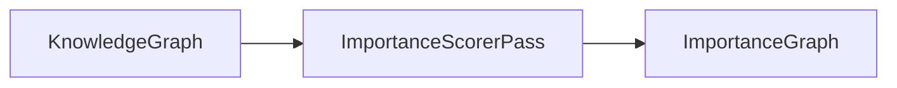

### Optimization Opportunities

| Technique | Description | Estimated Savings |
|-----------|-------------|-------------------|
| **Approximate betweenness** | Use Brandes algorithm with k-sampling instead of exact | 80-95% compute |
| **Incremental PageRank** | Reuse previous PageRank vector as initialization | 50% iterations |
| **Score caching** | Cache centrality scores keyed by graph hash | Variable |
| **Top-k only** | Only compute for nodes above degree threshold | 20% nodes |

---

## 14. Dependency Graph (DependencyGraph)

### Purpose

DependencyGraph tracks compilation dependencies for incremental builds. Every node records its content hash and which other nodes it depends on. The cache layer uses this to determine invalidation: if a node's content hash changes, all downstream dependents are invalidated and must be recomputed.

**Producer:** `DependencyTrackerPass` (runs alongside all other passes)
**Consumer(s):** `CacheLayer`, `IncrementalBuildOrchestrator`

### Schema

```typescript
type DependencyNodeType = "DependencyFile" | "DependencyIRNode" | "DependencyPass";

interface DependencyFileNode extends IRNode {
  type: "DependencyFile";
  filePath: string;
  contentType: string;               // e.g. "markdown", "json", "config"
  contentHash: ContentHash;
  fileSize: number;
  lastModified: UnixMs;
  isExternal: boolean;               // Outside the repo (e.g., npm package)
}

interface DependencyIRNode extends IRNode {
  type: "DependencyIRNode";
  irName: string;                    // e.g. "DocAST", "SectionGraph"
  nodeType: string;                  // Node type within that IR
  originalId: UUID;
  contentHash: ContentHash;
  sourceFileId: UUID;                // Links to DependencyFileNode
}

interface DependencyPassNode extends IRNode {
  type: "DependencyPass";
  passName: string;                  // e.g. "SectionExtractorPass"
  passVersion: string;               // Implementation version
  inputIRs: string[];                // e.g. ["DocAST"]
  outputIR: string;                  // e.g. "SectionGraph"
  duration: number;                  // Execution time in ms
}

type DependencyEdgeType =
  | "depends-on"                    // A depends on B (A uses B in its computation)
  | "derives-from"                  // A is derived from B (inverse)
  | "depends-file"                  // A depends on a source file
  | "pass-produces"                 // A pass produces an IR
  | "pass-consumes";                // A pass consumes an IR

interface DependencyGraph extends IRGraph<DependencyFileNode | DependencyIRNode | DependencyPassNode> {
  type: "DependencyGraph";
  buildId: string;                   // Unique build identifier
  startTime: UnixMs;
  endTime: UnixMs;
  isIncremental: boolean;
  rootFiles: UUID[];                 // Top-level source files
  changedFiles: UUID[];              // Files that changed since last build
  invalidatedNodes: UUID[];          // Nodes invalidated by changes
  recomputedPasses: UUID[];          // Passes that were re-run
  cachedPasses: UUID[];              // Passes that were skipped (cache hit)
}
```

### Example

```json
{
  "type": "DependencyGraph",
  "buildId": "build-20240709-001",
  "startTime": 1720550400000,
  "endTime": 1720550402000,
  "isIncremental": true,
  "rootFiles": ["dep-file-001", "dep-file-002"],
  "changedFiles": ["dep-file-002"],
  "invalidatedNodes": ["dep-ir-003", "dep-ir-005"],
  "recomputedPasses": ["dep-pass-002", "dep-pass-003"],
  "cachedPasses": ["dep-pass-001"],
  "nodes": {
    "dep-file-001": {
      "id": "dep-file-001",
      "type": "DependencyFile",
      "filePath": "/docs/guides/deployment.md",
      "contentType": "markdown",
      "contentHash": { "algorithm": "sha256", "hash": "a1b2c3..." },
      "fileSize": 12450,
      "lastModified": 1720550400000,
      "isExternal": false,
      "metadata": {},
      "createdAt": 1720550401200,
      "version": 1
    },
    "dep-file-002": {
      "id": "dep-file-002",
      "type": "DependencyFile",
      "filePath": "/docs/guides/configuration.md",
      "contentType": "markdown",
      "contentHash": { "algorithm": "sha256", "hash": "d4e5f6..." },
      "fileSize": 8920,
      "lastModified": 1720550400000,
      "isExternal": false,
      "metadata": {},
      "createdAt": 1720550401201,
      "version": 1
    },
    "dep-ir-001": {
      "id": "dep-ir-001",
      "type": "DependencyIRNode",
      "irName": "DocAST",
      "nodeType": "Document",
      "originalId": "doc-deploy",
      "contentHash": { "algorithm": "sha256", "hash": "b2c3d4..." },
      "sourceFileId": "dep-file-001",
      "metadata": {},
      "createdAt": 1720550401202,
      "version": 1
    },
    "dep-pass-001": {
      "id": "dep-pass-001",
      "type": "DependencyPass",
      "passName": "SectionExtractorPass",
      "passVersion": "1.2.0",
      "inputIRs": ["DocAST"],
      "outputIR": "SectionGraph",
      "duration": 145,
      "metadata": {},
      "createdAt": 1720550401203,
      "version": 1
    }
  },
  "edges": {
    "edge-dep-001": {
      "id": "edge-dep-001",
      "sourceId": "dep-ir-001",
      "targetId": "dep-file-001",
      "type": "depends-file",
      "weight": 1,
      "metadata": { "relationship": "parsed-from" }
    },
    "edge-dep-002": {
      "id": "edge-dep-002",
      "sourceId": "dep-pass-001",
      "targetId": "dep-ir-001",
      "type": "pass-consumes",
      "weight": 1,
      "metadata": {}
    }
  },
  "adjacency": {
    "dep-ir-001": ["edge-dep-001"],
    "dep-file-001": ["edge-dep-001"],
    "dep-pass-001": ["edge-dep-002"]
  }
}
```

### Invariants

| Invariant | Description |
|-----------|-------------|
| Acyclic dependency | `depends-on` edges must form a DAG (no circular dependencies) |
| Content hash determinism | Same file content must always produce the same `contentHash` |
| File consistency | Every `DependencyIRNode.sourceFileId` must reference an existing `DependencyFileNode` |
| Pass I/O consistency | A pass consuming IR X must have X listed in `inputIRs` |
| Build ID uniqueness | Each build produces a unique `buildId` |
| Time ordering | `startTime <= endTime` and `dep-pass.duration <= endTime - startTime` |
| Cache validity | `cachedPasses` + `recomputedPasses` must equal all passes in the pipeline |

### Transformations

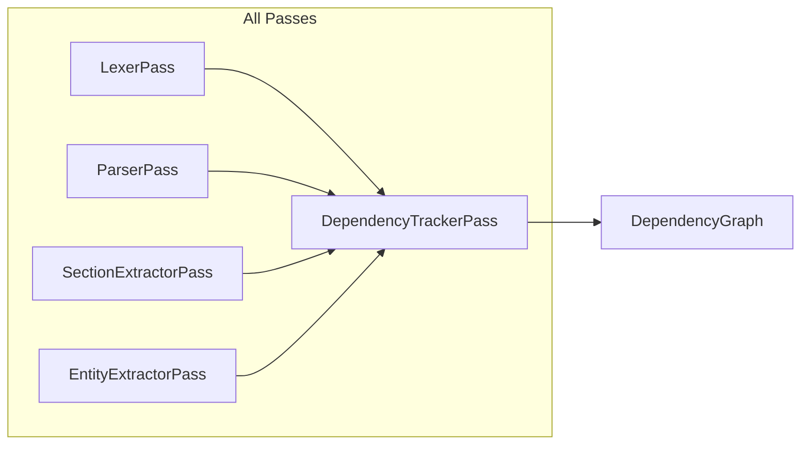

### Optimization Opportunities

| Technique | Description | Estimated Savings |
|-----------|-------------|-------------------|
| **Skip unchanged subtrees** | If entire file tree is unchanged, skip all passes | 100% of passes |
| **Fine-grained invalidation** | Track at node level instead of IR level | 30-60% fewer recomputations |
| **Content hash caching** | Cache file hashes across builds (using mtime + size heuristic) | 90% fewer file reads |
| **Pass version pinning** | Only invalidate dependent nodes if pass version changed | Variable |

---

## 15. Search Graph (SearchGraph)

### Purpose

SearchGraph is the optimized search-oriented IR containing inverted indexes, vector indexes, keyword indexes, and faceted index metadata. This is the primary IR for the search pass and is designed for fast query-time lookups.

**Producer:** `SearchIndexerPass`
**Consumer(s):** `SearchService (runtime)`, `API layer`

### Schema

```typescript
// --- Index Structures ---

interface InvertedIndexEntry {
  term: string;
  documentFrequency: number;           // Number of documents containing this term
  postings: Array<{
    nodeId: UUID;
    termFrequency: number;              // Occurrences in this node
    positions: number[];                // Character offsets (optional, for snippets)
    field: string;                      // e.g. "title", "content", "code", "heading"
    weight: number;                     // Field-specific weight
  }>;
}

interface VectorIndexEntry {
  nodeId: UUID;
  embedding: EmbeddingVector;
  metadata: {
    label: string;
    nodeType: NodeType;
    importance: number;
  };
}

interface KeywordIndexEntry {
  keyword: string;
  nodeIds: UUID[];
  relevance: number;                  // [0, 1] keyword relevance to each node
}

interface FacetMetadata {
  field: string;
  type: "string" | "number" | "date" | "boolean" | "enum";
  cardinality: number;
  values: Map<string, number>;        // value -> count
  hierarchy?: string[];               // For hierarchical facets (e.g. location)
}

// --- Nodes ---

type SearchNodeType = "SearchIndexMetadata" | "SearchQuery";

interface SearchIndexMetadataNode extends IRNode {
  type: "SearchIndexMetadata";
  indexType: "inverted" | "vector" | "keyword" | "faceted";
  entryCount: number;
  totalTokens: number;
  vocabularySize: number;
  avgPostingsPerTerm: number;
}

interface SearchQueryNode extends IRNode {
  type: "SearchQuery";
  query: string;
  parsedQuery: {
    tokens: string[];
    operators: Array<{ type: string; field?: string }>;
    filters: Record<string, unknown>;
  };
  results: Array<{
    nodeId: UUID;
    score: number;
    rank: number;
  }>;
}

// --- Edge Types ---

type SearchEdgeType =
  | "index-entry"                    // Links metadata to index data
  | "query-result"                   // Links query to its results
  | "term-correlation";              // Terms that frequently co-occur in queries

interface SearchGraph extends IRGraph<SearchIndexMetadataNode | SearchQueryNode> {
  type: "SearchGraph";
  invertedIndex: Map<string, InvertedIndexEntry>;
  vectorIndex: VectorIndexEntry[];        // Flat array for ANN index
  vectorIndexConfig: {
    algorithm: string;                     // e.g. "hnsw", "ivf-pq", "flat"
    dimension: number;
    metric: string;                        // "cosine" | "euclidean" | "dot"
    indexParams: Record<string, unknown>;
  };
  keywordIndex: Map<string, KeywordIndexEntry>;
  facets: FacetMetadata[];
  searchableFields: string[];
  boostConfig: {
    title: number;                         // Boost multiplier
    heading: number;
    content: number;
    code: number;
    entity: number;
  };
  stopWords: Set<string>;
  stemmer: string;                         // e.g. "porter", "snowball"
}
```

### Example

```json
{
  "type": "SearchGraph",
  "invertedIndex": {
    "kubernetes": {
      "term": "kubernetes",
      "documentFrequency": 18,
      "postings": [
        {
          "nodeId": "kg-doc-001",
          "termFrequency": 12,
          "positions": [142, 389, 567],
          "field": "content",
          "weight": 1.0
        },
        {
          "nodeId": "kg-ent-001",
          "termFrequency": 1,
          "positions": [0],
          "field": "title",
          "weight": 3.0
        }
      ]
    }
  },
  "vectorIndex": [
    {
      "nodeId": "semdoc-001",
      "embedding": { "model": "text-embedding-3-small", "dimensions": 1536, "values": [0.023, -0.045, 0.112] },
      "metadata": { "label": "Deployment Guide", "nodeType": "Document", "importance": 0.78 }
    }
  ],
  "vectorIndexConfig": {
    "algorithm": "hnsw",
    "dimension": 1536,
    "metric": "cosine",
    "indexParams": { "M": 16, "efConstruction": 200, "efSearch": 50 }
  },
  "keywordIndex": {
    "container orchestration": {
      "keyword": "container orchestration",
      "nodeIds": ["kg-doc-001", "kg-doc-003", "kg-ent-001"],
      "relevance": 0.92
    }
  },
  "facets": [
    {
      "field": "nodeType",
      "type": "enum",
      "cardinality": 5,
      "values": { "Document": 14, "Section": 89, "Entity": 234, "Concept": 56, "Topic": 24 }
    },
    {
      "field": "entityType",
      "type": "enum",
      "cardinality": 8,
      "values": { "TECHNOLOGY": 67, "CONCEPT": 52, "ORG": 41, "PRODUCT": 29, "LOC": 18 }
    },
    {
      "field": "importance",
      "type": "number",
      "cardinality": 100,
      "values": {}
    }
  ],
  "searchableFields": ["title", "heading", "content", "code", "entity", "concept"],
  "boostConfig": {
    "title": 3.0,
    "heading": 2.0,
    "content": 1.0,
    "code": 0.5,
    "entity": 2.5
  },
  "stopWords": ["the", "a", "an", "in", "on", "at", "for", "to", "is", "was"],
  "stemmer": "snowball",
  "nodes": {},
  "edges": {},
  "adjacency": {}
}
```

### Invariants

| Invariant | Description |
|-----------|-------------|
| Posting node validity | Every `postings[*].nodeId` in the inverted index must exist in the KnowledgeGraph |
| Vector dimension consistency | All vector index entries must have identical `dimensions` |
| Facet consistency | Facet values must aggregate correctly from the underlying data |
| Boost positivity | All boost values must be > 0 |
| Term normalization | All index terms must be lowercased and stemmed |
| Stop word exclusion | No term in the inverted index is a stop word |
| Document frequency bound | `documentFrequency <= totalDocuments` |

### Transformations

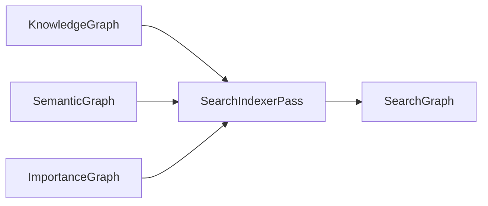

### Optimization Opportunities

| Technique | Description | Estimated Savings |
|-----------|-------------|-------------------|
| **Index pruning** | Remove terms with document frequency < 2 | 20-40% index size |
| **Position skipping** | Omit positions when snippet generation is not required | 60% index size |
| **Posting list compression** | Use Varint-GB or Simple9 encoding | 50-70% index size |
| **Vector quantization** | Use product quantization (PQ) for vector index | 80-90% vector index size |
| **Stop word expansion** | Aggressive stop word list for domain-specific corpus | 15-25% index size |
| **Tiered indexing** | Separate hot (high importance) and cold (low importance) indexes | Faster queries |

---

## 16. Recommendation Graph (RecommendationGraph)

### Purpose

RecommendationGraph pre-computes recommendations for every content node. It combines multiple recommendation strategies (semantic similarity, co-viewing, concept relatedness, importance correlation) into unified recommendation scores. Top-k recommendations are pre-computed for every node.

**Producer:** `RecommendationBuilderPass`
**Consumer(s):** `API layer`, `Frontend (render recommendations)`

### Schema

```typescript
type RecommendationNodeType = "RecommendableContent";

interface RecommendableContentNode extends IRNode {
  type: "RecommendableContent";
  originalId: UUID;
  originalType: NodeType;
  label: string;
  description: string;
  importanceScore: number;             // From ImportanceGraph
  embedding?: EmbeddingVector;
  tags: string[];
  contentType: string;                 // e.g. "guide", "reference", "tutorial", "concept"
  popularity: number;                  // Normalized view/usage count [0, 1]
  recency: number;                     // How recently updated [0, 1]
}

type RecommendationEdgeType =
  | "recommends"                      // Primary recommendation with unified score
  | "also-viewed"                     // Collaborative filtering signal
  | "semantically-similar"            // Embedding similarity
  | "concept-related"                 // Shares concepts
  | "topic-related"                   // Shares topics
  | "complementary"                   // Fills knowledge gap (prerequisite/next)
  | "trending";                       // Temporarily popular

interface RecommendationEdge extends IREdge {
  type: RecommendationEdgeType;
  weight: number;                      // [0, 1] recommendation confidence
  metadata: {
    strategy: string;                  // Which strategy produced this edge
    strategyWeight: number;            // Contribution of this strategy to final score
    reasoning: string[];               // Human-readable reasons
    diversityBonus?: number;           // Diversity adjustment
  };
}

interface RecommendationGraph extends IRGraph<RecommendableContentNode> {
  type: "RecommendationGraph";
  strategies: string[];                // Active recommendation strategies
  topK: number;                        // Max recommendations per node
  diversityFactor: number;             // [0, 1] how much to penalize similar recs
  recencyWeight: number;               // Weight for recency in scoring
  popularityWeight: number;            // Weight for popularity in scoring
  minScore: number;                    // Minimum score to include a recommendation
  totalRecommendations: number;
}
```

### Example

```json
{
  "type": "RecommendationGraph",
  "strategies": ["semantic", "concept", "topic", "collaborative"],
  "topK": 10,
  "diversityFactor": 0.3,
  "recencyWeight": 0.1,
  "popularityWeight": 0.15,
  "minScore": 0.1,
  "totalRecommendations": 1420,
  "nodes": {
    "rec-001": {
      "id": "rec-001",
      "type": "RecommendableContent",
      "originalId": "doc-deploy",
      "originalType": "Document",
      "label": "Deployment Guide",
      "description": "Guide for deploying applications to production",
      "importanceScore": 0.78,
      "tags": ["deployment", "production", "kubernetes", "docker"],
      "contentType": "guide",
      "popularity": 0.85,
      "recency": 0.72,
      "metadata": {},
      "createdAt": 1720550401300,
      "version": 1
    },
    "rec-002": {
      "id": "rec-002",
      "type": "RecommendableContent",
      "originalId": "doc-monitoring",
      "originalType": "Document",
      "label": "Monitoring & Observability Guide",
      "description": "Setting up monitoring and observability for production systems",
      "importanceScore": 0.65,
      "tags": ["monitoring", "observability", "prometheus", "grafana"],
      "contentType": "guide",
      "popularity": 0.72,
      "recency": 0.91,
      "metadata": {},
      "createdAt": 1720550401301,
      "version": 1
    }
  },
  "edges": {
    "edge-rec-001": {
      "id": "edge-rec-001",
      "sourceId": "rec-001",
      "targetId": "rec-002",
      "type": "recommends",
      "weight": 0.84,
      "metadata": {
        "strategy": "hybrid",
        "strategyWeight": 0.42,
        "reasoning": [
          "Semantically similar (cosine: 0.76)",
          "Shares concepts: Kubernetes, Prometheus",
          "Complementary: deployment -> monitoring workflow"
        ],
        "diversityBonus": 0.05
      }
    },
    "edge-rec-002": {
      "id": "edge-rec-002",
      "sourceId": "rec-001",
      "targetId": "rec-003",
      "type": "also-viewed",
      "weight": 0.62,
      "metadata": {
        "strategy": "collaborative",
        "strategyWeight": 0.31,
        "reasoning": ["Users who viewed this also viewed Configuration Guide"]
      }
    }
  },
  "adjacency": {
    "rec-001": ["edge-rec-001", "edge-rec-002"],
    "rec-002": ["edge-rec-001"],
    "rec-003": ["edge-rec-002"]
  }
}
```

### Invariants

| Invariant | Description |
|-----------|-------------|
| No self-recommendation | A node must not recommend itself |
| Score bounds | All `weight` values in [0, 1] |
| Top-k consistency | Each node has at most `topK` outgoing `recommends` edges |
| Strategy contribution | `sum(edge.metadata.strategyWeight)` for a node's top-k approx = 1.0 |
| Diversity bonus bound | `diversityBonus` in [-0.5, 0.5] |
| Popularity/recency bounds | Both `popularity` and `recency` in [0, 1] |
| Asymmetric recommendations | Edge from A->B does not imply B->A (recommendation may not be symmetric) |

### Transformations

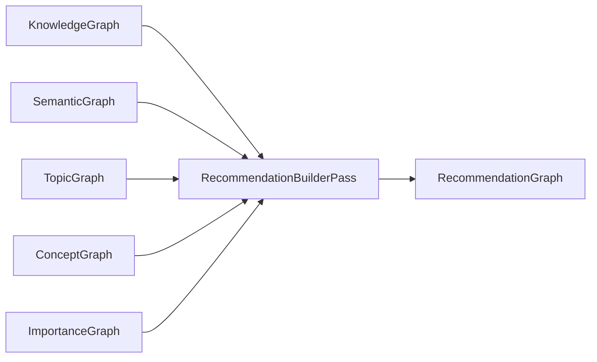

### Optimization Opportunities

| Technique | Description | Estimated Savings |
|-----------|-------------|-------------------|
| **Lazy recommendation** | Compute top-k on-demand instead of pre-computing all pairs | 90% compute (cold start) |
| **Matrix factorization** | Use SVD/ALS instead of pairwise similarity | 60% compute (for collaborative) |
| **Approximate nearest neighbor** | Use ANN for semantic strategy | 90% compute (for semantic) |
| **Cluster-based pruning** | Only recommend within same cluster (plus boundary items) | 80% candidate pairs |
| **Caching popular results** | Cache frequently requested recommendation sets | Variable |

---

## 17. Transformation Pipeline

The following Mermaid diagram shows the complete transformation chain from raw Markdown to all optimized output IRs.

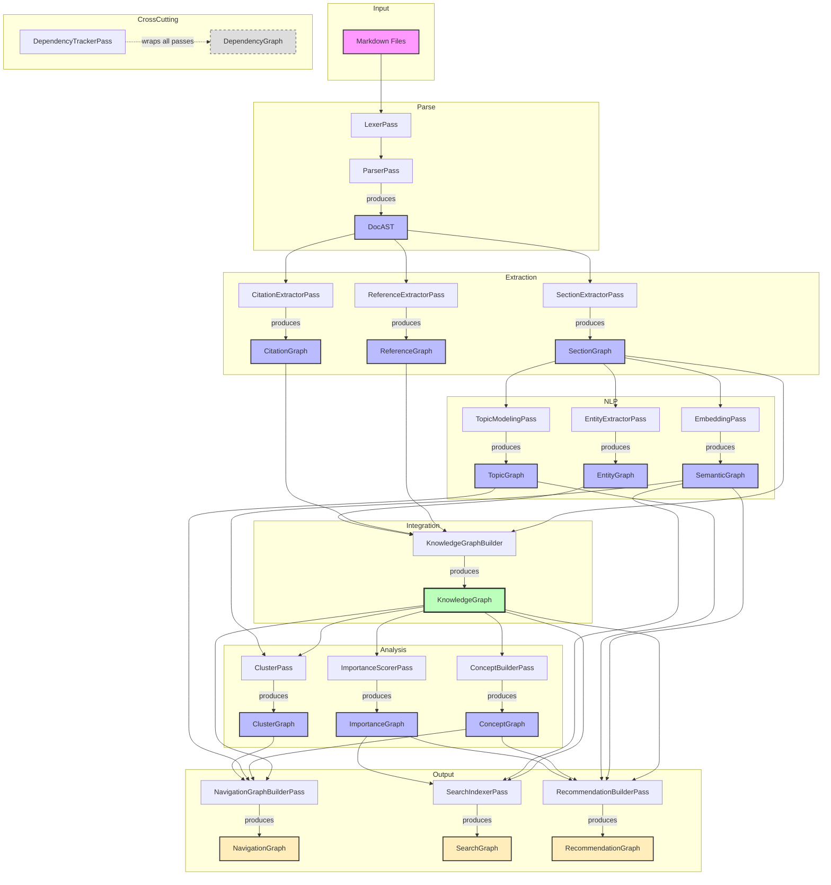

### Pass Ordering & Parallelism

The compiler organizes passes into phases with explicit parallelism:

| Phase | Passes | Parallelism |
|-------|--------|-------------|
| **Parse** | `LexerPass` -> `ParserPass` | Sequential (lex -> parse per file) |
| **Extract** | `SectionExtractorPass`, `ReferenceExtractorPass`, `CitationExtractorPass` | Parallel (depends only on DocAST) |
| **NLP** | `EntityExtractorPass`, `TopicModelingPass`, `EmbeddingPass` | Parallel (depends only on SectionGraph) |
| **Integrate** | `KnowledgeGraphBuilderPass` | Single (merges all extraction IRs) |
| **Analyze** | `ConceptBuilderPass`, `ImportanceScorerPass`, `ClusterPass` | Parallel (depends on KnowledgeGraph) |
| **Build** | `NavigationGraphBuilderPass`, `SearchIndexerPass`, `RecommendationBuilderPass` | Parallel (depends on KnowledgeGraph + analysis IRs) |

### Incremental Build Strategy

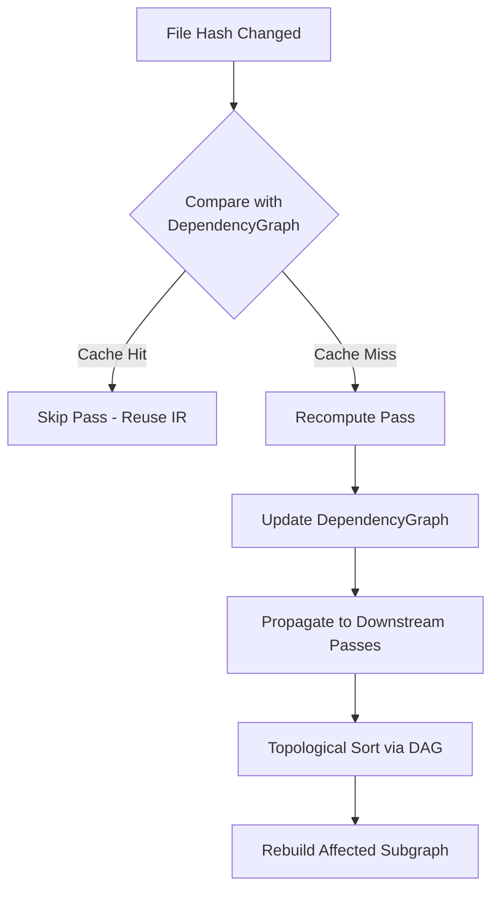

---

## 18. Cache Invalidation & Versioning

All IRs participate in a content-addressed caching system:

### Cache Key

```
cache_key = SHA256(concat(
  passName,
  passVersion,
  sorted(inputContentHashes),
  configHash
))
```

### Invalidation Rules

| Change Type | Cache Invalidation Scope |
|-------------|--------------------------|
| File content changed | Invalidate DocAST for that file -> cascade downstream |
| File added/removed | Same as content change + update document index |
| Pass version changed | Invalidate all output of that pass |
| Configuration changed | Invalidate all downstream of changed config |
| External dependency change | Invalidate affected ReferenceGraph nodes |

### IR Version Migration

When the IR schema version increments, the compiler runs a migration pass:

```typescript
interface IRMigration {
  fromVersion: number;
  toVersion: number;
  irName: string;
  migrate(node: IRNode): IRNode;
}
```

Migrations are applied lazily -- only when a cached IR is loaded and its version is stale.

---

## Appendix A: IR Inventory

| # | IR Name | Node Count | Edge Count | Primary Pass | Schema Version |
|---|---------|-----------|------------|-------------|----------------|
| 1 | DocAST | 42/file | 0 | ParserPass | 1 |
| 2 | SectionGraph | ~10x documents | 0 | SectionExtractorPass | 1 |
| 3 | CitationGraph | ~2x documents | variable | CitationExtractorPass | 1 |
| 4 | EntityGraph | hundreds | thousands | EntityExtractorPass | 1 |
| 5 | ReferenceGraph | ~3x documents | ~2x links | ReferenceExtractorPass | 1 |
| 6 | KnowledgeGraph | Sum(1-5) | Sum(1-5) | KnowledgeGraphBuilderPass | 1 |
| 7 | ConceptGraph | hundreds | hundreds | ConceptBuilderPass | 1 |
| 8 | TopicGraph | 10-50 | ~100 | TopicModelingPass | 1 |
| 9 | SemanticGraph | hundreds | thousands | EmbeddingPass | 1 |
| 10 | ClusterGraph | 5-50 | variable | ClusterPass | 1 |
| 11 | NavigationGraph | hundreds | thousands | NavigationGraphBuilderPass | 1 |
| 12 | ImportanceGraph | Sum(6) | Sum(6) | ImportanceScorerPass | 1 |
| 13 | DependencyGraph | Sum(all files+passes) | Sum(dependencies) | DependencyTrackerPass | 1 |
| 14 | SearchGraph | vocabulary | index-size | SearchIndexerPass | 1 |
| 15 | RecommendationGraph | hundreds | thousands | RecommendationBuilderPass | 1 |

## Appendix B: Glossary

| Term | Definition |
|------|-----------|
| **IR** | Intermediate Representation -- a structured data model produced by one compiler pass and consumed by another |
| **Pass** | A single transformation step in the compiler pipeline |
| **Node** | An entity in a graph IR, typed by the `type` discriminator |
| **Edge** | A typed, weighted relationship between two nodes |
| **Adjacency** | The set of edges incident to a given node |
| **Content Hash** | A cryptographic hash (SHA-256) of serialized content used for cache invalidation |
| **DocAST** | Document Abstract Syntax Tree -- the parsed tree of a Markdown document |
| **Section** | A contiguous block of content under a heading |
| **Entity** | A named entity (person, place, technology, etc.) extracted from text |
| **Concept** | An abstract idea or category in the domain taxonomy |
| **Topic** | A discovered theme via topic modeling (LDA, BERTopic, etc.) |
| **Embedding** | A dense vector representation of text content |
| **Cluster** | A group of related nodes found via graph community detection |
| **Centrality** | A measure of a node's importance in a graph (PageRank, degree, etc.) |
| **Incremental Build** | A build that only recomputes IRs affected by changed inputs |
| **Pass Version** | A semantic version string for a compiler pass implementation |
| **Content-Addressed Cache** | A cache keyed by content hash rather than file path |
