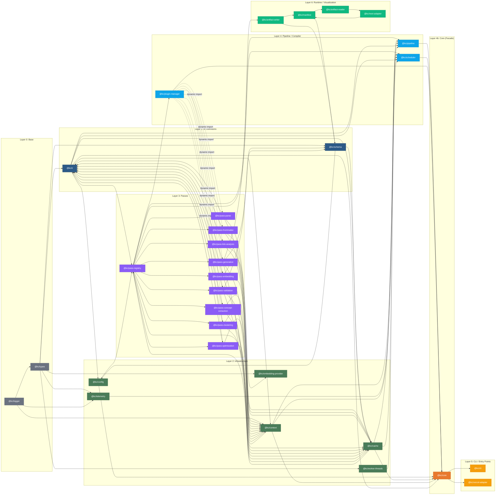
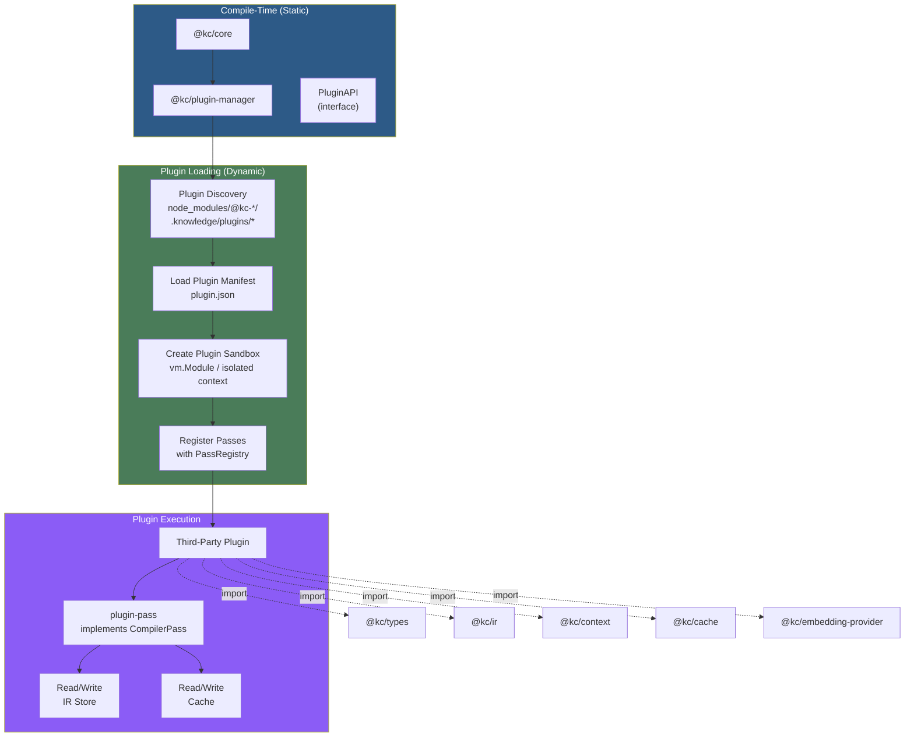

# Knowledge Compiler — Module Dependency Architecture

**Document Version:** 1.0.0  
**Audience:** Senior Compiler Engineers, Infrastructure Engineers  
**Last Updated:** 2026-07-10

---

## 1. Module Map

### 1.1 Module Directory Index

Every package/module in the project, its location, purpose, and public surface.

| # | Module | Path | Purpose | Public Surface |
|---|--------|------|---------|----------------|
| 1 | **core** | `packages/core/` | Compiler orchestrator, context, IR store, error propagation | `Compiler`, `CompilerContext`, `IRStore`, `CompilerConfig`, `CompilerResult`, `CompilerPhase` |
| 2 | **cli** | `packages/cli/` | CLI entry point, argument parsing, help output | `main()`, `runCLI()` |
| 3 | **config** | `packages/config/` | Config loading, merging, validation | `loadConfig()`, `CompilerConfig` (Zod schema), `mergeConfigs()`, `ConfigValidator` |
| 4 | **pipeline** | `packages/pipeline/` | Pipeline orchestration, phase management | `PipelineOrchestrator`, `CompilerPhase`, `PhaseHook`, `ExecutionStrategy` |
| 5 | **scheduler** | `packages/scheduler/` | Task scheduling, dependency resolution, parallel execution | `Scheduler`, `SchedulerConfig`, `PassNode`, `WorkerPool`, `ExecutionResult` |
| 6 | **context** | `packages/context/` | Compiler context (shared thread-safe state) | `CompilerContext`, `ReadonlyCompilerContext`, `SharedMap`, `AtomicCounter`, `ErrorCollector` |
| 7 | **cache** | `packages/cache/` | Two-level content-addressable cache | `CacheController`, `CacheEntry`, `L1MemoryCache`, `L2DiskCache`, `CachePolicy` |
| 8 | **ir** | `packages/ir/` | IR type definitions, graph containers, serialization | `IRNode`, `IREdge`, `IRGraph`, all IR types (`DocAST`, `SectionGraph`, `KnowledgeGraph`, etc.), `EmbeddingStore`, `EdgeStore` |
| 9 | **schema** | `packages/schema/` | Zod schemas for all artifacts and IRs | Zod schemas: `knowledgeGraphSchema`, `sectionIndexSchema`, `conceptIndexSchema`, `clusterIndexSchema`, `manifestSchema`, `embeddingSchema` |
| 10 | **pass-registry** | `packages/pass-registry/` | Global pass registry, pass descriptor management | `PassRegistry`, `PassDescriptor`, `registerPass()`, `getPass()`, `getAllPasses()` |
| 11 | **pass-parse** | `packages/pass-parse/` | Glob resolution, file reading, Markdown parsing | `GlobResolverPass`, `FileReaderPass`, `FrontmatterParserPass`, `MDASTParserPass` |
| 12 | **pass-frontmatter** | `packages/pass-frontmatter/` | Frontmatter extraction and validation | `FrontmatterParserPass`, `FrontmatterConfig` |
| 13 | **pass-link-analysis** | `packages/pass-link-analysis/` | Link and reference extraction, link classification | `LinkExtractorPass`, `ReferenceResolver`, `LinkClassifier` |
| 14 | **pass-embedding** | `packages/pass-embedding/` | Text chunking, embedding generation, dimension reduction | `TextChunkerPass`, `EmbeddingGeneratorPass`, `DimensionReducerPass` |
| 15 | **pass-clustering** | `packages/pass-clustering/` | Similarity matrix, HDBSCAN clustering, centroid calculation | `SimilarityMatrixPass`, `ClusterAssignerPass`, `CentroidCalculatorPass` |
| 16 | **pass-concept-extraction** | `packages/pass-concept-extraction/` | Entity extraction, keyword extraction, concept hierarchy | `EntityExtractorPass`, `KeywordExtractorPass`, `ConceptHierarchyPass` |
| 17 | **pass-optimization** | `packages/pass-optimization/` | Pruning, deduplication, compression | `PruningPass`, `DeduplicationPass`, `CompressionPass` |
| 18 | **pass-generation** | `packages/pass-generation/` | Artifact serialization, manifest building | `ArtifactSerializerPass`, `ManifestBuilderPass` |
| 19 | **pass-validation** | `packages/pass-validation/` | Schema validation of outputs | `SchemaValidatorPass`, `CrossFileValidator` |
| 20 | **artifact-writer** | `packages/artifact-writer/` | File system output, atomic writes | `ArtifactWriter`, `AtomicWriteProtocol`, `OutputDirectory` |
| 21 | **artifact-reader** | `packages/artifact-reader/` | File system input for Next.js runtime | `ArtifactReader`, `ManifestLoader`, `createKnowledgeLoader()` |
| 22 | **manifest** | `packages/manifest/` | Artifact manifest generation and reading | `ManifestBuilder`, `Manifest`, `ManifestEntry`, `ManifestValidator` |
| 23 | **next-adapter** | `packages/next-adapter/` | Next.js integration plugin | `withKnowledgeCompiler()`, `KnowledgeLoader`, `NextConfigPlugin` |
| 24 | **vercel-adapter** | `packages/vercel-adapter/` | Vercel deployment integration | `withVercelDeploy()`, `VercelOutputConfig` |
| 25 | **plugin-manager** | `packages/plugin-manager/` | Plugin loading, lifecycle, dependency resolution | `PluginManager`, `PluginManifest`, `PluginAPI`, `PluginLoader`, `PluginSandbox` |
| 26 | **embedding-provider** | `packages/embedding-provider/` | Embedding API client (OpenAI, Azure, custom) | `EmbeddingProvider`, `OpenAIProvider`, `AzureProvider`, `RateLimiter`, `RetryHandler`, `FallbackStrategy` |
| 27 | **worker-threads** | `packages/worker-threads/` | Worker pool abstraction | `WorkerPool`, `WorkerTask`, `WorkerResult`, `SharedBuffer`, `ThreadMessage` |
| 28 | **telemetry** | `packages/telemetry/` | Performance metrics, timing, counters | `MetricsCollector`, `Timer`, `Counter`, `Histogram`, `MetricExporter` |
| 29 | **logger** | `packages/logger/` | Structured logging | `Logger`, `LogLevel`, `LogEntry`, `ConsoleTransport`, `FileTransport` |
| 30 | **types** | `packages/types/` | Shared base types and utilities | `UUID`, `UnixMs`, `ContentHash`, `SourcePosition`, `SHA256`, `normalizePath()`, `deduplicate()`, `batchArray()` |

---

## 2. Dependency Graph

### 2.1 Full Module Dependency Graph



### 2.2 Dependency Matrix

| Module | Depends On | Depended On By | Dependency Count |
|--------|-----------|----------------|-----------------|
| **types** | — | IR, Schema, Config, Context, Cache, Worker, Telemetry, EmbedProv, Logger | 9 |
| **logger** | types | Context, Telemetry, Core, Pipeline, All Passes | 12+ |
| **ir** | types | Schema, Config, Context, Cache, All Passes, Pipeline, Scheduler, Core | 16 |
| **schema** | types, ir | Config, Cache, Pass-Gen, Pass-Validation, Writer, Manifest | 6 |
| **config** | types, ir, schema | Pass-Registry, Pipeline, Core | 3 |
| **context** | types, ir, logger | Pipeline, Scheduler, All Passes, Core | 14+ |
| **cache** | types, ir, schema | Pass-Registry, All Passes, Pipeline, Scheduler, Core | 14+ |
| **worker-threads** | types | Scheduler | 1 |
| **telemetry** | types, logger | Pipeline | 1 |
| **embedding-provider** | types | Pass-Embedding | 1 |
| **pass-registry** | config, context, cache, ir | Pipeline, Scheduler, Plugin-Mgr | 3 |
| **pass-parse** | ir, context, cache | Plugin-Mgr (dynamic) | 1+ |
| **pass-frontmatter** | ir, context, cache | Plugin-Mgr (dynamic) | 1+ |
| **pass-link-analysis** | ir, context, cache | Plugin-Mgr (dynamic) | 1+ |
| **pass-concept-extraction** | ir, context, cache | Plugin-Mgr (dynamic) | 1+ |
| **pass-embedding** | ir, context, cache, embedding-provider | Plugin-Mgr (dynamic) | 1+ |
| **pass-clustering** | ir, context, cache | Plugin-Mgr (dynamic) | 1+ |
| **pass-optimization** | ir, context, cache | Plugin-Mgr (dynamic) | 1+ |
| **pass-generation** | ir, context, cache, schema | Plugin-Mgr (dynamic) | 1+ |
| **pass-validation** | ir, context, cache, schema | Plugin-Mgr (dynamic) | 1+ |
| **pipeline** | config, pass-registry, scheduler, plugin-mgr, cache, context, ir | Core | 1 |
| **scheduler** | context, worker-threads, cache, ir, pass-registry | Pipeline | 1 |
| **plugin-manager** | pass-registry, config | Pipeline | 1 |
| **core** | pipeline, scheduler, plugin-mgr, config, cache, context, ir | CLI, Vercel-Adapter | 2 |
| **cli** | core, config | — | 0 |
| **vercel-adapter** | core, config | — | 0 |
| **artifact-writer** | schema, manifest | Pass-Generation | 1 |
| **manifest** | schema | Writer, Reader, Next-Adapter | 2 |
| **artifact-reader** | manifest | Next-Adapter | 1 |
| **next-adapter** | manifest, reader | — | 0 |

---

## 3. Layer Architecture

### 3.1 Strict Layer Definition

```mermaid
flowchart TB
    subgraph L0["Layer 0: Base Types & Utilities"]
        direction LR
        T0["@kc/types\nBase interfaces, type aliases\nUUID, UnixMs, ContentHash,\nSHA256, normalizePath()"]
        L0["@kc/logger\nStructured logging interface\nLogLevel, LogEntry, Transport"]
    end

    subgraph L1["Layer 1: IR Definitions"]
        direction LR
        IR["@kc/ir\nAll IR types (DocAST,\nSectionGraph, EntityGraph,\nKnowledgeGraph, etc.)\nGraph containers,\nEmbeddingStore"]
        SCH["@kc/schema\nZod schemas for all\nartifacts and IRs\nCross-file validators"]
    end

    subgraph L2["Layer 2: Infrastructure"]
        direction LR
        CFG["@kc/config\nConfig loading & validation\nDeep merge, CLI overrides"]
        CACHE["@kc/cache\nL1 (memory LRU) +\nL2 (disk content-addr)\nCache controller"]
        CTX["@kc/context\nThread-safe shared state\nSharedMap, AtomicCounter\nErrorCollector"]
        WK["@kc/worker-threads\nWorker pool abstraction\nSharedArrayBuffer\nThread messaging"]
        TEL["@kc/telemetry\nMetrics collection\nTimers, Counters\nHistograms"]
        EP["@kc/embedding-provider\nOpenAI / Azure client\nRate limiter, retry\nTF-IDF fallback"]
    end

    subgraph L3["Layer 3: Pass Modules"]
        direction LR
        PR["@kc/pass-registry"]
        PP["@kc/pass-parse\nGlob, FileReader,\nFrontmatter, MDAST"]
        PL["@kc/pass-link-analysis\nLinkExtractor,\nReferenceResolver"]
        PC["@kc/pass-concept-extraction\nEntityExtractor,\nKeywordExtractor"]
        PE["@kc/pass-embedding\nTextChunker,\nEmbeddingGenerator"]
        PCL["@kc/pass-clustering\nSimilarityMatrix,\nClusterAssigner"]
        PO["@kc/pass-optimization\nPruning, Dedup,\nCompression"]
        PG["@kc/pass-generation\nSerializer,\nManifestBuilder"]
        PV["@kc/pass-validation\nSchemaValidator,\nCrossFileValidator"]
    end

    subgraph L4["Layer 4: Orchestration"]
        direction LR
        PIP["@kc/pipeline\nPhase management\nPass sequencing\nLifecycle hooks"]
        SCHED["@kc/scheduler\nTopo sort, parallel dispatch\nWorker pool management\nError propagation"]
        PM["@kc/plugin-manager\nDynamic loading\nPlugin lifecycle\nSandboxing"]
    end

    subgraph L4b["Layer 4b: Core Facade"]
        CORE["@kc/core\nCompiler class\nPublic API\nFacade over L4"]
    end

    subgraph L5["Layer 5: Entry Points"]
        direction LR
        CLI["@kc/cli\nArgument parsing\nHelp output\nExit code handling"]
        VA["@kc/vercel-adapter\nVercel deploy hook\nEnvironment config"]
    end

    subgraph L6["Layer 6: Runtime & Visualization"]
        direction LR
        WR["@kc/artifact-writer\nAtomic writes\nFile organization\n(build-time only)"]
        MR["@kc/manifest\nManifest building\nChecksum registry\n(build + runtime)"]
        RD["@kc/artifact-reader\nManifest loading\nArtifact deserialization\n(runtime only)"]
        NA["@kc/next-adapter\nNext.js config plugin\nArtifact loader\n(runtime only)"]
    end

    L0 --> L1
    L1 --> L2
    L2 --> L3
    L3 --> L4
    L4 --> L4b
    L4b --> L5
    L2 --> L6
    L3 --> L6

    %% Crossing arrows (allowed)
    L2 --> L4
    L2 --> L4b

    %% Style
    classDef l0 fill:#6b7280,color:#fff,stroke:#4b5563
    classDef l1 fill:#2d5a87,color:#fff,stroke:#1a3a5c
    classDef l2 fill:#4a7c59,color:#fff,stroke:#2d5a3c
    classDef l3 fill:#8b5cf6,color:#fff,stroke:#6d3fd1
    classDef l4 fill:#0ea5e9,color:#fff,stroke:#0284c7
    classDef l4b fill:#e8792e,color:#fff,stroke:#c05e1a
    classDef l5 fill:#f59e0b,color:#fff,stroke:#d97706
    classDef l6 fill:#10b981,color:#fff,stroke:#059669

    class T0,L0 l0
    class IR,SCH l1
    class CFG,CACHE,CTX,WK,TEL,EP l2
    class PR,PP,PL,PC,PE,PCL,PO,PG,PV l3
    class PIP,SCHED,PM l4
    class CORE l4b
    class CLI,VA l5
    class WR,MR,RD,NA l6
```

### 3.2 Layer Dependency Rules

| Rule | Direction | Rationale | Enforcement |
|------|-----------|-----------|-------------|
| **Strict downward** | Layer N may depend on Layer N-1, N-2, ... 0 | Prevents circular dependencies, keeps DAG sorting feasible | ESLint `import/no-restricted-paths` with per-layer path config |
| **No upward** | Layer N may NOT depend on Layer N+1 | A pass must not import the pipeline; the pipeline imports passes | CI gate: `madge --warning --no-cyclic` |
| **No skip** | Layer N may NOT skip Layer N-1 to depend on N-2 (unless explicitly exempted) | A pass must depend on `@kc/ir` directly (L1) but must go through `@kc/context` (L2) for state, not through `@kc/types` (L0) | Architecture test: verify that each module's imports match its allowed dependency set |
| **Core is sealed** | `@kc/core` imports from L4; nothing in L0-L4 imports from `@kc/core` | Core is a facade that re-exports for CLI convenience; it must not create coupling back | ESLint rule forbidding `@kc/core` imports from `packages/*/src/` except `cli/` and `vercel-adapter/` |
| **Schema is leaf** | `@kc/schema` may only depend on `@kc/types` and `@kc/ir` | Other modules import from schema, not the reverse | `import/no-cycle` check |
| **Plugins break the rules** | Plugins may import from any layer, but no layer imports plugins | Plugins are dynamically loaded; their imports are their own concern | Plugin manager loads via `import()` at runtime, no static dependency |
| **Runtime modules stay small** | `@kc/artifact-reader`, `@kc/manifest`, `@kc/next-adapter` are Layer 6, depend only on L0-L2 | These modules must be bundled into the Next.js app; bundling L6 prevents frontend bloat | Separate tsconfig for runtime: `paths` restricted to allowed runtime modules |
| **CLI is a shell** | `@kc/cli` may only import from `@kc/core`, `@kc/config`, and L0 | CLI must contain zero business logic; it delegates everything to Core | Code review: CLI files should be < 200 lines |
| **Embedding provider is optional** | `@kc/embedding-provider` is imported only by `@kc/pass-embedding`, never by core | Embedding provider can be tree-shaken; users without embeddings skip this dependency | Dynamic `import()` in pass-embedding, optional peer dependency in package.json |

**Disallowed dependency examples:**

```typescript
// DISALLOWED: Pass importing from CLI
// @kc/pass-parse/src/index.ts
import { runCLI } from '@kc/cli'  // ERROR: upward dependency (L3 → L5)

// DISALLOWED: Core importing from a specific pass
// @kc/core/src/index.ts
import { GlobResolverPass } from '@kc/pass-parse'  // ERROR: core must be pass-agnostic

// DISALLOWED: Pipeline importing from CLI
// @kc/pipeline/src/index.ts
import { printHelp } from '@kc/cli'  // ERROR: upward dependency (L4 → L5)

// DISALLOWED: Config importing from Cache
// @kc/config/src/index.ts
import { CacheController } from '@kc/cache'  // ERROR: downward skip, but L2 to L2 is fine;
                                              // actually this is wrong direction
                                              // Config at L2, Cache at L2: fine

// DISALLOWED: Context importing from a specific pass
// @kc/context/src/index.ts
import { MDASTParserPass } from '@kc/pass-parse'  // ERROR: L2 importing from L3

// DISALLOWED: IR importing from Context
// @kc/ir/src/index.ts
import { SharedMap } from '@kc/context'  // ERROR: L1 importing from L2 (upward)
```

### 3.3 Allowed Dependency Matrix (Simplified)

| To → ↓ From | L0 | L1 | L2 | L3 | L4 | L4b | L5 | L6 |
|-------------|----|----|----|----|----|-----|----|----|
| **L0: types, logger** | ✔ | ✔ | ✔ | ✔ | ✔ | ✔ | ✔ | ✔ |
| **L1: ir, schema** | ⚡ | ✔ | ✔ | ✔ | ✔ | ✔ | ✔ | ✔ |
| **L2: config, cache, context, worker, telemetry, embed-prov** | ⚡ | ⚡ | ✔ | ✔ | ✔ | ✔ | ✔ | ✔ |
| **L3: passes, pass-registry** | ⚡ | ⚡ | ⚡ | ✔ | ✔ | ✔ | ✔ | ✔ |
| **L4: pipeline, scheduler, plugin-mgr** | ⚡ | ⚡ | ⚡ | ⚡ | ✔ | ✔ | ✔ | ✔ |
| **L4b: core** | ⚡ | ⚡ | ⚡ | ⚡ | ⚡ | ✔ | ✔ | ✔ |
| **L5: cli, vercel-adapter** | ⚡ | ⚡ | ⚡ | ⚡ | ⚡ | ⚡ | ✔ | ✔ |
| **L6: writer, reader, manifest, next-adapter** | ⚡ | ⚡ | ⚡ | ⚡ | ⚡ | ⚡ | ⚡ | ✔ |

- **✔** = Dependency allowed (N → M where N >= M)
- **⚡** = Dependency allowed (N → M via Layer 0 re-exports only)

---

## 4. Circular Dependency Analysis

### 4.1 Formal Proof of Acyclicity

**Theorem:** The module dependency graph `G = (V, E)` where `V` is the set of modules and `E` is the set of dependency edges is a directed acyclic graph (DAG).

**Proof by layer ordering:**

Define a layering function `L: V → ℕ` where:

| Layer | Modules |
|-------|---------|
| 0 | `types`, `logger` |
| 1 | `ir`, `schema` |
| 2 | `config`, `cache`, `context`, `worker-threads`, `telemetry`, `embedding-provider` |
| 3 | `pass-registry`, all pass modules |
| 4 | `pipeline`, `scheduler`, `plugin-manager` |
| 4b | `core` |
| 5 | `cli`, `vercel-adapter` |
| 6 | `artifact-writer`, `artifact-reader`, `manifest`, `next-adapter` |

**Claim:** For every edge `(u → v) ∈ E`, `L(u) >= L(v)` (dependencies go to same or lower layer).

**Verification** (by exhaustive enumeration of all module dependencies):

```
Module                          L(u)  Dependencies (L(v))          Max L(v)  L(u) >= L(v)?
------                          ----  ----------------------       ---------  -------------
@kc/types                       0     —                            —          ✔ (root)
@kc/logger                      0     types(0)                     0          ✔
@kc/ir                          1     types(0)                     0          ✔
@kc/schema                      1     types(0), ir(1)              1          ✔
@kc/config                      2     types(0), ir(1), schema(1)   1          ✔
@kc/cache                       2     types(0), ir(1), schema(1)   1          ✔
@kc/context                     2     types(0), ir(1), logger(0)   1          ✔
@kc/worker-threads              2     types(0)                     0          ✔
@kc/telemetry                   2     types(0), logger(0)          0          ✔
@kc/embedding-provider          2     types(0)                     0          ✔
@kc/pass-registry               3     config(2), context(2),       2          ✔
                                     cache(2), ir(1)
All passes                      3     ir(1), context(2), cache(2)  2          ✔
@kc/pipeline                    4     config(2), pass-registry(3), 3          ✔
                                     scheduler(4), plugin-mgr(4),
                                     cache(2), context(2), ir(1)
@kc/scheduler                   4     context(2), worker-threads(2),3          ✔
                                     cache(2), ir(1), pass-registry(3)
@kc/plugin-manager              4     pass-registry(3), config(2)  3          ✔
@kc/core                        4b    pipeline(4), scheduler(4),   4          ✔
                                     plugin-mgr(4), config(2),
                                     cache(2), context(2), ir(1)
@kc/cli                         5     core(4b), config(2)          4b         ✔
@kc/vercel-adapter              5     core(4b), config(2)          4b         ✔
@kc/artifact-writer             6     schema(1), manifest(6)       6          ✔
@kc/manifest                    6     schema(1)                    1          ✔
@kc/artifact-reader             6     manifest(6)                  6          ✔
@kc/next-adapter                6     manifest(6), reader(6)       6          ✔
```

Since `L(u) >= L(v)` for every edge, and `L` is a total order on the partition of modules into layers, there can be no cycle. A cycle would require `L(v) > L(u)` for at least one edge in the cycle, which is impossible given the above inequality.

**QED:** The module dependency graph is a DAG.

### 4.2 Pass Dependency DAG (Topological Sort)

Beyond module-level dependencies, passes within the compiler also form a DAG. The scheduler uses Kahn's algorithm to produce a valid topological ordering.

```mermaid
flowchart TB
    subgraph PassDAG["Pass Dependency DAG"]
        INIT[init]
        GLOB[glob-resolver]
        FR[file-reader]
        FMP[frontmatter-parser]
        MP[mdast-parser]
        LE[link-extractor]
        HA[heading-analyzer]
        EE[entity-extractor]
        KE[keyword-extractor]
        CE[concept-extractor]
        RB[relation-builder]
        DG[dependency-graph]
        TC[text-chunker]
        EG[embedding-generator]
        DR[dimension-reducer]
        SM[similarity-matrix]
        CA[cluster-assigner]
        CC[centroid-calculator]
        PR[pruning]
        DD[deduplication]
        CO[compression]
        AS[artifact-serializer]
        MB[manifest-builder]
        CL[cleanup]
        RP[reporter]

        INIT --> GLOB
        GLOB --> FR
        FR --> FMP
        FMP --> MP
        MP --> LE
        MP --> HA
        MP --> EE
        MP --> KE
        LE --> RB
        HA --> RB
        EE --> CE
        KE --> CE
        RB --> DG
        CE --> DG
        DG --> TC
        TC --> EG
        EG --> DR
        DR --> SM
        SM --> CA
        CA --> CC
        CC --> PR
        PR --> DD
        DD --> CO
        CO --> AS
        AS --> MB
        MB --> CL
        CL --> RP
    end

    %% Parallel groups (executed concurrently when dependencies allow)
    subgraph Parallel_Parse["Parallel Group 1"]
        FR
        FMP
        MP
    end

    subgraph Parallel_Analysis["Parallel Group 2"]
        LE
        HA
        EE
        KE
    end

    subgraph Parallel_Embed["Parallel Group 3 (serialized)"]
        EG
    end

    classDef init fill:#6b7280,color:#fff
    classDef parse fill:#2d5a87,color:#fff
    classDef analysis fill:#4a7c59,color:#fff
    classDef graph fill:#8b5cf6,color:#fff
    classDef embed fill:#e8792e,color:#fff
    classDef cluster fill:#0ea5e9,color:#fff
    classDef opt fill:#f59e0b,color:#fff
    classDef gen fill:#10b981,color:#fff
    classDef cleanup fill:#ef4444,color:#fff

    class INIT init
    class GLOB,FR,FMP,MP parse
    class LE,HA,EE,KE analysis
    class CE,RB,DG graph
    class TC,EG,DR embed
    class SM,CA,CC cluster
    class PR,DD,CO opt
    class AS,MB gen
    class CL,RP cleanup
```

**Topological sort proof (Kahn's algorithm):** The pass DAG has 24 nodes and the following in-degree distribution:

| Pass | In-Degree | Phase | Ready At |
|------|-----------|-------|----------|
| `init` | 0 | INIT | Start |
| `glob-resolver` | 1 | PARSING | After init |
| `file-reader` | 1 | PARSING | After glob |
| `frontmatter-parser` | 1 | PARSING | After reader |
| `mdast-parser` | 1 | PARSING | After frontmatter |
| `link-extractor` | 1 | ANALYSIS | After mdast |
| `heading-analyzer` | 1 | ANALYSIS | After mdast |
| `entity-extractor` | 1 | ANALYSIS | After mdast |
| `keyword-extractor` | 2 | ANALYSIS | After entities + headings |
| `concept-extractor` | 2 | GRAPH | After entities + keywords |
| `relation-builder` | 2 | GRAPH | After links + headings |
| `dependency-graph` | 2 | GRAPH | After concepts + relations |
| `text-chunker` | 1 | EMBEDDING | After dep graph |
| `embedding-generator` | 1 | EMBEDDING | After chunker |
| `dimension-reducer` | 1 | EMBEDDING | After generator |
| `similarity-matrix` | 1 | CLUSTERING | After reducer |
| `cluster-assigner` | 1 | CLUSTERING | After similarity |
| `centroid-calculator` | 1 | CLUSTERING | After clusters |
| `pruning` | 1 | OPTIMIZATION | After centroids |
| `deduplication` | 1 | OPTIMIZATION | After pruning |
| `compression` | 1 | OPTIMIZATION | After dedup |
| `artifact-serializer` | 1 | GENERATION | After compression |
| `manifest-builder` | 1 | GENERATION | After serializer |
| `cleanup` | 1 | COMPLETE | After manifest |
| `reporter` | 1 | COMPLETE | After cleanup |

Kahn's algorithm will always find at least one node with in-degree 0 at each step (since we constructed the DAG to have this property). The algorithm terminates after processing all 25 passes, proving acyclicity.

**Parallel execution groups** (passes with no inter-dependency that execute concurrently):

- **Group P1** (Parsing): `file-reader`, `frontmatter-parser`, `mdast-parser` — pipeline parallel per file
- **Group A1** (Analysis): `link-extractor`, `heading-analyzer`, `entity-extractor` — read-only, disjoint IR regions
- **Group G1** (Graph): `concept-extractor`, `relation-builder` — write to different edge types
- **Group E1** (Embedding): `embedding-generator` only — serialized due to GPU/API affinity
- **Group C1** (Clustering): `similarity-matrix` only — single writer to similarity edges
- **Group O1** (Optimization): Passes are sequential due to read-write dependency on graph
- **Group Gen1** (Generation): `artifact-serializer` only — single writer to filesystem

### 4.3 How Plugins Break Layering

Plugins are the **intentional exception** to the strict layering rules. The plugin system allows external code to be dynamically loaded into the compiler at runtime.



**How plugins break layering:**

1. **A plugin is not a module in the `packages/` directory.** It lives in an external package or local directory, outside the monorepo structure.

2. **A plugin can import any Knowledge Compiler module** that it declares as a dependency. The plugin manager does not restrict imports — the plugin author is responsible for maintaining compatibility.

3. **The compiler does not import plugins.** Plugins are loaded dynamically via `import(pluginPath)` and registered into `PassRegistry` before the pipeline starts.

4. **Plugin sandboxing** via `vm.Module` (Node.js) restricts:
   - File system access to plugin's own directory and `.knowledge/` output
   - Network access based on plugin manifest permissions
   - Memory limits via `--max-old-space-size` per plugin worker

5. **Plugin lifecycle** ensures clean separation:
   ```
   discovery → manifest validation → sandbox creation → 
   pass registration → execution → cleanup → unload
   ```

6. **Layer violation is contained:** A misbehaving plugin can only affect its own passes. The core pipeline, scheduler, and other passes remain isolated in separate worker threads.

---

## 5. Runtime Dependency Analysis

### 5.1 What Gets Bundled (Frontend) vs What Runs at Build Time

```mermaid
flowchart TB
    subgraph BuildTime["BUILD TIME — Node.js (Vercel Build)"]
        direction LR
        CLI["@kc/cli\n+ core + passes + scheduler\n+ cache + config + pipeline\n+ plugin-mgr + worker-threads\n+ embedding-provider"]
        BUILD_FS["@kc/artifact-writer\n@kc/manifest\n(atomic file writes)"]
        BUILD_DEPS["Dependencies:\nfast-glob, unified, remark-parse\njs-yaml, zod, compromise\nnatural, wordnet-db\nopenai (optional)"]
    end

    subgraph Bundle["BUNDLED — No runtime"]
        BUNDLE_EXCLUDED["NOT bundled in Next.js:\n@kc/core\n@kc/pipeline\n@kc/scheduler\n@kc/context\n@kc/cache\n@kc/pass-*\n@kc/plugin-manager\n@kc/worker-threads\n@kc/embedding-provider"]
    end

    subgraph Runtime["RUNTIME — Vercel Edge / Serverless"]
        direction LR
        READER["@kc/artifact-reader\n(reads pre-built artifacts)"]
        MANIFEST_RT["@kc/manifest\n(manifest parsing only)"]
        NEXT_ADAPTER["@kc/next-adapter\n(next.config.js plugin)"]
        RUNTIME_DEPS["Dependencies:\nnone (zero npm deps)\nStatic JSON files\nserved from .next/\nor CDN"]
    end

    subgraph Browser["BROWSER — Client Side"]
        direction LR
        STATIC_JSON["Static JSON artifacts\n(knowledge-graph.json,\nsection-index.json,\nconcept-index.json)"]
        VEC["embeddings.vec\n(binary, optional)"]
        CLIENT_APP["Client App\n(semantic search,\nknowledge graph view,\nQ&A interface)"]
    end

    BuildTime -->|produces| STATIC_JSON
    BuildTime -->|produces| VEC
    STATIC_JSON -->|fetched by| CLIENT_APP
    VEC -->|fetched by| CLIENT_APP

    BuildTime --> RUNS_ON[Node.js v18+\nVercel Build container\n~4GB memory]
    Runtime --> RUNS_ON_RUNTIME[Vercel Edge Runtime\nor Node.js Serverless]
    Browser --> RUNS_IN[Browser\nAny modern browser]

    note right of BuildTime
        All 30 modules loaded.
        ~50MB node_modules.
        Full pipeline execution.
    end

    note right of Runtime
        3 modules loaded.
        ~200KB total.
        No compilation occurs.
        Only artifact reading.
    end

    note right of Browser
        Zero Knowledge Compiler
        code in the browser.
        Pure static JSON + binary.
        Client fetches artifacts
        from CDN or .next/static.
    end

    style BuildTime fill:#2d5a87,color:#fff
    style Bundle fill:#4a7c59,color:#fff
    style Runtime fill:#8b5cf6,color:#fff
    style Browser fill:#0ea5e9,color:#fff
```

### 5.2 Embedding Provider Dependencies (Optional, Tree-Shakeable)

The embedding provider module is the **only dynamically-optional** dependency in the system.

```typescript
// packages/pass-embedding/src/embedding-generator.ts

// Static import: always present (small, ~2KB)
import { EmbeddingProvider } from '@kc/embedding-provider'

// Dynamic import: only loaded when embeddings are enabled (tree-shakeable)
export class EmbeddingGeneratorPass {
  async execute(ctx: CompilerContext): Promise<PassResult> {
    if (!ctx.config.embedding.enabled) {
      return { status: 'skipped', reason: 'embedding disabled in config' }
    }
    
    // provider implementation is loaded lazily
    // this enables tree-shaking for users who don't use embeddings
    const { createProvider } = await import(
      /* webpackChunkName: "embedding-provider" */
      /* webpackMode: "lazy" */
      '@kc/embedding-provider'
    )
    
    const provider = createProvider(ctx.config.embedding)
    // ... execute embeddings
  }
}
```

**Bundle size impact:**

| Scenario | `@kc/embedding-provider` | OpenAI SDK | Total Added | Notes |
|----------|--------------------------|------------|-------------|-------|
| Embeddings disabled | Not bundled | Not bundled | 0 KB | Dynamic import never triggered |
| Embeddings enabled (OpenAI) | Bundled | `openai` npm package | ~80 KB (minified) | Only in build-time Node.js |
| Embeddings enabled (Azure) | Bundled | `@azure/openai` npm package | ~100 KB (minified) | Alternative provider |
| TF-IDF fallback only | Not bundled | Not bundled | 0 KB | Pure JS, always available as fallback |

**Tree-shaking mechanism:**

1. `@kc/pass-embedding` uses dynamic `import()` for `@kc/embedding-provider`
2. Webpack/Rollup cannot statically analyze dynamic imports, so they are split into separate chunks
3. When `pass-embedding` is not in the executed pass list (e.g., `embedding.enabled: false`), the dynamic import chunk is never requested
4. On Vercel Build, the chunk exists on disk but is never loaded into memory
5. On client bundles, the entire pass-embedding module is excluded by `next.config.js` externals

**next.config.js externals configuration:**

```javascript
// next.config.js (generated by @kc/next-adapter)
const knowledgeCompilerExternals = {
  // All build-time modules are external — never bundled for client
  '@kc/core': 'commonjs @kc/core',
  '@kc/pipeline': 'commonjs @kc/pipeline',
  '@kc/scheduler': 'commonjs @kc/scheduler',
  '@kc/context': 'commonjs @kc/context',
  '@kc/cache': 'commonjs @kc/cache',
  '@kc/pass-*': 'commonjs @kc/pass-',
  '@kc/plugin-manager': 'commonjs @kc/plugin-manager',
  '@kc/worker-threads': 'commonjs @kc/worker-threads',
  '@kc/embedding-provider': 'commonjs @kc/embedding-provider',
  '@kc/artifact-writer': 'commonjs @kc/artifact-writer',
  
  // Runtime modules are bundled (they run in Edge/Serverless)
  // '@kc/artifact-reader': bundled
  // '@kc/manifest': bundled
  // '@kc/next-adapter': bundled
}

module.exports = {
  experimental: {
    serverComponentsExternalPackages: ['@kc/core', '@kc/pipeline', /* ... */]
  },
  webpack: (config, { isServer }) => {
    if (!isServer) {
      // Client bundle: exclude everything
      config.externals.push(knowledgeCompilerExternals)
    }
    return config
  }
}
```

### 5.3 Visualization Dependencies (App-Only)

Visualization modules are in `packages/visualization/` (or `src/visualization/`) and are **never loaded by the compiler**. They are consumed only by the Next.js application at runtime.

```typescript
// packages/visualization/src/index.ts
// Dependencies: React, D3, Three.js (all frontend)
// These packages are NEVER imported by any compiler module

import React from 'react'
import { ForceGraph2D } from 'react-force-graph-2d'
import { Canvas } from '@react-three/fiber'

// Only imported by Next.js pages:
// pages/knowledge-graph.tsx
// pages/semantic-search.tsx
// components/KnowledgeGraphView.tsx
```

**Visualization dependency tree:**

```
@kc/visualization
  ├── react (peer dependency, ~7KB gzipped)
  ├── react-force-graph-2d (~50KB gzipped)
  ├── three.js (~150KB gzipped, optional 3D mode)
  ├── @react-three/fiber (~30KB gzipped, optional)
  ├── d3-force (~10KB gzipped)
  ├── d3-scale (~5KB gzipped)
  └── @kc/artifact-reader (for loading artifact data in browser)
      └── @kc/manifest (for parsing manifest)
  
Total: ~252KB gzipped (full 3D), ~72KB gzipped (2D only)
```

**Layer rule:** `@kc/visualization` is Layer 6 (runtime only). It may import from `@kc/artifact-reader` and `@kc/types` but must never import from compiler modules.

### 5.4 Plugin Dependencies (Dynamic Require, Not Bundled)

```mermaid
flowchart LR
    subgraph PluginSystem["Plugin Dependency Architecture"]
        PLUGIN_MGR["@kc/plugin-manager"]
        PLUGIN_API["PluginAPI interface\n(orchestrator hooks)"]
        
        subgraph InstalledPlugins["Installed Plugins (node_modules)"]
            P1["@kc-plugin/source-s3\nS3 file source"]
            P2["@kc-plugin/output-bigquery\nBigQuery output"]
            P3["@kc-plugin/ner-spacy\nspaCy NER backend"]
            P4["@kc-plugin/custom-pass\nUser-defined pass"]
        end
        
        PLUGIN_MGR -->|discovers| P1
        PLUGIN_MGR -->|discovers| P2
        PLUGIN_MGR -->|discovers| P3
        PLUGIN_MGR -->|discovers| P4
    end

    subgraph BundleExclude["Webpack Bundling"]
        WEBPACK[webpack / next.config.js]
        RULE[Rule: all @kc-plugin-* are\nexternal, never bundled]
    end

    PLUGIN_MGR -.->|dynamic import()| P1
    PLUGIN_MGR -.->|dynamic import()| P2
    PLUGIN_MGR -.->|dynamic import()| P3
    PLUGIN_MGR -.->|dynamic import()| P4

    P1 -->|depends on| AWS_SDK["aws-sdk\n(~300KB)"]
    P2 -->|depends on| BIGQUERY["@google-cloud/bigquery\n(~500KB)"]
    P3 -->|depends on| SPACY["spacy-rs\n(~20MB WASM)"]
    P4 -->|depends on| CUSTOM["User deps\n(variable)"]

    note right of BundleExclude
        Plugins and their transitive
        dependencies are never bundled
        into the Next.js client app.
        They run only in the build
        container as Node.js modules
        loaded via dynamic import().
    end

    style PluginSystem fill:#2d5a87,color:#fff
    style BundleExclude fill:#4a7c59,color:#fff
```

**Plugin loading protocol:**

```typescript
interface PluginLoadingProtocol {
  // Discovery phase
  discoveryPaths: string[] = [
    'node_modules/@kc-plugin-*',
    '.knowledge/plugins/*',
    process.env.KNOWLEDGE_PLUGIN_PATH
  ]
  
  // Manifest validation
  manifest: {
    name: string
    version: string
    entryPoint: string           // relative path to main JS file
    passes: PluginPassDescriptor[]
    permissions: ('filesystem' | 'network' | 'process')[]
    dependencies: string[]       // KC packages this plugin imports
    runtime: 'node' | 'wasm' | 'native'
  }
  
  // Sandbox creation  
  sandbox: {
    type: 'vm' | 'worker' | 'process'
    memoryLimitMB: number
    timeout: number
    allowedPaths: string[]       // file system sandbox
    allowedHosts: string[]       // network sandbox
  }
  
  // Loading (dynamic, never bundled)
  async loadPlugin(manifest: PluginManifest): Promise<PluginInstance> {
    const sandbox = createSandbox(manifest)
    const plugin = await sandbox.import(manifest.entryPoint)
    return plugin
  }
}
```

---

## 6. Package Architecture

### 6.1 NPM Package Structure (Monorepo)

```mermaid
flowchart TB
    subgraph Monorepo["knowledge-compiler monorepo\npnpm workspace"]
        ROOT["packages/"]
        
        subgraph CoreGroup["Core Packages"]
            CORE["core/\n@knowledge-compiler/core"]
            PIPELINE["pipeline/\n@knowledge-compiler/pipeline"]
            SCHED["scheduler/\n@knowledge-compiler/scheduler"]
            CTX["context/\n@knowledge-compiler/context"]
            CACHE["cache/\n@knowledge-compiler/cache"]
            IR["ir/\n@knowledge-compiler/ir"]
            SCHEMA["schema/\n@knowledge-compiler/schema"]
            CONFIG["config/\n@knowledge-compiler/config"]
            TYPES["types/\n@knowledge-compiler/types"]
        end

        subgraph PassGroup["Pass Packages"]
            PR["pass-registry/\n@knowledge-compiler/pass-registry"]
            PP["pass-parse/\n@knowledge-compiler/pass-parse"]
            PF["pass-frontmatter/\n@knowledge-compiler/pass-frontmatter"]
            PL["pass-link-analysis/\n@knowledge-compiler/pass-link-analysis"]
            PCE["pass-concept-extraction/\n@knowledge-compiler/pass-concept-extraction"]
            PE["pass-embedding/\n@knowledge-compiler/pass-embedding"]
            PCL["pass-clustering/\n@knowledge-compiler/pass-clustering"]
            PO["pass-optimization/\n@knowledge-compiler/pass-optimization"]
            PG["pass-generation/\n@knowledge-compiler/pass-generation"]
            PV["pass-validation/\n@knowledge-compiler/pass-validation"]
        end

        subgraph InfraGroup["Infrastructure Packages"]
            EP["embedding-provider/\n@knowledge-compiler/embedding-provider"]
            WT["worker-threads/\n@knowledge-compiler/worker-threads"]
            TEL["telemetry/\n@knowledge-compiler/telemetry"]
            LOG["logger/\n@knowledge-compiler/logger"]
        end

        subgraph EntryGroup["Entry Point Packages"]
            CLI["cli/\n@knowledge-compiler/cli"]
            VA["vercel-adapter/\n@knowledge-compiler/vercel-adapter"]
        end

        subgraph ArtifactGroup["Artifact Packages"]
            AW["artifact-writer/\n@knowledge-compiler/artifact-writer"]
            AR["artifact-reader/\n@knowledge-compiler/artifact-reader"]
            MAN["manifest/\n@knowledge-compiler/manifest"]
            NA["next-adapter/\n@knowledge-compiler/next-adapter"]
        end

        subgraph PluginGroup["Plugin Infrastructure"]
            PM["plugin-manager/\n@knowledge-compiler/plugin-manager"]
        end

        subgraph VizGroup["Visualization (optional)"]
            VIZ["visualization/\n@knowledge-compiler/visualization"]
        end
    end

    subgraph External["External Ecosystem"]
        NPM["npm registry"]
        NEXT["next.js"]
        VERCEL["▲ Vercel"]
        GH["GitHub"]
    end

    %% Inter-package dependencies (simplified)
    CLI --> CORE
    VA --> CORE
    
    CORE --> PIPELINE
    CORE --> SCHED
    CORE --> CTX
    CORE --> CACHE
    CORE --> IR
    CORE --> SCHEMA
    CORE --> CONFIG
    
    PIPELINE --> SCHED
    PIPELINE --> PM
    PIPELINE --> PR
    
    PR --> PP & PF & PL & PCE & PE & PCL & PO & PG & PV
    
    PE --> EP
    SCHED --> WT
    
    PG --> AW
    AW --> MAN
    AR --> MAN
    NA --> AR
    NA --> MAN

    CONFIG --> SCHEMA & IR & TYPES
    CTX --> IR & TYPES & LOG
    CACHE --> IR & TYPES & SCHEMA
    
    VIZ --> AR
    VIZ --> TYPES

    %% External
    CLI --> NPM
    NA --> NEXT
    VA --> VERCEL
    CORE --> GH

    %% Styling
    classDef core fill:#2d5a87,color:#fff,stroke:#1a3a5c
    classDef pass fill:#4a7c59,color:#fff,stroke:#2d5a3c
    classDef infra fill:#8b5cf6,color:#fff,stroke:#6d3fd1
    classDef entry fill:#e8792e,color:#fff,stroke:#c05e1a
    classDef artifact fill:#0ea5e9,color:#fff,stroke:#0284c7
    classDef plugin fill:#f59e0b,color:#fff,stroke:#d97706
    classDef viz fill:#10b981,color:#fff,stroke:#059669
    classDef external fill:#6b7280,color:#fff,stroke:#4b5563

    class CORE,PIPELINE,SCHED,CTX,CACHE,IR,SCHEMA,CONFIG,TYPES core
    class PR,PP,PF,PL,PCE,PE,PCL,PO,PG,PV pass
    class EP,WT,TEL,LOG infra
    class CLI,VA entry
    class AW,AR,MAN,NA artifact
    class PM plugin
    class VIZ viz
    class NPM,NEXT,VERCEL,GH external
```



### 6.2 Package.json Dependency Structure

```json5
// packages/types/package.json
{
  "name": "@knowledge-compiler/types",
  "version": "1.0.0",
  "dependencies": {},
  "devDependencies": {}
}

// packages/ir/package.json
{
  "name": "@knowledge-compiler/ir",
  "version": "1.0.0",
  "dependencies": {
    "@knowledge-compiler/types": "workspace:*"
  }
}

// packages/schema/package.json
{
  "name": "@knowledge-compiler/schema",
  "version": "1.0.0",
  "dependencies": {
    "@knowledge-compiler/types": "workspace:*",
    "@knowledge-compiler/ir": "workspace:*",
    "zod": "^3.23.0"
  }
}

// packages/context/package.json
{
  "name": "@knowledge-compiler/context",
  "version": "1.0.0",
  "dependencies": {
    "@knowledge-compiler/types": "workspace:*",
    "@knowledge-compiler/ir": "workspace:*",
    "@knowledge-compiler/logger": "workspace:*"
  }
}

// packages/cache/package.json
{
  "name": "@knowledge-compiler/cache",
  "version": "1.0.0",
  "dependencies": {
    "@knowledge-compiler/types": "workspace:*",
    "@knowledge-compiler/ir": "workspace:*",
    "@knowledge-compiler/schema": "workspace:*"
  },
  "optionalDependencies": {
    "zstd-codec": "^0.1.0"     // Optional: better compression
  }
}

// packages/embedding-provider/package.json
{
  "name": "@knowledge-compiler/embedding-provider",
  "version": "1.0.0",
  "dependencies": {
    "@knowledge-compiler/types": "workspace:*"
  },
  "optionalDependencies": {
    "openai": "^4.0.0",          // Optional: OpenAI provider
    "@azure/openai": "^1.0.0"    // Optional: Azure provider
  }
}

// packages/pass-embedding/package.json
{
  "name": "@knowledge-compiler/pass-embedding",
  "version": "1.0.0",
  "dependencies": {
    "@knowledge-compiler/ir": "workspace:*",
    "@knowledge-compiler/context": "workspace:*",
    "@knowledge-compiler/cache": "workspace:*",
    "@knowledge-compiler/embedding-provider": "workspace:*"
  }
}

// packages/core/package.json
{
  "name": "@knowledge-compiler/core",
  "version": "1.0.0",
  "dependencies": {
    "@knowledge-compiler/pipeline": "workspace:*",
    "@knowledge-compiler/scheduler": "workspace:*",
    "@knowledge-compiler/plugin-manager": "workspace:*",
    "@knowledge-compiler/config": "workspace:*",
    "@knowledge-compiler/context": "workspace:*",
    "@knowledge-compiler/cache": "workspace:*",
    "@knowledge-compiler/ir": "workspace:*"
  },
  "peerDependencies": {
    "typescript": "^5.4.0"
  }
}

// packages/artifact-reader/package.json
{
  "name": "@knowledge-compiler/artifact-reader",
  "version": "1.0.0",
  "dependencies": {
    "@knowledge-compiler/manifest": "workspace:*"
  },
  "//": "Zero npm dependencies — pure JSON deserialization"
}

// packages/next-adapter/package.json
{
  "name": "@knowledge-compiler/next-adapter",
  "version": "1.0.0",
  "dependencies": {
    "@knowledge-compiler/manifest": "workspace:*",
    "@knowledge-compiler/artifact-reader": "workspace:*"
  },
  "peerDependencies": {
    "next": "^14.0.0 || ^15.0.0"
  }
}

// packages/visualization/package.json
{
  "name": "@knowledge-compiler/visualization",
  "version": "1.0.0",
  "dependencies": {
    "@knowledge-compiler/artifact-reader": "workspace:*",
    "@knowledge-compiler/types": "workspace:*"
  },
  "peerDependencies": {
    "react": "^18.0.0 || ^19.0.0"
  },
  "optionalDependencies": {
    "react-force-graph-2d": "^1.25.0",
    "three": "^0.160.0",
    "@react-three/fiber": "^8.0.0",
    "d3-force": "^3.0.0",
    "d3-scale": "^4.0.0"
  }
}
```

### 6.3 Build Configuration

```typescript
// tsconfig.json (shared)
{
  "compilerOptions": {
    "target": "ES2022",
    "module": "ESNext",
    "moduleResolution": "bundler",
    "declaration": true,
    "declarationMap": true,
    "sourceMap": true,
    "strict": true,
    "paths": {
      "@knowledge-compiler/types": ["./packages/types/src"],
      "@knowledge-compiler/ir": ["./packages/ir/src"],
      "@knowledge-compiler/schema": ["./packages/schema/src"],
      "@knowledge-compiler/core": ["./packages/core/src"],
      "@knowledge-compiler/cli": ["./packages/cli/src"],
      "@knowledge-compiler/config": ["./packages/config/src"],
      "@knowledge-compiler/pipeline": ["./packages/pipeline/src"],
      "@knowledge-compiler/scheduler": ["./packages/scheduler/src"],
      "@knowledge-compiler/context": ["./packages/context/src"],
      "@knowledge-compiler/cache": ["./packages/cache/src"],
      "@knowledge-compiler/pass-registry": ["./packages/pass-registry/src"],
      "@knowledge-compiler/pass-parse": ["./packages/pass-parse/src"],
      "@knowledge-compiler/pass-frontmatter": ["./packages/pass-frontmatter/src"],
      "@knowledge-compiler/pass-link-analysis": ["./packages/pass-link-analysis/src"],
      "@knowledge-compiler/pass-concept-extraction": ["./packages/pass-concept-extraction/src"],
      "@knowledge-compiler/pass-embedding": ["./packages/pass-embedding/src"],
      "@knowledge-compiler/pass-clustering": ["./packages/pass-clustering/src"],
      "@knowledge-compiler/pass-optimization": ["./packages/pass-optimization/src"],
      "@knowledge-compiler/pass-generation": ["./packages/pass-generation/src"],
      "@knowledge-compiler/pass-validation": ["./packages/pass-validation/src"],
      "@knowledge-compiler/artifact-writer": ["./packages/artifact-writer/src"],
      "@knowledge-compiler/artifact-reader": ["./packages/artifact-reader/src"],
      "@knowledge-compiler/manifest": ["./packages/manifest/src"],
      "@knowledge-compiler/next-adapter": ["./packages/next-adapter/src"],
      "@knowledge-compiler/vercel-adapter": ["./packages/vercel-adapter/src"],
      "@knowledge-compiler/plugin-manager": ["./packages/plugin-manager/src"],
      "@knowledge-compiler/embedding-provider": ["./packages/embedding-provider/src"],
      "@knowledge-compiler/worker-threads": ["./packages/worker-threads/src"],
      "@knowledge-compiler/telemetry": ["./packages/telemetry/src"],
      "@knowledge-compiler/logger": ["./packages/logger/src"],
      "@knowledge-compiler/visualization": ["./packages/visualization/src"]
    }
  }
}
```

### 6.4 Package Dependency Summary Table

| Consumer Package | Depends On (workspace) | External Deps | Bundle Target |
|-----------------|----------------------|---------------|---------------|
| `@kc/types` | — | — | Build + Runtime |
| `@kc/logger` | types | — | Build only |
| `@kc/ir` | types | — | Build only |
| `@kc/schema` | types, ir | zod | Build + Runtime (minimal) |
| `@kc/config` | types, ir, schema | — | Build only |
| `@kc/context` | types, ir, logger | — | Build only |
| `@kc/cache` | types, ir, schema | zstd-codec (opt) | Build only |
| `@kc/worker-threads` | types | — | Build only |
| `@kc/telemetry` | types, logger | — | Build only |
| `@kc/embedding-provider` | types | openai, @azure/openai (opt) | Build only |
| `@kc/pass-registry` | config, context, cache, ir | — | Build only |
| `@kc/pass-parse` | ir, context, cache | fast-glob, unified, remark-parse, js-yaml | Build only |
| `@kc/pass-frontmatter` | ir, context, cache | js-yaml, zod | Build only |
| `@kc/pass-link-analysis` | ir, context, cache | — | Build only |
| `@kc/pass-concept-extraction` | ir, context, cache | compromise, natural, wordnet-db | Build only |
| `@kc/pass-embedding` | ir, context, cache, embed-prov | — | Build only |
| `@kc/pass-clustering` | ir, context, cache | — | Build only |
| `@kc/pass-optimization` | ir, context, cache | — | Build only |
| `@kc/pass-generation` | ir, context, cache, schema | — | Build only |
| `@kc/pass-validation` | ir, context, cache, schema | zod | Build only |
| `@kc/pipeline` | config, pass-registry, scheduler, plugin-mgr, cache, context, ir | — | Build only |
| `@kc/scheduler` | context, worker-threads, cache, ir, pass-registry | — | Build only |
| `@kc/plugin-manager` | pass-registry, config | — | Build only |
| `@kc/core` | pipeline, scheduler, plugin-mgr, config, cache, context, ir | — | Build only |
| `@kc/cli` | core, config | chalk, commander | Build only |
| `@kc/vercel-adapter` | core, config | — | Build only |
| `@kc/artifact-writer` | schema, manifest | — | Build only |
| `@kc/manifest` | schema | — | Build + Runtime |
| `@kc/artifact-reader` | manifest | — | Runtime only |
| `@kc/next-adapter` | manifest, reader | next (peer) | Runtime only |
| `@kc/visualization` | reader, types | react (peer), d3-force, three.js (opt) | Browser only |

---

## Appendix A: Dependency Verification CI Checks

| Check | Tool | Command | Enforced Rule |
|-------|------|---------|---------------|
| No cyclic dependencies | `madge` | `madge --warning --no-cyclic --ts-config tsconfig.json packages/` | Zero cycles in module graph |
| Layer boundary enforcement | `eslint` | `eslint --rule 'import/no-restricted-paths'` | L_N → L_M with N < M is forbidden |
| No core → pass imports | `eslint` | Custom rule in `.eslintrc` | `@kc/core` may not import from `@kc/pass-*` |
| Package.json consistency | `syncpack` | `syncpack list-mismatches` | Version alignment across monorepo |
| Bundle size budget | `size-limit` | `size-limit --limit 250KB` | Runtime bundle < 250KB gzipped |
| Unused dependencies | `depcheck` | `depcheck --ignores=@types/*` | No extraneous or missing deps |

## Appendix B: Module Dependency Quick Reference

```typescript
// Allowed import patterns by module position

// Layer 0 — may import nothing but Node built-ins
import type { UUID, UnixMs, SHA256 } from '@knowledge-compiler/types'

// Layer 1 — may import Layer 0 only
import { IRNode, IRGraph, DocAST } from '@knowledge-compiler/ir'
import { knowledgeGraphSchema } from '@knowledge-compiler/schema'

// Layer 2 — may import Layers 0-1
import { CompilerConfig } from '@knowledge-compiler/config'
import { CacheController } from '@knowledge-compiler/cache'
import { CompilerContext } from '@knowledge-compiler/context'
import { WorkerPool } from '@knowledge-compiler/worker-threads'

// Layer 3 — may import Layers 0-2 (NOT Layer 4+)
import type { DocumentNode, SectionNode } from '@knowledge-compiler/ir'
import { CompilerContext } from '@knowledge-compiler/context'
import { CacheController } from '@knowledge-compiler/cache'
// DOES NOT import from @knowledge-compiler/pipeline
// DOES NOT import from @knowledge-compiler/core

// Layer 4 — may import Layers 0-3
import { PassRegistry } from '@knowledge-compiler/pass-registry'
import { PassDescriptor } from '@knowledge-compiler/pass-registry'

// Layer 4b (Core) — may import Layers 0-4, facade for Layers 5
import { PipelineOrchestrator } from '@knowledge-compiler/pipeline'
import { Scheduler } from '@knowledge-compiler/scheduler'

// Layer 5 — may import Layer 4b (or lower)
import { Compiler } from '@knowledge-compiler/core'
import { loadConfig } from '@knowledge-compiler/config'

// Layer 6 (Runtime) — may import Layers 0-2 ONLY
import { Manifest, ManifestEntry } from '@knowledge-compiler/manifest'
import { ArtifactReader } from '@knowledge-compiler/artifact-reader'
// DOES NOT import from @knowledge-compiler/core, @knowledge-compiler/pipeline, etc.
```
