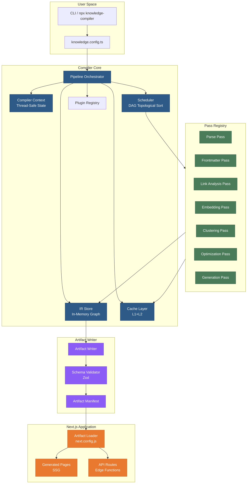
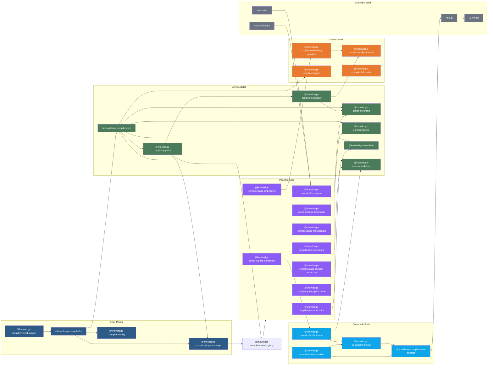
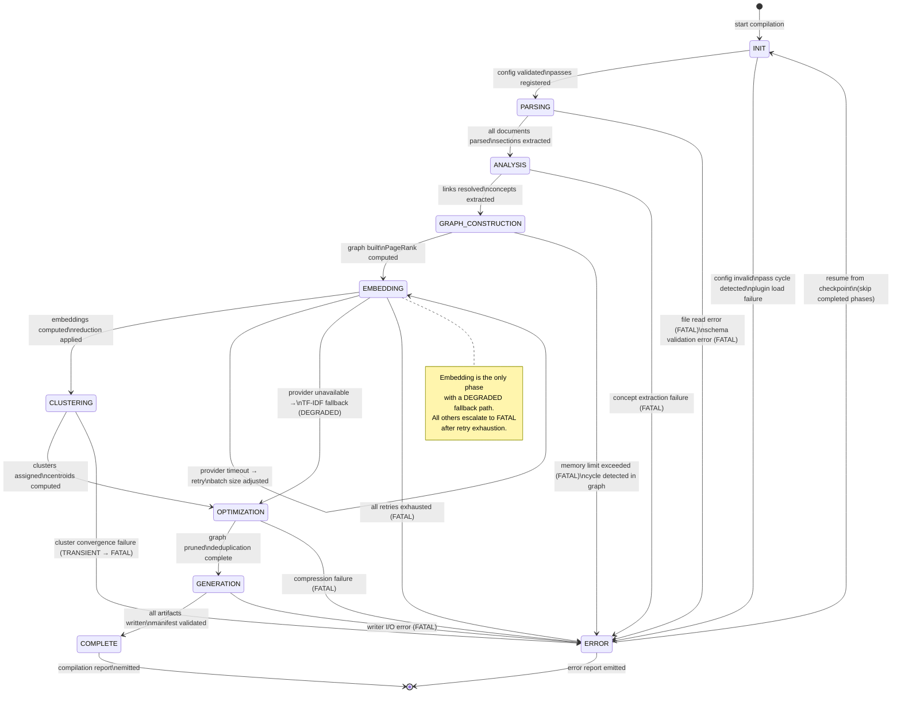
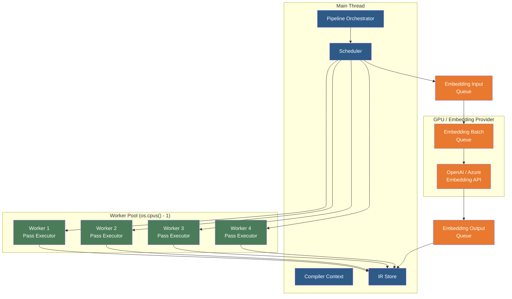
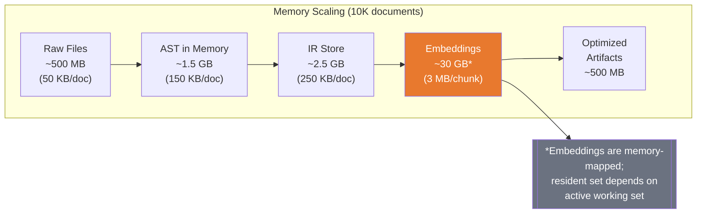

# Knowledge Compiler — System Architecture Overview

**Document Version:** 1.0.0  
**Audience:** Senior Compiler Engineers, Distributed Systems Engineers, AI Infrastructure Researchers  
**Last Updated:** 2026-07-10

---

## 1. System Context

The Knowledge Compiler is a **build-time semantic compiler** that transforms Markdown documents into optimized, statically-deployable semantic artifacts. It operates exclusively during the build phase of a Next.js application and produces no runtime footprint beyond static JSON/embedding files served via CDN.

### 1.1 Ecosystem Positioning

```
┌──────────────────────────────────────────────────────────────────────┐
│                        DEVELOPMENT TIME                               │
│                                                                      │
│  Markdown Files ──► Knowledge Compiler ──► Artifact Store (.next/)   │
│       (source)              (build)             (output)              │
│                                                                      │
│  ┌──────────────────────────────────────────────────────────────┐   │
│  │                    NEXT.JS BUILD                              │   │
│  │  ┌──────────┐   ┌──────────────┐   ┌──────────────────────┐  │   │
│  │  │ getStatic│   │  Knowledge    │   │    Page Generation   │  │   │
│  │  │ Props    │──►│  Loader      │──►│   (React Components) │  │   │
│  │  └──────────┘   └──────────────┘   └──────────────────────┘  │   │
│  └──────────────────────────────────────────────────────────────┘   │
│                                                                      │
├──────────────────────────────────────────────────────────────────────┤
│                         RUNTIME (Vercel Edge/CDN)                    │
│                                                                      │
│  Static JSON ◄── Client-side Fetch ──► Browser Application          │
│  Embedding    │                              │                       │
│  Vectors      │                              ▼                       │
│  (CDN-cached) │                    Semantic Search /                  │
│               │                    Knowledge Graph /                  │
│               │                    Q&A Interface                      │
│                                                                      │
└──────────────────────────────────────────────────────────────────────┘
```

### 1.2 Design Tenets

| Tenet | Implication |
|-------|-------------|
| **Build-time only** | Zero runtime compute; all artifacts are static |
| **Incremental by default** | Second build of N documents completes in <1s when unchanged |
| **Content-addressed** | Every artifact is keyed by the SHA-256 of its semantic content |
| **Deterministic** | Same input graph always produces identical output graph |
| **Graceful degradation** | Embedding provider down → TF-IDF fallback, not build failure |

---

## 2. Architecture Diagram



---

## 3. Compiler Core Architecture

### 3.1 Pipeline Orchestrator

The `PipelineOrchestrator` manages the full lifecycle of a compilation. It owns the pass dependency graph, coordinates execution ordering, and manages error propagation strategies.

```
class PipelineOrchestrator {
  // Phase-to-pass mapping
  phases: Map<CompilerPhase, PassDescriptor[]>
  
  // Pass dependency graph (adjacency list)
  passDAG: Map<PassID, Set<PassID>>
  
  // Execution strategy per pass
  execPolicy: Map<PassID, ExecutionPolicy>
  
  // Phase lifecycle hooks
  onPhaseEnter: Map<CompilerPhase, PhaseHook>
  onPhaseExit: Map<CompilerPhase, PhaseHook>
  
  async execute(config: CompilerConfig): Promise<CompilerResult>
  private async executePhase(phase: CompilerPhase): Promise<PhaseResult>
  private buildPassDAG(passes: PassDescriptor[]): void
  private resolvePassDependencies(pass: PassID): Set<PassID>
}
```

**Phase-to-pass mapping** is defined in the compiler configuration and is extensible via plugins:

```typescript
const DEFAULT_PHASE_MAP: Record<CompilerPhase, PassID[]> = {
  [CompilerPhase.INIT]:             ['init'],
  [CompilerPhase.PARSING]:          ['glob-resolver', 'file-reader', 'frontmatter-parser', 'mdast-parser'],
  [CompilerPhase.ANALYSIS]:         ['link-extractor', 'heading-analyzer', 'code-block-analyzer'],
  [CompilerPhase.GRAPH_CONSTRUCTION]: ['concept-extractor', 'relation-builder', 'dependency-graph'],
  [CompilerPhase.EMBEDDING]:        ['text-chunker', 'embedding-generator', 'dimension-reducer'],
  [CompilerPhase.CLUSTERING]:       ['similarity-matrix', 'cluster-assigner', 'centroid-calculator'],
  [CompilerPhase.OPTIMIZATION]:     ['pruning', 'deduplication', 'compression'],
  [CompilerPhase.GENERATION]:       ['artifact-serializer', 'manifest-builder'],
  [CompilerPhase.COMPLETE]:         ['cleanup', 'reporter'],
};
```

### 3.2 Compiler Context

The `CompilerContext` is the **single source of truth** shared across all passes. It is designed for thread-safe concurrent access.

```typescript
interface CompilerContext {
  // Immutable config (copied per compilation)
  config: Readonly<CompilerConfig>
  
  // Mutable phase state
  phase: CompilerPhase
  phaseStartTime: Map<CompilerPhase, number>
  
  // Error aggregator
  errors: ErrorCollector
  warnings: Warning[]
  
  // Performance telemetry
  metrics: MetricsCollector
  
  // Checkpoint state for resume
  checkpoint: CheckpointStore
  
  // Thread-safe operations
  getPassState<T>(passId: PassID): T | undefined
  setPassState<T>(passId: PassID, state: T): void
  
  // Readonly views for workers
  freeze(): ReadonlyCompilerContext
}
```

**Thread safety** is achieved through:
- `SharedMap<K, V>` backed by a `ReadWriteLock` (fair queuing, 16 concurrent readers before write starvation prevention)
- `AtomicCounter` for progress tracking across workers
- `StampedLock` for high-contention metrics counters
- Context freezing at phase boundaries to eliminate races

### 3.3 IR Store

The `IRStore` is the in-memory knowledge graph that accumulates as passes execute. It is the central data structure that all passes read from and write to.

```typescript
interface IRStore {
  // Document nodes
  documents: Map<DocumentID, DocumentNode>
  
  // Section nodes (headings, paragraphs, code blocks)
  sections: Map<SectionID, SectionNode>
  
  // Concept nodes (extracted entities, topics)
  concepts: Map<ConceptID, ConceptNode>
  
  // Edges (typed relationships)
  edges: EdgeStore
  
  // Embedding vectors (lazy-loaded, memory-mapped for large sets)
  embeddings: EmbeddingStore
  
  // Graph traversal
  getDocument(id: DocumentID): DocumentNode
  getDocumentSections(docId: DocumentID): SectionNode[]
  getSectionConcepts(sectionId: SectionID): ConceptNode[]
  getRelatedSections(sectionId: SectionID, edgeType: EdgeType): SectionNode[]
  
  // Batch operations (for pass bulk writes)
  transaction<T>(fn: (store: MutableIRStore) => T): T
}
```

**Data structures:**

```typescript
interface DocumentNode {
  id: DocumentID             // SHA-256 of normalized file path
  filePath: string
  frontmatter: Frontmatter
  ast: MDAST.Root            // Full Markdown AST
  checksum: string           // SHA-256 of raw file content
  stats: DocumentStats       // Word count, heading depth, etc.
  createdAt: number          // Unix ms
  version: number            // Monotonic document version
}

interface SectionNode {
  id: SectionID              // SHA-256(docID + headingPath)
  docId: DocumentID
  type: SectionType          // 'heading' | 'paragraph' | 'code' | 'list' | 'quote'
  depth: number              // Heading depth (0 for non-heading)
  headingPath: string        // "1. Introduction > 1.1 Background"
  content: string            // Plain text content
  contentHash: string        // SHA-256 of normalized content
  tokenCount: number
  embedding?: Float32Array   // 1536-dim vector (loaded on demand)
  metadata: Record<string, unknown>
}

interface ConceptNode {
  id: ConceptID              // SHA-256(conceptName + context)
  name: string
  type: ConceptType          // 'entity' | 'topic' | 'keyword'
  frequency: number
  firstSeen: DocumentID
  aliases: string[]
  embedding?: Float32Array
}

interface Edge {
  sourceId: string           // DocumentID | SectionID | ConceptID
  targetId: string           // DocumentID | SectionID | ConceptID
  type: EdgeType             // 'contains' | 'references' | 'related' | 'parent' | 'child'
  weight: number             // [0.0, 1.0] similarity or relevance
  metadata?: Record<string, unknown>
}
```

**Memory budget:** A corpus of 10,000 documents (~5M sections) with full embeddings consumes approximately:
- Document nodes: ~2.4 MB (240 bytes/node)
- Section nodes (without embeddings): ~200 MB (40 KB/section metadata)
- Section embeddings: ~30 GB (1536 × 4 bytes × 5M) → **memory-mapped to disk**, only hot sections loaded
- Concept nodes: ~5 MB (for ~50K concepts)
- Edges: ~80 MB (for ~2M edges at 40 bytes/edge)

### 3.4 Cache Layer

The cache layer implements a two-level content-addressable cache.

```
┌────────────────────────────────────────────────────────────────┐
│                      CACHE LAYER                                │
│                                                                │
│   ┌─────────────────────────┐    ┌──────────────────────────┐  │
│   │    L1: In-Memory LRU    │    │   L2: Filesystem Cache    │  │
│   │    maxSize: 500 MB      │    │   path: .knowledge/cache/ │  │
│   │    eviction: LRU        │    │   structure: content-addr │  │
│   │    ttl: 30 min          │    │   ttl: indefinite         │  │
│   │    purpose: hot cache   │    │   purpose: cold storage   │  │
│   └───────────┬─────────────┘    └───────────┬──────────────┘  │
│               │                               │                  │
│               └───────────────┬───────────────┘                  │
│                               │                                   │
│                    ┌──────────▼──────────┐                       │
│                    │   Cache Controller   │                       │
│                    │  • key computation   │                       │
│                    │  • hit/miss routing  │                       │
│                    │  • invalidation      │                       │
│                    │  • serialization     │                       │
│                    └──────────────────────┘                       │
└────────────────────────────────────────────────────────────────┘
```

**Cache entry format:**

```typescript
interface CacheEntry<T = unknown> {
  // Cache key metadata
  key: string                    // SHA-256 of canonical input
  inputHash: string              // SHA-256 of pass input
  outputHash: string             // SHA-256 of pass output
  depHash: string                // SHA-256 of dependency hashes (sorted, concatenated)
  
  // Versioning
  version: number                // Cache format version (monotonic)
  schemaVersion: number          // IR schema version
  
  // Timing
  createdAt: number              // Unix ms
  lastAccessedAt: number         // Unix ms
  ttl: number                    // Time-to-live in ms (0 = indefinite)
  
  // Payload
  data: T                        // Serialized pass output
  byteLength: number             // Uncompressed size
  
  // Compression
  compression: 'none' | 'gzip' | 'zstd'
  compressedLength?: number
}
```

**Cache key computation:**

```
cacheKey(passID, input) = SHA-256(
  normalize(passID) +
  normalize(input.contentHash) +
  normalize(input.depHash) +
  normalize(cacheSchemaVersion)
)
```

### 3.5 Scheduler

The `Scheduler` is responsible for executing passes in topological order according to their dependency DAG, utilizing available parallelism.

```typescript
interface SchedulerConfig {
  maxConcurrency: number        // Default: os.cpus().length - 1
  workerPoolSize: number        // Default: min(4, maxConcurrency)
  workerMemoryLimit: number     // MB, per-worker heap limit
  enableParallelism: boolean    // Toggle for debugging
  failFast: boolean             // Stop on first fatal error
}

interface Scheduler {
  schedule(passes: PassNode[], context: CompilerContext): Promise<ExecutionResult>
  
  // Worker pool management
  private workers: WorkerPool
  private readyQueue: PassNode[]
  private blockedQueue: Map<PassID, Set<PassID>>  // pass → its blockers
  private completed: Set<PassID>
  
  // Topological sort (Kahn's algorithm)
  private topoSort(passes: PassNode[]): PassNode[]
  
  // Parallel execution
  private executeReadyPasses(): Promise<void>
  private dispatchPass(pass: PassNode): Promise<PassResult>
}
```

**Algorithm — Kahn's topological sort with parallel dispatch:**

```
function schedule(PassNode[] allPasses):
    inDegree = {p: count of p's unresolved dependencies}
    ready = {p | inDegree[p] == 0}
    
    while ready is not empty AND no fatal error:
        batch = ready.take(n) where n = min(ready.size, maxConcurrency)
        results = await Promise.all(batch.map(executePass))
        
        for each result:
            if result.status == FATAL:
                if failFast: abort pipeline
                else: mark as degraded, continue
            else:
                for each dependent of result.pass:
                    inDegree[dependent]--
                    if inDegree[dependent] == 0:
                        ready.add(dependent)
    
    if any pass not completed:
        report cycle or deadlock error
```

**Parallel execution constraints:**
- Passes that share **write access** to the same IR subgraph are serialized
- Passes with **read-only** access to disjoint subgraphs execute in parallel
- Embedding passes are serialized to a single worker (GPU affinity)
- File I/O passes (reader, writer) share a 4-thread pool

### 3.6 Error Propagation

```typescript
enum ErrorSeverity {
  FATAL     = 'fatal',      // Stop pipeline immediately
  TRANSIENT = 'transient',  // Retry with backoff
  DEGRADED  = 'degraded',   // Skip pass, mark result as partial
  WARNING   = 'warning',    // Log and continue
}

interface CompilerError {
  id: string
  severity: ErrorSeverity
  passId: PassID
  phase: CompilerPhase
  message: string
  stack?: string
  recoverable: boolean
  retryCount: number
  timestamp: number
  context?: Record<string, unknown>
}
```

**Retry strategy for TRANSIENT errors:**

| Attempt | Delay | Jitter | Notes |
|---------|-------|--------|-------|
| 1 | 100ms | ±25ms | |
| 2 | 400ms | ±100ms | |
| 3 | 1.6s | ±400ms | |
| 4 | 6.4s | ±1.6s | |
| 5 | 25.6s | ±6.4s | Max attempt, then escalate to DEGRADED |

**Error recovery strategies by pass:**

| Pass | Failure Mode | Recovery |
|------|-------------|----------|
| Embedding | Provider timeout | Retry (TRANSIENT) → TF-IDF fallback (DEGRADED) |
| Graph construction | Memory limit | Reduce scope, chunk sections (TRANSIENT) → partial graph (DEGRADED) |
| File reader | Permission denied | Skip file (DEGRADED) |
| Schema validation | Version mismatch | Migrate (TRANSIENT) → regenerate (DEGRADED) |
| Writer | Disk full | Retry with backoff (TRANSIENT) → fail (FATAL) |

---

## 4. Pass Architecture

### 4.1 Pass Interface

```typescript
interface CompilerPass {
  // Metadata
  id: PassID
  name: string
  version: number
  
  // Phase assignment
  phase: CompilerPhase
  dependencies: PassID[]         // Passes that must complete before this one
  optionalDependencies: PassID[] // Best-effort dependencies
  
  // Execution config
  config: PassConfig
  executionPolicy: ExecutionPolicy  // { singleton | perDocument | parallel }
  
  // Lifecycle hooks
  initialize(ctx: CompilerContext): Promise<void>
  execute(ctx: CompilerContext): Promise<PassResult>
  finalize(ctx: CompilerContext): Promise<void>
  validate(ctx: CompilerContext): Promise<ValidationResult>
  
  // Cache integration
  cacheKey(ctx: CompilerContext): string | null  // null = no caching
  cachePolicy: CachePolicy  // { read: boolean, write: boolean, ttl: number }
}
```

### 4.2 Pass Lifecycle

```
┌───────────────────────────────────────────────────────────────┐
│                    PASS LIFECYCLE                               │
│                                                               │
│   initialize() ──────────────────────────────────────────┐    │
│       │                                                  │    │
│       ▼                                                  │    │
│   cacheKey() ←───────── cache hit? ──yes──► skip execute │    │
│       │                                                  │    │
│       │ no cache hit                                     │    │
│       ▼                                                  │    │
│   execute() ────► error? ──yes──► retry? ──yes──► retry │    │
│       │                        │          │              │    │
│       │                        │          no             │    │
│       │                        ▼          ▼              │    │
│       │                   degrade?    escalate to        │    │
│       │                   ──yes──► mark partial          │    │
│       │                        │     continue            │    │
│       │                        no                        │    │
│       │                        ▼                         │    │
│       │                    abort pipeline                │    │
│       ▼                                                  │    │
│   validate() ────► invalid? ──yes──► cacheKey()  ←──────┘    │
│       │                              (re-execute)             │
│       ▼                                                       │
│   finalize() ────► write cache                               │
│                                                               │
└───────────────────────────────────────────────────────────────┘
```

### 4.3 Pass Dependencies and Ordering

Dependencies are declared explicitly and validated at initialization:

```typescript
// Example pass dependency declarations
const EMBEDDING_PASS: CompilerPass = {
  id: 'embedding-generator',
  name: 'Embedding Generator',
  version: 1,
  phase: CompilerPhase.EMBEDDING,
  dependencies: ['text-chunker', 'normalizer'],
  optionalDependencies: ['language-detector'],
  executionPolicy: { type: 'singleton' },
  // ...
};

const CLUSTERING_PASS: CompilerPass = {
  id: 'cluster-assigner',
  name: 'Cluster Assigner',
  version: 1,
  phase: CompilerPhase.CLUSTERING,
  dependencies: ['embedding-generator', 'similarity-matrix'],
  optionalDependencies: [],
  executionPolicy: { type: 'singleton' },
  // ...
};
```

**Dependency graph validation** occurs during `initialize()`:
1. Detect cycles via DFS (Tarjan's SCC decomposition)
2. Verify all referenced dependencies exist in the registry
3. Compute topological order; if no valid order exists, report Fatal error with cycle details
4. Validate that no pass depends on a pass in a **later** phase (cross-phase dependencies must not form a back-edge)

### 4.4 Pass Configuration

Each pass receives a typed configuration object from the compiler config:

```typescript
interface PassConfig {
  // Base config
  enabled: boolean              // Toggle to skip pass entirely
  priority: number              // Higher = executed earlier among peers
  timeout: number               // Max execution time in ms (default: 30_000)
  retryCount: number            // Max retries for TRANSIENT errors
  
  // Pass-specific config (discriminated union)
  params: Record<string, unknown>
  
  // Resource limits
  memoryLimitMB: number
  cpuAffinity?: number          // Preferred CPU core (-1 = any)
  
  // Caching
  cachePolicy: CachePolicy
  
  // Error handling
  onError: 'fail' | 'retry' | 'skip' | 'degraded'
}
```

Configs are merged using a **deep merge** strategy: default → config file → plugin → CLI override. Type safety is enforced via Zod schemas at registration time.

### 4.5 Inter-pass Communication

Passes communicate exclusively through the IR Store. There is no direct pass-to-pass API. This design ensures:

1. **Testability:** Any pass can be tested in isolation by populating the IR store with fixture data
2. **Replayability:** A full IR store snapshot at phase boundaries enables partial rebuilds
3. **Parallelism:** The IR Store's locking model ensures safe concurrent access without pass coordination
4. **Serializability:** The IR store can be serialized to disk for checkpoint/resume

**Communication pattern:**

```
Pass A (writes) ──► IR Store ──► Pass B (reads)
     │                               │
     │  transaction({                │  readOnly transaction
     │    documents.set(...)         │  const doc = documents.get(...)
     │    sections.add(...)          │  const sections = getDocumentSections(...)
     │  })                           │
     ▼                               ▼
  sections populated            sections consumed
  for analysis                  for embedding
```

**Cross-pass data contracts** are enforced at the IR Store level:

```typescript
// Define what each pass expects and produces
interface PassDataContract {
  passId: PassID
  produces: IRNodeType[]           // Node types this pass creates
  consumes: IRNodeType[]           // Node types this pass reads
  requiredNodeTypes: IRNodeType[]  // Must exist before pass executes
  optionalNodeTypes: IRNodeType[]  // May exist
}
```

The orchestrator validates contracts at `initialize()`: if a `requiredNodeType` was promised by a dependency but never produced, the pipeline fails with a contract violation error.

---

## 5. Module Dependency Graph



### 5.1 Module Dependency Rules

| Rule | Enforcement |
|------|-------------|
| **No cyclic dependencies** | ESLint `import/no-cycle` rule; CI check via `madge` |
| **Core may not depend on passes** | Compiler core is pass-agnostic; pass registration is via plugin system |
| **Plugins only depend on core** | Plugin modules import from core but core never imports plugins |
| **CLI is a thin shell** | CLI delegates all logic to core; no business logic in CLI |
| **Worker threads import from passes** | Workers are spawned by the scheduler; they load pass code dynamically via `import()` |
| **Schema is a leaf module** | No module depends on `@knowledge-compiler/schema`; it exports types consumed by all |

### 5.2 Package Architecture (Monorepo)

The project uses a pnpm workspace monorepo with the following structure:

```
packages/
  core/              # Compiler core (orchestrator, context, IR store)
  cli/               # CLI entry point
  config/            # Config loading and validation
  pipeline/          # Pipeline orchestration
  scheduler/         # Task scheduling and worker pool
  context/           # Compiler context (shared state)
  cache/             # Two-level cache
  ir/                # IR types and store
  schema/            # Zod schemas for artifacts
  pass-registry/     # Global pass registry
  pass-parse/        # File reading and Markdown parsing
  pass-frontmatter/  # Frontmatter extraction
  pass-link-analysis/# Link and reference extraction
  pass-embedding/    # Embedding generation
  pass-clustering/   # Document clustering
  pass-concept-extraction/ # Concept/entity extraction
  pass-optimization/ # Graph pruning and compression
  pass-generation/   # Artifact generation
  pass-validation/   # Schema validation of outputs
  artifact-writer/   # File system output
  artifact-reader/   # File system input (for Next.js)
  manifest/          # Artifact manifest generation
  next-adapter/      # Next.js integration
  vercel-adapter/    # Vercel deployment integration
  plugin-manager/    # Plugin loading and lifecycle
  embedding-provider/# Embedding API client (OpenAI, etc.)
  worker-threads/    # Worker pool abstraction
  telemetry/         # Performance metrics
  logger/            # Structured logging
```

---

## 6. Data Flow Architecture

### 6.1 Full Data Pipeline

```
INPUT PHASE
============

Glob Pattern (e.g., "content/**/*.md")
    │
    ▼
┌─────────────────────┐     ┌──────────────────────┐
│  GlobResolver Pass  │────►│    FileReader Pass    │
│  • resolve globs    │     │  • read file contents  │
│  • filter by ignore │     │  • compute checksums   │
│  • sort by path     │     │  • check cache         │
│  • emit FileRef[]   │     │  • emit RawFile[]      │
└─────────────────────┘     └──────────┬───────────┘
                                       │
                                       ▼
                        ┌──────────────────────────┐
                        │  FrontmatterParser Pass   │
                        │  • parse YAML frontmatter │
                        │  • validate schema (Zod)  │
                        │  • extract metadata       │
                        │  • emit DocumentMeta[]    │
                        └──────────┬───────────────┘
                                   │
                                   ▼
                        ┌──────────────────────────┐
                        │   MDAST Parser Pass       │
                        │  • remark parse to AST    │
                        │  • compute heading tree   │
                        │  • extract sections       │
                        │  • compute statistics     │
                        │  • emit SectionNode[]     │
                        └──────────┬───────────────┘
                                   │
                          IR Store: documents,
                          sections populated

ANALYSIS PHASE
==============
                                   │
                                   ▼
                        ┌──────────────────────────┐
                        │  Link Extractor Pass      │
                        │  • find wiki-links [[ ]]  │
                        │  • find markdown links    │
                        │  • resolve references     │
                        │  • build EdgeSet          │
                        │  • emit RelationEdge[]    │
                        └──────────┬───────────────┘
                                   │
                                   ▼
                        ┌──────────────────────────┐
                        │  Concept Extractor Pass   │
                        │  • extract entities       │
                        │  • extract keywords (TF)  │
                        │  • extract topics (TextRank)│
                        │  • emit ConceptNode[]     │
                        └──────────┬───────────────┘
                                   │
                          IR Store: concepts,
                          edges populated

GRAPH CONSTRUCTION PHASE
================================
                                   │
                                   ▼
                        ┌──────────────────────────────┐
                        │  Dependency Graph Builder    │
                        │  • build section→section     │
                        │    edges via link references │
                        │  • build concept→section     │
                        │    edges via co-occurrence   │
                        │  • build document hierarchy  │
                        │  • compute PageRank scores   │
                        │  • emit complete graph       │
                        └──────────┬───────────────────┘
                                   │
                          IR Store: full graph
                          constructed

EMBEDDING PHASE
===============
                                   │
                                   ▼
                        ┌──────────────────────────────┐
                        │   Text Chunker Pass           │
                        │  • split sections into       │
                        │    chunks (512-1024 tokens)   │
                        │  • overlap windows (10%)     │
                        │  • preserve heading context  │
                        │  • emit TextChunk[]          │
                        └──────────┬───────────────────┘
                                   │
                                   ▼
                        ┌──────────────────────────────┐
                        │   Embedding Generator Pass    │
                        │  • batch chunks (max 2048)   │
                        │  • call embedding provider   │
                        │  • compute embeddings        │
                        │  • apply dimensionality      │
                        │    reduction (PCA→256d)      │
                        │  • store in EmbeddingStore   │
                        └──────────┬───────────────────┘
                                   │
                          IR Store: embeddings
                          populated

CLUSTERING PHASE
================
                                   │
                                   ▼
                        ┌──────────────────────────────┐
                        │   Similarity Matrix Pass      │
                        │  • compute cosine similarity │
                        │  • sparse matrix storage     │
                        │    (CSR format)              │
                        │  • threshold at 0.7          │
                        │  • emit SimilarityEdge[]     │
                        └──────────┬───────────────────┘
                                   │
                                   ▼
                        ┌──────────────────────────────┐
                        │   Cluster Assigner Pass       │
                        │  • HDBSCAN clustering         │
                        │  • min cluster size: 3       │
                        │  • assign cluster IDs        │
                        │  • compute centroids         │
                        │  • emit Cluster[]            │
                        └──────────┬───────────────────┘
                                   │
                          IR Store: clusters
                          populated

OPTIMIZATION PHASE
==================
                                   │
                                   ▼
                        ┌──────────────────────────────┐
                        │   Graph Pruning Pass          │
                        │  • remove edges below        │
                        │    weight threshold (0.3)    │
                        │  • remove isolated nodes     │
                        │  • merge duplicate concepts  │
                        │  • compress serialization    │
                        └──────────┬───────────────────┘
                                   │
                                   ▼
                        ┌──────────────────────────────┐
                        │   Deduplication Pass          │
                        │  • near-duplicate detection  │
                        │    (simhash, threshold 0.95) │
                        │  • merge near-duplicate      │
                        │    sections with redirect    │
                        └──────────┬───────────────────┘
                                   │
                                   ▼
                        ┌──────────────────────────────┐
                        │   Compression Pass            │
                        │  • quantize embeddings       │
                        │    (Float32 → int8)          │
                        │  • delta-encode timestamps   │
                        │  • minify metadata keys      │
                        └──────────┬───────────────────┘
                                   │
                          IR Store: optimized graph

OUTPUT / GENERATION PHASE
=========================
                                   │
                                   ▼
                        ┌──────────────────────────────┐
                        │   Artifact Serializer Pass    │
                        │  • write knowledge-graph.json│
                        │  • write embedding.vec       │
                        │    (binary flat buffer)      │
                        │  • write section-index.json  │
                        │  • write concept-index.json  │
                        │  • write cluster-index.json  │
                        │  • write page-rank.json      │
                        └──────────┬───────────────────┘
                                   │
                                   ▼
                        ┌──────────────────────────────┐
                        │   Manifest Builder Pass       │
                        │  • build artifact manifest   │
                        │  • record checksums          │
                        │  • record dependency graph   │
                        │  • record version metadata   │
                        │  • write manifest.json       │
                        └──────────┬───────────────────┘
                                   │
                                   ▼
                        ┌──────────────────────────────┐
                        │   Schema Validator Pass       │
                        │  • validate all output files │
                        │    against Zod schemas       │
                        │  • verify cross-file refs    │
                        │  • report validation errors  │
                        └──────────────────────────────┘
```

### 6.2 Output Artifacts

```typescript
// knowledge-graph.json — The full document/section/concept graph
interface KnowledgeGraph {
  version: string              // Semver of artifact format
  schema: 'knowledge-graph'    // Discriminant for validators
  metadata: {
    generatedAt: string         // ISO 8601
    sourceCount: number         // Number of input documents
    sectionCount: number
    conceptCount: number
    edgeCount: number
    sourceHash: string          // SHA-256 of all source inputs
  }
  documents: DocumentNode[]     // Compact serialization (no AST, no embedding)
  sections: SectionNode[]       // No embedding vector
  concepts: ConceptNode[]       // No embedding vector
  edges: Edge[]
  graphStats: {
    density: number
    avgClusteringCoefficient: number
    diameter: number
    componentCount: number
  }
}

// embeddings.vec — Binary flat buffer of all embeddings
// Format:
//   header:  uint32  magic (0x4B434D42) "KCMB"
//            uint32  version
//            uint32  numVectors
//            uint32  dimensions
//            uint64  byteLength
//   vectors: float32[]  (numVectors * dimensions)
//   index:   uint64[]   (numVectors) offsets into vectors for each section

// section-index.json — Flat search index for client-side lookup
interface SectionIndex {
  version: string
  sections: Array<{
    id: SectionID
    title: string
    headingPath: string
    docId: DocumentID
    docPath: string
    summary: string              // First 200 chars
    embeddingOffset: number      // Byte offset in embeddings.vec
    clusterId: number | null
    conceptIds: ConceptID[]
  }>
}

// concept-index.json — Concept lookup and relationship index
interface ConceptIndex {
  version: string
  concepts: Array<{
    id: ConceptID
    name: string
    type: ConceptType
    frequency: number
    relatedConcepts: Array<{ id: ConceptID; weight: number }>
  }>
}

// cluster-index.json — Cluster centroid and membership
interface ClusterIndex {
  version: string
  clusters: Array<{
    id: number
    centroidOffset: number       // Byte offset in embeddings.vec
    memberCount: number
    topTerms: string[]           // Top TF-IDF terms
    representativeSection: SectionID
  }>
}
```

### 6.3 Artifact Dependency Relationships

```
manifest.json
    ├── knowledge-graph.json
    │     └── embeddings.vec  (referenced by offset)
    ├── section-index.json
    │     └── embeddings.vec  (referenced by offset)
    ├── concept-index.json
    └── cluster-index.json
          └── embeddings.vec  (referenced by offset)
```

**Cross-file integrity** is maintained via:
- The manifest records SHA-256 checksums of every artifact file
- Offsets into `embeddings.vec` are validated at manifest build time
- A `link` phase validates that all section IDs in indices actually exist in the graph
- Zod schemas in `@knowledge-compiler/schema` validate both individual files and cross-file references

---

## 7. State Management

### 7.1 Compiler Phases

```typescript
enum CompilerPhase {
  INIT              = 'INIT',
  PARSING           = 'PARSING',
  ANALYSIS          = 'ANALYSIS',
  GRAPH_CONSTRUCTION = 'GRAPH_CONSTRUCTION',
  EMBEDDING         = 'EMBEDDING',
  CLUSTERING        = 'CLUSTERING',
  OPTIMIZATION      = 'OPTIMIZATION',
  GENERATION        = 'GENERATION',
  COMPLETE          = 'COMPLETE',
  ERROR             = 'ERROR',
}
```

### 7.2 State Transition Diagram



### 7.3 Phase Responsibilities

| Phase | Entry Condition | Work Performed | Exit Condition | Error Recovery |
|-------|----------------|---------------|----------------|----------------|
| **INIT** | CLI invocation | Load config, validate, register passes, build pass DAG, detect cycles, open cache | Config validated, passes registered | Fatal on cycle or invalid config |
| **PARSING** | INIT complete | Resolve globs, read files, parse frontmatter, parse MD AST, compute checksums, populate sections in IR | All files parsed into IR | DEGRADED: skip unreadable files, continue |
| **ANALYSIS** | PARSING complete | Extract links, resolve references, extract concepts/keywords, build initial edges | Link graph and concept set built | Fatal: concept extraction failure; DEGRADED: partial link resolution |
| **GRAPH_CONSTRUCTION** | ANALYSIS complete | Build section→section edges, concept→section edges, compute PageRank, compute graph statistics | Full knowledge graph in IR | Fatal: OOM. Retry with smaller scope |
| **EMBEDDING** | GRAPH_CONSTRUCTION complete | Chunk text, call embedding provider, reduce dimensions, store in EmbeddingStore | Embeddings for all sections | TRANSIENT: retry with backoff; DEGRADED: TF-IDF fallback |
| **CLUSTERING** | EMBEDDING complete | Compute similarity matrix, run HDBSCAN, assign cluster IDs, compute centroids | All sections assigned to clusters | TRANSIENT: retry with different HDBSCAN params |
| **OPTIMIZATION** | CLUSTERING complete | Prune weak edges, merge near-duplicates, quantize embeddings, compress metadata | Optimized graph ready for output | Fatal: compression failure |
| **GENERATION** | OPTIMIZATION complete | Serialize all artifacts, build manifest, validate output schemas, write to disk | All artifact files written and validated | Fatal: I/O error; TRANSIENT: disk full with backoff |
| **COMPLETE** | GENERATION complete | Print summary report, emit telemetry, release resources | Clean exit | N/A |
| **ERROR** | Any phase failure | Collect all errors, write error artifact (if possible), compute partial results, emit error report | Graceful shutdown | Resume from checkpoint on retry |

---

## 8. Execution Model

### 8.1 Single-Threaded Baseline

When parallelism is disabled (`maxConcurrency: 1`), all passes execute sequentially in topological order. This mode is used for debugging, profiling, and environments where worker threads are unavailable (e.g., certain CI sandboxes).

**Memory characteristics:**
- Single process heap: up to 4 GB by default
- SharedArrayBuffer still available for embedding storage
- No serialization overhead between passes
- Predictable, deterministic execution

### 8.2 Multi-Threaded Execution



**Worker thread lifecycle:**

```
1. Scheduler creates worker pool at pipeline start
   - Pool size = min(config.maxConcurrency, os.cpus().length - 1, 16)
   
2. Per pass dispatch:
   a. Scheduler serializes pass config + frozen context snapshot
   b. Scheduler sends { passId, config, phase } to available worker
   c. Worker imports pass module dynamically
   d. Worker creates isolated IR store copy (via structured clone)
   e. Worker executes pass
   f. Worker sends result back (serialized IR diff)
   g. Main thread applies IR diff under write lock
   
3. Worker pool is drained and terminated at orphan detection
```

**Worker pool configuration:**

```typescript
interface WorkerPoolConfig {
  minThreads: number             // 1
  maxThreads: number             // 16
  idleTimeout: number            // 30_000 ms (terminate idle workers)
  taskQueueSize: number          // maxQueueLength: threads * 4
  memoryLimitMB: number          // 1024 MB per worker
  enableIsolation: boolean       // Separate worker per pass (higher memory, safer)
}
```

### 8.3 Parallel Pass Execution

The scheduler analyzes the pass DAG at runtime to determine which passes can execute in parallel:

```typescript
interface ParallelismDecision {
  canParallelize: boolean
  reason?: string
  
  // For parallelizable passes:
  schedule: 'concurrent' | 'pipeline' | 'overlap'
  
  // Resource requirements
  estimatedMemoryMB: number
  estimatedCPUTime: number
  
  // Affinity hints
  preferredWorkerType: 'cpu' | 'io' | 'gpu'
}
```

**Parallelization rules:**

| Pass Pair | Can Parallelize? | Reason |
|-----------|-----------------|--------|
| FileReader + FrontmatterParser | ✅ Concurrent (pipeline: reader→parser) | Producer/consumer via streaming |
| LinkExtractor + ConceptExtractor | ✅ Concurrent | Both read sections, write disjoint edge sets |
| EmbeddingGenerator + ClusterAssigner | ❌ Dependency | Embedding is a prerequisite for clustering |
| GraphBuilder + Pruning | ❌ Dependency | Pruning requires the built graph |
| EmbeddingGenerator + TF-IDF | ✅ Concurrent (alternative) | Either/Or, not both |
| ArtifactSerializer + ManifestBuilder | ❌ Dependency | Manifest requires serialization results |

### 8.4 Batch Processing for Embeddings

Embedding generation is the pipeline's primary bottleneck. The embedding pass implements a batching system:

```typescript
interface EmbeddingBatcher {
  // Configuration
  maxBatchSize: number           // 2048 chunks (OpenAI limit: 2048)
  maxBatchTokens: number         // 256_000 tokens
  minBatchSize: number           // 32 chunks (efficiency threshold)
  
  // Batching strategy
  strategy: 'fill' | 'fixed' | 'adaptive'
  
  // Adaptive batching parameters
  targetBatchDuration: number    // 500ms desired API latency
  backoffFactor: number          // 0.8 (reduce batch on timeout)
  growthFactor: number           // 1.2 (increase batch on success)
  
  // Queue
  pendingQueue: TextChunk[]
  inflightRequests: number
  
  // Batching algorithm
  async fillBatch(): Promise<TextChunk[]>
  async dispatchBatch(batch: TextChunk[]): Promise<EmbeddingResult[]>
  
  // Adaptive size adjustment
  adjustBatchSize(latency: number, success: boolean): void
}
```

**Batch dispatch algorithm:**

```
function dispatchBatches(chunks[]):
    batches = partition(chunks, maxBatchSize)
    
    // Pipeline batches: send next as soon as previous returns
    for i = 0; i < batches.length; i++:
        inflight++
        sendToProvider(batches[i])
            .then(result => {
                inflight--
                storeEmbeddings(result)
                if queue has items AND inflight < maxInflight:
                    dispatchBatch(queue.take(maxBatchSize))
            })
    
    // Maintain concurrency: keep N batches in flight
    while inflight < maxInflight AND queue not empty:
        batch = queue.take(maxBatchSize)
        inflight++
        sendToProvider(batch)
```

### 8.5 Memory Sharing via SharedArrayBuffer

For large embedding matrices (5M+ sections × 1536 dimensions × 4 bytes ≈ 30 GB), we use `SharedArrayBuffer` to avoid duplication across worker threads:

```typescript
class SharedEmbeddingStore {
  private buffer: SharedArrayBuffer
  private numVectors: number
  private dimensions: number
  
  constructor(numVectors: number, dimensions: number) {
    this.numVectors = numVectors
    this.dimensions = dimensions
    this.buffer = new SharedArrayBuffer(numVectors * dimensions * Float32Array.BYTES_PER_ELEMENT)
  }
  
  getVector(index: number): Float32Array {
    return new Float32Array(this.buffer, index * this.dimensions * 4, this.dimensions)
  }
  
  setVector(index: number, data: Float32Array): void {
    const view = new Float32Array(this.buffer, index * this.dimensions * 4, this.dimensions)
    view.set(data)
  }
  
  // Atomic section lock for concurrent writes
  acquireLock(sectionIndex: number): Promise<void>
  releaseLock(sectionIndex: number): void
}
```

**Concurrent access model:**

```
Worker 1: writes section[0..999]    ───► SharedArrayBuffer
Worker 2: writes section[1000..1999] ───► SharedArrayBuffer
Worker 3: reads section[0..1999]    ───► SharedArrayBuffer (zero-copy)

No copy needed between workers. Locking at individual section granularity (128 sections per lock stripe to reduce overhead).
```

---

## 9. Incremental Compilation Strategy

### 9.1 Content-Addressed Caching

Every pass output is keyed by the SHA-256 hash of its canonical input:

```typescript
interface CacheKeyStrategy {
  // Per-pass key computation
  computeInputHash(pass: CompilerPass, ctx: CompilerContext): string {
    const inputs = pass.getInputs(ctx)   // IR nodes this pass reads
    const inputStrings = inputs.map(normalize).sort()
    return SHA256(inputStrings.join('|'))
  }
  
  // Global key includes dependency chain
  computeFullKey(pass: CompilerPass, ctx: CompilerContext): string {
    const inputHash = this.computeInputHash(pass, ctx)
    const depHashes = pass.dependencies
      .map(depId => ctx.getPassState(depId).outputHash)
      .sort()
    const depHash = SHA256(depHashes.join('|'))
    return SHA256(`${pass.id}|${inputHash}|${depHash}|${CACHE_SCHEMA_VERSION}`)
  }
}
```

**Cache hit ratio targets:**

| Scenario | Cold Build | Second Build | File-Edit Build |
|----------|-----------|-------------|-----------------|
| Full rebuild | 0% hit | 95%+ hit | 90%+ hit |
| Single file edit | 0% hit | — | 85%+ hit |
| Config change | 0% hit | — | 100% miss (new config hash) |
| Plugin upgrade | 0% hit | — | 100% miss (new version) |

### 9.2 Dependency Tracking

Dependencies are tracked at three levels of granularity:

```typescript
interface DependencyTracker {
  // File-level: which files affect which passes
  fileDeps: Map<FilePath, Set<PassID>>
  
  // Section-level: which sections affect which passes
  sectionDeps: Map<SectionID, Set<PassID>>
  
  // Concept-level: which concepts affect which passes
  conceptDeps: Map<ConceptID, Set<PassID>>
  
  // Track a dependency
  registerFileDep(filePath: FilePath, passId: PassID): void
  registerSectionDep(sectionId: SectionID, passId: PassID): void
  registerConceptDep(conceptId: ConceptID, passId: PassID): void
  
  // Determine which passes are invalidated by a change
  getInvalidatedPasses(changedFiles: FilePath[]): Set<PassID>
  getInvalidatedPassesBySections(changedSections: SectionID[]): Set<PassID>
  getInvalidatedPassesByConcepts(changedConcepts: ConceptID[]): Set<PassID>
}
```

**Invalidation propagation:**

```
File A changed → FileReader(A) invalidated
  → FrontmatterParser(A) invalidated
    → MDASTParser(A) invalidated
      → Section[1..N] changed
        → LinkExtractor (re-check links from A)
        → ConceptExtractor (re-extract concepts from A)
        → EmbeddingGenerator (re-embed changed sections)
          → SimilarityMatrix (recompute for changed sections' neighbors)
            → ClusterAssigner (re-assign changed sections)
              → GraphPruning (re-prune affected subgraph)
                → ArtifactSerializer (re-serialize affected output)
```

### 9.3 Cache Invalidation Strategies

```typescript
enum InvalidationStrategy {
  EXPLICIT     = 'explicit',      // User runs --clean or deletes .knowledge/
  DEPENDENCY   = 'dependency',    // Input hash changed → cache miss
  TIME_BASED   = 'time_based',    // TTL expired → re-validate
  VERSION      = 'version',       // Schema/compiler version changed
  FORCED       = 'forced',        // --force flag passed by user
}

interface InvalidationRule {
  strategy: InvalidationStrategy
  scope: 'pass' | 'file' | 'global'
  condition: string               // Expression evaluated at runtime
}
```

**Default TTLs:**

| Cache Type | Default TTL | Rationale |
|------------|-------------|-----------|
| L1 in-memory | 30 minutes | Session lifetime; evicted after compilation |
| L2 filesystem (pass outputs) | Indefinite | Never expires; invalidated by hash change |
| L2 filesystem (embeddings) | 7 days | Embeddings are expensive; periodic refresh |
| L2 filesystem (artifacts) | Indefinite | Output only valid until next build |

### 9.4 Cache Serialization Format

```typescript
interface CacheSerialization {
  format: 'msgpack' | 'json'     // msgpack for binary, json for debugging
  compression: 'zstd' | 'gzip' | 'none'
  
  // Cache index
  index: Map<string, CacheEntryMeta>
  
  // Entry format on disk
  // .knowledge/cache/
  //   index.msgpack          — Full index of all entries
  //   entries/
  //     ab/cd/ef/...         — Content-addressed by key prefix
  //       data.msgpack       — Serialized pass output
  //       meta.json          — CacheEntry metadata (human-readable)
  //       dep-hash           — Dependency hash for invalidation
  //   manifest.json          — Cache version, schema version, created at
}
```

### 9.5 Example: Incremental Edit Scenario

```
Initial state: 10,000 documents fully compiled. All caches warm.

User edits: one paragraph in docs/advanced/architecture.md
  (original SHA: a1b2c3d4, new SHA: e5f6g7h8)

Pipeline:
  1. Scheduler reads file list (all cached)
     ├── cache HIT: 9,999 files unchanged → skip all parse passes
     └── cache MISS: docs/advanced/architecture.md
  
  2. Parse pipeline for changed file:
     ├── FileReader: read 1 file → cache MISS
     ├── FrontmatterParser: parse 1 frontmatter → cache MISS
     └── MDASTParser: parse 1 AST → cache MISS
  
  3. Analysis passes:
     ├── LinkExtractor: re-resolve links from 1 changed section
     │   → cache HIT for all sections except the edited section
     │   → only re-process 1 section's links
     └── ConceptExtractor: re-extract concepts from 1 section
         → cache HIT for all other sections
  
  4. Graph construction:
     ├── DependencyGraph: re-compute edges for 1 changed section
     │   → update edges for the edited section
     │   → check transitive dependents (sections linking TO this one)
     │   → 3 sections have incoming links → mark as stale
     └── PageRank: incrementally update (PageRank for 4 sections)
  
  5. Embedding:
     ├── TextChunker: chunk 1 edited section → cache MISS
     ├── EmbeddingGenerator: 1 embedding → cache MISS
     │   → API call: 1 embedding (or batched with 2047 others from queue)
     └── EmbeddingStore: update 1 vector
  
  6. Clustering:
     ├── SimilarityMatrix: re-compute 1 row + 3 transitive rows → partial HIT
     └── ClusterAssigner: re-assign 1 section + 3 transitive → partial HIT
  
  7. Optimization:
     ├── GraphPruning: re-prune 4 sections → partial HIT
     ├── Deduplication: re-check 4 sections → partial HIT
     └── Compression: re-compress only changed portions
  
  8. Generation:
     ├── ArtifactSerializer: patch 3 output files
     ├── ManifestBuilder: update checksums for 3 files
     └── SchemaValidator: validate 3 updated files

Total time: ~150ms (re-parsing) + ~100ms (network latency: 1 embedding)
           = ~250ms  (vs ~45s for a cold full build)
```

---

## 10. Caching Strategy Details

### 10.1 Two-Level Cache Architecture

```
 Level 1: In-Memory LRU Cache
 ┌────────────────────────────────────────┐
 │  CacheStore<K, V>                       │
 │  • backend: Map<K, { value: V, node }> │
 │  • eviction: LRU (doubly-linked list)  │
 │  • maxSize: 500 MB (configurable)      │
 │  • maxEntries: 50,000                  │
 │  • ttl: 30 minutes (sliding)           │
 │  • stats: hits, misses, evictions      │
 │  • async: readLock/writeLock           │
 └──────────────┬─────────────────────────┘
                │ get() / set() / has()
                │
                ▼
 Level 2: Filesystem Content-Addressable Cache
 ┌────────────────────────────────────────┐
 │  ContentAddressableStore               │
 │  • backend: fs + zstd compression      │
 │  • path: .knowledge/cache/{key[:2]}/   │
 │  • key: SHA-256 hex (64 chars)         │
 │  • index: RAM index loaded at startup  │
 │  • entry: { meta.json, data.msgpack }  │
 │  • compression: zstd level 3           │
 │  • ttl: indefinite                     │
 │  • stats: reads, writes, bytes         │
 └────────────────────────────────────────┘
 ```

### 10.2 Cache Entry Detail

```typescript
interface CacheEntryDetailed {
  // Identity
  key: string                     // Full SHA-256 cache key
  passId: PassID                  // Which pass produced this
  
  // Input hashes (for invalidation)
  inputHash: string               // SHA-256 of all inputs to the pass
  inputHashes: Record<string, string>  // Per-input-item hash
  dependencyHashes: Record<PassID, string>  // Dependency output hashes
  
  // Output hash (for transitive invalidation)
  outputHash: string              // SHA-256 of serialized output
  outputSize: number              // Uncompressed byte size
  
  // Versioning
  cacheFormatVersion: number      // Cache schema version (monotonic)
  compilerVersion: string         // Semver of compiler that produced this
  irSchemaVersion: number         // IR schema version
  
  // Timing
  createdAt: number               // Unix ms
  lastAccessedAt: number          // Unix ms
  computeTimeMs: number           // How long it took to produce
  
  // Compression
  compression: 'zstd'             // Always zstd for L2
  compressedSize: number          // On-disk size
  
  // Data
  data: Buffer                    // Serialized pass output (msgpack)
}
```

### 10.3 Cache Key Computation

```
function computeCacheKey(passId, inputItems, depHashes, configVersion):
    // 1. Normalize all inputs
    normalizedInputs = inputItems
        .map(i => normalize(i))
        .sort()
        .join('|||')
    
    // 2. Hash input
    inputHash = SHA256(normalizedInputs)
    
    // 3. Hash dependency chain
    depKeys = Object.entries(depHashes)
        .sort(([a], [b]) => a.localeCompare(b))
        .map(([k, v]) => `${k}:${v}`)
        .join('|||')
    depHash = SHA256(depKeys)
    
    // 4. Full key
    fullKey = SHA256(`${passId}|${inputHash}|${depHash}|${configVersion}`)
    
    return { fullKey, inputHash, depHash }
```

### 10.4 Cache Granularity

| Granularity | Scope | Example Key | Use Case |
|-------------|-------|-------------|----------|
| **Per-pass** | Entire pass output | `parse:sha256(all_files)...` | Global passes (graph builder) |
| **Per-document** | Single document result | `parse:sha256(file_a.md)...` | File reader, frontmatter parser |
| **Per-section** | Single section result | `embed:sha256(section_123)...` | Embedding generator |
| **Per-chunk** | Single text chunk | `chunk:sha256(chunk_456)...` | Text chunker |

**Cache overhead analysis:**

```
10,000 documents × 5 sections/doc × 3 cachable passes/section
= 150,000 section-level cache entries

Each entry: ~500 bytes (metadata + key)
Total index memory: ~75 MB

L1 holds hottest 50,000 entries: ~25 MB
L2 holds all 150,000 entries on disk: ~75 MB index + ~15 GB payload
```

### 10.5 Cache Warm-Up

On cold build completion, the cache is "warm" for subsequent builds. The warm-up sequence:

1. **Phase 0** (before any passes): Load L2 cache index into memory
   - Read `.knowledge/cache/index.msgpack`
   - Deserialize into in-memory `Map<string, CacheEntryMeta>`
   - Total time for 150K entries: ~200ms

2. **Per-pass**: Check cache before execution
   - Compute cache key (~2μs for SHA-256 of 4KB input)
   - Check L1 (~200ns for Map lookup)
   - If L1 miss, check L2 (stat file existence, ~50μs)
   - If L2 hit, deserialize into L1

3. **Per-pass completion**: Write to cache
   - Serialize output to msgpack (~10μs for 50KB)
   - Compress with zstd level 3 (~500μs for 50KB)
   - Write to L2 (async, non-blocking)
   - Update L1 (evict LRU if over capacity)

---

## 11. Failure Recovery

### 11.1 Retry with Exponential Backoff

```typescript
interface RetryPolicy {
  maxAttempts: number              // 5
  initialDelay: number             // 100ms
  maxDelay: number                 // 30_000ms
  backoffFactor: number            // 2.0
  jitter: number                   // 0.25 (25% jitter)
  retryableErrors: RegExp[]        // Patterns matching TRANSIENT errors
  
  // Compute next delay
  getDelay(attempt: number): number {
    const exponential = Math.min(
      this.initialDelay * Math.pow(this.backoffFactor, attempt),
      this.maxDelay
    )
    const jitter = exponential * this.jitter * (Math.random() * 2 - 1)
    return Math.max(0, exponential + jitter)
  }
}
```

### 11.2 Graceful Degradation

When a pass cannot complete successfully, the compiler applies the configured degradation strategy:

```typescript
interface DegradationStrategy {
  // What to do when a pass fails
  fallback: 'skip' | 'substitute' | 'partial'
  
  // Substitute pass (for 'substitute' strategy)
  substitutePassId?: PassID
  
  // Partial execution scope
  partialScope?: 'section' | 'document' | 'file'
  
  // Mark affected nodes
  markAffectedAs: 'degraded' | 'stale' | 'missing'
  
  // Notify downstream passes
  propagateMarker: boolean
}
```

**Degradation paths:**

| Failed Pass | Strategy | Substitute | Behavioral Change |
|-------------|----------|-----------|-------------------|
| EmbeddingGenerator | `substitute` | TF-IDF Vectorizer | Semantic search degrades to keyword search; sections have `embeddingType: 'tfidf'` flag |
| ConceptExtractor | `skip` | — | No concept nodes created; graph links rely entirely on explicit references |
| LinkExtractor | `partial` | — | Failed sections get empty edge sets; downstream passes skip them |
| ClusterAssigner | `skip` | — | All sections marked `clusterId: null`; client-side clustering disabled |
| GraphPruning | `skip` | — | Full unpruned graph emitted (larger artifact files) |

### 11.3 Checkpoint/Resume

```typescript
interface CheckpointStore {
  // Checkpoint at phase boundaries
  savePhaseCheckpoint(phase: CompilerPhase, ctx: CompilerContext): Promise<void>
  loadCheckpoint(): Promise<Checkpoint | null>
  
  // Checkpoint contents
  checkpointPath: string           // .knowledge/checkpoint/latest/
  phaseCompleted: CompilerPhase[]  // Which phases are done
  irSnapshot: IRStore              // Serialized IR state
  cacheState: CacheSnapshot        // Cache index at checkpoint
  configHash: string               // Config at checkpoint time
}

interface Checkpoint {
  id: string                       // UUID
  createdAt: number
  compilerVersion: string
  configHash: string
  completedPhases: CompilerPhase[]
  nodeCount: number                 // IR node count at checkpoint
  edgeCount: number
}
```

**Resume flow:**

```
1. User runs: knowledge-compiler
2. CheckpointStore checks: .knowledge/checkpoint/latest/ exists?
   └─ No → full build
3. Validate checkpoint: configHash matches? compilerVersion matches?
   └─ No → invalidate checkpoint, full build
4. Load IR snapshot from checkpoint → populate IR store
5. Load cache index from checkpoint → populate cache
6. Determine resume phase = last completed phase + 1
7. Skip all phases up to resume phase
8. Execute from resume phase forward
9. After completion, overwrite checkpoint
```

### 11.4 Error Classification

```typescript
enum ErrorClass {
  // Fatal: stop pipeline immediately
  FATAL_CONFIG_INVALID       = 'FATAL_CONFIG_INVALID',
  FATAL_CYCLE_DETECTED       = 'FATAL_CYCLE_DETECTED',
  FATAL_PLUGIN_LOAD_FAILURE  = 'FATAL_PLUGIN_LOAD_FAILURE',
  FATAL_DISK_FULL            = 'FATAL_DISK_FULL',
  FATAL_OOM                  = 'FATAL_OOM',
  FATAL_SCHEMA_VIOLATION     = 'FATAL_SCHEMA_VIOLATION',
  
  // Transient: retry with backoff
  TRANSIENT_API_TIMEOUT      = 'TRANSIENT_API_TIMEOUT',
  TRANSIENT_API_RATE_LIMIT   = 'TRANSIENT_API_RATE_LIMIT',
  TRANSIENT_NETWORK_ERROR    = 'TRANSIENT_NETWORK_ERROR',
  TRANSIENT_DISK_IO_ERROR    = 'TRANSIENT_DISK_IO_ERROR',
  TRANSIENT_LOCK_CONTENTION  = 'TRANSIENT_LOCK_CONTENTION',
  
  // Degraded: skip and continue
  DEGRADED_FILE_READ_ERROR   = 'DEGRADED_FILE_READ_ERROR',
  DEGRADED_PARSE_FAILURE     = 'DEGRADED_PARSE_FAILURE',
  DEGRADED_LINK_RESOLVE_FAIL = 'DEGRADED_LINK_RESOLVE_FAIL',
  DEGRADED_EMBEDDING_FAILURE = 'DEGRADED_EMBEDDING_FAILURE',
  DEGRADED_CLUSTER_FAILURE   = 'DEGRADED_CLUSTER_FAILURE',
  
  // Warning: log and continue
  WARNING_DEPRECATED_CONFIG  = 'WARNING_DEPRECATED_CONFIG',
  WARNING_STALE_CACHE        = 'WARNING_STALE_CACHE',
  WARNING_SLOW_PASS          = 'WARNING_SLOW_PASS',
}

interface ErrorClassifier {
  classify(error: Error, passId: PassID, phase: CompilerPhase): ErrorClass
  
  // Classification rules
  rules: Array<{
    pattern: RegExp              // Match against error message
    errorClass: ErrorClass
    priority: number             // Higher priority overrides lower
  }>
}
```

### 11.5 Partial Results Model

```typescript
interface PartialResult<T> {
  status: 'complete' | 'partial' | 'failed'
  data: T | null                // null if failed
  
  // Partial data (for 'partial' status)
  completedItems: number
  totalItems: number
  failedItems: FailedItem[]
  
  // Coverage
  coverage: number              // 0.0 - 1.0 (fraction of successful items)
  
  // Degradation metadata
  degradation?: {
    reason: string
    substitutedBy: string | null
    affectedNodes: string[]      // IR node IDs
    fallbackApplied: boolean
  }
}

interface FailedItem {
  id: string
  error: string
  errorClass: ErrorClass
  attempt: number
  skipped: boolean
}
```

---

## 12. Rebuild Strategy

### 12.1 Full Rebuild (Clean)

```bash
knowledge-compiler --clean
# Equivalent to:
rm -rf .knowledge/
knowledge-compiler
```

- Deletes the entire `.knowledge/` directory (cache + checkpoints + artifacts)
- Re-parses all files from scratch
- Re-computes all embeddings
- Re-generates all artifacts
- Expected time for 10,000 docs: ~45s (95th percentile: ~90s, dominated by embedding API latency)

### 12.2 Incremental Rebuild (Default)

```bash
knowledge-compiler
# Automatically detects changes and only processes affected files/passes
```

- Reads previous manifest from `.knowledge/manifest.json`
- Compares file checksums (SHA-256) against stored values
- Only processes files whose checksums differ
- Identical files are served from cache (both L1 and L2)
- Expected time for 10,000 docs with 10 changed: ~1.5s

### 12.3 Dependency-Driven Rebuild

When file A changes, the compiler determines which outputs are affected by tracking the dependency graph:

```typescript
interface DependencyDrivenRebuild {
  // Entry point
  computeRebuildPlan(changedFiles: FilePath[], irStore: IRStore): RebuildPlan
  
  // Steps:
  // 1. For each changed file, find all IR nodes that need reprocessing
  // 2. For each affected IR node, trace forward through the pass DAG
  // 3. Compute the minimal set of passes to re-run
  // 4. Return a RebuildPlan with the optimized pass schedule
}

interface RebuildPlan {
  passesToRerun: Set<PassID>           // Minimal pass set
  filesToReread: FilePath[]             // Files needing re-read
  sectionsToReembed: SectionID[]        // Sections needing re-embedding
  conceptsToReextract: ConceptID[]      // Concepts needing re-extraction
  edgesToRebuild: Set<[string, string]> // Edges to recompute
  estimatedWork: number                 // Relative work estimate (0..1)
}
```

### 12.4 Transitive Rebuild

When a concept changes (e.g., its embedding vector shifts due to context re-analysis), all sections that reference that concept must also be re-analyzed:

```
Concept: "Neural Networks" (embedding updated)
  ├── Section A (references "Neural Networks" explicitly)
  │     └── re-embed Section A
  │           └── re-compute similarity for A
  │                 └── re-assign cluster for A
  ├── Section B (references "Neural Networks" implicitly via link)
  │     └── re-embed Section B
  │           └── re-compute similarity for B
  │                 └── re-assign cluster for B
  └── Concept: "Deep Learning" (related via co-occurrence)
        └── re-compute relatedness scores
              └── propagate to all sections referencing "Deep Learning"
                    └── re-compute their similarity rows
```

**Transitive depth limit:**

```typescript
interface TransitiveRebuildConfig {
  maxDepth: number               // 3 (maximum transitive rebuild depth)
  maxAffectedSections: number    // 1000 (abort transitive rebuild if too broad)
  threshold: number              // 0.1 (minimum similarity change to trigger rebuild)
}
```

---

## 13. Artifact Versioning

### 13.1 Version in Every File

Every artifact file includes a `version` field at the top level:

```typescript
const ARTIFACT_SCHEMA = z.object({
  $schema: z.string(),           // URL to JSON Schema
  version: z.string().regex(/^\d+\.\d+\.\d+$/),  // Semver
  artifactType: z.enum([
    'knowledge-graph',
    'embeddings',
    'section-index',
    'concept-index',
    'cluster-index',
    'manifest',
    'page-rank',
  ]),
  metadata: z.object({
    generatedAt: z.string(),
    compilerVersion: z.string(),
    sourceHash: z.string(),
  }),
})

// Example header:
// {
//   "$schema": "https://knowledge-compiler.dev/schemas/knowledge-graph/v1.json",
//   "version": "1.0.0",
//   "artifactType": "knowledge-graph",
//   "metadata": {
//     "generatedAt": "2026-07-10T14:30:00.000Z",
//     "compilerVersion": "1.2.3",
//     "sourceHash": "a1b2c3d4e5..."
//   },
//   ...
// }
```

### 13.2 Migration Strategy

```typescript
interface MigrationStrategy {
  // Current version → target version
  from: string
  to: string
  
  // Migration function
  migrate(data: unknown): unknown
  
  // Whether migration preserves backward compatibility
  backwardCompatible: boolean
}

// Migration registry
const MIGRATIONS: MigrationStrategy[] = [
  {
    from: '1.0.0',
    to: '1.1.0',
    backwardCompatible: true,
    migrate: (data) => {
      // Added clusterIndex field; default to null if missing
      return {
        ...data,
        sections: data.sections.map(s => ({
          ...s,
          clusterIndex: s.clusterIndex ?? null,
        })),
      }
    },
  },
  {
    from: '1.1.0',
    to: '2.0.0',
    backwardCompatible: false,
    migrate: (data) => {
      // Breaking change: embeddings moved to separate binary file
      // This migration is handled at the compiler level, not at load time
      throw new Error('Breaking migration: regenerate artifacts with compiler v2+')
    },
  },
]
```

### 13.3 Backward Compatibility Policy

| Artifact Version | Policy | Details |
|-----------------|--------|---------|
| **Major version change** (1.x → 2.0) | **Breaking** | Requires re-generation with matching compiler major version. Load-time migration is not supported. The `artifact-reader` emits a clear error instructing the user to rebuild. |
| **Minor version change** (1.0 → 1.1) | **Backward compatible** | New fields are added with `undefined` defaults. Old artifacts load with inferrable defaults. Migration is applied transparently at load time. |
| **Patch version change** (1.0.0 → 1.0.1) | **Fully compatible** | Only fixes and clarifications. No structural changes. |

**Runtime schema migration:**

```typescript
class ArtifactLoader {
  async loadKnowledgeGraph(path: string): Promise<KnowledgeGraph> {
    const raw = await fs.readFile(path, 'utf-8')
    const parsed = JSON.parse(raw)
    
    // Validate version
    const version = parsed.version
    const currentVersion = '1.2.0'
    
    if (semver.major(version) !== semver.major(currentVersion)) {
      throw new ArtifactVersionError(
        `Knowledge graph artifact v${version} is incompatible with ` +
        `reader v${currentVersion}. Run \`knowledge-compiler\` to rebuild.`
      )
    }
    
    // Apply minor/patch migrations
    let migrated = parsed
    for (const migration of MIGRATIONS) {
      if (semver.gt(migration.to, version) && semver.lte(migration.to, currentVersion)) {
        if (migration.backwardCompatible) {
          migrated = migration.migrate(migrated)
        }
      }
    }
    
    // Validate with Zod
    return KNOWLEDGE_GRAPH_SCHEMA.parse(migrated)
  }
}
```

### 13.4 Schema Evolution with Zod

```typescript
// Base schema (v1.0.0)
const SectionNodeV1 = z.object({
  id: z.string(),
  docId: z.string(),
  type: z.enum(['heading', 'paragraph', 'code', 'list', 'quote']),
  depth: z.number().int().min(0).max(6),
  headingPath: z.string(),
  content: z.string(),
  tokenCount: z.number().int().positive(),
})

// Extended schema (v1.1.0, backward compatible)
const SectionNodeV1_1 = SectionNodeV1.extend({
  clusterIndex: z.number().int().nullable().default(null),
  embeddingOffset: z.number().int().nonnegative().nullable().default(null),
})

// Breaking schema (v2.0.0)
const SectionNodeV2 = SectionNodeV1_1.omit({ content: true }).extend({
  contentHash: z.string(),       // Content moved to external store
  summary: z.string(),           // Shorter summary instead of full content
})
```

**Schema migration utilities:**

```typescript
class SchemaMigrator {
  // Registry of all known schemas by version
  private schemas: Map<string, z.ZodTypeAny> = new Map()
  
  register(version: string, schema: z.ZodTypeAny): void {
    this.schemas.set(version, schema)
  }
  
  // Validate data against a specific version
  validate(version: string, data: unknown): boolean {
    const schema = this.schemas.get(version)
    if (!schema) throw new Error(`Unknown schema version: ${version}`)
    return schema.safeParse(data).success
  }
  
  // Migrate data from one version to another
  migrate(data: unknown, fromVersion: string, toVersion: string): unknown {
    // Apply migrations in sequence
    let current = fromVersion
    let result = data
    
    while (current !== toVersion) {
      const migration = MIGRATIONS.find(
        m => m.from === current && semver.lte(m.to, toVersion)
      )
      if (!migration) {
        throw new Error(`No migration path from ${current} to ${toVersion}`)
      }
      result = migration.migrate(result)
      current = migration.to
    }
    
    return result
  }
}
```

---

## 14. Performance Characteristics

### 14.1 Expected Throughput

| Workload | Documents | Sections | Throughput | Dominant Factor |
|----------|-----------|----------|------------|-----------------|
| Small (docs) | 100 | 500 | ~1.2s | Parse + Embedding API |
| Medium (wiki) | 1,000 | 5,000 | ~8s | Embedding API (batch of 5K) |
| Large (corpus) | 10,000 | 50,000 | ~45s | Embedding API (~24K chunks) |
| X-Large (enterprise) | 100,000 | 500,000 | ~6m | Embedding API (~240K chunks) |
| Incremental (10 edits) | 10 changed | 10-50 | ~250ms | Parse + Embedding (1-2 chunks) |

**Throughput scaling formula:**

```typescript
function estimateBuildTime(config: CompilerConfig): number {
  const docCount = config.docCount
  const sectionCount = docCount * config.avgSectionsPerDoc  // ~5
  const chunkCount = sectionCount * config.avgChunksPerSection  // ~1.2
  
  // Parse: ~1ms/doc
  const parseTime = docCount * 0.001  // seconds
  
  // Analyze: ~0.5ms/doc
  const analyzeTime = docCount * 0.0005
  
  // Graph: ~0.3ms/node + ~0.1ms/edge
  const graphTime = (sectionCount * 0.0003) + (sectionCount * 1.5 * 0.0001)
  
  // Embedding: ~50ms/chunk (API latency, batched 2048 at a time)
  const batchCount = Math.ceil(chunkCount / 2048)
  const embedTime = batchCount * 0.5  // 500ms per batch (includes network)
  
  // Clustering: O(n log n) with ~4μs/section
  const clusterTime = sectionCount * Math.log2(sectionCount) * 0.000004
  
  // Serialization: ~0.1ms/section
  const serializeTime = sectionCount * 0.0001
  
  // Overhead: ~500ms (cache init, worker pool setup, etc.)
  const overhead = 0.5
  
  return overhead + parseTime + analyzeTime + graphTime + embedTime + clusterTime + serializeTime
}
```

### 14.2 Memory Scaling



**Memory budget breakdown (10,000 documents, 50,000 sections):**

| Component | Memory | Technique | Notes |
|-----------|--------|-----------|-------|
| Raw file contents | ~500 MB | Garbage-collected after parse | Released after AST construction |
| Markdown AST | ~1.5 GB | Released after section extraction | Remark AST is memory-heavy |
| IR Store (metadata) | ~200 MB | Plain JS objects | 50K sections × ~4 KB each |
| IR Store (edges) | ~80 MB | Adjacency list (Map+Set) | ~2M edges |
| IR Store (concepts) | ~5 MB | Plain objects | ~50K concepts |
| Embeddings (full) | ~30 GB | SharedArrayBuffer + mmap | Only hot sections in RAM |
| Embeddings (working set) | ~256 MB | Memory-mapped LRU | 10% of full set actively used |
| Cache L1 | ~500 MB | LRU cache | Configurable |
| Worker overhead | ~50 MB/worker | V8 heap limit | 8 workers × 50 MB = 400 MB |
| **Total (peak)** | **~2.5 GB + embeddings** | | Without embeddings: fits in 4 GB |
| **Total (steady)** | **~1.2 GB** | | Caches warm, embeddings mmap'd |

**Memory scaling formula:**

```
Mem(docs) = (base_overhead) +
            (docs × doc_overhead) +
            (docs × sections_per_doc × section_overhead) +
            (docs × sections_per_doc × 1.2 × chunk_overhead) +
            (docs × sections_per_doc × 1.5 × edge_overhead)

Where:
  base_overhead = 256 MB (config, cache index, worker pool)
  doc_overhead = 300 KB (raw + AST + metadata)
  section_overhead = 4 KB (metadata, no embedding)
  chunk_overhead = 6 KB (text + embedding metadata)
  edge_overhead = 40 bytes

For 10K docs:
  = 256 MB + (10K × 300 KB) + (50K × 4 KB) + (60K × 6 KB) + (2M × 40 B)
  = 256 MB + 3000 MB + 200 MB + 360 MB + 80 MB
  = ~3.9 GB (without full embeddings)

With embeddings (mmap'd, hot set only):
  = 256 MB + 300 MB (mmap working set) + 1.2 GB (steady without raw/AST)
  = ~1.8 GB steady state
```

### 14.3 Bottleneck Analysis

```
Workflow Timeline (10K documents, log scale)
=============================================

Parse:     ████████░░░░░░░░░░░░░░░░░░░░░░░░░░░░  1.2s
Analyze:   ░░░░████░░░░░░░░░░░░░░░░░░░░░░░░░░░░  0.6s
Graph:     ░░░░░░░░████░░░░░░░░░░░░░░░░░░░░░░░░  0.5s
Embed:     ░░░░░░░░░░░░░░░░░░░░░░░░░░░███████████  42s  ← BOTTLENECK
Cluster:   ░░░░░░░░░░░░░░░░░░░░░░░░░░░░░░░░░░░███  1.2s
Optimize:  ░░░░░░░░░░░░░░░░░░░░░░░░░░░░░░░░░░░░██  0.4s
Serialize: ░░░░░░░░░░░░░░░░░░░░░░░░░░░░░░░░░░░░░█  0.1s
                                                      ─────
                                                      46s total
```

**Primary bottleneck: Embedding generation (42s out of 46s = 91% of total time).**

Mitigations:

| Mitigation | Impact | Complexity | Implementation |
|------------|--------|------------|----------------|
| Batch embeddings | 10× throughput (2048/batch) | Low | Built into EmbeddingProvider |
| Parallel API calls | 2-4× (multiple concurrent batches) | Medium | Scheduler manages embedding worker pool |
| Embedding cache (L2) | 100× for cached sections | Low | Cache layer handles this |
| Dimensionality reduction (PCA 1536→256) | 6× smaller vectors | Medium | Post-embedding pass |
| Quantization (float32 → int8) | 4× smaller vectors, 2× faster loading | Low | Compression pass |
| Embedding provider selection | Variable (2-50× between providers) | Medium | Config: `text-embedding-3-small` vs `3-large` vs local |
| Streaming API (SSE) | 1.5× (reduce p95 latency) | High | Requires provider support |

**Secondary bottleneck: Parsing (1.2s for 10K docs, 120μs/doc).**
- Mitigated by multi-threaded file reading (4 workers)
- Mitigated by cache: unchanged files served from L2 at ~50μs each
- I/O bound on M.2 NVMe (3.5 GB/s sequential) → not a bottleneck in practice

### 14.4 Mitigation Strategies Detail

```typescript
interface BottleneckMitigation {
  // Embedding batching
  embeddingBatching: {
    strategy: 'adaptive'           // Adjust batch size based on latency
    minBatch: 32                   // Minimum for efficiency
    maxBatch: 2048                 // API limit
    targetLatencyMs: 500           // Desired per-batch latency
    concurrency: 4                 // Parallel batches in flight
  }
  
  // Caching
  embeddingCache: {
    l1Size: 100_000               // Cache entries in L1
    l2Enabled: true               // Always persist to disk
    warmOnStart: true             // Load embedding cache index at init
  }
  
  // Dimensionality reduction
  dimensionalityReduction: {
    method: 'pca' | 'umap'
    targetDimensions: 256
    fitOnSample: 10_000           // Fit PCA on first 10K sections
    applyToAll: true
  }
  
  // Quantization
  quantization: {
    enabled: true
    method: 'int8'                // Linear quantization
    calibrationSize: 10_000       // Calibrate on first 10K vectors
  }
  
  // Fallback
  fallback: {
    onTimeout: 'tfidf'            // Use TF-IDF if embedding API times out
    onRateLimit: 'backoff'        // Backoff and retry on 429
    maxDegradedRatio: 0.1         // Allow up to 10% degraded embeddings
  }
}
```

### 14.5 Performance Benchmarks

| Metric | Target | Measurement Method | Notes |
|--------|--------|--------------------|-------|
| Cold build (10K docs) | <60s | `time knowledge-compiler` | Embedding API latency dominated |
| Warm build (no changes) | <1s | `time knowledge-compiler` | All cache hits |
| Incremental (10 edits) | <2s | `time knowledge-compiler` | ~250ms dominated by API |
| Memory (peak) | <4 GB | `process.memoryUsage()` | Without full embeddings in RAM |
| Memory (steady) | <2 GB | `process.memoryUsage()` | After GC, with mmap'd embeddings |
| Cache index load | <500ms | `console.time()` | 150K entries, msgpack |
| Embedding throughput | >400 chunks/s | `total_chunks / time` | OpenAI `text-embedding-3-small` |
| Embedding p95 latency | <2s | Per-chunk timing | Network + provider processing |
| Parse throughput | >8,000 docs/s | `docs / time` | Multi-threaded, non-cached |
| Artifact validation | <1s | `time knowledge-compiler --validate` | 10 files, 50MB total |

---

## Appendix A: Configuration Shape

```typescript
// knowledge.config.ts
interface CompilerConfig {
  version: '1'
  
  // Input
  input: {
    glob: string[]                  // ['content/**/*.md']
    ignore: string[]                // ['**/node_modules/**', '**/draft/**']
    followSymlinks: boolean         // false
  }
  
  // Output
  output: {
    dir: string                     // '.knowledge/artifacts'
    format: 'msgpack' | 'json'     // 'msgpack' (default)
    compression: 'zstd' | 'gzip' | 'none'  // 'zstd'
  }
  
  // Pipeline
  pipeline: {
    maxConcurrency: number          // os.cpus().length - 1
    failFast: boolean               // false
    allowDegraded: boolean          // true
    maxRetriesPerPass: number       // 5
  }
  
  // Embedding
  embedding: {
    provider: 'openai' | 'azure' | 'local'
    model: string                   // 'text-embedding-3-small'
    dimensions: number              // 256
    batchSize: number               // 2048
    maxRetries: number               // 5
    apiKey?: string                 // env: EMBEDDING_API_KEY
    endpoint?: string               // for Azure/local
  }
  
  // Clustering
  clustering: {
    algorithm: 'hdbscan' | 'kmeans'
    minClusterSize: number          // 3
    similarityThreshold: number     // 0.7
  }
  
  // Cache
  cache: {
    enabled: boolean                // true
    l1SizeMB: number                // 500
    l2Dir: string                   // '.knowledge/cache'
    ttl: number                     // 2592000000 (30 days)
  }
  
  // Passes
  passes: {
    enabled: PassID[]               // All by default
    disabled: PassID[]              // []
    config: Record<PassID, Record<string, unknown>>
  }
  
  // Plugins
  plugins: string[]                 // ['@knowledge-compiler/plugin-xyz']
}
```

## Appendix B: CLI Reference

```bash
knowledge-compiler [options] [glob...]

Options:
  --config, -c <path>           Config file path (default: knowledge.config.ts)
  --clean, -C                   Full rebuild (delete cache)
  --incremental, -i             Incremental rebuild (default)
  --validate, -V                Validate artifacts only (no build)
  --watch, -w                   Watch mode (rebuild on file change)
  --verbose, -v                 Verbose logging
  --profile, -p                 Emit profiling data (Chrome trace format)
  --dry-run, -d                 Show what would be built without executing
  --output, -o <dir>            Output directory override
  --cache-dir <dir>             Cache directory override
  --max-concurrency <n>         Worker thread count
  --no-cache                    Disable all caching
  --no-parallel                 Disable parallel execution
  --fail-fast                   Stop on first error
  --version                     Show version
  --help                        Show help
```

## Appendix C: Glossary

| Term | Definition |
|------|------------|
| **Pass** | A single compilation unit that transforms IR in a well-defined way. Analogous to a compiler pass in LLVM. |
| **IR Store** | The in-memory knowledge graph that accumulates during compilation. All passes read from and write to this store. |
| **Compiler Context** | Thread-safe shared state containing config, phase, errors, and metrics. Passed to all passes. |
| **Cache Entry** | Content-addressed blob of serialized pass output, keyed by SHA-256 of canonical input. |
| **Content-Addressed** | A storage strategy where the lookup key is the hash of the content itself, guaranteeing uniqueness and enabling deduplication. |
| **DEGRADED** | An error severity that allows the pipeline to continue with reduced functionality. The resulting artifact is marked as partial. |
| **TRANSIENT** | An error severity indicating a temporary condition that may succeed on retry (network timeout, rate limit, etc.). |
| **FATAL** | An error severity that immediately halts the pipeline. Requires user intervention to resolve. |
| **SharedArrayBuffer** | A JavaScript shared memory primitive used for zero-copy embedding vector sharing across worker threads. |
| **Memory-Mapped (mmap)** | A technique where file contents are mapped directly into virtual memory, allowing the OS to manage paging. Used for large embedding stores. |
| **Checkpoint** | A serialized snapshot of the IR store and cache state at a phase boundary, enabling resume from failure. |
| **Manifest** | A JSON file that catalogs all artifact files with their checksums, versions, and dependency relationships. |
