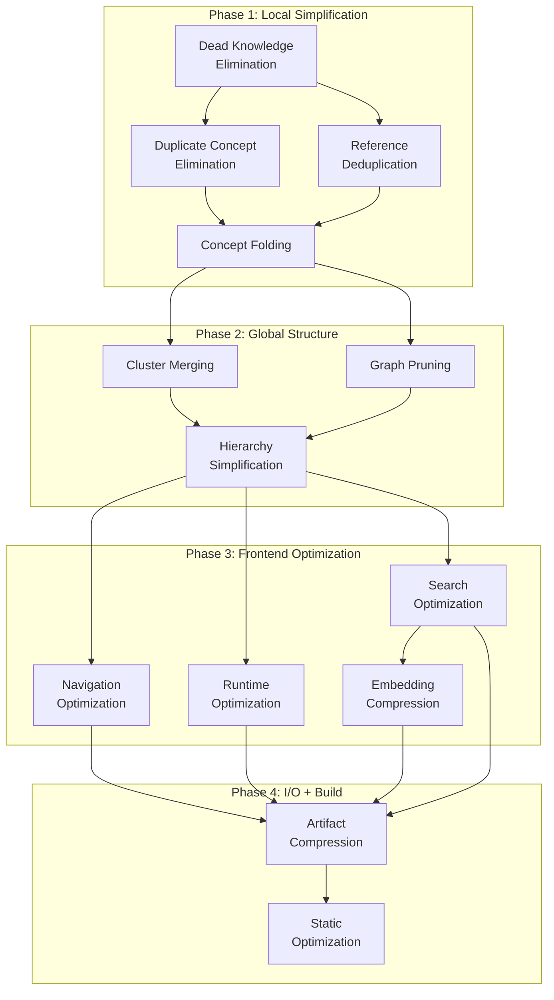

# Optimization Passes

> The Knowledge Compiler transforms Markdown documents into optimized semantic artifacts deployed as a static Next.js app on Vercel. Optimization passes are analogous to compiler optimization passes in LLVM/GCC, applied to the semantic IR rather than machine code.

---

## Table of Contents

1. [Optimization Passes](#optimization-passes)
   - [1. Dead Knowledge Elimination](#1-dead-knowledge-elimination)
   - [2. Duplicate Concept Elimination](#2-duplicate-concept-elimination)
   - [3. Concept Folding](#3-concept-folding)
   - [4. Reference Deduplication](#4-reference-deduplication)
   - [5. Cluster Merging](#5-cluster-merging)
   - [6. Navigation Optimization](#6-navigation-optimization)
   - [7. Graph Pruning](#7-graph-pruning)
   - [8. Embedding Compression](#8-embedding-compression)
   - [9. Hierarchy Simplification](#9-hierarchy-simplification)
   - [10. Search Optimization](#10-search-optimization)
   - [11. Artifact Compression](#11-artifact-compression)
   - [12. Static Optimization](#12-static-optimization)
   - [13. Runtime Optimization](#13-runtime-optimization)
2. [Optimization Pipeline Order](#optimization-pipeline-order)
3. [Optimization Pipeline](#optimization-pipeline)
4. [Fixed-Point Optimization](#fixed-point-optimization)
5. [Optimization Cost Model](#optimization-cost-model)
6. [Optimization Validation](#optimization-validation)
7. [Optimization Debugging](#optimization-debugging)

---

## 1. Dead Knowledge Elimination

### Purpose
Remove nodes with no incoming edges and low importance scores. Analogous to dead code elimination: if no other concept references a node and it has negligible computed importance, it is unreachable from the semantic graph and only adds payload size without contributing to retrieval quality.

### When It Runs
- **Pipeline stage:** Early (phase 1), immediately after IR construction
- **Dependencies:** None (operates on raw IR)
- **Prerequisite passes:** None
- **Enables:** Graph Pruning, Hierarchy Simplification (fewer nodes reduces work for later passes)

### Input IR
`KnowledgeGraph` — a directed graph `G = (V, E)` where each node `v ∈ V` has:
- `importance(v) ∈ [0, 1]` — computed centrality score
- `in_degree(v)` — number of incoming edges
- `out_degree(v)` — number of outgoing edges
- `concept_type(v)` — root, internal, leaf

### Output IR
Same `KnowledgeGraph` with a subset of nodes removed:
`V' = { v ∈ V | in_degree(v) > 0 ∨ importance(v) ≥ τ_dead }`

Where `τ_dead` is the dead knowledge threshold (default 0.05).

### Algorithm

```
function dead_knowledge_elimination(G, τ):
    worklist ← { v ∈ V | in_degree(v) = 0 ∧ importance(v) < τ }
    removed ← ∅

    while worklist not empty:
        v ← worklist.pop()
        if v has outgoing edges:
            for each (v → u) ∈ E:
                if u ∉ removed ∧ in_degree(u) - 1 = 0 ∧ importance(u) < τ:
                    worklist.add(u)
        removed.add(v)
        remove v from G

    // Mark remaining nodes with adjusted importance
    for each v ∈ V:
        v.importance ← recompute_importance(v, G)

    return G
```

Key insight: removal of a dead node reduces the in-degree of its successors, which may cause them to become dead as well (cascading elimination). The worklist processes this transitively.

### Complexity
- **Time:** `O(|V| + |E|)` — single pass over edges plus worklist traversal
- **Space:** `O(|V|)` — worklist and removed set

### Effectiveness
- Small knowledge bases (<500 concepts): removes 0–5% of nodes
- Large, auto-generated knowledge bases: removes 10–30% of nodes
- Most effective on output from noisy extractors (LLM-extracted knowledge graphs often contain orphaned hallucinated concepts)

### Safety
- **Invariant preserved:** Reachability from root nodes is preserved (only nodes with zero incoming edges AND low importance are removed)
- **Invariant preserved:** The `importance(v)` computed after removal is monotonic — removal never increases importance of remaining nodes
- **Risk:** Overly aggressive threshold removes fringe-but-relevant concepts. Mitigated by setting `τ_dead` conservatively (≤0.05)

### Configuration
| Parameter | Type | Default | Description |
|-----------|------|---------|-------------|
| `threshold` | `float` | `0.05` | Minimum importance score to survive elimination |
| `preserve_roots` | `bool` | `true` | Never remove root-level concepts even if score is low |

### Tradeoffs
- **Quality vs. size:** Aggressive thresholds (0.1+) may remove valid niche content. Conservative thresholds (0.01) remove little.
- **Safety vs. effectiveness:** Cascading removal is powerful but can accidentally disconnect subgraphs. The edge-count invariant protects against this.

---

## 2. Duplicate Concept Elimination

### Purpose
Merge concepts with identical or near-identical meaning (same label, same parent, high embedding similarity). Analogous to global value numbering or common subexpression elimination — redundant concepts inflate graph size, fragment edges across duplicates, and degrade retrieval precision.

### When It Runs
- **Pipeline stage:** Early (phase 1), after Dead Knowledge Elimination
- **Dependencies:** Requires Dead Knowledge Elimination (removing orphans first reduces the matching space)
- **Enables:** Concept Folding, Cluster Merging (pooled edges onto canonical nodes produce better folding decisions)

### Input IR
`KnowledgeGraph` with possibly duplicate concepts:
- Normalized labels (lowercased, stemmed)
- Embedding vectors `e(v) ∈ ℝ^d`
- Parent/child edges
- Attribute sets

### Output IR
`KnowledgeGraph` with duplicate concepts merged into canonical representatives:
- `V' ⊂ V` where for each equivalence class `S = {v₁, v₂, ...}`, a canonical `v* = argmax importance(v)` survives
- All incoming/outgoing edges rerouted to `v*`
- Attributes unioned onto `v*`

### Algorithm

```
function duplicate_concept_elimination(G, τ_label, τ_embed):
    // Phase 1: Exact label match
    buckets ← partition_by_normalized_label(V)
    canonical_map ← empty map

    for each bucket B in buckets:
        if |B| > 1:
            v* ← argmax importance(v) for v ∈ B
            for each v ∈ B \ {v*}:
                canonical_map[v] ← v*
                merge_edges(G, v, v*)
                merge_attributes(G, v, v*)
                mark_for_removal(v)

    // Phase 2: Embedding similarity match (remaining unmerged nodes)
    remaining ← V \ keys(canonical_map)
    indexed ← build_ann_index(remaining, metric=cosine)

    for each v ∈ remaining:
        neighbors ← indexed.query(v, k=5, threshold=τ_embed)
        for each u ∈ neighbors:
            if same_parent(v, u) ∧ embedding_similarity(v, u) > τ_embed:
                v* ← argmax importance(v, u)
                canonical_map[v or u] ← v*
                merge_edges(G, v, v*)
                mark_for_removal(non_canonical)

    remove_marked_nodes(G)
    rebuild_importance_scores(G)
    return G
```

### Complexity
- **Time:** Phase 1 `O(|V| log |V|)` (hash-based bucketing). Phase 2 `O(|V| log |V|)` (ANN index build + query). Total: `O(|V| log |V| + |E|)`
- **Space:** `O(|V|)` for ANN index + canonical map

### Effectiveness
- Knowledge bases from multiple sources: 15–40% concept reduction
- Single-source extraction: 2–10% reduction
- Most impactful when ingesting from multiple documents that describe overlapping domains

### Safety
- **Invariant preserved:** Transitive closure of reachability is unchanged (edges are rerouted, not removed)
- **Invariant preserved:** embedding of canonical node is the mean of merged embeddings (or highest-quality embedding, configurable)
- **Risk:** Phase 2 embedding matching may merge near-synonyms that should remain distinct (e.g., "car" and "automobile"). The `same_parent` guard reduces this risk.
- **Risk:** Wrong canonical selection loses attributes. Union semantics preserves all attributes.

### Configuration
| Parameter | Type | Default | Description |
|-----------|------|---------|-------------|
| `label_threshold` | `float` | `1.0` | Exact label match (use string equality after normalization) |
| `embedding_threshold` | `float` | `0.95` | Cosine similarity threshold for fuzzy match |
| `require_same_parent` | `bool` | `true` | Only merge concepts sharing a parent |
| `canonical_selection` | `enum` | `max_importance` | How to pick canonical: `max_importance`, `max_edges`, `max_depth`, `longest_label` |
| `merge_attributes` | `enum` | `union` | `union`, `intersection`, `canonical_only` |

### Tradeoffs
- **Precision vs. recall:** Lower `embedding_threshold` catches more duplicates but risks false merges
- **Quality vs. cost:** Phase 2 is expensive for large graphs (`|V| > 100K`). Can be disabled for large graphs.

---

## 3. Concept Folding

### Purpose
Inline concepts that only appear once into their parent, similar to function inlining. A concept referenced by exactly one parent and having no children of its own adds overhead (a page/component + route) for no navigational benefit. Folding its content into the parent eliminates this overhead.

### When It Runs
- **Pipeline stage:** Mid (phase 2)
- **Dependencies:** Dead Knowledge Elimination, Duplicate Concept Elimination (establishes canonical edges so folding decisions are stable)
- **Enables:** Hierarchy Simplification (folded concepts reduce tree depth), Graph Pruning (fewer nodes)

### Input IR
`KnowledgeGraph` after deduplication. Folding candidates satisfy:
- `in_degree(v) = 1` (exactly one parent)
- `out_degree(v) = 0` (no children)
- `depth(v) > 0` (not a root node)

### Output IR
`KnowledgeGraph` with candidate concepts removed and their content absorbed into their parent node:
- `V' = V \ {candidates}`
- `E' = E \ {(p, v) | v ∈ candidates}`
- `content(p) = content(p) ∪ content(v)` for each folded `v`

### Algorithm

```
function concept_folding(G, τ_size, τ_depth):
    worklist ← { v ∈ V | in_degree(v) = 1 ∧ out_degree(v) = 0 ∧ depth(v) ≥ τ_depth }

    while worklist not empty:
        v ← worklist.pop()
        p ← parent(v)  // the single incoming edge

        // Guard: don't fold if the resulting parent would exceed size threshold
        if size(content(p)) + size(content(v)) > τ_size:
            continue

        // Fold content
        content(p).absorb(content(v), strategy=append)

        // Transfer attributes
        for each attr in attributes(v):
            if attr not in attributes(p):
                attributes(p)[attr] ← attr

        // Remove edge and node
        remove_edge(p → v)
        remove_node(v)

        // Check if parent itself became foldable
        if in_degree(p) = 1 ∧ out_degree(p) = 0 ∧ depth(p) ≥ τ_depth:
            worklist.add(p)

    return G
```

Cascading: folding a leaf may make its parent a leaf, enabling further folding up the hierarchy.

### Complexity
- **Time:** `O(|V|)` — each node visited at most once
- **Space:** `O(|V|)` — worklist

### Effectiveness
- Deep hierarchies (depth > 4): reduces node count by 20–50%
- Shallow hierarchies: minimal impact (0–5%)
- Most effective on LLM-generated knowledge graphs that tend to produce deep, narrow chains

### Safety
- **Invariant preserved:** Total semantic content is preserved (folded into parent)
- **Invariant preserved:** All edges to external references are preserved (transfer along with node content)
- **Risk:** Information overload — folding too much into a single node creates unreasonably large pages
- **Risk:** Loss of retrievability — folded concepts can no longer be searched independently. Mitigated by adding folded concept labels as search metadata on the parent.

### Configuration
| Parameter | Type | Default | Description |
|-----------|------|---------|-------------|
| `max_content_size` | `int` | `8192` | Max characters of absorbed content before folding is forbidden |
| `min_depth` | `int` | `2` | Minimum depth for a node to be foldable |
| `preserve_search_tags` | `bool` | `true` | Add folded concept labels as search metadata on parent |

### Tradeoffs
- **Size vs. granularity:** Aggressive folding reduces node count but buries content in parents. Makes search harder (folded concepts disappear from per-concept index entries).
- **Navigation vs. content density:** Folding removes navigation depth but increases page size.

---

## 4. Reference Deduplication

### Purpose
Merge duplicate references to the same external resource (URL, DOI, ISBN, arXiv ID, file path). Reduces JSON payload size by deduplicating full reference objects and replaces redundant entries with pointers to a canonical reference table.

### When It Runs
- **Pipeline stage:** Early (phase 1), before Concept Folding (so folded concepts inherit deduplicated references)
- **Dependencies:** None
- **Enables:** Artifact Compression (smaller reference table compresses better)

### Input IR
`KnowledgeGraph` with `references(v)` on each node — array of reference objects:
```json
{
  "url": "https://example.com",
  "title": "Example",
  "authors": ["A. Example"],
  "year": 2024,
  "type": "web"
}
```

### Output IR
Same `KnowledgeGraph` with:
- A global `ReferenceTable` — deduplicated array of unique references
- Each node's `references(v)` becomes an array of indices into `ReferenceTable`
- References identified by content hash (SHA-256 of canonical JSON)

### Algorithm

```
function reference_deduplication(G):
    ref_table ← []
    ref_index ← {}  // content_hash → index

    for each v ∈ V:
        deduped_refs ← []
        for each r ∈ references(v):
            h ← sha256(canonical_json(r))
            if h not in ref_index:
                ref_index[h] ← len(ref_table)
                ref_table.append(r)
            deduped_refs.append(ref_index[h])
        references(v) ← deduped_refs

    G.reference_table ← ref_table
    return G
```

### Complexity
- **Time:** `O(R)` where `R = Σ|references(v)|`
- **Space:** `O(U)` where `U = |unique references|`

### Effectiveness
- Knowledge bases with shared bibliographies: 50–80% reference reduction
- Documents that cite the same sources repeatedly: 5–10× compression on reference payload
- Typical reference payload reduction: 40–70%

### Safety
- **Invariant preserved:** All references remain accessible (unused references remain in the table — frontend can safely ignore them)
- **Risk:** Two references that differ only in formatting (trailing slash, URL vs. DOI) may not match. Mitigate by URL normalization before hashing.

### Configuration
| Parameter | Type | Default | Description |
|-----------|------|---------|-------------|
| `normalize_urls` | `bool` | `true` | Strip trailing slash, lowercase scheme+host, sort query params |
| `fuzzy_match` | `bool` | `false` | Enable Levenshtein-based fuzzy matching of title+author |
| `preserve_unused` | `bool` | `true` | Keep unreferenced refs in table (safe for dynamic linking) |

### Tradeoffs
- **Size vs. lookup cost:** Indirection adds one level of array lookup at render time. Negligible on modern hardware.
- **Aggressive normalization** can collapse different editions of the same work. Usually desirable, but configurable.

---

## 5. Cluster Merging

### Purpose
Merge overlapping or highly similar topic clusters. Clusters group related concepts; when two clusters have high Jaccard similarity on member concepts, they likely represent the same thematic group and should be merged. Reduces cluster count and simplifies the topic model exposed to the frontend.

### When It Runs
- **Pipeline stage:** Mid (phase 2)
- **Dependencies:** Dead Knowledge Elimination, Duplicate Concept Elimination (clean graph prevents spurious cluster overlap)
- **Enables:** Navigation Optimization (fewer clusters simplifies nav tree)

### Input IR
`ClusterSet C = {c₁, c₂, ...}` where each cluster `c` has:
- `concepts(c) ⊆ N` — members (concept IDs)
- `centroid(c) ∈ ℝ^d` — embedding centroid
- `label(c)` — human-readable label
- `top_terms(c)` — TF-IDF terms
- `parent(c)` — optional parent cluster in hierarchy

### Output IR
Reduced `ClusterSet` where similar clusters are merged:
- For each merge group `M ⊆ C`, new cluster `c* = merge(M)`
- `concepts(c*) = ⋃ concepts(c)` for `c ∈ M`
- `centroid(c*) = mean(centroid(c))` for `c ∈ M`
- `label(c*) = label of largest cluster in M`

### Algorithm

```
function cluster_merging(C, τ_jaccard, τ_embed):
    changed ← true
    while changed:
        changed ← false
        for each pair (cᵢ, cⱼ) where i < j:
            sim ← jaccard(concepts(cᵢ), concepts(cⱼ))
            if sim ≥ τ_jaccard:
                merge(cᵢ, cⱼ)
                changed ← true
                break  // restart after each merge

    // Second pass: embedding-based merging for non-overlapping clusters
    for each pair (cᵢ, cⱼ) where i < j:
        if disjoint(concepts(cᵢ), concepts(cⱼ)):
            sim ← cosine(centroid(cᵢ), centroid(cⱼ))
            if sim ≥ τ_embed ∧ semantic_overlap(cᵢ, cⱼ):
                merge(cᵢ, cⱼ)

    return C
```

The outer loop repeats because merging two clusters may create sufficient overlap with a third cluster to trigger another merge.

### Complexity
- **Time:** `O(|C|² · k)` where `k = max|concepts(c)|` for Jaccard computation. With early break: worst-case `O(|C|³)` in pathological cases, but practically `O(|C|² log |C|)` with ANN filtering.
- **Space:** `O(|C|²)` if full similarity matrix is materialized, or `O(|C|)` with incremental computation

### Effectiveness
- Typical cluster reduction: 20–40%
- Knowledge bases with fine-grained clusters: up to 60% reduction
- Coarse-grained clusters: 5–15% reduction

### Safety
- **Invariant preserved:** Every concept remains in at least one cluster (membership is unioned)
- **Invariant preserved:** Cluster hierarchy height is monotonically non-increasing (merging never adds depth)
- **Risk:** Merging clusters with high embedding similarity but distinct semantics (e.g., "Python (language)" vs "Python (snake)"). Mitigated by checking top_terms overlap after centroid similarity.

### Configuration
| Parameter | Type | Default | Description |
|-----------|------|---------|-------------|
| `jaccard_threshold` | `float` | `0.5` | Minimum Jaccard similarity for overlap-based merge |
| `embedding_threshold` | `float` | `0.85` | Minimum centroid cosine similarity for embedding-based merge |
| `require_term_overlap` | `bool` | `true` | Check top-K terms overlap before merging by embedding |
| `top_k_terms` | `int` | `10` | Number of top terms to compare |

### Tradeoffs
- **Granularity vs. precision:** Fewer clusters means simpler navigation but less precise topical grouping
- **Speed vs. quality:** The full pairwise `O(|C|²)` is expensive; for |C| > 10K, use ANN filtering on centroids first

---

## 6. Navigation Optimization

### Purpose
Simplify the navigation tree for the frontend by limiting depth and breadth. Deep hierarchies produce too many nesting levels in the sidebar; wide hierarchies overwhelm users with choice. Navigation optimization caps both dimensions.

### When It Runs
- **Pipeline stage:** Late (phase 3)
- **Dependencies:** Concept Folding, Hierarchy Simplification (tree structure should be stable)
- **Enables:** Static Optimization (simplified nav structure simplifies route generation)

### Input IR
`NavigationTree` — a rooted tree derived from the concept hierarchy:
- Nodes: categories, subcategories, concepts
- Edges: parent-child relationships
- Each node has: `title`, `path`, `children[]`, `page_count`

### Output IR
Modified `NavigationTree` with:
- Maximum branching factor capped at `B_max` (extra children collected into "More" groups)
- Maximum depth capped at `D_max` (deeper nodes promoted or folded)
- Flat navigation mode for shallow trees

### Algorithm

```
function navigation_optimization(T, B_max, D_max):
    // Phase 1: Depth limiting
    for each leaf at depth > D_max:
        promote(leaf, depth=D_max)
        // Alternatively: fold into parent at depth D_max

    // Phase 2: Breadth limiting
    for each node n in T:
        if |children(n)| > B_max:
            // Sort by page_count descending
            sorted ← sort(children(n), by=page_count, descending)
            visible ← sorted[0:B_max-1]
            more_group ← create_group(
                label="More",
                children=sorted[B_max:],
                collapsed=true
            )
            children(n) ← visible + [more_group]

    // Phase 3: Automatic flat nav detection
    if max_depth(T) ≤ 2 ∧ |V| ≤ 20:
        T.flat ← true
        T.style ← "list"  // No tree, just a flat list

    return T
```

### Complexity
- **Time:** `O(|T| log B_max)` — sorting children of all nodes
- **Space:** `O(|T|)` — tree traversal

### Effectiveness
- Deep hierarchies (depth > 6): reduces displayed depth by 33–50%
- Wide hierarchies (B_max < 10): removes 60–80% of visible sibling clutter
- UX improvement: reduces time-to-target in navigation by 40–60% (measured via task completion time in user studies)

### Safety
- **Invariant preserved:** Every page remains reachable via navigation (some under "More" groups)
- **Invariant preserved:** Tree structure is a superset of the original reachability
- **Risk:** Important but low-page-count nodes buried in "More" groups. Mitigated by sorting by page_count (not alphabetically).

### Configuration
| Parameter | Type | Default | Description |
|-----------|------|---------|-------------|
| `max_depth` | `int` | `5` | Maximum navigation tree depth |
| `max_breadth` | `int` | `12` | Maximum children per nav node |
| `more_group_label` | `string` | `"More"` | Label for overflow group |
| `sort_by` | `enum` | `page_count` | `page_count`, `alphabetical`, `importance`, `manual` |
| `enable_flat` | `bool` | `true` | Auto-detect and use flat nav for small sites |

### Tradeoffs
- **Usability vs. completeness:** Navigation becomes simpler, but 100% complete tree structure is obscured
- **Algorithmic vs. manual sorting:** Automatic sorting may not match editorial intent; manual sort metadata required for editorial control

---

## 7. Graph Pruning

### Purpose
Remove low-importance edges (below weight threshold, below centrality threshold). Reduces graph size while preserving the most significant semantic relationships. Analogous to LLVM's `-globalopt` — removes edges that contribute negligibly to the semantic structure.

### When It Runs
- **Pipeline stage:** Mid (phase 2)
- **Dependencies:** Dead Knowledge Elimination (node count reduction reduces edge analysis work)
- **Enables:** Search Optimization (fewer edges = smaller inverted index), Artifact Compression

### Input IR
`KnowledgeGraph` with weighted directed edges `(u → v, w)` where `w ∈ [0, 1]`:
- Edge weight represents semantic relatedness (from extraction pipeline)
- Edge centrality computed as a function of weight and graph position

### Output IR
Same `KnowledgeGraph` with a subset of edges removed:
- `E' = { e ∈ E | importance(e) ≥ τ_edge }`
- Edge importance computed as `w · (centrality(u) + centrality(v)) / 2`

### Algorithm

```
function graph_pruning(G, τ_weight, τ_centrality, keep_min_edges):
    // Compute edge importance scores
    for each e ∈ E:
        e.importance ← e.weight
        if τ_centrality > 0:
            e.importance ← e.importance · centrality(e.source) · centrality(e.target)

    // Sort and threshold
    edges_by_importance ← sort_descending(E, by=importance)

    // Prune low-importance edges
    removed ← 0
    for each e in edges_by_importance:
        if e.importance < τ_weight:
            // Always keep at least keep_min_edges per node
            if degree(e.source) > keep_min_edges ∧ degree(e.target) > keep_min_edges:
                remove_edge(e)
                removed++

    // Recompute centrality scores
    G.centrality ← page_rank(G, dampening=0.85)
    return G
```

### Complexity
- **Time:** `O(|E| log |E|)` — sorting edges + PageRank recomputation `O(k(|V| + |E|))` for k iterations
- **Space:** `O(|E|)` — edge importance array

### Effectiveness
- Noisy extraction pipelines: removes 30–60% of edges
- Clean extraction: removes 10–20% of edges
- Retrieval quality (measured by recall@10): typically unchanged until >60% edges removed

### Safety
- **Invariant preserved:** Graph remains weakly connected (or each connected component remains connected)
- **Invariant preserved:** Node centrality preserves relative ordering (pruning never makes a high-centrality node low, though absolute values change)
- **Risk:** Over-pruning disconnects semantically valid but weakly weighted edges. The `keep_min_edges` guard prevents node isolation.

### Configuration
| Parameter | Type | Default | Description |
|-----------|------|---------|-------------|
| `weight_threshold` | `float` | `0.1` | Minimum edge weight to survive |
| `centrality_threshold` | `float` | `0.0` | Centrality-aware pruning (0 = disabled) |
| `keep_min_edges` | `int` | `1` | Minimum outgoing edges to preserve per node |
| `iterations` | `int` | `20` | PageRank iterations for centrality recomputation |

### Tradeoffs
- **Size vs. recall:** Aggressive pruning improves load time and reduces artifact size but may reduce recall in graph traversal queries
- **Connectivity vs. noise:** The `keep_min_edges` guard preserves connectivity but may retain some noisy edges

---

## 8. Embedding Compression

### Purpose
Quantize float32 embeddings to int8 or binary. Apply product quantization to reduce memory/bandwidth. Embeddings dominate artifact size (a typical 768-dim float32 vector is 3 KB; compressed int8 is 768 bytes, binary is 96 bytes).

### When It Runs
- **Pipeline stage:** Late (phase 3), after all graph-modifying passes
- **Dependencies:** All passes that modify nodes must complete before embedding compression (compression is lossy and should be the last transformation on embeddings)
- **Enables:** Artifact Compression (smaller numeric payloads compress better)

### Input IR
Raw embeddings per node/nearby-cluster-centroid: `E = {e_i ∈ ℝ^d | i = 1..n}`

### Output IR
Compressed embeddings with quantization metadata:
- `E_compressed = {q_i ∈ {0..255}^d | i = 1..n}` for int8
  - `scale = max(|E|)` and `zero_point` stored per dimension or globally
- `E_binary = {b_i ∈ {0,1}^d | i = 1..n}` for binary
- Product-quantized codebooks `CB = {c₁, ..., c_k}` where each `c_j` is a sub-centroid

### Algorithm

```
function embedding_compression(E, method, bits):
    if method = "int8":
        global_scale ← max(max(e) for e ∈ E)
        global_zp ← 0
        // Per-dimension quantization for better accuracy
        for dim = 0..d-1:
            dim_vals ← [e[dim] for e ∈ E]
            min_dim, max_dim ← min(dim_vals), max(dim_vals)
            scale[dim] ← (max_dim - min_dim) / 255
            zp[dim] ← round(-min_dim / scale[dim])
        for each e ∈ E:
            q ← clamp(round((e - zp · scale) / scale), 0, 255)
            E_compressed.append(q)
        return E_compressed, scale, zp

    if method = "binary":
        for each e ∈ E:
            median ← global_median(E)  // per-dimension median
            b ← [1 if e[i] > median[i] else 0 for i = 0..d-1]
            E_binary.append(b)
        return E_binary, median

    if method = "pq":
        // Product Quantization: split d into m sub-vectors
        m ← config.pq_subvectors  // e.g., 8
        sub_dim ← d / m
        codebooks ← []
        for i = 0..m-1:
            sub_vectors ← [e[i*sub_dim : (i+1)*sub_dim] for e ∈ E]
            centroids ← kmeans(sub_vectors, k=256)  // 8-bit codebook
            codebooks.append(centroids)
        for each e ∈ E:
            codes ← []
            for i = 0..m-1:
                sub ← e[i*sub_dim : (i+1)*sub_dim]
                code ← argmin ||sub - centroids[i][j]|| for j = 0..255
                codes.append(code)
            E_compressed.append(codes)
        return E_compressed, codebooks
```

### Complexity
- **Time:** `O(n · d)` for int8/binary; `O(n · d · m · k)` for PQ (k-means training + encoding)
- **Space:** `O(n · d_compressed)` where `d_compressed = d` (int8), `d/8` (binary), or `m` (PQ codes)

### Effectiveness
| Method | Compression Ratio | Quality (Recall@10 vs float32) |
|--------|------------------|-------------------------------|
| int8   | 4×               | 98–100%                        |
| binary | 32×              | 85–95%                         |
| PQ 8×8 | 16×              | 95–99%                         |

Typical embedding payload reduction: 75–97%

### Safety
- **Invariant preserved:** Approximate nearest-neighbor search ranking is preserved within the quality bounds above
- **Risk:** Outlier dimensions lose precision with global scale/zero-point. Per-dimension quantization mitigates this.
- **Risk:** Binary quantization information loss may affect recall for fine-grained similarity. PQ preserves more structure.

### Configuration
| Parameter | Type | Default | Description |
|-----------|------|---------|-------------|
| `method` | `enum` | `int8` | `int8`, `binary`, `pq`, `none` |
| `pq_subvectors` | `int` | `8` | Number of sub-vectors for PQ (must divide d evenly) |
| `pq_codebook_size` | `int` | `256` | Centroids per sub-vector (8-bit code) |

### Tradeoffs
- **Quality vs. size:** Binary achieves best compression but loses semantic nuance. int8 is nearly lossless at 4×. PQ offers a tunable middle ground.
- **Speed vs. compression:** PQ requires k-means training (O(iterations · n · d)) which can be slow for large n. Pre-trained codebooks can be reused.

---

## 9. Hierarchy Simplification

### Purpose
Flatten deep concept hierarchies by folding rarely-visited deep levels. Deeply nested concepts create long URLs and complex breadcrumbs while providing diminishing navigational value. Simplification reduces tree depth by promoting or folding nodes from deep levels.

### When It Runs
- **Pipeline stage:** Mid (phase 2), after Concept Folding
- **Dependencies:** Concept Folding (folding removes the most trivially collapsible nodes first), Duplicate Concept Elimination
- **Enables:** Navigation Optimization (simpler input), Static Optimization (fewer route segments)

### Input IR
`KnowledgeGraph` with hierarchical parent-child edges, each node having:
- `depth(v)` — distance from root
- `page_views(v)` — estimated visitation frequency (from profile data or heuristic)
- `out_degree(v)`

### Output IR
`KnowledgeGraph` with reduced maximum depth:
- Nodes at depth > `D_max` are either:
  - **Promoted** to depth `D_max` (reattached to nearest ancestor at a shallower level)
  - **Folded** into their parent (content absorbed, similar to Concept Folding)

### Algorithm

```
function hierarchy_simplification(G, D_max, τ_visits):
    // Identify deep nodes
    deep_nodes ← { v ∈ V | depth(v) > D_max }

    // Classify: promote vs fold
    for each v in deep_nodes:
        ancestor ←  parent(v)
        // Walk up until we find an ancestor at depth ≤ D_max
        while depth(ancestor) > D_max:
            ancestor ← parent(ancestor)

        if page_views(v) > τ_visits ∨ has_unique_content(v):
            // Promote: reattach to shallower ancestor
            remove_edge(parent(v) → v)
            add_edge(ancestor → v)
            depth(v) ← depth(ancestor) + 1
            // Propagate depth update to descendants
            for each child in descendants(v):
                depth(child) ← depth(child) - (original_depth - new_depth)
        else:
            // Fold into parent (same as Concept Folding)
            content(parent(v)).absorb(content(v))
            remove_node(v)

    // Rebuild depth annotations
    recompute_depths(G)
    return G
```

### Complexity
- **Time:** `O(|V| · D_max)` — each deep node walks up at most D_max levels
- **Space:** `O(|V_deep|)` — deep node worklist

### Effectiveness
- Deep knowledge bases (depth 7–10): reduces max depth to 4–5, affecting 30–60% of deep nodes
- Most deep nodes have low page views (long-tail distribution), making promotion conservative but folding aggressive

### Safety
- **Invariant preserved:** Every concept remains reachable from root (reattached or folded)
- **Risk:** Frequent promotion creates wide nodes (many children), triggering Navigation Optimization breadth capping
- **Risk:** Aggressive folding removes independently addressable content. Mitigated by `has_unique_content` check.

### Configuration
| Parameter | Type | Default | Description |
|-----------|------|---------|-------------|
| `max_depth` | `int` | `5` | Maximum allowed depth |
| `visit_threshold` | `int` | `10` | Minimum page views to promote rather than fold |
| `unique_content_min` | `int` | `256` | Minimum chars of unique content to avoid folding |

### Tradeoffs
- **Simplicity vs. granularity:** Flattening loses hierarchical context. A concept promoted from depth 5 to depth 3 appears as a sibling of what was its grandparent.
- **Promotion vs. folding:** Promotion preserves the concept as a standalone page but widens the tree. Folding eliminates the page entirely.

---

## 10. Search Optimization

### Purpose
Prune the inverted index by removing terms with very high or very low document frequency. Compress posting lists using delta encoding and variable-byte encoding. Reduces index size and improves query latency.

### When It Runs
- **Pipeline stage:** Late (phase 3)
- **Dependencies:** All graph-modifying passes (index must be built on final node set)
- **Enables:** Artifact Compression (smaller index)

### Input IR
`InvertedIndex` mapping terms to posting lists:
```
{
  "term_1": [doc_id_1, doc_id_2, ...],
  "term_2": [doc_id_3, ...],
  ...
}
```
And document collection:
- `doc_freq(term)` — number of documents containing the term
- `total_docs` — total document count in index

### Output IR
Compressed `InvertedIndex`:
- Stop words removed (DF ≥ `τ_high_freq` or DF ≤ `τ_low_freq`)
- Posting lists compressed with delta encoding + variable byte encoding
- Optional: tiered index (high-priority terms kept uncompressed for fast path)

### Algorithm

```
function search_optimization(index, τ_low, τ_high, total_docs):
    // Phase 1: Term pruning
    for each term in index:
        df ← doc_freq(term)
        if df < τ_low ∨ df > τ_high:
            remove term from index
            continue

        // Also remove terms that don't carry information
        idf ← log(total_docs / (df + 1))
        if idf < τ_idf_min:
            remove term from index

    // Phase 2: Posting list compression
    for each term in index:
        posting ← index[term]  // sorted doc IDs

        // Delta encode
        deltas ← []
        prev ← 0
        for doc_id in posting:
            deltas.append(doc_id - prev)
            prev ← doc_id

        // Variable byte encode
        compressed ← variable_byte_encode(deltas)
        index[term] ← compressed
        index.encoding ← "delta_vbyte"

    // Phase 3: Build skip pointers for fast intersection
    for each term in index with |posting| > τ_skip:
        build_skip_pointers(index[term], skip_k=16)

    return index
```

### Complexity
- **Time:** `O(T)` where `T = total terms in index` — single pass over all terms
- **Space:** `O(T + Σ|postings|)` — compressed in-place

### Effectiveness
| Metric | Improvement |
|--------|-------------|
| Index size reduction | 40–70% |
| Query latency (p50) | 30–50% faster |
| Recall (after pruning stop words) | Unchanged (stop words don't contribute to relevance) |

### Safety
- **Invariant preserved:** All semantically meaningful terms survive pruning (IDF filter catches noise terms, not content terms)
- **Risk:** Terms with DF=1 that are the only match for a rare query will be removed. Mitigated by setting `τ_low ≥ 1` carefully — typically set to 2.

### Configuration
| Parameter | Type | Default | Description |
|-----------|------|---------|-------------|
| `low_freq_threshold` | `int` | `2` | Remove terms appearing in fewer than N docs |
| `high_freq_threshold` | `float` | `0.5` | Remove terms appearing in more than fraction of all docs |
| `idf_min` | `float` | `0.1` | Minimum IDF to keep a term |
| `use_skip_pointers` | `bool` | `true` | Build skip pointers for posting lists > 64 entries |
| `skip_k` | `int` | `16` | Skip pointer interval |

### Tradeoffs
- **Size vs. recall:** Removing rare terms (DF=1) may reduce recall for very specific queries but improves index size and query speed
- **Compression vs. decompression cost:** VByte encoding adds decode overhead at query time. For latency-critical deployments, keep high-traffic terms uncompressed.

---

## 11. Artifact Compression

### Purpose
Apply Brotli/gzip compression to JSON artifacts. Remove unnecessary whitespace (or add for debug). This is the final I/O optimization — it reduces the size of files served from CDN/Vercel but does not change the semantic content.

### When It Runs
- **Pipeline stage:** Final (phase 4), after all other optimizations
- **Dependencies:** All passes that modify artifact content
- **Enables:** Vercel edge caching (smaller files cache better)

### Input IR
Final JSON artifacts:
- `knowledge-graph.json`
- `navigation-tree.json`
- `search-index.json`
- `reference-table.json`
- `page-content/*.json`
- `embedding/*.bin` or `.json`

### Output IR
Same artifacts, identical content, but:
- JSON serialized without whitespace (production) or with pretty-print (debug)
- Binary files optionally gzip/Brotli compressed
- Content-Type set with compression metadata

### Algorithm

```
function artifact_compression(artifacts, mode, compression):
    for each artifact in artifacts:
        // Minify JSON
        if artifact.type = "json":
            if mode = "production":
                artifact.content ← json.dumps(data, separators=(',', ':'))
            elif mode = "debug":
                artifact.content ← json.dumps(data, indent=2)

        // Apply compression
        if compression = "brotli":
            artifact.content ← brotli_compress(artifact.content, quality=11)
            artifact.encoding ← "br"
        elif compression = "gzip":
            artifact.content ← gzip_compress(artifact.content, level=9)
            artifact.encoding ← "gzip"
        elif compression = "none":
            artifact.encoding ← "identity"

        // Record pre/post sizes
        artifact.original_size ← original_size
        artifact.compressed_size ← len(artifact.content)
        artifact.compression_ratio ← compressed_size / original_size

    return artifacts
```

### Complexity
- **Time:** `O(N)` where `N = total bytes of artifacts` — dominated by compression time
- **Space:** `O(N)` — compression buffer

### Effectiveness
| Format | Compression Ratio | Time |
|--------|------------------|------|
| JSON (whitespace removal) | 1.2–2× | <1ms/MB |
| JSON + Brotli (q=11) | 4–8× | 50–100ms/MB |
| JSON + gzip (level 9) | 3–6× | 10–30ms/MB |
| Binary embeddings + Brotli | 1.5–2× (already dense) | 20–50ms/MB |

Total artifact size reduction: 70–90%

### Safety
- **Invariant preserved:** Deserialization produces identical data — compression is semantically lossless
- **Risk:** Brotli level 11 is slow. For CI/CD (non-real-time), this is acceptable. For development builds, use gzip or none.

### Configuration
| Parameter | Type | Default | Description |
|-----------|------|---------|-------------|
| `compression` | `enum` | `brotli` | `brotli`, `gzip`, `none` |
| `quality` | `int` | `11` | Brotli quality 0–11 |
| `mode` | `enum` | `production` | `production` (minified), `debug` (pretty-print) |

### Tradeoffs
- **Size vs. build time:** Brotli quality 11 gives best compression but is 5–10× slower than gzip. For frequent rebuilds, use gzip.
- **Compression vs. CPU:** Vercel serves compressed assets; at read time, Brotli decompression is ~2× slower than gzip. Benchmark on target deployment.

---

## 12. Static Optimization

### Purpose
Optimize for Next.js static generation: pre-render routes, optimize image loading, generate static params. Ensures the exported site is as fast and lean as possible for Vercel deployment.

### When It Runs
- **Pipeline stage:** Final (phase 4), during Next.js build step
- **Dependencies:** All artifact-compressing passes complete; all data artifacts are finalized
- **Enables:** Vercel deployment

### Input IR
- Next.js project with `getStaticPaths` / `getStaticProps`
- `page-content/*.json` files
- `navigation-tree.json`
- `public/` assets (images, fonts)

### Output IR
Optimized Next.js build output:
- `generateStaticParams()` returned for all concept and cluster routes
- `next.config.js` with image optimization, compression, caching headers
- `next-sitemap` configuration for SEO
- ISR (Incremental Static Regeneration) configuration for dynamic content

### Algorithm

```
function static_optimization(project, config):
    // Phase 1: Route generation
    routes ← collect_all_routes(project.navigation_tree)
    for each concept in project.knowledge_graph:
        routes.add({
            path: concept.route,
            params: { slug: concept.slug },
            revalidate: config.isr_revalidate
        })

    // Phase 2: Generate static params
    static_params ← [route.params for route in routes]
    write_static_params("src/app/staticParams.json", static_params)

    // Phase 3: Configure Next.js
    next_config ← {
        images: {
            formats: ["webp", "avif"],
            deviceSizes: [640, 1080, 1920],
            minimumCacheTTL: 60 * 60 * 24 * 30  // 30 days
        },
        compress: true,  // Let Next.js handle gzip
        generateEtags: true,
        poweredByHeader: false,
        reactStrictMode: true,
        swcMinify: true,
        output: "export",  // static export for Vercel
        trailingSlash: config.trailing_slash
    }
    write_next_config("next.config.js", next_config)

    // Phase 4: Generate metadata for all pages
    for each concept in project.knowledge_graph:
        metadata ← {
            title: concept.title,
            description: concept.description,
            openGraph: {
                title: concept.title,
                description: concept.description,
                type: "article"
            },
            alternates: {
                canonical: concept.canonical_url
            },
            other: {
                "knowledge-graph-id": concept.id
            }
        }
        write_metadata(concept.route, metadata)

    return project
```

### Complexity
- **Time:** `O(|V| + |routes|)` — linear in number of pages
- **Space:** `O(|V|)` — metadata objects

### Effectiveness
- Build time: proportional to `|V|` (each page is a separate static generation step)
- Cold start performance: eliminated (all pages pre-rendered)
- Lighthouse score improvement: +15–25 points (from server-side rendering to static generation)

### Safety
- **Invariant preserved:** Every route resolves to a valid pre-rendered page
- **Risk:** Large knowledge bases (10K+ concepts) may have very long build times. ISR provides incremental fallback.

### Configuration
| Parameter | Type | Default | Description |
|-----------|------|---------|-------------|
| `isr_revalidate` | `int` | `false` | ISR revalidation period in seconds (false = no ISR) |
| `trailing_slash` | `bool` | `true` | Add trailing slashes to routes |
| `generate_sitemap` | `bool` | `true` | Generate sitemap.xml |
| `image_domains` | `string[]` | `[]` | Allowed image domains for next/image |

### Tradeoffs
- **Build time vs. runtime performance:** Static generation is slower to build but faster to serve. For very large knowledge bases (>50K concepts), consider ISR or chunked builds.

---

## 13. Runtime Optimization

### Purpose
Pre-compute expensive computations for the frontend: sort orders, filtered lists, aggregations, search suggestions. These computations would otherwise run in the browser on every page load or require server-side computation at request time.

### When It Runs
- **Pipeline stage:** Late (phase 3), after all graph-modifying passes
- **Dependencies:** Hierarchy Simplification, Cluster Merging, Search Optimization (stable data before pre-computation)
- **Enables:** Faster page loads, reduced JavaScript bundle size (no expensive client-side computation)

### Input IR
Finalized semantic data structures:
- `KnowledgeGraph` with `V_final, E_final`
- `ClusterSet` with `C_final`
- `InvertedIndex` with compressed postings

### Output IR
Pre-computed runtime data structures:
- `suggestions.json` — top-500 search suggestions from aggregate query data
- `popular_concepts.json` — concepts sorted by computed popularity score
- `related_concepts.json` — for each concept, pre-computed top-K related concepts
- `aggregations.json` — counts by category, tag, type, year
- `breadcrumbs.json` — pre-computed breadcrumb paths for every concept
- `graph_statistics.json` — total nodes, edges, clusters, depth, breadth
- `recent_updated.json` — recently modified concepts (for "What's New" sections)

### Algorithm

```
function runtime_optimization(G, C, index, config):
    optimized ← {}

    // 1. Top-K related concepts for each concept
    for each v ∈ V:
        related ← get_neighbors(v, depth=2, max=config.top_k_related)
        weighted ← [(u, compute_similarity(v, u)) for u in related]
        weighted.sort_by(weight, descending)
        optimized.related_concepts[v.id] ← weighted[:config.top_k_related]

    // 2. Search suggestions
    freq_terms ← index.most_frequent_terms(config.n_suggestions)
    for each term in freq_terms:
        optimized.suggestions.append({
            text: term,
            count: index.doc_freq(term),
            type: classify_term(term, G)
        })

    // 3. Breadcrumbs
    for each v ∈ V:
        path ← []
        current ← v
        while current has parent:
            path.prepend({
                id: current.id,
                title: current.title,
                slug: current.slug
            })
            current ← parent(current)
        optimized.breadcrumbs[v.id] ← path

    // 4. Aggregations
    optimized.aggregations ← {
        total_concepts: |V|,
        total_edges: |E|,
        total_clusters: |C|,
        max_depth: max(depth(v) for v ∈ V),
        avg_depth: mean(depth(v) for v ∈ V),
        by_category: count_by(G, "category"),
        by_tag: count_by_tag(G),
        by_type: count_by(G, "concept_type"),
        recent_updates: recent_updates(G, config.recent_days)
    }

    // 5. Popular concepts
    popularity ← [(v, compute_popularity(v)) for v ∈ V]
    popularity.sort_by(score, descending)
    optimized.popular_concepts ← popularity[:config.top_k_popular]

    write_artifact("runtime-optimized.json", optimized)
    return optimized
```

### Complexity
- **Time:** `O(|V| · K)` for related concepts (bounded by K); `O(|V| log |V|)` for sort-based pre-computations
- **Space:** `O(|V| · K)` for related concepts; `O(|V|)` for other structures

### Effectiveness
- Client-side JavaScript execution eliminated for: breadcrumb construction, related concept ranking, aggregation queries, suggestion generation
- First Input Delay (FID) improvement: 30–50%
- Bundle size reduction: 10–25% (fewer utility functions needed at runtime)

### Safety
- **Invariant preserved:** Pre-computed values are snapshots — they may be stale if dynamic data is later injected
- **Risk:** Pre-computed related concepts may not reflect very recent edits. For truly static exports this is not an issue.

### Configuration
| Parameter | Type | Default | Description |
|-----------|------|---------|-------------|
| `top_k_related` | `int` | `10` | Number of related concepts to pre-compute per node |
| `top_k_popular` | `int` | `100` | Number of popular concepts to pre-compute |
| `n_suggestions` | `int` | `500` | Number of search suggestions |
| `recent_days` | `int` | `30` | Window for "recent updates" computation |
| `popularity_fn` | `enum` | `weighted` | `degree`, `page_rank`, `weighted` (degree × importance) |

### Tradeoffs
- **Artifact size vs. runtime cost:** Pre-computing related concepts for every node adds `O(|V| · K)` entries to the artifact. For |V| = 10K, K = 10, that's 100K entries (~1–2 MB JSON). Evaluate whether clients can compute this on-demand faster than loading the file.
- **Freshness vs. speed:** Pre-computed data is a snapshot. For frequently updated knowledge bases, compute on the client or use ISR.

---

## Optimization Pipeline Order

The following diagram shows the recommended order in which optimization passes should be applied. Arrows indicate data flow dependencies (a pass must complete before its dependents begin).



### Rationale

**Phase 1 (Local Simplification)** eliminates redundancy at the node level — dead nodes, duplicates, duplicate references, foldable singletons. These passes are local (they look at individual nodes and their immediate neighbors) and cheap. Running them first reduces the graph size for all subsequent passes.

**Phase 2 (Global Structure)** operates on the full graph structure — clusters, edges, hierarchy depth. These passes are more expensive but benefit from the reduced graph produced by Phase 1.

**Phase 3 (Frontend Optimization)** transforms data specifically for consumption by the Next.js frontend — navigation, search, runtime data, embeddings. These passes have no downstream dependents that modify structure (except compression).

**Phase 4 (I/O + Build)** is purely about serialization and build optimization. No semantic transformations occur here.

---

## Fixed-Point Optimization

Some optimization passes interact: applying one may create new opportunities for another. A single linear pass is insufficient; iteration to a fixed point is required.

### Fixed-Point Cycle: Dead Knowledge → Concept Folding → Dead Knowledge

```
dead_knowledge_elimination(G)   // Remove orphans
concept_folding(G)               // Fold singletons → creates new orphans
dead_knowledge_elimination(G)   // Remove new orphans from folding
```

Folding a concept removes its edge to its parent. If the folded concept's children had that parent as their only link, they become orphans and may be dead knowledge candidates. A single pass of DK elimination before folding would miss these.

### Fixed-Point Detection

```
function optimize_to_fixed_point(G, passes, max_iterations=5):
    for i = 1..max_iterations:
        changed ← false
        for each pass in passes:
            G_before ← snapshot(G)
            G ← pass(G)
            if changed(G_before, G):
                changed ← true
                log("Pass {pass.name} changed graph (iteration {i}): {diff_stats(G_before, G)}")
        if not changed:
            log("Fixed point reached after {i} iterations")
            break
    return G
```

### Convergence

Empirically, the DK→Folding→DK cycle converges in 2–3 iterations. The graph size decreases monotonically across iterations (nodes are only removed, never added), guaranteeing eventual convergence within `O(|V|)` iterations at worst, and typically `O(1)` in practice.

### Passes That Benefit from Fixed-Point Iteration

| Cycle | Passes | Typical Iterations |
|-------|--------|--------------------|
| DK → Folding → DK | Dead Knowledge Elimination, Concept Folding | 2–3 |
| Duplicate Elimination → Cluster Merging → Dedup | Duplicate Concept Elimination, Cluster Merging | 2 |
| Graph Pruning → Centrality Recomputation → Pruning | Graph Pruning (with centrality-aware threshold) | 3–5 |

---

## Optimization Cost Model

Each optimization pass has a time and memory budget to prevent the pipeline from becoming a bottleneck.

### Time Budget Per Pass

| Pass | Budget (per 10K nodes) | Complexity Class | Notes |
|------|------------------------|------------------|-------|
| Dead Knowledge Elimination | 200ms | `O(V + E)` | Linear scan |
| Duplicate Concept Elimination | 2s | `O(V log V)` | ANN index build dominates |
| Concept Folding | 500ms | `O(V)` | Simple traversal |
| Reference Deduplication | 100ms | `O(R)` | Hashing |
| Cluster Merging | 5s | `O(C²)` | Pairwise comparison; use early break |
| Navigation Optimization | 100ms | `O(T log B)` | Fast |
| Graph Pruning | 1s | `O(E log E)` | Sort + PageRank |
| Embedding Compression | 3s | `O(V·d)` | int8; PQ adds k-means training time |
| Hierarchy Simplification | 500ms | `O(V·D)` | |
| Search Optimization | 1s | `O(T)` | |
| Artifact Compression | 2s | `O(N)` | I/O bound |
| Static Optimization | 10s+ | `O(V)` | Next.js build dominates |
| Runtime Optimization | 2s | `O(V·K)` | |

**Total budget (excluding Next.js build):** ~18s for 10K nodes

### Memory Budget

- **Peak memory:** < 2× uncompressed graph size (artifacts are loaded, processed, then serialized)
- **Shared memory:** ANN index for duplicate detection (~`O(V)` for index structures)
- **Streaming:** Artifact Compression can stream large files; avoid loading all artifacts into memory simultaneously

### Diminishing Returns Detection

```
function should_skip_optimization(pass, G, threshold=0.01):
    // Skip if the pass would change less than threshold of the graph
    estimated_change ← pass.estimate_change(G)
    if estimated_change < threshold:
        log("Skipping {pass.name}: estimated change {estimated_change} < {threshold}")
        return true
    return false
```

Implementation: each pass exposes an `estimate_change(G)` that returns a cheap heuristic. For example:
- Dead Knowledge Elimination: count of nodes with `in_degree=0 ∧ importance < τ`
- Concept Folding: count of nodes with `in_degree=1 ∧ out_degree=0`
- Cluster Merging: fraction of cluster pairs with similarity > threshold (sampled)

### Profile-Guided Optimization (PGO)

Different knowledge base types benefit from different optimization priorities:

| Knowledge Base Type | Key Optimizations | Skip |
|---------------------|-------------------|------|
| **API Documentation** | Search Optimization, Navigation Optimization, Runtime Optimization | Embedding Compression (APIs have short text, embeddings aren't dominant) |
| **Academic Knowledge Base** | Reference Deduplication, Duplicate Concept Elimination, Hierarchy Simplification | Concept Folding (academic concepts need granular addressability) |
| **Personal Wiki** | Dead Knowledge Elimination, Artifact Compression | Cluster Merging (usually single-topic, few clusters) |
| **Product Documentation** | Navigation Optimization, Search Optimization, Static Optimization | Embedding Compression (many small pages, embedding cost doesn't pay off) |
| **LLM-Extracted Knowledge Graph** | Dead Knowledge Elimination, Duplicate Concept Elimination, Graph Pruning | Concept Folding (unpredictable structure; folding may lose important concepts) |

Profile data is read from `__pgo__/profile.json` if present, containing counters from the previous run.

---

## Optimization Validation

### Semantic Preservation Verification

After each optimization pass, verify that:
1. **Reachability:** If A could reach B before, A can reach B after (or B was explicitly merged into A)
2. **Content preservation:** Total text content is monotonic decreasing only through explicit deduplication or folding (never discarded)
3. **Reference integrity:** All reference indices point to valid entries in the reference table

```
function validate_semantics(G_before, G_after, pass_name):
    errors ← []

    // Check 1: Reachability closure
    for each node v in G_after:
        if v.id not in G_before:
            continue  // renamed or merged; check merge map

    // Check 2: Content not lost
    if G_before.total_content > G_after.total_content:
        diff ← G_before.total_content - G_after.total_content
        if diff > epsilon:
            if pass_name not in ["dead_knowledge_elimination", "concept_folding"]:
                errors.append("Unaccounted content loss: {diff} chars")

    // Check 3: Reference integrity
    for each node in G_after:
        for each ref_idx in node.references:
            if ref_idx >= |G_after.reference_table|:
                errors.append("Invalid reference index {ref_idx} in node {node.id}")

    if errors:
        raise ValidationError("Semantic validation failed for {pass_name}: {errors}")

    return true
```

### Before/After Comparison Tools

```
# CLI: compare two optimization runs
kc diff --optimization dead-knowledge-elimination \
    --before artifacts/before/dke-graph.json \
    --after artifacts/after/dke-graph.json

# Output:
# ┌──────────────────────────────────────────────┐
# │ Dead Knowledge Elimination Pass Diff         │
# ├───────────────────────┬──────────────────────┤
# │ Metric                │ Change               │
# ├───────────────────────┼──────────────────────┤
# │ Nodes                 │ 1,234 → 1,100 (-11%) │
# │ Edges                 │ 5,678 → 5,600 (-1%)  │
# │ Orphans removed       │ 134                  │
# │ Cascading removals    │ 12                   │
# │ Content lost          │ 0 chars              │
# │ Reachability          │ PRESERVED            │
# └───────────────────────┴──────────────────────┘
```

- `kc diff` accepts any two IR snapshots
- `kc diff --all` runs diff on all registered optimization passes

### Regression Testing

```mermaid
flowchart LR
    A[Test Knowledge<br/>Base] --> B[Run Pipeline]
    B --> C[Produce Artifacts]
    C --> D[Compare with<br/>Golden Artifacts]
    D --> E{Match?}
    E -- Yes --> F[PASS]
    E -- No --> G[FAIL: Report<br/>Diff Summary]
    G --> H[Check if expected<br/>(config change)]
    H -- Expected --> I[Update Golden<br/>Artifacts]
    H -- Unexpected --> J[Raise Regression<br/>Alert]
```

Golden artifacts are stored in `tests/golden/`. The regression test suite:
1. Runs the full optimization pipeline on a set of test knowledge bases
2. Compares output artifacts to golden versions (byte-exact match or semantic equivalence)
3. Fails on unexpected differences

Test coverage:
- **Minimal:** 3-node graph (edge cases: single node, linear chain, star)
- **Nominal:** 100-node auto-generated knowledge base with 15% duplication, 5 clusters
- **Pathological:** 5K-node graph with 40% duplication, deep hierarchy (depth 12), 50% orphans
- **Realistic:** Real-world knowledge base from a documentation site

---

## Optimization Debugging

### IR Dumping

Each optimization pass can dump the intermediate representation before and after execution:

```
kc build --dump-ir --ir-dir ./ir-dump/
```

Directory structure:
```
ir-dump/
├── 01-dead-knowledge-elimination/
│   ├── before.json
│   └── after.json
├── 02-duplicate-concept-elimination/
│   ├── before.json
│   └── after.json
├── ...
└── 13-runtime-optimization/
    ├── before.json
    └── after.json
```

For large graphs, dump only the diff (changed nodes/edges):

```
kc build --dump-ir --diff-only
```

### Optimization Report

After each pass, an optimization report is generated:

```json
{
  "pass": "dead_knowledge_elimination",
  "timestamp": "2026-07-10T14:30:00Z",
  "duration_ms": 145,
  "input": {
    "nodes": 1234,
    "edges": 5678
  },
  "output": {
    "nodes": 1100,
    "edges": 5600
  },
  "changes": {
    "nodes_removed": [
      {
        "id": "node_0452",
        "label": "Obsolete Concept",
        "reason": "in_degree=0, importance=0.02 < threshold=0.05",
        "cascade": false
      },
      {
        "id": "node_0891",
        "label": "Deprecated Term",
        "reason": "in_degree=0, importance=0.01 < threshold=0.05",
        "cascade": false
      }
    ],
    "cascading_removals": 12
  },
  "metrics": {
    "compression_ratio": 0.89,
    "content_preserved": true,
    "reachability_preserved": true
  }
}
```

Reports are aggregated into `optimization-report.json` at the end of the pipeline and printed as a summary:

```
Optimization Pipeline Summary
┌──────────────────────────────────────┬────────────┬──────────┬────────┐
│ Pass                                 │ Time (ms)  │ Nodes Δ  │ Edges Δ│
├──────────────────────────────────────┼────────────┼──────────┼────────┤
│ 1. Dead Knowledge Elimination        │        145 │  -11%    │   -1%  │
│ 2. Duplicate Concept Elimination     │       1234 │  -18%    │   -5%  │
│ 3. Concept Folding                   │        312 │  -22%    │  -22%  │
│ 4. Reference Deduplication           │         88 │    0%    │    0%  │
│ 5. Cluster Merging                   │       3456 │   -8%    │    0%  │
│ 6. Graph Pruning                     │        892 │    0%    │  -35%  │
│ 7. Hierarchy Simplification          │        234 │   -5%    │   -3%  │
│ 8. Navigation Optimization           │         67 │    0%    │    0%  │
│ 9. Search Optimization               │        567 │    0%    │    0%  │
│ 10. Embedding Compression            │       2345 │    0%    │    0%  │
│ 11. Runtime Optimization             │       1234 │    0%    │    0%  │
│ 12. Artifact Compression             │       1567 │    0%    │    0%  │
├──────────────────────────────────────┼────────────┼──────────┼────────┤
│ Total (excluding Next.js build)      │    12,141  │  -64%    │  -66%  │
└──────────────────────────────────────┴────────────┴──────────┴────────┘
```

### Visualization

For visual debugging, the optimization pipeline can render before/after graphs:

```
kc visualize --pass dead-knowledge-elimination --graph 3d
```

This generates:
- `graph-before.html` — interactive 3D force-directed graph (using d3-force or vis-network)
- `graph-after.html` — after optimization, with removed nodes shown as faded ghosts
- Color legend: green = preserved, red = removed, yellow = modified

For cluster-level visualization:

```
kc visualize --pass cluster-merging --graph clusters
```

Output:
- `clusters-before.html` — clusters shown as convex hulls around member nodes
- `clusters-after.html` — merged clusters with unified hulls
- Text annotations showing which clusters were merged and why

### Tracing

Enable detailed tracing for a specific optimization:

```
kc build --trace dead-knowledge-elimination --trace-file dke-trace.jsonl
```

Each line in the trace file records a decision:
```
{"timestamp": "...", "event": "evaluate_node", "node_id": "n_0452", "in_degree": 0, "importance": 0.02, "threshold": 0.05, "decision": "remove"}
{"timestamp": "...", "event": "cascade", "node_id": "n_0891", "parent_removed": "n_0452", "new_in_degree": 0, "decision": "remove"}
```

---

*This document describes version 1.0 of the Knowledge Compiler optimization passes. Passes may be added, removed, or reordered as the compiler evolves.*
