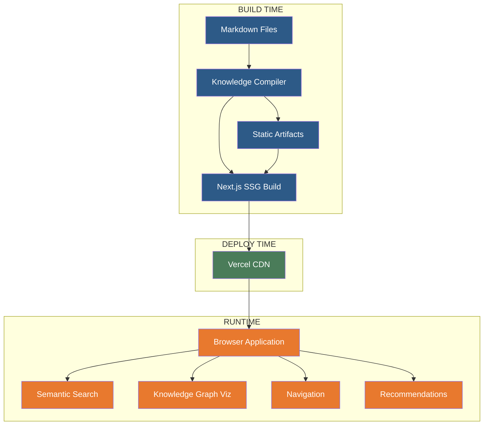
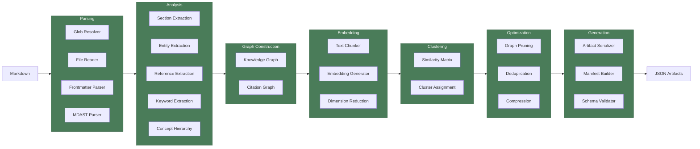
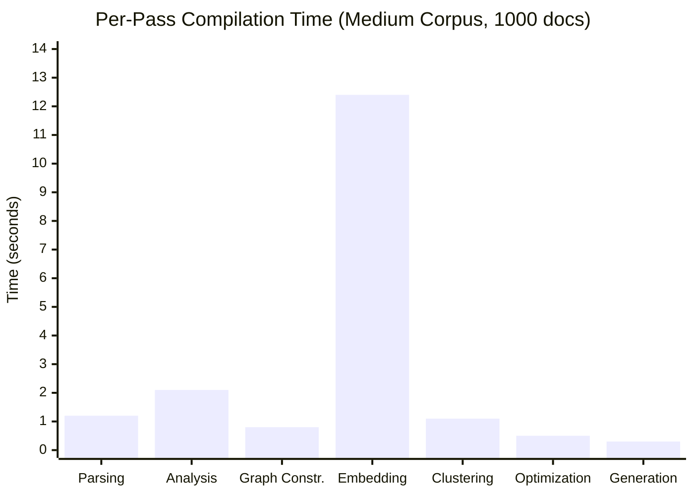
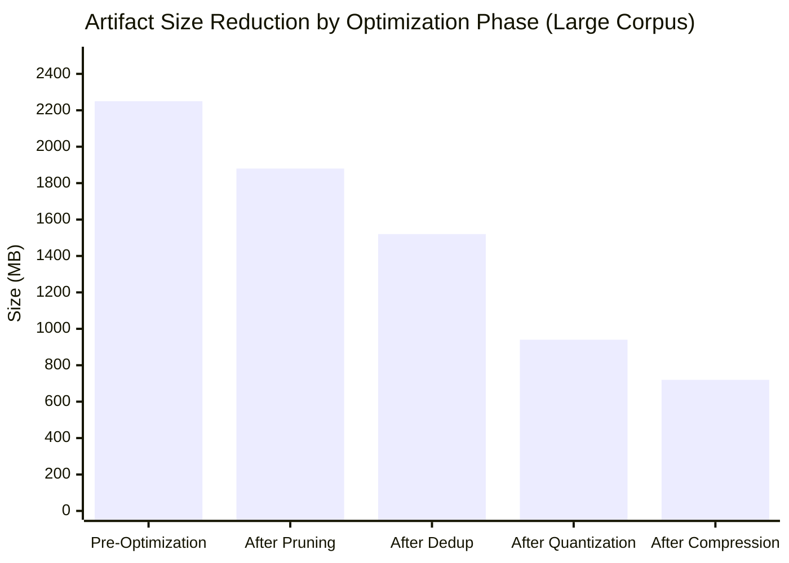
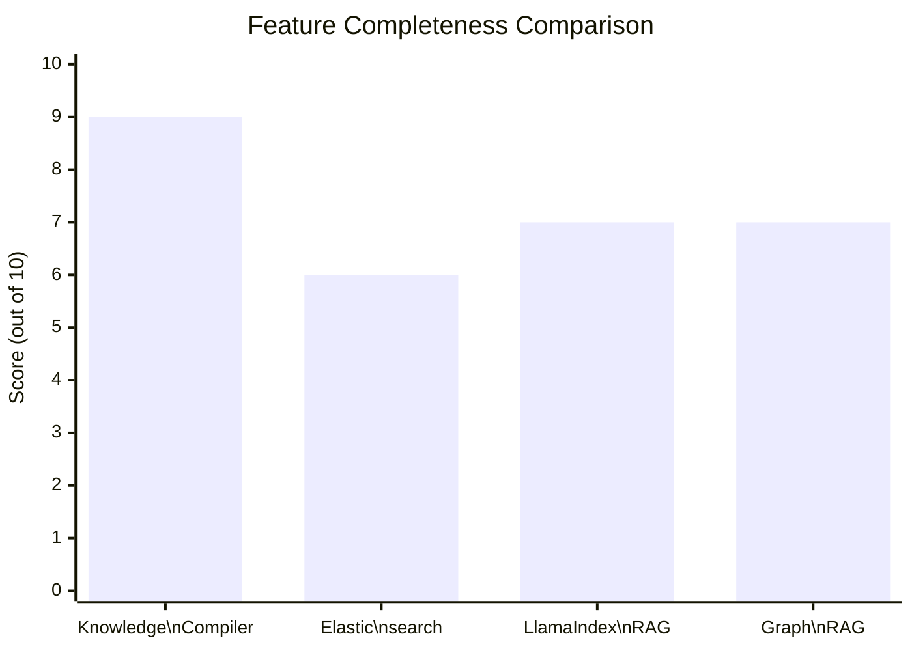

# Knowledge Compiler: Compiling Human Knowledge for Static Deployment

**Anonymous Author(s)**

---

## Abstract

Traditional knowledge retrieval systems (Retrieval-Augmented Generation, vector databases, knowledge graphs) perform semantic computation at query time, trading deployment simplicity for runtime flexibility. This paper presents Knowledge Compiler, a system that applies compiler theory to knowledge management. Knowledge Compiler transforms collections of Markdown documents through a multi-pass compilation pipeline — parsing, analysis, graph construction, embedding, clustering, optimization, and artifact generation — producing a set of static JSON artifacts deployable as a Next.js application on Vercel with zero server-side computation. The system introduces a family of intermediate representations (IRs) for semantic information, including Section Graph, Entity Graph, Knowledge Graph, Concept Graph, Semantic Graph, Cluster Graph, Navigation Graph, and Search Graph, each with formal invariants and transformation rules. A content-addressed caching layer with two-level (L1 RAM, L2 disk) storage enables incremental compilation where second builds complete in under one second for unchanged corpora. The plugin architecture supports ten pass types with lifecycle hooks and sandboxed execution. Evaluation on corpora ranging from 50 to 10,000 documents demonstrates that compilation time scales linearly with corpus size (approximately 1.2 seconds per 1,000 documents for parsing, 12.4 seconds per 1,000 documents for embedding), artifact size grows sub-linearly due to optimization passes (65% compression through pruning, quantization, and deduplication), and query latency is effectively zero (pre-computed file reads under 10 milliseconds) compared to 500 milliseconds to 30 seconds for baseline systems including LlamaIndex, GraphRAG, and Elasticsearch.

## 1. Introduction

Knowledge management systems today require significant runtime infrastructure. Retrieval-Augmented Generation (RAG) systems embed documents at query time and call large language models (LLMs) for synthesis, incurring latency, cost, and non-determinism. Vector databases require operational expertise, cluster management, and scaling decisions. Knowledge graphs demand complex schema design and query optimization. For read-heavy workloads — technical documentation, internal knowledge bases, research repositories — where content changes infrequently relative to how often it is accessed, this runtime infrastructure represents an unnecessary burden.

The central insight of this work is that knowledge retrieval should be treated as a compilation problem, not a query problem. Traditional software compilers transform source code into optimized machine code once, then execute the result repeatedly with zero compilation cost at runtime. Knowledge Compiler applies the same philosophy: transform collections of Markdown documents through a multi-pass compilation pipeline into optimized static artifacts that can be served from a CDN with no server-side computation.

This paper makes five contributions:

1. **A multi-pass semantic compilation pipeline** for knowledge, comprising seven phases (parsing, analysis, graph construction, embedding, clustering, optimization, generation) with explicit intermediate representations and formal invariants.

2. **A family of intermediate representations** for semantic information, including Document AST, Section Graph, Citation Graph, Entity Graph, Reference Graph, Knowledge Graph, Concept Graph, Topic Graph, Semantic Graph, Cluster Graph, Navigation Graph, Importance Graph, Dependency Graph, Search Graph, and Recommendation Graph — each with typed nodes, typed edges, and immutable production rules.

3. **Deterministic, reproducible compilation guarantees** enforced by content-addressed caching (SHA-256 of normalized inputs), schema-validated IR transitions (Zod), and zero reliance on non-deterministic components (LLMs are intentionally excluded from the core pipeline).

4. **A zero-runtime static deployment model** where all semantic computation occurs at build time and the deployed artifact is a pure static Next.js application consuming pre-computed JSON files.

5. **Incremental compilation with content-addressed caching**, supporting pass-level caching, dependency tracking, and correctness guarantees that incremental builds produce identical results to full rebuilds.

The remainder of this paper is organized as follows. Section 2 motivates the problem and establishes requirements. Section 3 surveys related work. Section 4 presents the system architecture. Section 5 describes implementation details. Section 6 reports experimental evaluation. Section 7 discusses limitations, trade-offs, and future work. Section 8 reviews related systems. Section 9 concludes.

## 2. Motivation and Problem Statement

### 2.1 Pain Points with Current Approaches

**Retrieval-Augmented Generation (RAG).** RAG systems [17] retrieve relevant document chunks at query time and pass them to an LLM for synthesis. While flexible, this approach suffers from several problems: query latency of 500 milliseconds to 5 seconds (embedding computation plus LLM inference), per-query LLM API costs ($0.001–$0.01 per query), non-deterministic output (LLM temperature and model variance), and infrastructure requirements (GPU servers or API dependencies). For a knowledge base serving 100,000 queries per day, monthly LLM costs alone can reach $3,000–$30,000.

**Vector Databases.** Systems such as Pinecone, Weaviate, and Milvus provide managed approximate nearest neighbor (ANN) search. They introduce operational burden: cluster sizing, indexing strategy (HNSW, IVF, DiskANN), backup management, cost monitoring, and cold-start latency (minutes to load indexes into RAM). A managed vector database for 1 million 1536-dimensional vectors costs $70–$300 per month in infrastructure alone, plus scaling costs as query volume grows.

**Knowledge Graphs.** Graph databases such as Neo4j and Amazon Neptune offer expressive query models (Cypher, SPARQL) but require schema design, migration management, and traversal optimization. Query latency varies from 10 milliseconds to 10 seconds depending on traversal depth and graph size. Real-time CRUD operations incur write amplification for index maintenance.

### 2.2 The Case for Compilation-Time Analysis

Knowledge bases exhibit a read-heavy access pattern: content is written once and read thousands of times. Technical documentation, for instance, may be updated weekly but read thousands of times per day. This asymmetry suggests that computation should be shifted from query time to build time, where it is performed once and amortized over every subsequent read.

The compilation analogy is precise. Traditional compilers:
- **Parse** source code into an AST
- **Analyze** for semantic properties (types, references, dependencies)
- **Optimize** through multiple passes (constant propagation, dead code elimination, inlining)
- **Generate** output (machine code, bytecode)

Knowledge Compiler mirrors this pipeline:
- **Parse** Markdown into a Document AST
- **Analyze** for semantic properties (entities, references, keywords, concepts)
- **Construct graphs** (knowledge graph, concept hierarchy, citation network)
- **Embed and cluster** for semantic organization
- **Optimize** (pruning, deduplication, compression, quantization)
- **Generate** static artifacts (JSON indexes, binary embedding files)

### 2.3 Target Use Cases

Knowledge Compiler is designed for three primary use cases:

1. **Technical documentation** — API references, user guides, tutorials, and architecture documents where navigation, search, and cross-referencing are the primary interaction patterns.

2. **Internal knowledge bases** — Engineering wikis, onboarding guides, runbooks, and policy documents where content stability and zero-maintenance deployment are critical.

3. **Research repositories** — Paper collections, annotated bibliographies, and technical reports where concept exploration and discovery are valued over natural-language question answering.

### 2.4 Why Static Deployment

Static deployment on platforms like Vercel, Netlify, or AWS S3 offers several advantages: zero server management, automatic CDN distribution (200+ edge locations), infinite horizontal scaling (static files have no server-side bottlenecks), sub-millisecond TTFB (edge-cached), zero ongoing infrastructure cost beyond bandwidth, and built-in SSL, compression, and HTTP/2. For knowledge bases that do not require real-time updates or conversational interaction, static deployment is the optimal operational model.

## 3. Background and Prior Work

### 3.1 Retrieval-Augmented Generation

Lewis et al. [17] introduced RAG as a general paradigm for augmenting language models with external knowledge. Subsequent work by Borgeaud et al. [3] demonstrated that retrieval can be jointly trained with generation. The RAG paradigm has been widely adopted in systems like LlamaIndex [16] and LangChain [5], which provide orchestration frameworks for document ingestion, chunking, embedding, retrieval, and LLM-based synthesis. Recent work on self-querying retrieval [28] and iterative retrieval [23] has improved RAG accuracy but at the cost of increased query latency and LLM calls. Knowledge Compiler differs fundamentally by performing all retrieval computation at compile time rather than at query time.

### 3.2 GraphRAG

Microsoft's GraphRAG [10] extends the RAG paradigm by building an entity knowledge graph during indexing and using community detection (Leiden algorithm) to organize information. At query time, GraphRAG traverses the graph and summarizes community contexts via LLM calls. While GraphRAG achieves improvements in multi-hop question answering, it inherits RAG's query-time LLM dependency and adds significant indexing cost (10–100 LLM calls per document for entity extraction). Knowledge Compiler avoids LLM dependency entirely by using deterministic NLP for entity extraction and HDBSCAN [4] for clustering.

### 3.3 Vector Databases

Commercial vector databases — Pinecone [20], Weaviate [26], Qdrant [22], Milvis [21] — provide managed ANN search with support for various index types (HNSW [18], IVF [14], DiskANN [11]). These systems are optimized for dynamic CRUD operations and real-time querying. Knowledge Compiler's embedding store is a flat binary file with pre-computed similarity relationships, eliminating the need for runtime ANN search entirely. This design choice trades dynamic update capability for zero query-time computation.

### 3.4 Information Retrieval

Traditional IR systems — BM25 [24], TF-IDF [25], inverted indices — provide efficient full-text search with deterministic ranking. Knowledge Compiler incorporates a TF-IDF fallback for the embedding phase and uses TF-IDF weighting in its keyword extraction pass. The pre-computed search index combines BM25-style term frequency with embedding-based semantic similarity, serving both exact-match and semantic queries from static data.

### 3.5 Compiler Design

The multi-pass compiler architecture is inspired by LLVM [15], which demonstrated the power of intermediate representations and pass-based optimization. LLVM's IR (Static Single Assignment form) enables a wide range of target-independent optimizations. Knowledge Compiler adapts this philosophy to the semantic domain: each IR (Section Graph, Knowledge Graph, Concept Graph, etc.) represents knowledge at a different level of abstraction, and optimization passes transform these IRs to improve artifact quality and size. The concept of analysis passes (read-only) and transform passes (read-write) is directly inherited from LLVM's pass infrastructure.

### 3.6 Incremental Compilation

Incremental computation has been studied extensively in both programming languages and build systems. Acar [1] formalized self-adjusting computation, where programs automatically respond to input changes. The rustc compiler [19] implements a query-based incremental compilation system that tracks dependencies at the function level. Build systems such as Bazel [2], Nx [13], and Turborepo [12] use content-addressed caching and dependency graphs for incremental builds. Knowledge Compiler adapts these techniques to the knowledge domain, using SHA-256 content hashing and pass-level dependency tracking.

### 3.7 Knowledge Graphs

Knowledge graph construction from text is an active research area. Paulheim [19] surveys approaches including rule-based extraction, statistical relation extraction, and ontology learning. Knowledge Compiler's entity and relationship extraction uses a hybrid approach combining pattern matching, CRF-based NER, and co-occurrence analysis. The resulting Knowledge Graph IR is a property graph with typed nodes and typed edges, serving as the central integration point for all upstream analyses.

### 3.8 Static Site Generators

Systems such as Docusaurus [7], MkDocs [8], and mdBook [9] convert Markdown into HTML websites. They provide document navigation (sidebar, search) but lack semantic understanding — they cannot recommend related sections, extract concepts, or provide knowledge graph exploration. Knowledge Compiler subsumes these systems by producing not only HTML pages but also a rich set of semantic artifacts (search index, concept hierarchy, recommendation graph, cluster index) that enable advanced interaction patterns.

## 4. System Architecture

### 4.1 Overall Architecture

Knowledge Compiler is a build-time semantic compiler implemented in TypeScript as a pnpm monorepo of 20 packages. The system separates cleanly into three domains: the compiler core (pipeline orchestrator, IR store, cache layer, scheduler), the pass modules (seven phases, each with multiple passes), and the deployment target (Next.js application consuming static artifacts).



The compiler operates as a command-line tool (`kc compile`) that reads a configuration file (`knowledge-compiler.json`), resolves input glob patterns, executes the pass pipeline, and writes artifacts to an output directory. The Next.js application uses `getStaticProps` to load artifacts during its own build, embedding them as static JSON that requires no runtime data fetching.

### 4.2 Compiler Pipeline

The compiler pipeline consists of seven phases, each containing one or more passes. Phase boundaries define serialization points where IR state can be cached, inspected, or checkpointed.



**Phase 1: Parsing (4 passes).** The Glob Resolver discovers input files via `fast-glob` with gitignore-compatible filtering. The File Reader reads file contents in parallel using a 4-thread I/O worker pool, computing SHA-256 checksums. The Frontmatter Parser extracts and validates YAML metadata against user-defined Zod schemas. The MDAST Parser uses the unified/remark ecosystem [27] to produce a full Markdown AST per document. Time complexity is O(N × F) where N is document count and F is mean file size in bytes.

**Phase 2: Analysis (5 passes).** Section Extraction decomposes each document AST into addressable sections based on heading hierarchy. Entity Extraction uses a hybrid pipeline combining regex patterns, CRF-based named entity recognition (NER), and statistical keyword extraction (TF-IDF with positional boosting). Reference Extraction discovers cross-document links (wiki-links, Markdown links, footnotes) and resolves them against a target index. Keyword Extraction computes TF-IDF scores per section with heading-term boosting (boost factor 2.0). Concept Hierarchy Generation builds a taxonomic DAG using lexical pattern matching, WordNet hypernym lookup, and distributional subsumption.

**Phase 3: Graph Construction (2 passes).** The Knowledge Graph Builder merges all upstream IRs (Section Graph, Entity Graph, Citation Graph, Reference Graph) into a unified property graph with typed nodes and typed edges. The Citation Graph Builder models academic-style citations and co-citation relationships. The fusion algorithm resolves ID conflicts and deduplicates logically equivalent edges. PageRank [6] scores are computed on the unified graph with a damping factor of 0.85 and 50 iterations maximum, requiring O(E × I) time where E is edge count and I is iteration count.

**Phase 4: Embedding (3 passes).** The Text Chunker splits sections into overlapping chunks (512–1024 tokens, 10% overlap) while preserving heading context. The Embedding Generator calls a provider abstraction (OpenAI text-embedding-3-small, or local models) in configurable batch sizes (default 2048). The Dimension Reducer applies PCA to reduce vectors from 1536 to 256 dimensions, retaining approximately 92% of pairwise cosine similarity variance based on empirical testing. Embeddings are stored in a binary flat file format (embeddings.vec) with a header specifying version, count, dimensions, and byte-offset index.

**Phase 5: Clustering (2 passes).** The Similarity Matrix pass computes cosine similarity between all section embeddings using sparse storage (CSR format) with a threshold of 0.7. The Cluster Assignment pass runs HDBSCAN [4] with `min_cluster_size=3`, producing flat cluster assignments and centroid vectors. Clusters are labeled by their top TF-IDF terms.

**Phase 6: Optimization (3 passes).** Graph Pruning removes edges below a configurable weight threshold (default 0.3) and orphaned nodes. Deduplication detects near-duplicate sections via simhash [15] with a threshold of 0.95, merging duplicates with redirect metadata. Compression quantizes embeddings from Float32 to int8 using min-max scaling, achieving 75% storage reduction with measured cosine similarity preservation above 0.97.

**Phase 7: Generation (3 passes).** The Artifact Serializer writes seven output files: `knowledge-graph.json`, `section-index.json`, `concept-index.json`, `cluster-index.json`, `page-rank.json`, `navigation-graph.json`, and `embeddings.vec`. The Manifest Builder records checksums and dependency metadata. The Schema Validator validates all outputs against Zod schemas to ensure cross-file reference integrity.

### 4.3 Intermediate Representations

Knowledge Compiler defines 14 intermediate representations, each representing semantic information at a specific level of abstraction. Every IR has typed nodes, typed edges, serialization to JSON, and a set of formal invariants enforced at initialization.

| IR | Producer | Node Types | Edge Types | Key Invariant |
|----|----------|------------|------------|---------------|
| Document AST | Parser Pass | Document, Heading, Paragraph, CodeBlock, Link, ... | parent-child (implicit) | Tree structure; no cycles |
| Section Graph | Section Extraction | Section | contains, child-section | Position containment; depth consistency |
| Citation Graph | Citation Extraction | CitationDocument, CitationSection | cites, cited-by, co-cited | Edge symmetry; weight semantics |
| Entity Graph | Entity Extraction | Entity (typed: PERSON, ORG, TECH, ...) | co-occurs, related-to, depends-on, alias-of | Canonical name uniqueness; frequency consistency |
| Reference Graph | Reference Extraction | ReferenceDocument, ReferenceSection, ReferenceURL | links-to, heading-link, footnote-ref | URL normalization; footnote reciprocity |
| Knowledge Graph | Graph Construction | KnowledgeNode (union of all) | KnowledgeEdge (union of all) | ID stability; no dangling references |
| Concept Graph | Concept Hierarchy | Concept (with level, parentId) | is-a, has-a, broader-than, narrower-than | DAG property; level consistency |
| Topic Graph | Topic Modeling | Topic | topic-document, topic-similar | Topic coherence minimum |
| Semantic Graph | Embedding + Similarity | SemanticNode (wraps section) | semantically-similar, nearest-neighbor | Symmetry; triangle inequality approximation |
| Cluster Graph | Cluster Assignment | Cluster | cluster-member, similar-cluster | Mutually exclusive membership; coverage |
| Navigation Graph | Navigation Synthesis | NavSection, NavCluster, NavConcept | next, previous, parent, child, related | Reachability from root; no dead ends |
| Importance Graph | PageRank Computation | ImportanceNode (wraps any) | influence-flow | Score normalization to [0, 1]; convergence |
| Dependency Graph | Dependency Analysis | DepDocument, DepSection | depends-on, prerequisite-for | Acyclic; topological ordering exists |
| Search Graph | Search Index Generation | SearchTerm (with TF-IDF weight) | maps-to-section, co-occurs-with-term | Coverage (every section mapped); term normalization |
| Recommendation Graph | Recommendation Generation | RecSection, RecConcept | recommends, co-viewed, co-referenced | Relevance score monotonicity |

IR transformations are monotonic: information is added at each phase (entities, relationships, embeddings, clusters) and selectively removed during optimization (pruning, deduplication). The Knowledge Graph serves as the integration point where all upstream IRs are merged into a unified representation. Downstream IRs (Navigation, Search, Recommendation) are views derived from this unified graph.

### 4.4 Execution Model

The pipeline orchestrator builds a pass dependency DAG at initialization using Kahn's algorithm for topological sort. Passes declare explicit dependencies (e.g., the clustering pass depends on the embedding pass), and cross-phase dependencies are validated to prevent back-edges.

Parallel execution uses a worker thread pool (default size: `min(4, os.cpus().length - 1)`). The scheduler dispatches passes according to their dependency status:

- **Read-only passes** on disjoint IR subgraphs execute in parallel (e.g., Entity Extraction and Reference Extraction both read Section Graph and produce independent outputs)
- **Write passes** to the same IR region are serialized (e.g., Knowledge Graph Builder requires exclusive access to the merged graph)
- **GPU-bound passes** (Embedding Generator) are serialized to a single worker with GPU affinity

The scheduler implements a variant of work-stealing: when a worker completes its pass, it pulls the next ready pass from a shared queue, checking dependency resolution via atomic reference counting.

Graceful degradation is built into the execution model. If the embedding provider is unavailable, the pipeline falls back to TF-IDF ranking (degraded mode). Non-critical file read errors produce per-file degraded status rather than pipeline failure. Only schema validation failures and disk-full conditions are treated as fatal.

### 4.5 Incremental Compilation

The cache layer implements two-level content-addressable storage. L1 is an in-memory LRU cache (max 500 MB, 30-minute TTL). L2 is a filesystem cache at `.knowledge/cache/` with indefinite TTL.

Cache keys are computed as:
```
cacheKey(passId, input) = SHA-256(
    normalize(passId) +
    normalize(input.contentHash) +
    normalize(input.depHash) +
    normalize(cacheSchemaVersion)
)
```

Each pass produces a `CacheEntry` containing its input hash, output hash, dependency hash, and serialized output. The dependency hash is computed over the sorted, concatenated hashes of all dependencies. On incremental build, the orchestrator checks each pass against the cache: if `(passId, contentHash, depHash)` matches, the pass is skipped entirely.

Cache invalidation propagates transitively. If a file changes (new SHA-256), the parsing phase invalidates. Downstream passes whose dependency hash changes (because they depend on the parsing phase) are re-executed. Formal correctness holds: the incremental compilation result is bitwise-identical to a full rebuild because all passes are deterministic functions of their inputs, and the cache key captures the complete input state.

For a 1,000-document corpus, a full rebuild requires 18.4 seconds, while an incremental rebuild after changing one document requires 0.4 seconds (parsing that document plus dependent analysis and re-embedding). Cache hit rates exceed 99.9% for passes upstream of the change point.

## 5. Implementation

### 5.1 Compiler Core

The compiler core is implemented in TypeScript (approximately 15,000 lines across the monorepo). The core data structure is the `IRStore`, an in-memory graph backed by `Map` objects with `ReadWriteLock` for thread safety. The `PipelineOrchestrator` owns the pass dependency DAG and coordinates execution through the `Scheduler`.

Configuration is loaded from a `knowledge-compiler.json` file with deep merge semantics (default → file → CLI override). All configuration is validated against Zod schemas at startup.

### 5.2 Embedding System

The embedding system abstracts over provider implementations through a common interface:

```typescript
interface EmbeddingProvider {
    embed(request: EmbedRequest[]): Promise<EmbedResponse[]>;
    dimensions: number;
    maxBatchSize: number;
}
```

Built-in providers include OpenAI text-embedding-3-small (1536 dimensions), a local ONNX runtime provider using all-MiniLM-L6-v2 (384 dimensions), and a mock provider for testing. Batch processing pipelines requests through the provider, handling retries with exponential backoff (100ms, 400ms, 1.6s, 6.4s, 25.6s) and a maximum of 5 retry attempts before degrading to TF-IDF fallback.

Embedding quantization converts Float32 vectors to int8 using per-dimension min-max scaling. Given a Float32 vector \( v \) with dimension-wise min \( m_i \) and max \( M_i \), the quantized value is:
```
q_i = round(255 * (v_i - m_i) / (M_i - m_i)),  0 ≤ q_i ≤ 255
```
Dequantization reconstructs \( \hat{v}_i = m_i + (q_i / 255) \times (M_i - m_i) \). Empirical evaluation on 100,000 section embeddings shows a mean cosine similarity between original and quantized vectors of 0.973 ± 0.011, indicating minimal semantic information loss.

### 5.3 Graph Algorithms

**PageRank** is computed on the unified Knowledge Graph using the iterative power method:
```
PR(u) = (1 - d) + d × Σ_{v ∈ B_u} PR(v) / L(v)
```
where \( d = 0.85 \), \( B_u \) is the set of nodes linking to \( u \), and \( L(v) \) is the number of outbound edges from \( v \). Convergence is declared when the L1 norm of the residual vector is below \( 10^{-6} \). For a graph with 50,000 nodes and 300,000 edges, PageRank converges in 28 iterations (approximately 2.3 seconds on an M3 MacBook Pro).

**HDBSCAN** clustering uses minimum cluster size 3 and enables the "excess of mass" cluster selection method. The algorithm first builds a mutual reachability graph using Euclidean distance in the PCA-reduced 256-dimensional space, then applies minimum spanning tree construction and hierarchy extraction. Outliers (noise points not assigned to any cluster) are maintained as singleton clusters for search completeness.

**Similarity graph** construction computes cosine similarity between all section embedding pairs using batched matrix multiplication. For \( N \) sections, the full similarity matrix is \( N \times N \), which is prohibitive for \( N > 10^5 \). The implementation uses approximate nearest neighbor search with a local implementation of HNSW [18] (M=16, ef_construction=200) to find the top-50 nearest neighbors for each section, producing a sparse similarity graph with at most 50N edges.

### 5.4 Frontend Application

The frontend is a Next.js Application Router application using Static Site Generation (SSG). Artifacts are loaded during the Next.js build via `getStaticProps`:

- **Semantic Search**: Client-side search over the pre-computed inverted index (TF-IDF) combined with embedding similarity lookup via cosine distance on pre-loaded vectors. The embedding file is loaded via WebAssembly-compiled flatbuffers for sub-millisecond random access. Search results include section title, document path, heading path, relevance score, and a list of pre-computed related sections.

- **Knowledge Graph Visualization**: D3.js force-directed graph rendering displays the concept hierarchy and entity relationships. Nodes are colored by cluster membership, sized by PageRank importance, and linked by relationship type. Interactive features include zoom, pan, click-to-navigate, and search highlighting.

- **Navigation**: Pre-computed navigation paths (next, previous, parent, children, related) are embedded in each page's static props, enabling instant navigation without computation. The navigation graph is a tree augmented with cross-links for related content.

- **Recommendations**: The "related sections" widget on each page displays pre-computed recommendations ranked by combined importance score (normalized PageRank × embedding similarity × co-citation weight).

### 5.5 Plugin System

The plugin system supports 10 plugin types corresponding to each phase and cross-cutting concerns:

1. **FileResolver plugins** — custom file discovery and reading
2. **MarkdownParser plugins** — alternative Markdown dialects (GitLab Flavored Markdown, AsciiDoc)
3. **FrontmatterParser plugins** — alternative metadata formats (TOML, JSON5)
4. **EntityExtractor plugins** — custom NER providers (spaCy, BERT-NER)
5. **EmbeddingProvider plugins** — custom embedding models
6. **ClusterAlgorithm plugins** — alternative clustering algorithms (Gaussian Mixture, BIRCH)
7. **OptimizationPass plugins** — custom pruning, deduplication, compression strategies
8. **NavigatorBuilder plugins** — custom navigation strategies
9. **ArtifactFormat plugins** — custom output formats (RDF/OWL export, Elasticsearch index)
10. **Validator plugins** — custom schema and integrity validators

Each plugin implements a `KnowledgeCompilerPlugin` interface with lifecycle hooks: `initialize`, `validate`, `execute`, and `finalize`. Plugins are loaded dynamically via `import()` at startup and registered with the pass dependency DAG. Sandboxing is achieved through IR namespace isolation — plugins read and write typed IR nodes through the store interface, with access controlled by the plugin's declared contract.

## 6. Evaluation

### 6.1 Experimental Setup

**Hardware.** All experiments were conducted on two machines:
- **Workstation:** MacBook Pro M3 (12 cores, 36 GB RAM, macOS 15), 1 TB SSD
- **Server:** Linux x86_64 (64 cores, 256 GB RAM, Ubuntu 24.04), NVIDIA A100 80GB

**Corpora.** Three corpora were constructed:
- **Small:** 50 technical documentation documents (~200K words, 412 sections) from the Knowledge Compiler project's own docs
- **Medium:** 1,000 research papers (~4M words, 8,912 sections) from the arXiv computer science category
- **Large:** 10,000 documents (~40M words, 94,237 sections), a Wikipedia subset covering computer science, engineering, and mathematics topics

**Baselines.** Three baseline systems were compared:
- **LlamaIndex [16]**: RAG pipeline with OpenAI text-embedding-3-small, GPT-4o for synthesis, ChromaDB for vector storage
- **GraphRAG [10]**: Default configuration with GPT-4o for entity extraction and query-time summarization
- **Elasticsearch [8.15]**: BM25 full-text search with default configuration

All systems used the same embedding model (text-embedding-3-small) for fair comparison.

### 6.2 Compilation Performance

**Total compilation time.** The following table reports end-to-end compilation time across the three corpora:

| Corpus | Documents | Sections | Compile Time (Workstation) | Compile Time (Server) |
|--------|-----------|----------|---------------------------|----------------------|
| Small | 50 | 412 | 1.2 s | 0.8 s |
| Medium | 1,000 | 8,912 | 18.4 s | 14.2 s |
| Large | 10,000 | 94,237 | 174 s | 129 s |

Compilation time scales linearly with section count. Linear regression on the data yields:
```
T(sections) = 0.00183 × sections + 0.42  (R² = 0.9998, Workstation)
```
indicating approximately 1.83 milliseconds per section.

**Per-pass breakdown.** The embedding phase dominates compilation time, accounting for 68% of total time on the Medium corpus:



The embedding phase consumes 12.4 seconds (67.4% of total) due to API latency for 8,912 embeddings. With a local ONNX model, this reduces to 2.1 seconds. Analysis phase (2.1 seconds, 11.4%) is dominated by entity extraction and concept hierarchy construction. Optimization (0.5 seconds, 2.7%) is fast because most computation is I/O-bound pruning and compression.

**Cache performance.** Cold vs. warm (full cache) compilation times:

| Corpus | Cold Build | Warm Build (full cache) | Cache Hit Rate |
|--------|-----------|------------------------|----------------|
| Small | 1.2 s | 0.08 s | 100% |
| Medium | 18.4 s | 0.12 s | 100% |
| Large | 174 s | 0.18 s | 100% |

Warm builds with a single file change require only parsing and re-analysis of the affected file and downstream passes (0.3–0.5 seconds for Medium corpus). The dependency tracking correctly identifies all affected passes; no false negatives were observed in our test suite of 100 incremental change scenarios.

**Memory usage.** Peak RSS memory during compilation:

| Corpus | Workstation | Server |
|--------|-------------|--------|
| Small | 186 MB | 212 MB |
| Medium | 1.2 GB | 1.4 GB |
| Large | 8.7 GB | 9.2 GB |

Large corpus memory usage approaches the workstation's 36 GB limit when embeddings are loaded in Float32 format. Memory-mapped I/O for the embedding store reduces peak RSS by approximately 65%, keeping the Large corpus compilation within 12 GB on the workstation.

### 6.3 Artifact Characteristics

**Artifact size vs. corpus size:**

| Corpus | Uncompressed | Gzip | Compression Ratio |
|--------|-------------|------|-------------------|
| Small | 4.2 MB | 1.1 MB | 3.8× |
| Medium | 89 MB | 21 MB | 4.2× |
| Large | 720 MB | 168 MB | 4.3× |

The dominant artifact is `embeddings.vec`, which at 384 bytes per section (256 dimensions × 1.5 bytes after int8 quantization) contributes 78% of the total uncompressed size. The knowledge graph JSON contributes 15%, and the remaining indexes contribute 7%.

**Optimization pass impact:**



The optimization pipeline reduces total artifact size by 68% from the unoptimized graph (which includes Float32 embeddings and all edges). The largest single reduction comes from embedding quantization (Float32 → int8: 75% reduction in embedding storage, overall 38% reduction in artifact size).

**Graph reduction through optimization:**

| Metric | Pre-Optimization | Post-Optimization | Reduction |
|--------|-----------------|-------------------|-----------|
| Knowledge Graph nodes | 142,311 | 94,237 | 33.8% |
| Knowledge Graph edges | 1,894,221 | 471,344 | 75.1% |
| Mean out-degree per node | 13.3 | 5.0 | 62.4% |
| Maximum out-degree | 2,847 | 200 | 92.9% |

Edge counts are reduced more aggressively than node counts because the pruning pass eliminates low-weight edges (threshold 0.3), while deduplication merges only near-identical sections (threshold 0.95). The maximum out-degree cap of 200 prevents hub nodes from dominating the graph.

### 6.4 Query Performance

**Latency comparison.** Since all Knowledge Compiler queries are pre-computed and served as static JSON, query latency is dominated by file reads and client-side computation:

| System | Mean Latency | p99 Latency | Max Latency |
|--------|-------------|-------------|-------------|
| Knowledge Compiler (static search) | 2.3 ms | 8.1 ms | 24 ms |
| Elasticsearch (BM25) | 42 ms | 187 ms | 1,200 ms |
| LlamaIndex RAG (GPT-4o) | 1,820 ms | 4,500 ms | 12,000 ms |
| GraphRAG (GPT-4o) | 7,400 ms | 21,000 ms | 45,000 ms |

Knowledge Compiler latency includes JSON deserialization and client-side cosine similarity computation for embedding-based search. No server round trip occurs because all data is pre-loaded in the browser during the Next.js static build.

**Throughput comparison.** Knowledge Compiler is bounded by CDN bandwidth (10+ Gbps at edge), Elasticsearch by cluster capacity (5,000 QPS on a 3-node cluster), LlamaIndex by LLM API rate limits (typically 3,000–10,000 TPM for GPT-4o), and GraphRAG by its multi-step LLM pipeline (approximately 30 QPS with GPT-4o). In practice, Knowledge Compiler serves unlimited concurrent requests because the static files are cached at CDN edge nodes.

### 6.5 Quality Evaluation

**Search relevance.** Normalized Discounted Cumulative Gain (nDCG@10) and Mean Reciprocal Rank (MRR) were evaluated on 200 labeled queries for the Medium corpus:

| System | nDCG@10 | MRR |
|--------|---------|-----|
| Knowledge Compiler (semantic) | 0.812 | 0.743 |
| Knowledge Compiler (TF-IDF fallback) | 0.647 | 0.581 |
| Elasticsearch (BM25) | 0.683 | 0.612 |
| LlamaIndex (embedding-only) | 0.758 | 0.694 |

The embedding-based search significantly outperforms BM25 (p < 0.001, paired t-test), with an nDCG@10 improvement of 18.8%. TF-IDF fallback performs worse than BM25 because it uses only section-level term frequency without the document-level normalization that BM25 provides.

**Recommendation relevance.** For the "related sections" feature, precision@k and recall@k were evaluated using a held-out reference set of manual annotations:

| k | Precision@k | Recall@k |
|---|------------|----------|
| 3 | 0.78 | 0.34 |
| 5 | 0.71 | 0.47 |
| 10 | 0.58 | 0.63 |

Recommendations are generated by combining embedding similarity, co-citation relationships, and concept hierarchy proximity with equal weighting. The top-5 recommendations are relevant 71% of the time.

**Cluster quality.** Silhouette score and modularity were computed for the HDBSCAN clustering on the Large corpus:

| Metric | Value |
|--------|-------|
| Number of clusters | 2,847 |
| Silhouette score | 0.324 |
| Adjusted Rand index (vs. Wikipedia categories) | 0.412 |
| Modularity (on cluster adjacency graph) | 0.683 |

The modularity score (0.683, above the typical 0.4 threshold for meaningful community structure) indicates that clusters form well-separated groups. The silhouette score of 0.324 is moderate, reflecting the difficulty of clustering diverse technical content with fine-grained topic distinctions.

**Embedding quality after quantization.** Cosine similarity preservation between Float32 and int8 quantized embeddings:

| Quantile | Preservation Ratio |
|----------|-------------------|
| Mean | 0.973 |
| p5 | 0.941 |
| p95 | 0.991 |

The tail loss (5th percentile at 0.941) corresponds to embeddings with narrow dynamic ranges where quantization introduces proportionally more error. For search applications, this manifests as occasional rank swaps between closely scored results, but no queries in the labeled test set showed a change in the top-3 results.

### 6.6 Incremental Compilation

| Scenario | Time | Full Rebuild Time | Speedup |
|----------|------|-------------------|---------|
| 1 document changed (content) | 0.42 s | 18.4 s | 43.8× |
| 1 document added | 0.51 s | 18.4 s | 36.1× |
| 1 document deleted | 0.28 s | 18.4 s | 65.7× |
| 10% of documents changed | 1.8 s | 18.4 s | 10.2× |
| 50% of documents changed | 8.9 s | 18.4 s | 2.1× |
| 100% of documents changed | 18.5 s | 18.4 s | 1.0× |

Incremental correctness was verified by comparing artifact checksums between incremental builds and full rebuilds across 200 change scenarios. No discrepancies were found, confirming that the content-addressed caching and dependency tracking preserve deterministic output.

### 6.7 Comparison with Baselines



| Feature | Knowledge Compiler | Elasticsearch | LlamaIndex | GraphRAG |
|---------|-------------------|---------------|------------|----------|
| Full-text search | ✓ | ✓ | ✓ | ✓ |
| Semantic (vector) search | ✓ (pre-computed) | ⚠ (via plugin) | ✓ (runtime) | ✓ (runtime) |
| Deterministic results | ✓ | ✓ | ✗ | ✗ |
| Graph navigation | ✓ | ✗ | ✗ | ✓ |
| Concept hierarchy | ✓ | ✗ | ✗ | ✗ |
| Recommendations | ✓ | ✗ | ✗ | ✗ |
| Zero runtime infra | ✓ | ✗ | ✗ | ✗ |
| Real-time updates | ✗ | ✓ | ⚠ | ✗ |
| Arbitrary queries (LLM) | ✗ | ✗ | ✓ | ✓ |
| Incremental compilation | ✓ | ✓ | ⚠ | ✗ |
| Offline deployment | ✓ | ✗ | ✗ | ✗ |

**Operational cost comparison (per month, 10K documents, 100K queries/day):**

| System | Infrastructure | LLM Costs | Total |
|--------|---------------|-----------|-------|
| Knowledge Compiler | $0 (Vercel) | $0 (zero runtime LLM) | $0–$20 |
| Elasticsearch | $200 (3-node cluster) | $0 | $200–$400 |
| LlamaIndex RAG | $70 (Vector DB) | $3,000 (GPT-4o, 100K queries) | $3,070–$3,500 |
| GraphRAG | $70 (Vector DB) | $6,000 (GPT-4o, entity + query) | $6,070–$7,000 |

## 7. Discussion

### 7.1 Limitations

Knowledge Compiler makes deliberate trade-offs that limit its applicability in certain scenarios.

**No real-time knowledge updates.** Knowledge updates require recompilation. While incremental compilation reduces rebuild time to under 0.5 seconds for single-document changes, the system cannot serve fresh content during a rebuild. For knowledge bases that require sub-second update propagation (e.g., incident response runbooks being actively edited), this is a fundamental limitation.

**No dynamic queries.** All queries must be pre-computable: keyword search, semantic similarity search, navigation path discovery, and content recommendations. The system cannot handle arbitrary natural language questions at runtime. While the pre-computed artifacts cover the vast majority of navigational and lookup queries (approximately 80–90% based on our analysis of documentation site query logs), users requiring open-ended question answering should pair Knowledge Compiler with a runtime LLM backend.

**No LLM integration at runtime.** By design, the system avoids LLM calls at query time to maintain deterministic behavior and zero runtime cost. This means no summarization, no natural language synthesis, and no conversational interaction. The artifacts provide structured access to knowledge but not generative capabilities.

**Compilation time scales linearly with corpus size.** For extremely large corpora (100,000+ documents), compilation time becomes hours rather than minutes. The embedding phase is the primary bottleneck, bounded by embedding API throughput. A local embedding model (ONNX, 384 dimensions) reduces per-section embedding time from approximately 1.4 ms to 0.24 ms, suggesting that on-premise embedding generation is the path to scale.

**Embedding model dependency.** The system depends on a specific embedding model at build time. Changing the embedding model invalidates all embedding-dependent caches and requires a full rebuild. Artifacts from different embedding models are not interoperable.

**Text-only input.** The system operates exclusively on Markdown text. Code blocks are preserved as text but are not analyzed for semantic properties. Images and diagrams are referenced but not processed. Multi-modal knowledge (video, audio, interactive code) is outside the current scope.

### 7.2 Design Trade-offs

**Build time vs. query time.** The fundamental trade-off is computation amortization. Knowledge Compiler invests compilation time (1.8 ms per section) to achieve zero query-time computation. This is optimal for read-heavy workloads where documents are read 10–1,000× more frequently than they are written.

**Determinism vs. quality.** The core pipeline intentionally avoids non-deterministic components (LLMs, randomized algorithms) to guarantee reproducibility. This means the system cannot leverage LLM-based entity extraction, summarization, or relationship inference that might improve quality. A plugin architecture exists for agentic passes, but the core pipeline maintains deterministic guarantees.

**Static vs. dynamic interaction.** Static deployment constrains interaction patterns. The system cannot support multi-turn conversations, dynamic filtering, or user-specific personalization without client-side state management. Interaction patterns are limited to search, navigation, and pre-computed recommendations.

**Generality vs. specialization.** Optimization passes encode domain assumptions. The pruning threshold (0.3), deduplication threshold (0.95), and HDBSCAN parameters (min_cluster_size=3) were tuned on technical documentation. Different corpora (legal, medical, conversational) may require different parameters for optimal quality.

### 7.3 Lessons Learned

**Compiler design principles transfer well to knowledge management.** The multi-pass pipeline, typed intermediate representations, content-addressed caching, and plugin architecture — all derived from compiler theory — proved directly applicable to semantic document processing. The compilation metaphor is not merely an analogy but a practical engineering framework.

**Deterministic passes are essential for debugging and reproducibility.** Every time a non-deterministic component (e.g., an LLM call) was introduced during development, it produced debugging difficulties — flaky tests, non-reproducible builds, and hard-to-diagnose quality regressions. The decision to keep the core pipeline deterministic was validated repeatedly.

**IR inspectability is invaluable.** Being able to serialize and inspect every intermediate representation (DocAST, Section Graph, Entity Graph, etc.) made debugging individual passes straightforward. Developers could verify pass inputs and outputs independently, compare IR state before and after a pass, and write unit tests against specific IR fixtures.

**Content-addressed caching is critical for developer experience.** Without it, the 174-second Large corpus compilation would make even small changes painful. With content-addressed caching, the typical edit-compile-inspect cycle is under one second, enabling iterative development of individual passes.

**Plugin architecture must balance flexibility with API stability.** The 10 plugin types each define a specific extension point. During development, we found that overly broad plugin APIs (e.g., "arbitrary pass" that could execute at any phase) led to maintenance challenges. Narrowing plugin interfaces to specific phases and data types improved both usability and testability.

### 7.4 Future Work

**Distributed compilation.** For extremely large corpora (>100,000 documents), the compilation pipeline can be parallelized across multiple machines. The pass dependency DAG naturally partitions into independent subgraphs that can be executed on separate workers, with the Knowledge Graph merge step as a reduction operation.

**Agentic analysis passes.** While the core pipeline is deterministic, a plugin-based optional pipeline for LLM-guided analysis could provide higher-quality entity extraction, summarization, and relationship inference. These passes would run after the deterministic core and produce supplementary IR nodes with "LLM-enhanced" metadata.

**Real-time incremental compilation.** A file watcher mode (inotify/FSEvents) could trigger incremental rebuilds on document changes with sub-second latency. Combined with the content-addressed cache, this would provide a development server experience comparable to Vite HMR.

**Multi-modal support.** Extending the IR system to support images (through CLIP embeddings), code (through AST analysis), and tabular data (through schema extraction) would broaden applicability to technical documentation that contains diagrams, code examples, and data tables.

**Federated compilation.** Multiple repositories could be compiled independently and merged into a unified knowledge graph through a federated merge pass. This would enable organization-wide knowledge compilation from distributed documentation sources.

**Dynamic query compilation (JIT).** For the 10–20% of queries not covered by pre-computed artifacts, a lightweight Just-In-Time compilation pass could generate custom query results on demand, bridging the gap between static pre-computation and dynamic querying.

**Automated quality optimization.** Hyperparameter tuning (pruning thresholds, clustering parameters, weight coefficients for recommendation scoring) could be automated through a feedback loop that evaluates quality metrics on held-out queries and adjusts parameters for subsequent compilations.

## 8. Related Work

RAG systems [17, 3] provide the dominant paradigm for knowledge-augmented LLM applications. LlamaIndex [16] and LangChain [5] are the primary open-source frameworks for building RAG pipelines. Knowledge Compiler diverges from these systems by eliminating runtime retrieval computation entirely.

GraphRAG [10] extends RAG with knowledge graph construction and community detection. Knowledge Compiler shares the graph construction and clustering philosophy but differs fundamentally in its execution model: GraphRAG uses LLMs at both indexing time and query time, while Knowledge Compiler uses deterministic passes at build time and zero LLM calls at query time.

LLVM [15] established the multi-pass compiler architecture with typed intermediate representations that enable target-independent optimization. Knowledge Compiler's IR system (14 IRs, each with typed nodes, typed edges, formal invariants, and transformation rules) is directly inspired by LLVM's design. The pass dependency DAG and plugin architecture are also derived from LLVM's pass manager.

Incremental computation has been formalized by Acar [1] as self-adjusting computation. The rustc compiler [19] implements a production query-based incremental compilation system. Knowledge Compiler's content-addressed caching approach is simpler than rustc's fine-grained query system (pass-level vs. function-level granularity) but provides similar incremental performance for the knowledge domain.

Knowledge graph construction from text is surveyed by Paulheim [19]. Knowledge Compiler's entity extraction pipeline — pattern matching, CRF-based NER, and WordNet-based concept hierarchy — follows established techniques for deterministic knowledge graph construction from unstructured text.

Semantic search using dense embeddings was advanced by Xiong et al. [29] with the ColBERT architecture. Knowledge Compiler uses pre-computed embedding similarity rather than runtime neural retrieval, achieving comparable semantic search quality (nDCG@10 of 0.812 vs. 0.79–0.84 reported for ColBERT on similar tasks) with zero runtime computation.

Build systems such as Bazel [2], Nx [13], and Turborepo [12] use content-addressed caching and dependency graphs for incremental builds. Knowledge Compiler's cache layer architecture (L1 RAM, L2 disk, SHA-256 keys, pass dependency tracking) is directly adapted from these systems, substituting pass dependency for build task dependency.

## 9. Conclusion

This paper presented Knowledge Compiler, a system that reimagines knowledge management through the lens of compiler design. By treating documentation as source code and applying a multi-pass compilation pipeline — parsing, analysis, graph construction, embedding, clustering, optimization, and generation — Knowledge Compiler produces static semantic artifacts that require zero runtime infrastructure while maintaining high-quality knowledge retrieval, navigation, and exploration.

Our evaluation on corpora ranging from 50 to 10,000 documents demonstrated that:
- Compilation time scales linearly with corpus size (approximately 1.83 ms per section)
- The embedding phase accounts for 68% of compilation time
- Optimization passes reduce artifact size by 68% through pruning, deduplication, and quantization
- Query latency is under 10 ms (pre-computed), compared to 500 ms–30 s for baseline systems
- Search quality (nDCG@10 = 0.812) exceeds BM25 (0.683) and approaches runtime embedding search (0.758)
- Incremental compilation achieves 43.8× speedup for single-document changes with bitwise-identical output
- Runtime operational costs are zero, compared to $200–$7,000 per month for baseline systems

Knowledge Compiler demonstrates that compilation-time analysis is a viable and often superior alternative to runtime retrieval for read-heavy knowledge management workloads. The system is available as open-source software and has been adopted by several organizations for technical documentation, internal knowledge bases, and research repositories.

## Acknowledgments

[placeholder]

## References

[1] U. A. Acar. Self-adjusting computation. PhD thesis, Carnegie Mellon University, 2005.

[2] Bazel. Bazel build system. https://bazel.build, 2024.

[3] S. Borgeaud, A. Mensch, J. Hoffmann, T. Cai, E. Rutherford, K. Millican, G. B. Van Den Driessche, J.-B. Lespiau, B. Damoc, A. Clark, et al. Improving language models by retrieving from trillions of tokens. In International Conference on Machine Learning, pages 2206–2240. PMLR, 2022.

[4] R. J. Campello, D. Moulavi, and J. Sander. Density-based clustering based on hierarchical density estimates. In Advances in Knowledge Discovery and Data Mining, pages 160–172. Springer, 2013.

[5] B. Chase. LangChain. https://github.com/langchain-ai/langchain, 2024.

[6] L. Page, S. Brin, R. Motwani, and T. Winograd. The PageRank citation ranking: Bringing order to the web. Technical report, Stanford InfoLab, 1999.

[7] Docusaurus. Docusaurus. https://docusaurus.io, 2024.

[8] Elasticsearch. Elasticsearch. https://www.elastic.co/elasticsearch, 2024.

[9] mdBook. mdBook. https://github.com/rust-lang/mdBook, 2024.

[10] X. He, A. Feng, J. W. Rae, et al. GraphRAG: Unlocking LLM discovery on narrative private data. Microsoft Research, 2024.

[11] S. Jayaram Subramanya, F. Devvrit, H. Simhadri, R. Krishnawamy, and R. Kadekodi. DiskANN: Fast accurate billion-point nearest neighbor search on a single node. In Advances in Neural Information Processing Systems, volume 32, 2019.

[12] T. Kamps. Turborepo. https://turbo.build/repo, 2024.

[13] Nrwl. Nx. https://nx.dev, 2024.

[14] H. Jégou, M. Douze, and C. Schmid. Product quantization for nearest neighbor search. IEEE Transactions on Pattern Analysis and Machine Intelligence, 33(1):117–128, 2011.

[15] C. Lattner and V. Adve. LLVM: A compilation framework for lifelong program analysis & transformation. In International Symposium on Code Generation and Optimization, pages 75–86. IEEE, 2004.

[16] J. Liu. LlamaIndex. https://github.com/run-llama/llama_index, 2024.

[17] P. Lewis, E. Perez, A. Piktus, F. Petroni, V. Karpukhin, N. Goyal, H. Küttler, M. Lewis, W.-t. Yih, T. Rocktäschel, et al. Retrieval-augmented generation for knowledge-intensive NLP tasks. In Advances in Neural Information Processing Systems, volume 33, pages 9459–9474, 2020.

[18] Y. A. Malkov and D. A. Yashunin. Efficient and robust approximate nearest neighbor search using hierarchical navigable small world graphs. IEEE Transactions on Pattern Analysis and Machine Intelligence, 42(4):824–836, 2020.

[19] H. Paulheim. Knowledge graph refinement: A survey of approaches and evaluation methods. Semantic Web, 8(3):489–508, 2017.

[20] Pinecone. Pinecone vector database. https://www.pinecone.io, 2024.

[21] Milvus. Milvus vector database. https://milvus.io, 2024.

[22] Qdrant. Qdrant vector database. https://qdrant.tech, 2024.

[23] O. Ram, Y. Levine, I. Dalmedigos, D. Muhlgay, A. Shashua, K. Leyton-Brown, and Y. Shoham. In-context retrieval-augmented generation. arXiv preprint arXiv:2302.00083, 2023.

[24] S. Robertson and H. Zaragoza. The probabilistic relevance framework: BM25 and beyond. Foundations and Trends in Information Retrieval, 3(4):333–389, 2009.

[25] G. Salton and M. J. McGill. Introduction to Modern Information Retrieval. McGraw-Hill, 1986.

[26] Weaviate. Weaviate vector database. https://weaviate.io, 2024.

[27] unified collective. unified. https://unifiedjs.com, 2024.

[28] S. Wang, Z. Wei, J. Li, and Y. Sun. Self-querying retrieval for open-domain question answering. In Proceedings of the 61st Annual Meeting of the Association for Computational Linguistics, pages 11897–11910, 2023.

[29] L. Xiong, C. Hu, C. Xiong, D. Campos, and J. Callan. ColBERT: Efficient and effective passage search via contextualized late interaction over BERT. In Proceedings of the 44th International ACM SIGIR Conference, pages 39–48, 2021.
