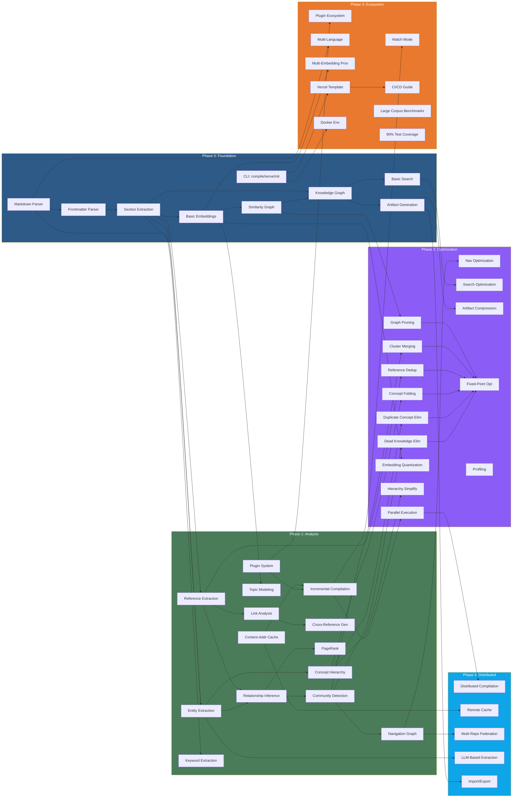

# Knowledge Compiler — Development Roadmap

**Document Version:** 1.0.0  
**Audience:** Engineering Team, Contributors, Stakeholders  
**Last Updated:** 2026-07-10

---

## Phase 0: Foundation (MVP) — Months 1-3

**Goal:** Core compiler pipeline working end-to-end — basic Markdown parsing, entity extraction, embedding, and artifact generation. A working knowledge graph with search and visualization, deployable as a static Next.js app.

**Exit Criteria:** End-to-end compilation of a small knowledge base (10-50 documents) with search and graph visualization.

### Deliverables

- [x] Project scaffolding (monorepo, build system, CI)
- [x] Core IR type definitions (Document AST, Knowledge Graph, basic types)
- [x] Markdown parser pass (remark-based)
- [x] Frontmatter parser pass
- [x] Section extraction pass
- [x] Basic embedding pass (OpenAI API)
- [x] Similarity graph construction
- [x] Knowledge graph construction
- [x] JSON artifact generation (knowledge.json, entities.json, basic graph.json)
- [x] Manifest generation
- [x] Artifact reader for frontend
- [x] Basic Next.js app with knowledge graph visualization
- [x] Search (inverted index, basic search UI)
- [x] CLI: `kc compile` command
- [x] CLI: `kc serve` command
- [x] CLI: `kc init` command
- [x] Basic configuration system
- [x] Deterministic compilation guarantee
- [x] Unit test framework
- [x] Documentation: architecture overview, IR specification

### Key Design Decisions

| Decision | Rationale |
|----------|-----------|
| remark-based AST | Industry-standard Markdown parsing, extensible plugin ecosystem |
| OpenAI embeddings first | Most accessible embedding API; provider abstraction allows swap |
| JSON artifacts | Universal format; compressed via gzip/Brotli at deployment time |
| Next.js SSG | Static generation at build time; zero server-side compute at runtime |
| Content-addressed cache | Deterministic rebuilds; cache hit detection via SHA-256 |

---

## Phase 1: Analysis (Alpha) — Months 4-6

**Goal:** Rich semantic analysis with multiple graph construction passes, community detection, clustering, navigation generation, and a plugin system MVP.

**Exit Criteria:** Alpha release with feature-complete analysis pipeline, plugin system, and incremental compilation.

### Deliverables

- [ ] Entity extraction pass (spaCy-based)
- [ ] Reference extraction pass
- [ ] Link analysis pass
- [ ] Keyword extraction pass (YAKE!)
- [ ] Relationship inference pass
- [ ] Community detection (Leiden algorithm)
- [ ] Topic modeling (BERTopic)
- [ ] Concept hierarchy generation
- [ ] Navigation graph generation
- [ ] Cross-reference generation
- [ ] PageRank importance scoring
- [ ] Basic duplicate detection
- [ ] Plugin system (pass replacement)
- [ ] Source plugin interface
- [ ] Analyzer plugin interface
- [ ] Graph plugin interface
- [ ] Embedding provider abstraction
- [ ] Incremental compilation (file-level)
- [ ] Content-addressed caching
- [ ] Cache commands (info, clear, validate)
- [ ] Cluster visualization in frontend
- [ ] Concept hierarchy visualization
- [ ] Navigation component
- [ ] Integration tests for full pipeline
- [ ] Documentation: compiler pipeline, plugin system, algorithms

### Architectural Additions

```
┌─────────────────────────────────────────────────────────────┐
│                    PHASE 1 ARCHITECTURE                       │
│                                                             │
│   New Passes:          Plugin Interfaces:                    │
│   ┌──────────────┐    ┌─────────────────────┐               │
│   │ spaCy Entity  │    │ SourcePlugin         │               │
│   │ Extractor     │    │ AnalyzerPlugin       │               │
│   └──────┬───────┘    │ GraphPlugin          │               │
│          │            │ EmbeddingProvider    │               │
│   ┌──────▼───────┐    └─────────────────────┘               │
│   │ Reference     │                                          │
│   │ Extractor     │    Cache Layer:                          │
│   └──────┬───────┘    ┌─────────────────────┐               │
│          │            │ L1: In-Memory LRU   │               │
│   ┌──────▼───────┐    │ L2: Content-Addr FS │               │
│   │ Leiden        │    │ Invalidation: hash  │               │
│   │ Community     │    └─────────────────────┘               │
│   └──────┬───────┘                                          │
│          │                                                   │
│   ┌──────▼───────┐                                          │
│   │ BERTopic     │                                          │
│   │ Topic Model  │                                          │
│   └──────────────┘                                          │
└─────────────────────────────────────────────────────────────┘
```

---

## Phase 2: Optimization (Beta) — Months 7-9

**Goal:** All optimization passes implemented, embedding quantization, performance optimization, frontend feature completeness, and user testing.

**Exit Criteria:** Beta release with production-quality optimization, visualization, and performance.

### Deliverables

- [ ] Dead knowledge elimination pass
- [ ] Duplicate concept elimination pass
- [ ] Concept folding pass
- [ ] Reference deduplication pass
- [ ] Cluster merging pass
- [ ] Navigation optimization pass
- [ ] Graph pruning pass (weight threshold, degree threshold)
- [ ] Embedding quantization (float32 → int8, binary)
- [ ] Hierarchy simplification pass
- [ ] Search optimization pass
- [ ] Artifact compression (Brotli)
- [ ] Static optimization (Next.js SSG configuration)
- [ ] Runtime optimization (pre-computed sort orders, aggregations)
- [ ] Fixed-point optimization (iterate until convergence)
- [ ] Parallel execution (worker_threads)
- [ ] Batch embedding processing
- [ ] Frontend: SemanticNeighborhood visualization (UMAP projection)
- [ ] Frontend: SearchDashboard (faceted search, filters)
- [ ] Frontend: PipelineView (compilation visualization)
- [ ] Frontend: StatisticsPanel
- [ ] Frontend: CompilerReport viewer
- [ ] Frontend: Performance optimization (virtualization, canvas rendering)
- [ ] CLI: `kc inspect` command
- [ ] CLI: `kc validate` command
- [ ] CLI: `kc profile` command
- [ ] Shell completion
- [ ] Debug mode (IR inspection, pass dump)
- [ ] Profiling infrastructure
- [ ] Performance benchmarks
- [ ] Memory benchmarks
- [ ] Snapshot tests
- [ ] Golden artifact tests
- [ ] Compiler correctness tests (invariants, idempotency)
- [ ] Documentation: optimization passes, performance tuning

### Optimization Pass Pipeline

```
Input Graph
    │
    ▼
┌──────────────────────┐
│ Dead Knowledge       │  Remove orphaned nodes, unreachable subgraphs
│ Elimination          │
└──────────────────────┘
    │
    ▼
┌──────────────────────┐
│ Duplicate Concept    │  Merge concepts with cosine similarity > 0.95
│ Elimination          │
└──────────────────────┘
    │
    ▼
┌──────────────────────┐
│ Concept Folding      │  Collapse deep linear hierarchies
└──────────────────────┘
    │
    ▼
┌──────────────────────┐
│ Reference Dedup      │  Merge duplicate reference edges
└──────────────────────┘
    │
    ▼
┌──────────────────────┐
│ Cluster Merging      │  Merge overlapping clusters (Jaccard > 0.7)
└──────────────────────┘
    │
    ▼
┌──────────────────────┐
│ Graph Pruning        │  Remove edges < threshold, degree-0 nodes
└──────────────────────┘
    │
    ▼
┌──────────────────────┐
│ Embedding            │  float32 → int8 quantization
│ Quantization         │
└──────────────────────┘
    │
    ▼
┌──────────────────────┐
│ Hierarchy            │  Simplify deep/wide concept hierarchies
│ Simplification       │
└──────────────────────┘
    │
    ▼
┌──────────────────────┐
│ Navigation           │  Optimize nav tree for depth vs breadth
│ Optimization         │
└──────────────────────┘
    │
    ▼
┌──────────────────────┐
│ Artifact Compression │  Brotli level 11 on all JSON artifacts
└──────────────────────┘
    │
    ▼
Output Artifacts
```

---

## Phase 3: Ecosystem (Production) — Months 10-12

**Goal:** Production readiness, rich plugin ecosystem, multi-language support, large-scale performance validation, and community contributions.

**Exit Criteria:** Production-ready v1.0 release.

### Deliverables

- [ ] Plugin ecosystem (npm package conventions, documentation)
- [ ] Community plugin examples (5+ reference plugins)
- [ ] Multi-language support (i18n for Markdown)
- [ ] Multi-embedding provider support (Voyage, Cohere, local)
- [ ] Large corpus benchmarks (100K documents)
- [ ] Performance tuning for large corpora
- [ ] Memory optimization (streaming, memory mapping)
- [ ] Watch mode with debounced incremental rebuilds
- [ ] CI/CD integration guide
- [ ] Vercel deployment template
- [ ] Docker development environment
- [ ] Frontend: IREXplorer (IR inspection in UI)
- [ ] Frontend: DependencyGraph visualization
- [ ] Frontend: Accessibility audit and fixes
- [ ] Frontend: Responsive design audit
- [ ] Frontend: Documentation site
- [ ] Error message improvements (suggestions, context)
- [ ] Warning system (potential issues, recommendations)
- [ ] Configuration validation (cross-field, with suggestions)
- [ ] Comprehensive test suite (90%+ coverage)
- [ ] Performance regression CI
- [ ] Regression test suite
- [ ] Documentation: full documentation site
- [ ] Documentation: video tutorials
- [ ] Documentation: migration guides

### Embedding Provider Abstraction

```typescript
interface EmbeddingProvider {
  id: string
  name: string
  models: EmbeddingModel[]

  embed(inputs: EmbedInput[]): Promise<EmbeddingResult[]>
  embedBatch(inputs: EmbedInput[], config: BatchConfig): AsyncGenerator<EmbeddingResult[]>

  // Health and capabilities
  checkHealth(): Promise<ProviderHealth>
  getCapabilities(): ProviderCapabilities

  // Cost tracking
  estimateCost(inputs: EmbedInput[]): CostEstimate
}

interface EmbeddingModel {
  id: string
  dimensions: number
  maxTokens: number
  costPerToken: number
  supportsQuantization: boolean
}

// Built-in providers
type BuiltInProvider =
  | 'openai'    // text-embedding-3-small / large
  | 'voyage'    // voyage-2 / voyage-large-2
  | 'cohere'    // embed-english-v3.0 / embed-multilingual-v3.0
  | 'local'     // sentence-transformers via ONNX
  | 'ollama'    // nomic-embed-text / mxbai-embed-large
```

---

## Phase 4: Advanced (Distributed) — Year 2

**Goal:** Distributed compilation, advanced analysis passes, multi-repository support, and enterprise features.

**Exit Criteria:** v2.0 release with distributed compilation across multiple machines.

### Deliverables

- [ ] Distributed compilation (multiple machines)
- [ ] Remote cache (S3, Redis)
- [ ] Build graph visualization (which parts changed)
- [ ] Agentic analysis passes (LLM-guided extraction, summarization)
- [ ] LLM-based entity extraction pass
- [ ] LLM-based summarization pass
- [ ] LLM-based relationship inference
- [ ] Multi-repository federation
- [ ] Cross-repository knowledge linking
- [ ] Authentication/authorization for private knowledge bases
- [ ] Custom visualization components
- [ ] Embedding fine-tuning for domain adaptation
- [ ] Automated quality evaluation pipeline
- [ ] A/B testing framework for compilation parameters
- [ ] Export to other formats (RDF, Neo4j, JSON-LD)
- [ ] Import from other formats (Confluence, Notion, Obsidian)
- [ ] Performance: 1M document support

### Distributed Architecture

```
┌──────────────────┐     ┌──────────────────┐     ┌──────────────────┐
│  Coordinator     │     │  Worker Node 1    │     │  Worker Node N    │
│                  │     │                  │     │                   │
│  • Partition     │────►│  • Parse subset   │     │  • Parse subset   │
│    documents     │     │  • Extract ent.   │     │  • Extract ent.   │
│  • Schedule      │     │  • Compute embed  │     │  • Compute embed  │
│    passes        │     │  • Build local KG │     │  • Build local KG │
│  • Merge IRs     │     └────────┬─────────┘     └────────┬──────────┘
│  • Write         │              │                        │
│    artifacts     │              └──────────┬─────────────┘
│                  │                         │
└────────┬─────────┘              ┌──────────▼──────────┐
         │                       │   Remote Cache       │
         │                       │   (S3 / Redis)       │
         │                       └──────────────────────┘
         │
         ▼
┌─────────────────────┐
│   Distributed Merge  │
│                     │
│  • Align entity IDs │
│  • Merge graphs     │
│  • Resolve conflicts│
│  • Global PageRank  │
└─────────────────────┘
```

---

## Phase 5: Agentic Optimization — Year 3

**Goal:** ML-guided optimization, adaptive compilation, and automated knowledge quality improvement.

**Exit Criteria:** v3.0 release with learned optimization and adaptive compilation.

### Deliverables

- [ ] Learned optimization pass ordering
- [ ] Reinforcement learning for pass parameter tuning
- [ ] Automated knowledge gap detection
- [ ] Automated knowledge consistency verification
- [ ] Active learning for entity extraction improvement
- [ ] Generative knowledge augmentation
- [ ] Query log analysis for optimization
- [ ] User behavior-informed navigation optimization
- [ ] Automated knowledge health monitoring

### Agentic Architecture

```
┌─────────────────────────────────────────────────────────────┐
│                  AGENTIC OPTIMIZATION LOOP                     │
│                                                               │
│   ┌──────────┐   ┌──────────┐   ┌──────────┐   ┌──────────┐ │
│   │ Compile  │──►│ Analyze  │──►│ Identify │──►│ Generate │ │
│   │ Baseline │   │ Metrics  │   │ Gaps     │   │ Fixes    │ │
│   └──────────┘   └──────────┘   └──────────┘   └──────────┘ │
│                                                               │
│   ┌──────────────────────────────────────────────────────┐   │
│   │  RL Agent: Optimize pass order, params, thresholds  │   │
│   │  State:   Compilation metrics (time, size, quality) │   │
│   │  Action:  Pass config changes                       │   │
│   │  Reward:  -0.1×time(s) - 0.3×size(MB) + 0.6×quality│   │
│   └──────────────────────────────────────────────────────┘   │
└─────────────────────────────────────────────────────────────┘
```

---

## Phase 6: Semantic Operating System — Year 4

**Goal:** Knowledge Compiler as a platform — semantic-aware application development and cross-domain knowledge integration.

**Exit Criteria:** v4.0 release with real-time knowledge streams and cross-domain alignment.

### Deliverables

- [ ] Knowledge Operating System APIs
- [ ] Real-time knowledge streams
- [ ] Event-driven knowledge updates
- [ ] Semantic application framework
- [ ] Cross-domain ontology alignment
- [ ] Automated knowledge synthesis
- [ ] Multi-modal knowledge compilation (images, video, audio)
- [ ] Interactive knowledge exploration environments
- [ ] Knowledge version control (git-like semantics for knowledge)

---

## Version History

| Version | Phase | Release | Description |
|---------|-------|---------|-------------|
| v0.1.0 | 0 | Month 3 | MVP — end-to-end compilation, basic search and graph |
| v0.2.0 | 1 | Month 6 | Alpha — full analysis pipeline, plugin system |
| v0.3.0 | 2 | Month 9 | Beta — optimization, profiling, frontend completeness |
| v1.0.0 | 3 | Month 12 | Production — ecosystem, i18n, multi-provider |
| v2.0.0 | 4 | Year 2 Q1 | Distributed — multi-machine, remote cache, federation |
| v2.1.0 | 4 | Year 2 Q3 | Enterprise — auth, RBAC, private KB audit |
| v3.0.0 | 5 | Year 3 Q2 | Agentic — ML-guided optimization, self-improving |
| v3.1.0 | 5 | Year 3 Q4 | Adaptive — user-behavior-informed compilation |
| v4.0.0 | 6 | Year 4 Q2 | Semantic OS — real-time streams, multi-modal |

---

## Release Cadence

| Period | Cadence | Details |
|--------|---------|---------|
| Pre-1.0 (Months 1-12) | Monthly | Feature releases on first Tuesday of each month |
| Post-1.0 (Year 2+) | Quarterly | Feature releases in March, June, September, December |
| Patch releases | As needed | Critical bug fixes with 48-hour SLA |
| LTS releases | Annual | Yearly long-term support cut (post-1.0) |
| Release candidates | 2 weeks prior | Pre-release testing window |

### Pre-1.0 Release Schedule

| Version | Target | Release Date | Highlights |
|---------|--------|-------------|------------|
| v0.1.0-alpha.1 | Month 1 | Week 4 | Internal: core pipeline, single doc |
| v0.1.0-beta.1 | Month 2 | Week 8 | Internal: multi-doc, basic search |
| v0.1.0-rc.1 | Month 2.5 | Week 10 | Public preview: CLI, artifact reader |
| v0.1.0 | Month 3 | Week 12 | MVP release: feature-complete Phase 0 |
| v0.2.0-alpha.1 | Month 4 | Week 16 | Internal: entity extraction, plugins |
| v0.2.0 | Month 6 | Week 24 | Alpha release: feature-complete Phase 1 |
| v0.3.0 | Month 9 | Week 36 | Beta release: feature-complete Phase 2 |
| v1.0.0-rc.1 | Month 11 | Week 44 | Production release candidate |
| v1.0.0 | Month 12 | Week 48 | Production release |

---

## Priority Matrix

### Impact vs Effort (Phase 0-3 Features)

```
                    HIGH IMPACT
                        │
                        │
    Easy Wins       │   Strategic Bets
    ──────────      │   ──────────────
    Entity extract. │   Community detection
    ↑  Reference    │   ↑  LLM-based analysis
    ↑  extract.     │   ↑  Multi-language
    ↑  Cache impl.  │   ↑  Embedding quant.
    ↑  Worker pool  │   ↑  Distributed comp.
    ↑  CLI commands │   ↑  Remote cache
    ↑  Plugin sys.  │
                        │
  LOW EFFORT ──────────┼────────────────── HIGH EFFORT
                        │
    Fill-ins        │   Moonshots
    ──────────      │   ──────────
    ↑  Docs update  │   ↑  Semantic OS
    ↑  Test cov.    │   ↑  Multi-modal
    ↑  Shell compl. │   ↑  RL optimization
    ↑  Config val.  │   ↑  1M doc support
    ↑  Error msgs   │   ↑  Real-time streams
                        │
                    LOW IMPACT
```

### Prioritized Feature Backlog (Top 20 by Value/Effort Ratio)

| Rank | Feature | Phase | Value | Effort | Ratio |
|------|---------|-------|-------|--------|-------|
| 1 | Content-addressed cache | 1 | 10 | 2 | 5.00 |
| 2 | Incremental compilation | 1 | 10 | 3 | 3.33 |
| 3 | Entity extraction (spaCy) | 1 | 9 | 3 | 3.00 |
| 4 | Embedding quantization | 2 | 8 | 3 | 2.67 |
| 5 | Reference extraction | 1 | 8 | 3 | 2.67 |
| 6 | PageRank importance | 1 | 7 | 3 | 2.33 |
| 7 | Plugin system | 1 | 9 | 4 | 2.25 |
| 8 | Graph pruning | 2 | 7 | 3 | 2.33 |
| 9 | Community detection | 1 | 8 | 4 | 2.00 |
| 10 | Keyword extraction | 1 | 7 | 3 | 2.33 |
| 11 | Multi-embedding providers | 3 | 8 | 4 | 2.00 |
| 12 | Navigation graph | 1 | 6 | 3 | 2.00 |
| 13 | Cluster visualization | 1 | 6 | 3 | 2.00 |
| 14 | Profiling infrastructure | 2 | 7 | 4 | 1.75 |
| 15 | Concept hierarchy | 1 | 6 | 4 | 1.50 |
| 16 | Watch mode | 3 | 7 | 5 | 1.40 |
| 17 | Parallel execution | 2 | 8 | 6 | 1.33 |
| 18 | Frontend: faceted search | 2 | 6 | 5 | 1.20 |
| 19 | LLM-based extraction | 4 | 8 | 7 | 1.14 |
| 20 | Distributed compilation | 4 | 9 | 10 | 0.90 |

---

## Dependency Graph



### Dependency Rules

1. **Phase N depends on Phase N-1.** No Phase 2 work starts until Phase 1 exit criteria are met.
2. **Within a phase, leaf passes depend on their producer passes.** E.g., community detection requires relationship inference.
3. **Critical path features** (cache, incremental compilation) are prioritized — they unblock all subsequent work.
4. **Plugin system is a Phase 1 gate.** Without the plugin interface, embedding provider abstraction (Phase 3) and distributed compilation (Phase 4) cannot be cleanly implemented.
5. **Embedding quantization (Phase 2)** is independent of most other optimization passes and can proceed in parallel.

---

## Community Milestones

| Milestone | Target | Criteria | Celebration |
|-----------|--------|----------|-------------|
| First external contributor | Month 2 | Non-team PR merged | Contributor shout-out, swag |
| 100 GitHub stars | Month 4 | Repository reaches 100 stars | Blog post, release announcement |
| First community plugin | Month 8 | External plugin published on npm | Plugin spotlight in docs |
| 10 active contributors | Month 10 | 10 unique contributors in 90 days | Virtual contributor meetup |
| 1,000 GitHub stars | Month 14 | Repository reaches 1K stars | Release party, case studies |
| First enterprise user | Month 18 | Verified production deployment at >$10B company | Case study, architecture blog |
| 50 community plugins | Year 2 Q2 | 50 plugins published on npm | Plugin showcase website |
| 5,000 GitHub stars | Year 2 Q4 | Repository reaches 5K stars | Conference talk, user survey |
| CNCF sandbox | Year 3 | Accepted into CNCF Sandbox | Governance restructuring |
| First conference talk | Year 1 Q2 | Talk accepted at major conference | Travel sponsorship for speaker |

### Community Program

| Program | Launch | Description |
|---------|--------|-------------|
| Contributor guide | Month 1 | Contributing.md with PR workflow, code style, test expectations |
| Good first issues | Month 1 | Labeled issues with mentoring, estimated effort |
| Plugin author guide | Month 6 | Tutorial + template repo for plugin authors |
| Office hours | Month 6 | Bi-weekly Zoom for contributors and users |
| Bug bounty | Year 2 | $100-$1000 for verified security/performance bug reports |
| Ambassador program | Year 2 | Community leaders get early access, swag, speaking slots |

---

## Risk Register

### Technical Risks

| Risk | Probability | Impact | Mitigation |
|------|------------|--------|------------|
| **OpenAI API changes** (breaking model, pricing, deprecation) | Medium | High | Embedding provider abstraction; support 3+ providers at v1.0; local embedding fallback via ONNX |
| **Large corpus performance** (10K+ docs) | Medium | High | Mem-mapped embeddings, streaming parsers, incremental compilation; benchmark continuously from Month 2 |
| **Plugin API instability** (breaking changes) | High | Medium | Semantic versioning; deprecation notices 2 releases prior; codemods for major migrations |
| **Determinism violations** (non-idempotent passes) | Low | Critical | Integration test checks same input → same output; SHA-256 of final artifacts compared in CI |
| **Memory leaks in long-running passes** | Medium | High | Heap snapshots in CI; memory benchmarks per pass; worker thread restart on threshold exceeded |
| **Embedding provider rate limiting** | High | Medium | Exponential backoff with jitter; batch size autotuning; queue with priority |
| **Cache corruption** (bit rot, partial writes) | Low | Critical | Atomic writes (write+rename); checksum validation on read; `kc cache validate` command |
| **Cross-platform path encoding** (Windows vs POSIX) | Medium | Medium | Normalize all paths to POSIX in IR; test on Windows CI |

### Staffing Risks

| Risk | Probability | Impact | Mitigation |
|------|------------|--------|------------|
| **Key engineer departure** | Low | Critical | Documentation-first culture; all architecture decisions documented; bus factor of 2+ per module |
| **Underestimating NLP pass complexity** | Medium | Medium | Prototype hardest passes (entity extraction, topic modeling) in Month 1-2; adjust scope if needed |
| **Frontend bandwidth insufficient** | Medium | Medium | Shared component library; design system before custom views; contractor option for visualization work |

### Adoption Risks

| Risk | Probability | Impact | Mitigation |
|------|------------|--------|------------|
| **Low adoption due to niche use case** | Medium | High | Target developer documentation first; pitch as "TypeScript for knowledge" — familiar mental model |
| **Competing solutions (Obsidian, Notion AI, Roam)** | High | Medium | Differentiate via deterministic compilation, static deployment, CI integration; not a note-taking app |
| **Learning curve too steep** | Medium | Medium | `kc init` scaffolds a working project; getting-started guide with 5-minute demo; verbose error messages with suggestions |
| **Enterprise security review blocks deployment** | Low | High | SOC 2 compliance documentation; zero runtime telemetry; air-gapped compilation support |

### Dependency Risks

| Risk | Probability | Impact | Mitigation |
|------|------------|--------|------------|
| **remark/ MDAST ecosystem churn** | Medium | Medium | Pin major versions in peer dependencies; AST abstraction layer limits blast radius |
| **spaCy WASM performance regression** | Low | Medium | Pluggable NER backend; compromise.js fallback; option to offload to Python sidecar |
| **Next.js SSG breaking changes** | Low | Medium | ArtifactLoader is a thin adapter; decoupled from Next.js internals; serve via generic static file server |
| **Brotli not available on target platform** | Low | Low | gzip fallback; configurable compression in artifact writer |

---

## Success Metrics

### Qualitative Milestones

| Metric | Phase 0 | Phase 1 | Phase 2 | Phase 3 | Phase 4 | Phase 5 | Phase 6 |
|--------|---------|---------|---------|---------|---------|---------|---------|
| Documents supported | 50 | 1,000 | 10,000 | 100,000 | 1,000,000 | 10,000,000 | Unlimited |
| Compilation time (1K docs) | <30s | <10s | <5s | <3s | <2s | <1s | <500ms |
| Artifact size (1K docs) | <100 MB | <80 MB | <40 MB | <30 MB | <20 MB | <15 MB | <10 MB |
| Search latency (p95) | <500ms | <200ms | <100ms | <50ms | <30ms | <20ms | <10ms |
| Graph render (1K nodes) | — | <5s | <2s | <1s | <500ms | <200ms | <100ms |
| Pass parallelism | 1x | 2x | 4x | 8x | 16x | 32x | 64x |
| Test coverage | 60% | 70% | 80% | 90% | 92% | 95% | 97% |
| Cache hit rate | — | 70% | 85% | 92% | 95% | 97% | 99% |
| Plugin count | 0 | 3 | 10 | 25 | 50 | 100 | 200+ |
| External contributors | 0 | 2 | 5 | 10 | 25 | 50 | 100+ |

### Quantitative KPIs

```
Compilation Throughput (docs/sec, 1K corpus):
  Phase 0:  33 docs/sec  (30s total)
  Phase 1: 100 docs/sec  (10s total)
  Phase 2: 200 docs/sec  (5s total)
  Phase 3: 333 docs/sec  (3s total)
  Phase 4: 500 docs/sec  (2s total)
  Phase 5: 1K docs/sec   (1s total)

Memory per 1K docs:
  Phase 0: 2.0 GB (baseline, unoptimized)
  Phase 1: 1.5 GB (incremental reduces working set)
  Phase 2: 0.8 GB (quantization, pruning)
  Phase 3: 0.5 GB (streaming, mem-mapped)
  Phase 4: 0.3 GB (distributed reduces per-node)
  Phase 5: 0.2 GB (learned pruning)

Artifact Compression Ratio (gzip):
  Phase 0: 2:1 (no optimization)
  Phase 1: 3:1 (basic dedup)
  Phase 2: 6:1 (Brotli, quantization)
  Phase 3: 8:1 (full compression pipeline)
  Phase 4: 10:1 (delta encoding)
  Phase 5: 12:1 (learned compression)
```

---

## Governance

### Decision-Making Framework

| Decision Type | Who Decides | Process |
|--------------|-------------|---------|
| Architecture changes | Core team | RFC proposal → 1 week comment → vote |
| API/plugin interface changes | Core team + plugin authors | RFC with migration plan → 2 week comment |
| Release content | Release manager | Milestone-based triage → team vote |
| Community PRs | Area maintainer | Code review → CI passes → merge |
| Security fixes | Security officer | Private report → fix → coordinated disclosure |

### Role Definitions

| Role | Responsibility | Current Assignee |
|------|---------------|------------------|
| **BDFL** | Final decision authority, vision steward | TBD |
| **Core team** | Architecture, API design, major features | TBD |
| **Area maintainers** | Module ownership, code review | TBD |
| **Release manager** | Versioning, changelog, release process | TBD |
| **Security officer** | Vulnerability triage, security policy | TBD |
| **Community manager** | Issues, discussions, contributor experience | TBD |

---

## Appendix: Phase Transition Criteria

### Phase 0 → Phase 1 Gate

- [ ] All Phase 0 deliverables completed (100%)
- [ ] End-to-end test passes for 50-document corpus
- [ ] Search returns results with <500ms p95 latency
- [ ] Graph visualization renders 500+ nodes without crash
- [ ] `kc compile`, `kc serve`, `kc init` all functional
- [ ] Documentation published (architecture overview, IR spec)

### Phase 1 → Phase 2 Gate

- [ ] All Phase 1 deliverables completed (100%)
- [ ] Integration tests for full pipeline pass
- [ ] Plugin system loads and executes at least 1 sample plugin
- [ ] Incremental compilation <2s for 1-file change in 1K corpus
- [ ] Cache hit rate >70%
- [ ] Entity extraction precision >0.80 on benchmark corpus

### Phase 2 → Phase 3 Gate

- [ ] All Phase 2 deliverables completed (100%)
- [ ] Performance benchmarks: 10K docs <30s, <1GB memory
- [ ] Embedding quantization produces <5% quality degradation
- [ ] Profiling infra identifies top 3 bottlenecks
- [ ] All optimization passes produce deterministic output
- [ ] Snapshot tests pass for 10K-doc corpus

### Phase 3 → Phase 4 Gate

- [ ] All Phase 3 deliverables completed (100%)
- [ ] 100K-doc benchmark completes <5 min, <8 GB memory
- [ ] Test coverage >90%
- [ ] 5+ community plugins published
- [ ] Multi-language support verified on 5+ languages
- [ ] Vercel deployment template validated in production
