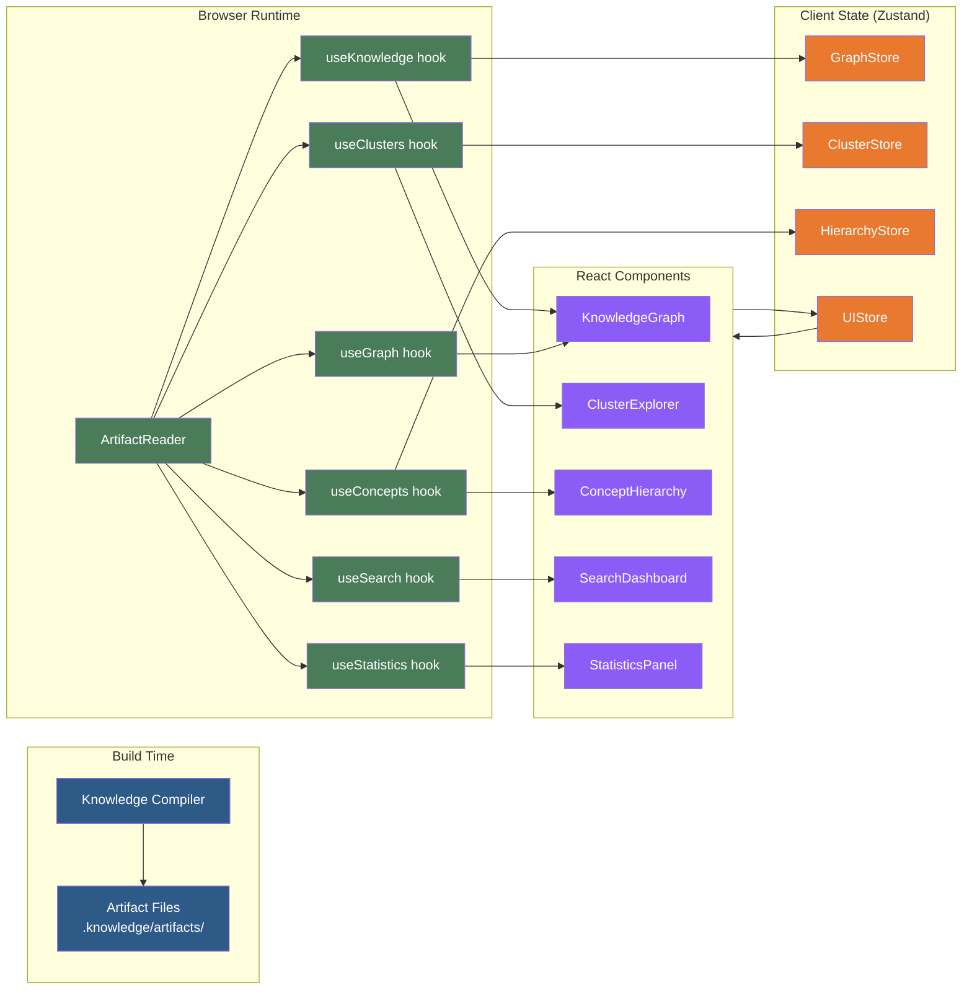
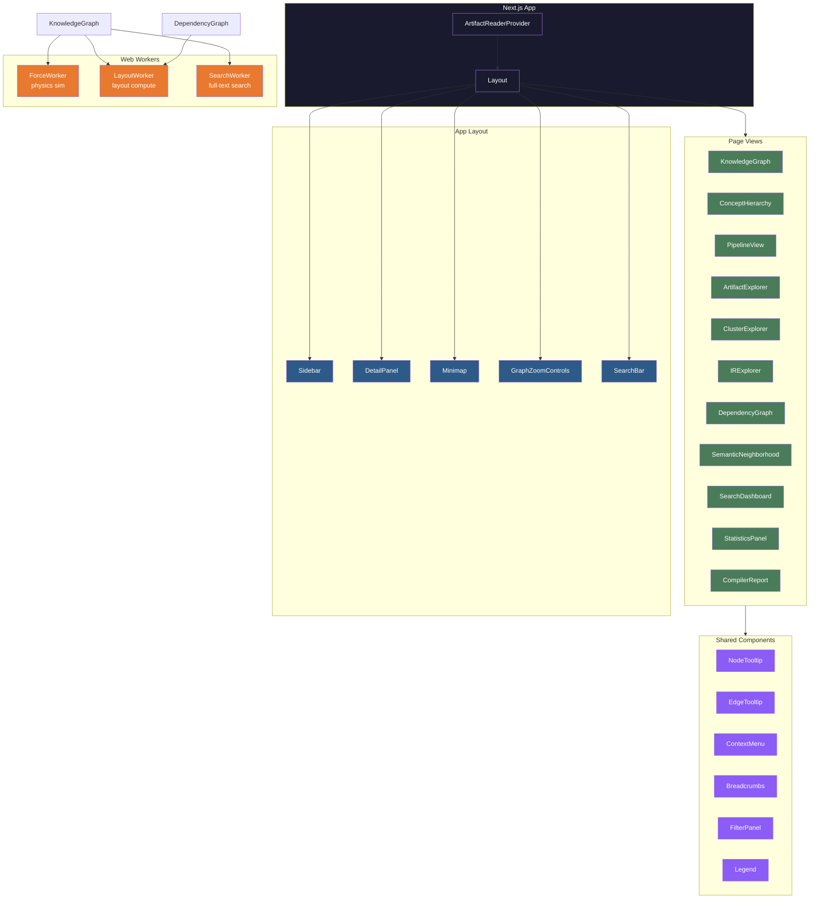

# Knowledge Compiler — Interactive Visualization Design

**Document Version:** 1.0.0
**Audience:** Senior Frontend Engineers, Visualization Engineers
**Last Updated:** 2026-07-10

---

## 1. Visualization Architecture

### 1.1 How Visualizations Consume Compiled Artifacts

All visualization components read from compiled artifacts through `ArtifactReader` (`@knowledge-compiler/artifacts`), never directly from the compiler pipeline. This enforces a clean separation between build-time and runtime.

```typescript
import { ArtifactReader } from '@knowledge-compiler/artifacts';

// Reader is instantiated once at app startup
const reader = new ArtifactReader('/.knowledge/artifacts');

// All visualizations consume typed collections:
const graph = await reader.readGraph();         // VisualGraph
const clusters = await reader.readClusters();    // ClusterCollection
const concepts = await reader.readConcepts();    // ConceptCollection
const entities = await reader.readEntities();    // EntityCollection
const stats = await reader.readStatistics();     // Statistics
const searchIndex = await reader.readSearchIndex(); // SearchIndex
```

Data flow is strictly unidirectional:



### 1.2 React Component Tree



### 1.3 State Management (Zustand)

```typescript
import { create } from 'zustand';
import { subscribeWithSelector } from 'zustand/middleware';

// ── Selection Store ──────────────────────────────────────────

interface SelectionState {
  selectedNodeId: string | null;
  selectedEdgeId: string | null;
  selectedClusterId: string | null;
  highlightedNodeIds: Set<string>;
  hoveredNodeId: string | null;

  selectNode: (id: string | null) => void;
  selectEdge: (id: string | null) => void;
  selectCluster: (id: string | null) => void;
  highlightNodes: (ids: string[]) => void;
  clearHighlight: () => void;
  setHoveredNode: (id: string | null) => void;
}

export const useSelectionStore = create<SelectionState>()(
  subscribeWithSelector((set) => ({
    selectedNodeId: null,
    selectedEdgeId: null,
    selectedClusterId: null,
    highlightedNodeIds: new Set(),
    hoveredNodeId: null,

    selectNode: (id) => set({ selectedNodeId: id, selectedEdgeId: null }),
    selectEdge: (id) => set({ selectedEdgeId: id, selectedNodeId: null }),
    selectCluster: (id) => set({ selectedClusterId: id }),
    highlightNodes: (ids) => set({ highlightedNodeIds: new Set(ids) }),
    clearHighlight: () => set({ highlightedNodeIds: new Set() }),
    setHoveredNode: (id) => set({ hoveredNodeId: id }),
  }))
);

// ── Viewport Store ───────────────────────────────────────────

interface ViewportState {
  zoom: number;
  panX: number;
  panY: number;
  center: { x: number; y: number };

  setZoom: (zoom: number) => void;
  setPan: (x: number, y: number) => void;
  resetView: () => void;
  centerOn: (x: number, y: number) => void;
}

export const useViewportStore = create<ViewportState>()((set) => ({
  zoom: 1,
  panX: 0,
  panY: 0,
  center: { x: 0, y: 0 },

  setZoom: (zoom) => set({ zoom: Math.max(0.1, Math.min(10, zoom)) }),
  setPan: (x, y) => set({ panX: x, panY: y }),
  resetView: () => set({ zoom: 1, panX: 0, panY: 0 }),
  centerOn: (x, y) => set({
    panX: -x * 1 + window.innerWidth / 2,
    panY: -y * 1 + window.innerHeight / 2,
  }),
}));

// ── Filter Store ─────────────────────────────────────────────

interface FilterState {
  nodeTypes: Set<string>;
  edgeTypes: Set<string>;
  clusters: Set<string>;
  searchQuery: string;
  minWeight: number;
  maxNodes: number;

  toggleNodeType: (type: string) => void;
  toggleEdgeType: (type: string) => void;
  toggleCluster: (id: string) => void;
  setSearchQuery: (q: string) => void;
  setMinWeight: (w: number) => void;
  resetFilters: () => void;
}

// ── Graph Store ──────────────────────────────────────────────

interface GraphState {
  physicsRunning: boolean;
  simulationAlpha: number;
  frozenNodes: Set<string>;

  pausePhysics: () => void;
  resumePhysics: () => void;
  freezeNode: (id: string) => void;
  unfreezeNode: (id: string) => void;
  stepSimulation: () => void;
}
```

### 1.4 Rendering Decisions

| Rendering Strategy | Use Case | Max Nodes | Max Edges | Technology |
|---|---|---|---|---|
| **SVG** | Small graphs, tooltips, legends | <500 | <2000 | React + SVG |
| **Canvas 2D** | Medium graphs, force layout | <10,000 | <50,000 | Canvas API + D3-force |
| **WebGL** | Large graphs, 3D visualization | <100,000 | <500,000 | Three.js / R3F |

```typescript
// Rendering strategy selector
type RenderStrategy = 'svg' | 'canvas' | 'webgl';

function selectRenderStrategy(nodeCount: number, edgeCount: number): RenderStrategy {
  if (nodeCount < 500 && edgeCount < 2000) return 'svg';
  if (nodeCount < 10000 && edgeCount < 50000) return 'canvas';
  return 'webgl';
}

// Dynamic import based on strategy
const GraphRenderer = dynamic(() => import('./renderers/CanvasGraph'), {
  loading: () => <GraphSkeleton />,
  ssr: false,
});
```

### 1.5 Performance Targets

| Metric | Target | Measurement |
|---|---|---|
| Initial render (<1000 nodes) | <500ms | `performance.mark()` |
| Initial render (<10000 nodes) | <2s | `performance.mark()` |
| Physics tick (<1000 nodes) | 60fps | `requestAnimationFrame` delta |
| Physics tick (<10000 nodes) | 30fps | RAF delta |
| Zoom/Pan response | <16ms | Input latency |
| Search results | <50ms | `performance.now()` |
| Detail panel open | <100ms | Layout shift / paint |
| Memory (<10000 nodes) | <200MB | `performance.memory` |

### 1.6 Progressive Loading

```typescript
interface LoadingStrategy {
  // Stage 1: Show skeleton immediately
  initial: { show: 'skeleton'; timeout: 0 };
  // Stage 2: Load and render first 500 nodes
  priority: { batch: 'first'; count: 500; strategy: 'svg' };
  // Stage 3: Load remaining nodes in chunks
  streaming: { chunkSize: 1000; delayMs: 50; worker: 'layout' };
  // Stage 4: Enable physics once fully loaded
  finalize: { physics: true; aggregation: true };
}

// Implementation
async function loadGraphProgressive(reader: ArtifactReader, store: GraphStore) {
  store.setLoadingStage('skeleton');

  const stream = reader.streamNodes();
  const batch: VisualNode[] = [];

  for await (const node of stream) {
    batch.push(node);

    if (batch.length >= 500) {
      store.appendNodes(batch);
      store.setLoadingStage('partial');
      batch.length = 0;
      await sleep(50); // Yield to event loop
    }
  }

  if (batch.length > 0) store.appendNodes(batch);
  store.setLoadingStage('complete');
  store.startPhysics();
}
```

---

## 2. Visualization Components

### 2.1 KnowledgeGraph

A force-directed graph visualization of the entire knowledge base. This is the primary visualization component.

```typescript
interface KnowledgeGraphProps {
  graph: VisualGraph;

  // Dimensions
  width?: number;
  height?: number;

  // Rendering
  renderer?: 'svg' | 'canvas' | 'webgl' | 'auto';
  theme?: 'light' | 'dark' | 'system';
  interactive?: boolean;

  // Physics
  physics?: boolean;
  physicsAlphaDecay?: number;
  physicsVelocityDecay?: number;
  physicsRepulsion?: number;
  physicsLinkDistance?: number;

  // Labels
  nodeLabelVisibility?: 'always' | 'hover' | 'zoom' | 'never';
  nodeLabelMaxLength?: number;
  edgeLabelVisibility?: 'hover' | 'never';

  // Sizing
  nodeSizeScale?: number;
  nodeSizeBy?: 'degree' | 'weight' | 'fixed';
  edgeWidthScale?: number;
  edgeWidthBy?: 'weight' | 'uniform';

  // Clustering
  clusterColoring?: boolean;
  clusterAggregation?: boolean;
  aggregationThreshold?: number;

  // Zoom
  minZoom?: number;
  maxZoom?: number;
  zoomStep?: number;

  // Interaction
  highlightOnHover?: boolean;
  highlightNeighbors?: boolean;
  highlightDepth?: number;
  dragEnabled?: boolean;
  panEnabled?: boolean;

  // Semantic zoom
  semanticZoom?: boolean;
  labelZoomThreshold?: number;
  detailZoomThreshold?: number;

  // Search
  searchHighlight?: boolean;

  // Callbacks
  onNodeClick?: (nodeId: string, node: VisualNode, event: React.MouseEvent) => void;
  onNodeDoubleClick?: (nodeId: string, node: VisualNode, event: React.MouseEvent) => void;
  onEdgeClick?: (edgeId: string, edge: VisualEdge, event: React.MouseEvent) => void;
  onBackgroundClick?: (event: React.MouseEvent) => void;
  onZoomChange?: (zoom: number, bbox: BBox) => void;
  onPhysicsTick?: (alpha: number) => void;
  onNodeDragStart?: (nodeId: string) => void;
  onNodeDragEnd?: (nodeId: string, position: Vector2D) => void;

  // State
  selectedNodeId?: string;
  selectedEdgeId?: string;
  highlightedNodeIds?: string[];
  filteredNodeIds?: string[];

  // Filtering
  filter?: (node: VisualNode) => boolean;
  edgeFilter?: (edge: VisualEdge) => boolean;

  // Tooltips
  nodeTooltip?: (node: VisualNode) => React.ReactNode;
  edgeTooltip?: (edge: VisualEdge) => React.ReactNode;

  // Controls
  controls?: boolean;
  minimap?: boolean;
  legend?: boolean;

  // Styling
  className?: string;
  style?: React.CSSProperties;
}
```

**Node Type Visual Styling:**

| Node Type | Shape | Color | Size Range | Icon | Border |
|---|---|---|---|---|---|
| Document | Rounded rect | `#3B82F6` (blue) | 20-40 | `📄` | 2px |
| Section | Circle | `#10B981` (green) | 8-16 | — | 1px |
| Entity | Diamond | `#F59E0B` (amber) | 12-24 | — | 1.5px |
| Concept | Hexagon | `#8B5CF6` (purple) | 16-32 | — | 2px |
| Topic | Triangle | `#EC4899` (pink) | 14-28 | — | 1.5px |

**Edge Type Visual Styling:**

| Edge Type | Stroke | Style | Width Range | Opacity |
|---|---|---|---|---|
| contains | `#94A3B8` | solid | 1-3 | 0.4 |
| references | `#3B82F6` | solid | 1-2 | 0.5 |
| mentions | `#F59E0B` | dashed | 1-2 | 0.4 |
| related_to | `#10B981` | dotted | 1-2 | 0.3 |
| is_a | `#8B5CF6` | solid | 2-3 | 0.6 |
| cites | `#EC4899` | dashed | 1-2 | 0.3 |
| contradicts | `#EF4444` | dashed | 2-3 | 0.5 |
| supports | `#22C55E` | solid | 2-3 | 0.5 |

**Physics Simulation Configuration:**

```typescript
interface ForceConfig {
  // d3-force parameters
  charge: { strength: number; distanceMin: number; distanceMax: number };
  link: { distance: number; strength: (edge: VisualEdge) => number };
  center: { x: number; y: number; strength: number };
  collision: { radius: (node: VisualNode) => number; strength: number };
  cluster: { strength: number; centroids: Map<string, Vector2D> };

  // Simulation lifecycle
  alpha: number;
  alphaMin: number;
  alphaDecay: number;
  velocityDecay: number;

  // Reheat conditions
  reheatOnFilter: boolean;
  reheatOnDrag: boolean;
  reheatAlpha: number;
}

const DEFAULT_FORCE_CONFIG: ForceConfig = {
  charge: { strength: -300, distanceMin: 1, distanceMax: 1000 },
  link: { distance: 100, strength: (e) => e.weight * 0.5 },
  center: { x: 0, y: 0, strength: 0.1 },
  collision: { radius: (n) => n.size * 2, strength: 0.7 },
  cluster: { strength: 0.3, centroids: new Map() },
  alpha: 1,
  alphaMin: 0.001,
  alphaDecay: 0.02,
  velocityDecay: 0.4,
  reheatOnFilter: true,
  reheatOnDrag: true,
  reheatAlpha: 0.3,
};
```

**Node Aggregation (for large graphs):**

```typescript
interface AggregateCluster {
  id: string;
  label: string;
  nodeCount: number;
  childIds: string[];
  centroid: Vector2D;
  color: string;
  size: number;
  representativeTerms: string[];
}

function buildAggregateClusters(
  nodes: VisualNode[],
  edges: VisualEdge[],
  threshold: number
): { clusters: AggregateCluster[]; remaining: VisualNode[] } {
  const communities = detectCommunities(nodes, edges);
  const aggregates: AggregateCluster[] = [];

  for (const [communityId, memberIds] of communities) {
    if (memberIds.length < threshold) continue;

    const members = memberIds.map((id) => nodes.find((n) => n.id === id)!);
    const centroid = computeCentroid(members);

    aggregates.push({
      id: `cluster-${communityId}`,
      label: `Cluster (${memberIds.length} nodes)`,
      nodeCount: memberIds.length,
      childIds: memberIds,
      centroid,
      color: interpolateColor(communityId, communities.size),
      size: Math.sqrt(memberIds.length) * 10,
      representativeTerms: extractTopTerms(members),
    });
  }

  const remaining = nodes.filter((n) =>
    !aggregates.some((a) => a.childIds.includes(n.id))
  );

  return { clusters: aggregates, remaining };
}
```

### 2.2 ConceptHierarchy

Interactive hierarchy visualization showing the concept taxonomy. Supports multiple layout modes.

```typescript
interface ConceptHierarchyProps {
  concepts: ConceptCollection;

  // Dimensions
  width?: number;
  height?: number;

  // Layout
  layout?: 'sunburst' | 'icicle' | 'tree' | 'radial';
  maxDepth?: number;
  compact?: boolean;

  // Visual
  theme?: 'light' | 'dark' | 'system';
  colorScheme?: 'category' | 'depth' | 'size';
  showLabels?: boolean;
  showNodeCount?: boolean;
  labelThreshold?: number;

  // Interaction
  interactive?: boolean;
  animate?: boolean;
  collapsible?: boolean;
  drillDown?: boolean;

  // Breadcrumb
  breadcrumb?: boolean;

  // Search
  searchable?: boolean;

  // Callbacks
  onConceptClick?: (conceptId: string, concept: Concept, event: React.MouseEvent) => void;
  onConceptHover?: (conceptId: string | null, concept: Concept | null) => void;
  onDrillDown?: (conceptId: string) => void;
  onDrillUp?: () => void;
  onBreadcrumbClick?: (conceptId: string) => void;

  // State
  selectedConceptId?: string;
  highlightedConceptIds?: string[];
  expandedConceptIds?: string[];

  // Filtering
  filter?: (concept: Concept) => boolean;

  // Tooltip
  nodeTooltip?: (concept: Concept) => React.ReactNode;

  // Styling
  className?: string;
  style?: React.CSSProperties;
}
```

**Layout Geometry:**

```typescript
interface SunburstLayout {
  type: 'sunburst';
  root: SunburstArc;

  // Arc = (x, y) center, inner/outer radius, start/end angle
  partition: (node: Concept) => SunburstArc;
  arc: d3.Arc<SunburstArc>;

  // Zoom state
  currentRoot: Concept;
  zoomTo: (concept: Concept) => void;
  zoomOut: () => void;
}

interface IcicleLayout {
  type: 'icicle';
  root: IcicleRect;

  // Rect = (x, y, width, height)
  partition: (node: Concept) => IcicleRect;
  rect: (d: IcicleRect) => string; // SVG rect path

  currentRoot: Concept;
  zoomTo: (concept: Concept) => void;
  zoomOut: () => void;
}

interface TreeLayout {
  type: 'tree' | 'radial';
  root: HierarchyPointNode<Concept>;

  // Tree layout
  nodeRadius: number;
  separation: (a: HierarchyPointNode<Concept>, b: HierarchyPointNode<Concept>) => number;
  linkGenerator: (link: HierarchyPointLink<Concept>) => string;
}
```

**Drill-Down Navigation:**

```typescript
function useDrillDown(initialRoot: Concept) {
  const [history, setHistory] = useState<Concept[]>([initialRoot]);
  const currentRoot = history[history.length - 1];

  const drillDown = useCallback((concept: Concept) => {
    if (concept.children.length > 0) {
      setHistory((prev) => [...prev, concept]);
    }
  }, []);

  const drillUp = useCallback(() => {
    setHistory((prev) => (prev.length > 1 ? prev.slice(0, -1) : prev));
  }, []);

  const breadcrumbs = history.map((c) => ({
    id: c.id,
    label: c.label,
    depth: c.level,
    isActive: c.id === currentRoot.id,
    onClick: () => {
      const idx = history.findIndex((h) => h.id === c.id);
      setHistory(history.slice(0, idx + 1));
    },
  }));

  return { currentRoot, breadcrumbs, drillDown, drillUp, canDrillUp: history.length > 1 };
}
```

### 2.3 PipelineView

Visualization of the compiler pipeline — data flow, timing, cache performance, and errors.

```typescript
interface PipelineViewProps {
  report: CompilerReport;

  // Display options
  theme?: 'light' | 'dark' | 'system';
  compact?: boolean;
  layout?: 'vertical' | 'horizontal';

  // Sections
  showSankey?: boolean;
  showTimings?: boolean;
  showPhaseDetails?: boolean;
  showPassDetails?: boolean;
  showPluginDetails?: boolean;
  showCacheStats?: boolean;
  showErrors?: boolean;

  // Sankey configuration
  sankeyAlignment?: 'left' | 'right' | 'center' | 'justify';
  sankeyNodeWidth?: number;
  sankeyNodePadding?: number;

  // Errors
  autoExpandErrors?: boolean;
  maxErrors?: number;

  // Callbacks
  onPhaseClick?: (phase: CompilerPhase, report: PhaseReport) => void;
  onPassClick?: (passName: string, report: PassReport) => void;
  onPluginClick?: (pluginName: string, stats: PluginStats) => void;
  onRetry?: () => void;
  onViewLog?: () => void;

  // Styling
  className?: string;
  style?: React.CSSProperties;
}
```

**Sankey Diagram Data Model:**

```typescript
interface SankeyData {
  nodes: SankeyNode[];
  links: SankeyLink[];
}

interface SankeyNode {
  id: string;
  label: string;
  phase: CompilerPhase;
  duration: number;
  status: 'success' | 'failed' | 'skipped' | 'degraded';
  color: string;
}

interface SankeyLink {
  source: string;
  target: string;
  value: number; // Data volume or document count
  label?: string;
}
```

**Per-Pass Timing Bar Chart:**

```typescript
interface PassTiming {
  passName: string;
  phase: CompilerPhase;
  totalDuration: number;
  selfDuration: number; // Excluding dependencies
  cacheReadTime: number;
  cacheWriteTime: number;
  itemsProcessed: number;
  itemsPerSecond: number;
  status: PassStatus;
}

function PassTimingBars({ timings }: { timings: PassTiming[] }) {
  const maxDuration = Math.max(...timings.map((t) => t.totalDuration));

  return (
    <div className="space-y-1">
      {timings.map((pass) => (
        <div key={pass.passName} className="flex items-center gap-3">
          <span className="w-48 text-sm truncate text-right">{pass.passName}</span>
          <div className="flex-1 h-6 bg-gray-100 dark:bg-gray-800 rounded overflow-hidden">
            <div
              className="h-full rounded transition-all duration-300"
              style={{
                width: `${(pass.selfDuration / maxDuration) * 100}%`,
                backgroundColor: PASS_COLORS[pass.status],
                opacity: 0.8,
              }}
            />
          </div>
          <span className="w-20 text-xs tabular-nums">{pass.selfDuration.toFixed(0)}ms</span>
          <PassStatusBadge status={pass.status} />
        </div>
      ))}
    </div>
  );
}
```

### 2.4 ArtifactExplorer

Browse and inspect generated artifacts from the compiled output.

```typescript
interface ArtifactExplorerProps {
  artifacts: ArtifactReader;

  // Dimensions
  width?: number;
  height?: number;

  // Theme
  theme?: 'light' | 'dark' | 'system';

  // Layout
  layout?: 'split' | 'sidebar' | 'full';
  defaultTab?: ArtifactTab;
  defaultSidebarWidth?: number;

  // File tree
  showHidden?: boolean;
  fileFilter?: (entry: ManifestEntry) => boolean;

  // JSON viewer
  jsonTheme?: 'light' | 'dark' | 'github' | 'monokai';
  maxJsonDepth?: number;
  collapsibleJson?: boolean;

  // Search
  showSearch?: boolean;
  searchPlaceholder?: string;

  // Schema
  showSchemaValidation?: boolean;

  // Callbacks
  onFileSelect?: (entry: ManifestEntry, data: unknown) => void;
  onNodeClick?: (nodeId: string) => void;
  onEntityClick?: (entityId: string) => void;
  onClusterClick?: (clusterId: string) => void;
  onConceptClick?: (conceptId: string) => void;

  // Styling
  className?: string;
  style?: React.CSSProperties;
}

type ArtifactTab = 'tree' | 'graph' | 'entities' | 'clusters' | 'concepts' | 'search' | 'stats';
```

**File Tree Component:**

```typescript
interface FileTreeNode {
  name: string;
  path: string;
  type: 'file' | 'directory';
  size: number;
  hash: string;
  contentType: string;
  children?: FileTreeNode[];
}

function buildFileTree(manifest: Manifest): FileTreeNode {
  const root: FileTreeNode = {
    name: 'artifacts',
    path: '',
    type: 'directory',
    size: 0,
    hash: '',
    contentType: '',
    children: [],
  };

  for (const [name, entry] of Object.entries(manifest.artifacts)) {
    const parts = name.split('/');
    let current = root;

    for (let i = 0; i < parts.length; i++) {
      const isLast = i === parts.length - 1;
      const partPath = parts.slice(0, i + 1).join('/');

      let child = current.children?.find((c) => c.name === parts[i]);

      if (!child) {
        child = isLast
          ? { name: parts[i], path: partPath, type: 'file', ...entry, children: undefined }
          : { name: parts[i], path: partPath, type: 'directory', size: 0, hash: '', contentType: '', children: [] };
        current.children = current.children || [];
        current.children.push(child);
      }

      current = child;
    }
  }

  return root;
}
```

**JSON Viewer with Syntax Highlighting:**

```typescript
function JsonViewer({
  data,
  theme = 'light',
  maxDepth = 10,
  collapsible = true,
  searchQuery,
}: {
  data: unknown;
  theme?: JsonTheme;
  maxDepth?: number;
  collapsible?: boolean;
  searchQuery?: string;
}) {
  const tokens = useMemo(() => tokenizeJson(data, { maxDepth }), [data, maxDepth]);

  return (
    <div className="font-mono text-sm leading-relaxed">
      {tokens.map((token, i) => (
        <JsonToken
          key={i}
          token={token}
          theme={theme}
          collapsible={collapsible}
          highlighted={searchQuery ? token.text.includes(searchQuery) : false}
        />
      ))}
    </div>
  );
}

interface JsonToken {
  text: string;
  type: 'key' | 'string' | 'number' | 'boolean' | 'null' | 'bracket' | 'comma' | 'colon';
  depth: number;
  collapsible: boolean;
  collapsed: boolean;
}
```

### 2.5 ClusterExplorer

Explore community detection results with overview and detail views.

```typescript
interface ClusterExplorerProps {
  clusters: ClusterCollection;
  graph?: VisualGraph;

  // Dimensions
  width?: number;
  height?: number;

  // Layout
  layout?: 'grid' | 'scatter' | 'graph' | 'treemap';

  // Theme
  theme?: 'light' | 'dark' | 'system';

  // Display
  showMetrics?: boolean;
  showHierarchy?: boolean;
  showKeywords?: boolean;
  showSummary?: boolean;
  showMembershipList?: boolean;
  showInterClusterEdges?: boolean;

  // Scatter plot
  scatterDimensions?: [string, string];
  scatterScale?: 'linear' | 'log';

  // Comparison
  comparisonMode?: boolean;
  comparisonClusterIds?: [string, string];

  // Filtering
  maxClusters?: number;
  minClusterSize?: number;
  clusterFilter?: (cluster: Cluster) => boolean;

  // Callbacks
  onClusterClick?: (clusterId: string, cluster: Cluster) => void;
  onNodeClick?: (nodeId: string) => void;
  onCompare?: (clusterA: string, clusterB: string) => void;

  // State
  selectedClusterId?: string;
  highlightedClusterIds?: string[];

  // Styling
  className?: string;
  style?: React.CSSProperties;
}
```

**Cluster Grid View:**

```typescript
function ClusterGrid({ clusters, onClusterClick }: {
  clusters: Cluster[];
  onClusterClick: (id: string) => void;
}) {
  // Sort by size descending, assign to grid with treemap-like sizing
  const sorted = [...clusters].sort((a, b) => b.memberCount - a.memberCount);
  const totalSize = sorted.reduce((sum, c) => sum + c.memberCount, 0);

  return (
    <div className="grid gap-2" style={{ gridTemplateColumns: 'repeat(auto-fill, minmax(200px, 1fr))' }}>
      {sorted.map((cluster) => {
        const fraction = cluster.memberCount / totalSize;
        const area = fraction * 100;
        const columns = Math.ceil(Math.sqrt(area));
        const rows = Math.ceil(area / columns);

        return (
          <ClusterCard
            key={cluster.id}
            cluster={cluster}
            size={`${columns}fr / ${rows}fr`}
            onClick={() => onClusterClick(cluster.id)}
          />
        );
      })}
    </div>
  );
}
```

**Cluster Detail Panel:**

```typescript
interface ClusterDetailProps {
  cluster: Cluster;
  allClusters: Cluster[];
  graph?: VisualGraph;
  onNodeClick?: (nodeId: string) => void;
}

function ClusterDetail({ cluster, allClusters, graph, onNodeClick }: ClusterDetailProps) {
  const siblingClusters = allClusters.filter((c) => c.parentId === cluster.parentId && c.id !== cluster.id);
  const childClusters = allClusters.filter((c) => c.parentId === cluster.id);
  const interClusterEdges = graph?.edges.filter(
    (e) => cluster.memberIds.includes(e.source) !== cluster.memberIds.includes(e.target)
  );

  return (
    <div className="space-y-6 p-4">
      <ClusterHeader cluster={cluster} />

      <MetricsRow
        metrics={[
          { label: 'Members', value: cluster.memberCount },
          { label: 'Density', value: (cluster.internalDensity * 100).toFixed(1) + '%' },
          { label: 'Conductance', value: cluster.conductance?.toFixed(3) },
          { label: 'Silhouette', value: cluster.silhouetteScore?.toFixed(3) },
        ]}
      />

      <KeywordCloud keywords={cluster.topTerms} />

      {cluster.representatives.length > 0 && (
        <RepresentativeList representatives={cluster.representatives} onNodeClick={onNodeClick} />
      )}

      {childClusters.length > 0 && (
        <SubclusterList clusters={childClusters} />
      )}

      {interClusterEdges && interClusterEdges.length > 0 && (
        <InterClusterGraph
          edges={interClusterEdges}
          sourceCluster={cluster}
          targetClusters={siblingClusters}
        />
      )}
    </div>
  );
}
```

### 2.6 IREXplorer

Inspect intermediate representations (IR) at each compiler phase.

```typescript
interface IRExplorerProps {
  ir: IRNode;

  // Dimensions
  width?: number;
  height?: number;

  // Theme
  theme?: 'light' | 'dark' | 'system';

  // View mode
  view?: 'tree' | 'json' | 'table' | 'graph';
  maxDepth?: number;

  // Compiler phase selector
  showPhaseSelector?: boolean;
  phases?: CompilerPhase[];
  selectedPhase?: CompilerPhase;
  onPhaseChange?: (phase: CompilerPhase) => void;

  // Comparison
  comparisonMode?: boolean;
  compareWith?: CompilerPhase;
  onCompareWithChange?: (phase: CompilerPhase | null) => void;

  // Search
  searchable?: boolean;

  // Edit
  editable?: boolean;
  onNodeChange?: (nodeId: string, changes: Partial<IRNode>) => void;

  // Display
  showMetadata?: boolean;
  showPositions?: boolean;
  showMetrics?: boolean;

  // Filtering
  filter?: (node: IRNode) => boolean;

  // Callbacks
  onNodeClick?: (nodeId: string, node: IRNode) => void;

  // State
  selectedNodeId?: string;

  // Styling
  className?: string;
  style?: React.CSSProperties;
}
```

**Phase Selector:**

```typescript
const IR_PHASES: { phase: CompilerPhase; label: string; icon: string }[] = [
  { phase: 'INIT', label: 'Initialization', icon: '⚙️' },
  { phase: 'PARSING', label: 'Parsing', icon: '📄' },
  { phase: 'ANALYSIS', label: 'Analysis', icon: '🔍' },
  { phase: 'GRAPH_CONSTRUCTION', label: 'Graph Construction', icon: '🔗' },
  { phase: 'EMBEDDING', label: 'Embedding', icon: '🧠' },
  { phase: 'CLUSTERING', label: 'Clustering', icon: '📊' },
  { phase: 'OPTIMIZATION', label: 'Optimization', icon: '⚡' },
  { phase: 'GENERATION', label: 'Generation', icon: '📦' },
];
```

**IR Diff View (for incremental compilation):**

```typescript
interface IRDiff {
  added: DiffEntry[];
  removed: DiffEntry[];
  modified: DiffEntry[];
  unchanged: number;
}

interface DiffEntry {
  id: string;
  type: IRNodeType;
  label: string;
  changes?: { field: string; before: unknown; after: unknown }[];
}

function computeIRDiff(before: IRNode, after: IRNode): IRDiff {
  const beforeIds = new Set(before.nodes.map((n) => n.id));
  const afterIds = new Set(after.nodes.map((n) => n.id));

  const added = after.nodes.filter((n) => !beforeIds.has(n.id));
  const removed = before.nodes.filter((n) => !afterIds.has(n.id));
  const modified: DiffEntry[] = [];

  for (const afterNode of after.nodes) {
    const beforeNode = before.nodes.find((n) => n.id === afterNode.id);
    if (beforeNode && !deepEqual(beforeNode, afterNode)) {
      modified.push({
        id: afterNode.id,
        type: afterNode.type,
        label: afterNode.label,
        changes: computeFieldChanges(beforeNode, afterNode),
      });
    }
  }

  const unchanged = before.nodes.length - removed.length - modified.length;

  return { added, removed, modified, unchanged };
}
```

### 2.7 DependencyGraph

Visualize document dependencies — citation/reference graph with bidirectional links.

```typescript
interface DependencyGraphProps {
  graph: VisualGraph;
  documents: KnowledgeNode[];

  // Dimensions
  width?: number;
  height?: number;

  // Theme
  theme?: 'light' | 'dark' | 'system';

  // Layout
  layout?: 'force' | 'dagre' | 'sugiyama';

  // Display
  showBidirectional?: boolean;
  showLinkLabels?: boolean;
  showEdgeWeights?: boolean;

  // Filtering
  linkTypes?: EdgeType[];
  onLinkTypeChange?: (types: EdgeType[]) => void;

  // Clustering
  clusterBy?: 'section' | 'document' | 'none';

  // Callbacks
  onNodeClick?: (nodeId: string, node: VisualNode) => void;
  onEdgeClick?: (edgeId: string, edge: VisualEdge) => void;

  // State
  selectedNodeId?: string;

  // Styling
  className?: string;
  style?: React.CSSProperties;
}
```

**Layout Configuration:**

```typescript
interface DagreLayoutConfig {
  rankdir: 'TB' | 'BT' | 'LR' | 'RL';
  align: 'UL' | 'UR' | 'DL' | 'DR';
  nodesep: number;
  edgesep: number;
  ranksep: number;
  marginx: number;
  marginy: number;
}

const DEFAULT_DAGRE_CONFIG: DagreLayoutConfig = {
  rankdir: 'LR',
  align: 'UL',
  nodesep: 50,
  edgesep: 10,
  ranksep: 100,
  marginx: 20,
  marginy: 20,
};
```

**Bidirectional Link Detection:**

```typescript
interface BidirectionalPair {
  sourceId: string;
  targetId: string;
  forwardEdge: VisualEdge;
  backwardEdge: VisualEdge | null;
  isBidirectional: boolean;
}

function findBidirectionalLinks(edges: VisualEdge[]): BidirectionalPair[] {
  const edgeMap = new Map<string, VisualEdge>();

  for (const edge of edges) {
    const key = `${edge.source}|${edge.target}`;
    edgeMap.set(key, edge);
  }

  const pairs: BidirectionalPair[] = [];
  const visited = new Set<string>();

  for (const [key, forwardEdge] of edgeMap) {
    if (visited.has(key)) continue;

    const reverseKey = `${forwardEdge.target}|${forwardEdge.source}`;
    const backwardEdge = edgeMap.get(reverseKey);

    visited.add(key);
    if (backwardEdge) visited.add(reverseKey);

    pairs.push({
      sourceId: forwardEdge.source,
      targetId: forwardEdge.target,
      forwardEdge,
      backwardEdge: backwardEdge || null,
      isBidirectional: backwardEdge !== null,
    });
  }

  return pairs;
}
```

### 2.8 SemanticNeighborhood

Explore embedding space with 2D projection, nearest-neighbor highlighting, and similarity analysis.

```typescript
interface SemanticNeighborhoodProps {
  reader: ArtifactReader;

  // Dimensions
  width?: number;
  height?: number;

  // Theme
  theme?: 'light' | 'dark' | 'system';

  // Projection
  projection?: 'umap' | 'tsne' | 'pca';
  projectionParams?: {
    nNeighbors?: number;
    minDist?: number;
    perplexity?: number;
    learningRate?: number;
    nIterations?: number;
  };

  // Display
  showDensity?: boolean;
  showLabels?: boolean;
  labelThreshold?: number;
  pointSize?: number;
  pointOpacity?: number;

  // Selection
  selectedNodeId?: string;

  // Neighborhood
  showNearest?: boolean;
  nearestCount?: number;
  neighborhoodRadius?: number;

  // Similarity
  showSimilarityHeatmap?: boolean;
  heatmapSize?: number;

  // Dimensionality
  showDimensionalitySlider?: boolean;
  defaultDimensions?: number;
  dimensionRange?: [number, number];

  // Callbacks
  onNodeClick?: (nodeId: string, node: KnowledgeNode) => void;
  onNodeHover?: (nodeId: string | null) => void;
  onProjectionChange?: (projection: ProjectionType) => void;

  // Styling
  className?: string;
  style?: React.CSSProperties;
}
```

**2D Projection Pipeline:**

```typescript
async function projectEmbeddings(
  reader: ArtifactReader,
  nodeIds: string[],
  method: 'umap' | 'tsne' | 'pca',
  params: ProjectionParams
): Promise<Map<string, Vector2D>> {
  // Load embedding vectors in batches
  const vectors: Float32Array[] = [];
  for (const id of nodeIds) {
    const vec = await reader.readEmbedding(id);
    if (vec) vectors.push(vec);
  }

  // Dispatch to Web Worker for projection
  const worker = new Worker(new URL('./projection.worker.ts', import.meta.url));
  const result = await new Promise<Float32Array[]>((resolve) => {
    worker.postMessage({ vectors, method, params });
    worker.onmessage = (e) => resolve(e.data);
  });

  // Map projected coordinates
  const projection = new Map<string, Vector2D>();
  for (let i = 0; i < nodeIds.length; i++) {
    projection.set(nodeIds[i], { x: result[i][0], y: result[i][1] });
  }

  worker.terminate();
  return projection;
}
```

**Similarity Heatmap:**

```typescript
function SimilarityHeatmap({
  nodeIds,
  similarityMatrix,
  width = 400,
  height = 400,
}: {
  nodeIds: string[];
  similarityMatrix: Float32Array; // Row-major, NxN
  width?: number;
  height?: number;
}) {
  const N = nodeIds.length;
  const cellW = width / N;
  const cellH = height / N;

  return (
    <svg width={width} height={height}>
      <defs>
        <linearGradient id="heat-gradient" x1="0" x2="1" y1="0" y2="0">
          <stop offset="0%" stopColor="#EF4444" />
          <stop offset="50%" stopColor="#F59E0B" />
          <stop offset="100%" stopColor="#22C55E" />
        </linearGradient>
      </defs>
      {Array.from({ length: N }, (_, i) =>
        Array.from({ length: N }, (_, j) => {
          const value = similarityMatrix[i * N + j];
          return (
            <rect
              key={`${i}-${j}`}
              x={i * cellW}
              y={j * cellH}
              width={cellW}
              height={cellH}
              fill={`rgba(34, 197, 94, ${value})`}
              stroke="#fff"
              strokeWidth={0.5}
            />
          );
        })
      )}
    </svg>
  );
}
```

### 2.9 SearchDashboard

Full-text and semantic search interface with faceted filtering.

```typescript
interface SearchDashboardProps {
  reader: ArtifactReader;

  // Theme
  theme?: 'light' | 'dark' | 'system';

  // Search bar
  placeholder?: string;
  debounceMs?: number;
  minQueryLength?: number;
  maxResults?: number;
  autocomplete?: boolean;
  autocompleteMaxItems?: number;

  // Filters
  showTypeFilters?: boolean;
  showFieldFilters?: boolean;
  showClusterFilters?: boolean;
  showConceptFilters?: boolean;
  showDateFilters?: boolean;

  // Results
  showHighlights?: boolean;
  showRelevanceScore?: boolean;
  showBreadcrumbs?: boolean;
  compact?: boolean;

  // Comparison
  comparisonMode?: boolean;
  maxComparisonResults?: number;

  // History
  showHistory?: boolean;
  maxHistoryItems?: number;

  // Callbacks
  onResultClick?: (entry: SearchEntry, event: React.MouseEvent) => void;
  onSearch?: (query: string, results: SearchResults) => void;
  onFilterChange?: (filters: SearchFilters) => void;
  onCompareAdd?: (entry: SearchEntry) => void;
  onCompareRemove?: (entry: SearchEntry) => void;

  // External state
  externalQuery?: string;

  // Styling
  className?: string;
  style?: React.CSSProperties;
}

interface SearchFilters {
  types: string[];
  clusters: string[];
  concepts: string[];
  dateRange: [number, number] | null;
  fields: string[];
}
```

**Search Implementation:**

```typescript
function useSearch(reader: ArtifactReader, debounceMs = 150) {
  const [query, setQuery] = useState('');
  const [results, setResults] = useState<SearchResults | null>(null);
  const [loading, setLoading] = useState(false);
  const [filters, setFilters] = useState<SearchFilters>(DEFAULT_FILTERS);
  const [history, setHistory] = useState<string[]>([]);

  const debouncedQuery = useDebounce(query, debounceMs);

  useEffect(() => {
    if (debouncedQuery.length < 2) {
      setResults(null);
      return;
    }

    let cancelled = false;
    setLoading(true);

    (async () => {
      const start = performance.now();
      const searchResults = await reader.search(debouncedQuery, {
        filters,
        limit: 50,
      });
      if (cancelled) return;

      setResults({
        ...searchResults,
        duration: performance.now() - start,
      });
      setLoading(false);
    })();

    return () => { cancelled = true; };
  }, [debouncedQuery, filters]);

  const executeSearch = useCallback((q: string) => {
    setQuery(q);
    setHistory((prev) => [q, ...prev.filter((h) => h !== q)].slice(0, 20));
  }, []);

  return { query: debouncedQuery, setQuery, results, loading, filters, setFilters, history, executeSearch };
}
```

### 2.10 StatisticsPanel

Dataset and compilation metrics dashboard.

```typescript
interface StatisticsPanelProps {
  statistics: Statistics;

  // Theme
  theme?: 'light' | 'dark' | 'system';

  // Display sections
  sections?: StatSection[];
  collapsible?: boolean;
  defaultCollapsed?: boolean;
  showCharts?: boolean;
  showProgressBars?: boolean;
  compact?: boolean;

  // Chart preferences
  chartType?: 'bar' | 'line' | 'area' | 'pie';
  chartHeight?: number;
  showGrid?: boolean;
  showLegend?: boolean;

  // Styling
  className?: string;
  style?: React.CSSProperties;
}

type StatSection = 'sources' | 'documents' | 'graph' | 'entities' | 'clusters' | 'concepts' | 'embeddings' | 'compilation';
```

**Section Display Config:**

```typescript
const STAT_SECTIONS: Record<StatSection, StatSectionConfig> = {
  sources: {
    label: 'Sources',
    icon: '📂',
    metrics: [
      { key: 'sources.total', label: 'Total Sources', format: 'number' },
      { key: 'sources.discovered', label: 'Discovered', format: 'number' },
      { key: 'sources.failed', label: 'Failed', format: 'number', color: '#EF4444' },
      { key: 'sources.totalSize', label: 'Total Size', format: 'bytes' },
    ],
    chart: { type: 'bar', dataKey: 'sources.byType' },
  },
  documents: {
    label: 'Documents',
    icon: '📄',
    metrics: [
      { key: 'documents.total', label: 'Total Documents', format: 'number' },
      { key: 'documents.totalWords', label: 'Total Words', format: 'number' },
      { key: 'documents.averageWordsPerDocument', label: 'Avg Words/Doc', format: 'number' },
      { key: 'documents.totalLinks', label: 'Total Links', format: 'number' },
    ],
    chart: { type: 'bar', dataKey: 'documents.byLanguage' },
  },
  graph: {
    label: 'Knowledge Graph',
    icon: '🔗',
    metrics: [
      { key: 'graph.nodes', label: 'Nodes', format: 'number' },
      { key: 'graph.edges', label: 'Edges', format: 'number' },
      { key: 'graph.density', label: 'Density', format: 'percent' },
      { key: 'graph.avgDegree', label: 'Avg Degree', format: 'decimal' },
      { key: 'graph.communities', label: 'Communities', format: 'number' },
    ],
  },
  entities: {
    label: 'Entities',
    icon: '🏷️',
    metrics: [
      { key: 'entities.total', label: 'Total Entities', format: 'number' },
      { key: 'entities.distinctTypes', label: 'Entity Types', format: 'number' },
    ],
    chart: { type: 'pie', dataKey: 'entities.byType' },
  },
  clusters: {
    label: 'Clusters',
    icon: '📊',
    metrics: [
      { key: 'clusters.total', label: 'Total Clusters', format: 'number' },
      { key: 'clusters.avgSize', label: 'Avg Size', format: 'decimal' },
      { key: 'clusters.avgSilhouette', label: 'Avg Silhouette', format: 'decimal' },
    ],
  },
  concepts: {
    label: 'Concepts',
    icon: '🧠',
    metrics: [
      { key: 'concepts.total', label: 'Total Concepts', format: 'number' },
      { key: 'concepts.maxDepth', label: 'Max Depth', format: 'number' },
      { key: 'concepts.avgChildrenPerConcept', label: 'Avg Children', format: 'decimal' },
    ],
  },
  embeddings: {
    label: 'Embeddings',
    icon: '🧬',
    metrics: [
      { key: 'embeddings.totalVectors', label: 'Total Vectors', format: 'number' },
      { key: 'embeddings.dimensions', label: 'Dimensions', format: 'number' },
      { key: 'embeddings.averageMagnitude', label: 'Avg Magnitude', format: 'decimal' },
      { key: 'embeddings.storageSize', label: 'Storage Size', format: 'bytes' },
    ],
  },
  compilation: {
    label: 'Compilation',
    icon: '⚡',
    metrics: [
      { key: 'compilation.duration', label: 'Duration', format: 'duration' },
      { key: 'compilation.cacheHitRate', label: 'Cache Hit Rate', format: 'percent' },
      { key: 'compilation.totalPasses', label: 'Total Passes', format: 'number' },
      { key: 'compilation.errors', label: 'Errors', format: 'number', color: '#EF4444' },
      { key: 'compilation.memoryPeakMB', label: 'Peak Memory', format: 'bytes' },
    ],
  },
};
```

### 2.11 CompilerReport

Full compiler report visualization with summary, waterfall chart, and error list.

```typescript
interface CompilerReportProps {
  report: CompilerReport;

  // Theme
  theme?: 'light' | 'dark' | 'system';

  // Display
  compact?: boolean;
  showSummary?: boolean;
  showTimeline?: boolean;
  showWaterfall?: boolean;
  showErrorsList?: boolean;
  showWarningsList?: boolean;
  showConfiguration?: boolean;
  showArtifactManifest?: boolean;

  // Waterfall
  waterfallSortBy?: 'time' | 'phase' | 'name';

  // Errors
  maxErrors?: number;
  maxWarnings?: number;
  autoExpandErrors?: boolean;
  showStackTrace?: boolean;

  // Callbacks
  onRerun?: () => void;
  onOpenOutput?: () => void;
  onViewFullReport?: () => void;

  // Styling
  className?: string;
  style?: React.CSSProperties;
}
```

**Waterfall Chart:**

```typescript
interface WaterfallItem {
  id: string;
  label: string;
  phase: CompilerPhase;
  startTime: number;
  endTime: number;
  duration: number;
  status: 'success' | 'failed' | 'skipped' | 'running';
  dependencies: string[];
  subItems?: WaterfallItem[];
}

function WaterfallChart({ items }: { items: WaterfallItem[] }) {
  const totalDuration = Math.max(...items.map((i) => i.endTime));
  const sorted = topologicalSort(items);

  return (
    <div className="space-y-0.5 font-mono text-xs">
      {sorted.map((item) => {
        const left = (item.startTime / totalDuration) * 100;
        const width = (item.duration / totalDuration) * 100;

        return (
          <div key={item.id} className="flex items-center gap-2">
            <span className="w-48 text-right truncate">{item.label}</span>
            <div className="flex-1 h-5 bg-gray-100 dark:bg-gray-800 rounded relative">
              <div
                className="absolute h-full rounded transition-all"
                style={{
                  left: `${left}%`,
                  width: `${Math.max(width, 0.5)}%`,
                  backgroundColor: PHASE_COLORS[item.phase],
                  opacity: item.status === 'success' ? 0.8 : item.status === 'failed' ? 1 : 0.3,
                }}
              />
              {item.subItems?.map((sub) => {
                const subLeft = (sub.startTime / totalDuration) * 100;
                const subWidth = (sub.duration / totalDuration) * 100;
                return (
                  <div
                    key={sub.id}
                    className="absolute h-3 top-1 rounded"
                    style={{
                      left: `${subLeft}%`,
                      width: `${Math.max(subWidth, 0.3)}%`,
                      backgroundColor: PASS_COLORS[sub.status],
                    }}
                  />
                );
              })}
            </div>
            <span className="w-16 text-right tabular-nums">{item.duration.toFixed(0)}ms</span>
          </div>
        );
      })}
    </div>
  );
}
```

---

## 3. Layout System

### 3.1 Dashboard Layout

```typescript
interface DashboardLayoutProps {
  // Grid configuration
  grid: GridLayout;
  onLayoutChange: (layout: GridLayout) => void;

  // Children mapped to grid positions
  children: React.ReactNode;

  // Responsive breakpoints
  breakpoints: Record<string, number>; // e.g. { lg: 1200, md: 768, sm: 480 }
  cols: Record<string, number>; // e.g. { lg: 12, md: 8, sm: 4 }

  // Behavior
  draggable?: boolean;
  resizable?: boolean;
  compact?: boolean;
  margin?: [number, number];
  containerPadding?: [number, number];

  // Persistence
  persistKey?: string;

  // Styling
  className?: string;
}

type GridPosition = { x: number; y: number; w: number; h: number; minW?: number; minH?: number };
type GridLayout = Record<string, GridPosition>;
```

### 3.2 Sidebar Navigation

```typescript
interface SidebarProps {
  navigation: Navigation;

  // State
  collapsed?: boolean;
  onToggleCollapse?: () => void;

  // Width
  width?: number;
  collapsedWidth?: number;

  // Sections
  sections?: ('sources' | 'topics' | 'clusters' | 'entities' | 'concepts')[];

  // Active state
  activeItemId?: string;
  onItemClick?: (item: NavItem) => void;

  // Search
  searchable?: boolean;
  searchPlaceholder?: string;
}
```

### 3.3 Detail Panel

```typescript
interface DetailPanelProps {
  // Position
  side?: 'left' | 'right';
  mode?: 'slide-over' | 'modal' | 'inline';

  // Sizing
  width?: number;
  minWidth?: number;
  maxWidth?: number;

  // State
  open: boolean;
  onClose: () => void;

  // Content
  title?: string;
  subtitle?: string;
  children: React.ReactNode;

  // Animation
  animate?: boolean;

  // Styling
  className?: string;
}
```

### 3.4 Responsive Breakpoints

```typescript
const BREAKPOINTS = {
  mobile: 480,   // Single column, stacked
  tablet: 768,   // Two columns, sidebar collapses
  desktop: 1200, // Full layout
  wide: 1600,    // Extra columns, side panels
};

const RESPONSIVE_BEHAVIOR = {
  mobile: {
    sidebar: 'overlay',
    detailPanel: 'fullscreen',
    graphControls: 'bottom-sheet',
    minimap: 'hidden',
  },
  tablet: {
    sidebar: 'collapsible',
    detailPanel: 'slide-over',
    graphControls: 'floating',
    minimap: 'compact',
  },
  desktop: {
    sidebar: 'fixed',
    detailPanel: 'slide-over',
    graphControls: 'top-bar',
    minimap: 'corner',
  },
  wide: {
    sidebar: 'fixed',
    detailPanel: 'side-by-side',
    graphControls: 'top-bar',
    minimap: 'corner',
  },
};
```

---

## 4. Interaction Design

```typescript
type InteractionMap = {
  // Click: select → show detail
  click: {
    trigger: 'mousedown';
    target: 'node' | 'edge' | 'background';
    action: 'select' | 'deselect';
    result: 'detail-panel-open' | 'detail-panel-close';
  };

  // Double-click: navigate to document
  doubleClick: {
    trigger: 'dblclick';
    target: 'node';
    condition: 'node.type === "document"';
    action: 'navigate';
    result: 'router.push(node.url)';
  };

  // Hover: tooltip
  hover: {
    trigger: 'mouseenter' | 'mouseleave';
    target: 'node' | 'edge';
    action: 'show-tooltip' | 'hide-tooltip';
    result: 'tooltip with label, type, score';
  };

  // Right-click: context menu
  rightClick: {
    trigger: 'contextmenu';
    target: 'node' | 'edge' | 'background';
    action: 'show-context-menu';
    result: 'context menu with options';
  };

  // Drag: rearrange
  drag: {
    trigger: 'mousedown + mousemove';
    target: 'node';
    action: 'drag-node';
    result: 'node position updated, physics reheat';
  };

  // Scroll: zoom
  scroll: {
    trigger: 'wheel';
    target: 'canvas' | 'svg';
    action: 'zoom';
    result: 'viewport zoom changed, semantic zoom triggers';
  };

  // Cmd+F: search
  cmdF: {
    trigger: 'keydown(Meta+f)';
    action: 'focus-search';
    result: 'search bar focused';
  };

  // Esc: deselect
  esc: {
    trigger: 'keydown(Escape)';
    action: 'deselect';
    result: 'selection cleared, detail panel closed';
  };
};
```

---

## 5. Color System

```typescript
// ── Node Type Palette (colorblind-friendly, Wong palette) ──

const NODE_COLORS: Record<NodeType, string> = {
  document: '#0072B2',    // Blue
  section: '#009E73',     // Green
  entity: '#E69F00',      // Gold
  concept: '#CC79A7',     // Pink
  topic: '#56B4E9',       // Sky blue
};

// ── Edge Type Colors ──

const EDGE_COLORS: Record<EdgeType, string> = {
  contains: '#D55E00',
  references: '#0072B2',
  mentions: '#E69F00',
  related_to: '#009E73',
  is_a: '#CC79A7',
  cites: '#56B4E9',
  contradicts: '#000000',
  supports: '#009E73',
  belongs_to: '#F0E442',
  subtopic_of: '#CC79A7',
  similar_to: '#56B4E9',
};

// ── Cluster Color Generation (HSL-based, distinguishable) ──

function generateClusterColors(count: number): string[] {
  const goldenRatio = 0.618033988749895;
  const saturation = 0.6;
  const lightness = 0.55;
  const colors: string[] = [];
  let hue = Math.random();

  for (let i = 0; i < count; i++) {
    hue = (hue + goldenRatio) % 1;
    colors.push(`hsl(${hue * 360}, ${saturation * 100}%, ${lightness * 100}%)`);
  }

  return colors;
}

// ── Theme Colors ──

const THEMES = {
  light: {
    background: '#FFFFFF',
    surface: '#F8FAFC',
    border: '#E2E8F0',
    text: '#0F172A',
    textSecondary: '#64748B',
    active: '#3B82F6',
    inactive: '#CBD5E1',
    selectionGlow: 'rgba(59, 130, 246, 0.3)',
    shadow: 'rgba(0, 0, 0, 0.1)',
    overlay: 'rgba(0, 0, 0, 0.5)',
  },
  dark: {
    background: '#0F172A',
    surface: '#1E293B',
    border: '#334155',
    text: '#F1F5F9',
    textSecondary: '#94A3B8',
    active: '#60A5FA',
    inactive: '#475569',
    selectionGlow: 'rgba(96, 165, 250, 0.3)',
    shadow: 'rgba(0, 0, 0, 0.3)',
    overlay: 'rgba(0, 0, 0, 0.7)',
  },
};
```

---

## 6. Animation

```typescript
// ── Transition Duration Tokens ──

const DURATIONS = {
  fast: 150,     // Hover, tooltip
  normal: 300,   // Selection, panel open/close
  slow: 500,     // Layout transitions
  physics: 16,   // Physics tick (~60fps)
};

// ── Easing Functions ──

const EASING = {
  default: 'cubic-bezier(0.4, 0, 0.2, 1)',
  in: 'cubic-bezier(0.4, 0, 1, 1)',
  out: 'cubic-bezier(0, 0, 0.2, 1)',
  inOut: 'cubic-bezier(0.4, 0, 0.2, 1)',
  spring: 'cubic-bezier(0.34, 1.56, 0.64, 1)',
};

// ── Enter/Exit Transitions ──

function useNodeTransition(nodeId: string, isNew: boolean) {
  const mounted = useRef(false);

  useEffect(() => {
    mounted.current = true;
  }, []);

  const opacity = useSpring(isNew ? 0 : 1, {
    config: { duration: DURATIONS.normal, easing: EASING.out },
  });

  const scale = useSpring(isNew ? 0.5 : 1, {
    config: { duration: DURATIONS.normal, easing: EASING.spring },
  });

  return { opacity, scale };
}

// ── Physics Sim Pause/Resume ──

function usePhysicsController(store: GraphStore) {
  const [isPaused, setIsPaused] = useState(false);

  const pause = useCallback(() => {
    store.pausePhysics();
    setIsPaused(true);
  }, [store]);

  const resume = useCallback(() => {
    store.resumePhysics();
    setIsPaused(false);
  }, [store]);

  // Auto-pause after stabilization
  useEffect(() => {
    const unsubscribe = store.subscribe(
      (state) => state.simulationAlpha,
      (alpha) => {
        if (alpha < 0.001 && !isPaused) {
          pause();
        }
      }
    );
    return unsubscribe;
  }, [store, pause, isPaused]);

  return { isPaused, pause, resume };
}
```

---

## 7. Accessibility

```typescript
// ── ARIA Roles and Labels ──

const GRAPH_ARIA = {
  container: {
    role: 'application',
    'aria-label': 'Knowledge graph visualization',
    'aria-roledescription': 'force-directed graph',
  },
  node: {
    role: 'button',
    'aria-roledescription': 'graph node',
    'aria-label': (node: VisualNode) => `${node.label}, ${node.type} node`,
  },
  edge: {
    role: 'img',
    'aria-roledescription': 'graph edge',
    'aria-label': (edge: VisualEdge) => `${edge.type} connection`,
  },
};

// ── Keyboard Navigation ──

interface KeyboardNavConfig {
  // Tab navigation for nodes
  tabEnabled: boolean;
  tabKey: (node: VisualNode) => string;

  // Arrow keys within selected cluster
  arrowEnabled: boolean;
  arrowStep: 'node' | 'cluster';

  // Actions
  actions: {
    select: ['Enter', ' '];
    navigate: ['Enter'];
    deselect: ['Escape'];
    zoomIn: ['+', '='];
    zoomOut: ['-'];
    resetView: ['0'];
    search: ['/', 'Meta+f'];
    togglePhysics: ['p'];
    toggleLabels: ['l'];
    expandAll: ['Meta+a'];
    collapseAll: ['Meta+Shift+a'];
    focusFilter: ['f'];
    showHelp: ['?'];
  };
}

function useKeyboardNav(config: KeyboardNavConfig) {
  const keyMap = useMemo(() => {
    const map = new Map<string, () => void>();

    for (const [action, keys] of Object.entries(config.actions)) {
      for (const key of keys) {
        map.set(key.toLowerCase(), () => handleAction(action));
      }
    }

    return map;
  }, [config.actions]);

  useEffect(() => {
    const handler = (e: KeyboardEvent) => {
      const action = keyMap.get(e.key.toLowerCase());
      if (action) {
        e.preventDefault();
        action();
      }
    };

    window.addEventListener('keydown', handler);
    return () => window.removeEventListener('keydown', handler);
  }, [keyMap]);
}
```

---

## 8. Performance Optimization

### 8.1 Virtualization for Large Lists

```typescript
function VirtualizedNodeList({
  nodes,
  itemHeight = 48,
  overscan = 5,
  renderItem,
}: {
  nodes: VisualNode[];
  itemHeight?: number;
  overscan?: number;
  renderItem: (node: VisualNode, index: number) => React.ReactNode;
}) {
  const containerRef = useRef<HTMLDivElement>(null);
  const [scrollTop, setScrollTop] = useState(0);
  const containerHeight = containerRef.current?.clientHeight ?? 600;

  const totalHeight = nodes.length * itemHeight;
  const startIndex = Math.max(0, Math.floor(scrollTop / itemHeight) - overscan);
  const endIndex = Math.min(nodes.length, Math.ceil((scrollTop + containerHeight) / itemHeight) + overscan);
  const visibleNodes = nodes.slice(startIndex, endIndex);

  return (
    <div
      ref={containerRef}
      onScroll={(e) => setScrollTop(e.currentTarget.scrollTop)}
      style={{ height: '100%', overflow: 'auto' }}
    >
      <div style={{ height: totalHeight, position: 'relative' }}>
        {visibleNodes.map((node, i) => (
          <div
            key={node.id}
            style={{
              position: 'absolute',
              top: (startIndex + i) * itemHeight,
              height: itemHeight,
              width: '100%',
            }}
          >
            {renderItem(node, startIndex + i)}
          </div>
        ))}
      </div>
    </div>
  );
}
```

### 8.2 Canvas Rendering Pipeline

```typescript
interface CanvasRenderer {
  ctx: CanvasRenderingContext2D;
  nodes: VisualNode[];
  edges: VisualEdge[];
  viewport: ViewportState;
}

function renderGraph({ ctx, nodes, edges, viewport }: CanvasRenderer) {
  ctx.clearRect(0, 0, ctx.canvas.width, ctx.canvas.height);
  ctx.save();

  // Apply viewport transform
  ctx.translate(viewport.panX, viewport.panY);
  ctx.scale(viewport.zoom, viewport.zoom);

  // Frustum culling
  const visibleBounds = {
    x: -viewport.panX / viewport.zoom,
    y: -viewport.panY / viewport.zoom,
    w: ctx.canvas.width / viewport.zoom,
    h: ctx.canvas.height / viewport.zoom,
  };

  const visibleEdges = edges.filter((e) => isEdgeVisible(e, visibleBounds));
  const visibleNodes = nodes.filter((n) => isNodeVisible(n, visibleBounds));

  // Level-of-detail rendering
  const lod = viewport.zoom > 0.5 ? 'full' : viewport.zoom > 0.2 ? 'medium' : 'low';

  // Draw edges first (behind nodes)
  for (const edge of visibleEdges) {
    drawEdge(ctx, edge, lod);
  }

  // Draw nodes
  for (const node of visibleNodes) {
    drawNode(ctx, node, lod);
  }

  ctx.restore();
}
```

### 8.3 Web Worker Physics

```typescript
// force.worker.ts
import { forceSimulation, forceLink, forceManyBody, forceCenter, forceCollide } from 'd3-force';

self.onmessage = (e: MessageEvent<ForceWorkerMessage>) => {
  const { nodes, edges, config, type } = e.data;

  if (type === 'init' || type === 'reheat') {
    const simulation = forceSimulation(nodes)
      .force('charge', forceManyBody().strength(config.charge.strength)
        .distanceMin(config.charge.distanceMin)
        .distanceMax(config.charge.distanceMax))
      .force('link', forceLink(edges).id((d: any) => d.id)
        .distance(config.link.distance)
        .strength(config.link.strength))
      .force('center', forceCenter(config.center.x, config.center.y)
        .strength(config.center.strength))
      .force('collision', forceCollide().radius((d: any) => d.size * 2)
        .strength(config.collision.strength))
      .alpha(config.alpha)
      .alphaMin(config.alphaMin)
      .alphaDecay(config.alphaDecay)
      .velocityDecay(config.velocityDecay)
      .on('tick', () => {
        self.postMessage({ type: 'tick', nodes, alpha: simulation.alpha() });
      });
  }
};
```

### 8.4 Viewport Culling

```typescript
function isNodeVisible(node: VisualNode, viewport: BBox, margin = 100): boolean {
  return (
    node.x! + margin > viewport.x &&
    node.x! - margin < viewport.x + viewport.w &&
    node.y! + margin > viewport.y &&
    node.y! - margin < viewport.y + viewport.h
  );
}

function isEdgeVisible(edge: VisualEdge, viewport: BBox): boolean {
  // Check if either endpoint is visible
  return (
    isNodeVisible({ x: edge.source.x, y: edge.source.y } as any, viewport) ||
    isNodeVisible({ x: edge.target.x, y: edge.target.y } as any, viewport)
  );
}
```

---

## 9. Technology Stack

| Layer | Technology | Rationale |
|---|---|---|
| Framework | React 18+ (Next.js 14+) | SSR for initial load, ISR for artifact pages |
| Language | TypeScript 5.5+ | End-to-end type safety with artifact schemas |
| Graph Rendering (<500 nodes) | React + SVG + D3.js | Declarative, accessible, easy tooltips |
| Graph Rendering (<10K nodes) | Canvas 2D + D3-force | 60fps physics, no DOM overhead |
| Graph Rendering (>10K nodes) | Three.js / React Three Fiber | WebGL GPU rendering, instanced meshes |
| Hierarchy Rendering | D3-hierarchy (sunburst, icicle, tree) | Mature hierarchical layouts |
| Sankey Diagrams | D3-sankey | Data flow visualization |
| State Management | Zustand 5 | Lightweight, no boilerplate, subscribeWithSelector |
| Styling | Tailwind CSS 4 + CSS Modules | Utility-first, dark mode via class |
| Code Splitting | Next.js dynamic imports | Lazy-load heavy visualizations |
| Animations | CSS transitions + React Spring | Declarative spring physics |
| Workers | Vite/Rollup worker bundling | Offload physics and layout computation |
| Testing | Vitest + Playwright | Unit test stores, E2E test interactions |
| Bundling | Next.js (Turbopack) | Optimized for app router |

### Dynamic Imports (Code Splitting)

```typescript
// Heavy visualizations loaded lazily
const KnowledgeGraph = dynamic(() => import('@/components/KnowledgeGraph'), {
  loading: () => <GraphSkeleton />,
  ssr: false,
});

const SemanticNeighborhood = dynamic(() => import('@/components/SemanticNeighborhood'), {
  loading: () => <div className="animate-pulse h-96 bg-gray-100 dark:bg-gray-800 rounded" />,
  ssr: false,
});

// Lightweight components loaded eagerly
import { StatisticsPanel } from '@knowledge-compiler/visualization';
import { SearchDashboard } from '@knowledge-compiler/visualization';
```
